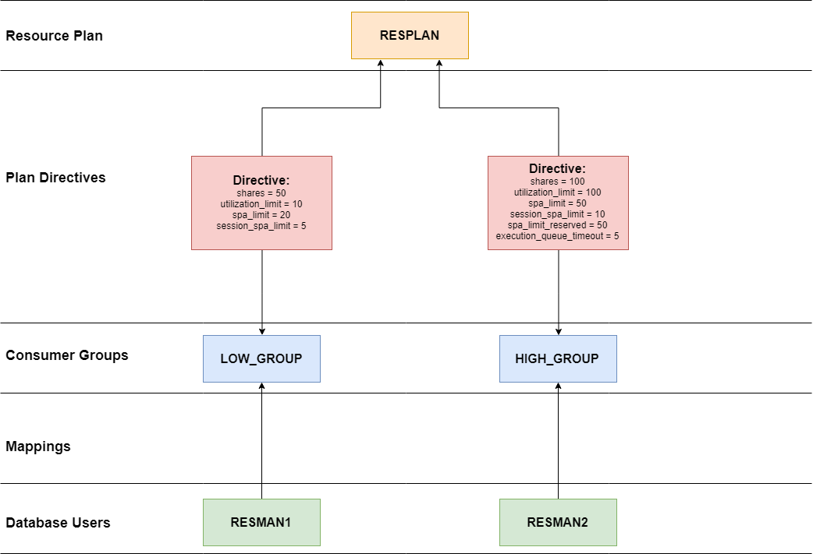

YashanDB resource management configures physical resource (CPU, memory, etc.) allocation rules to meet different users or programs' resource requirements. Through resource management, the following goals can be achieved:

- Provide resource isolation, ensuring that users can access their allocated resources even in extreme scenarios, unaffected by other users.
- Maximize overall resource utilization while ensuring the database operates stably.
- Allow configuration and switching between different resource usage plans without needing a restart, such as switching plans suitable for daytime and nighttime.
- Real-time monitoring of physical resource allocation and usage.

## Core Concepts

### Resource Usage Group

A resource usage group consists of resource users who share a resource allocation instruction within the same group.

The system includes the following default resource usage groups:

- SYS_GROUP: Includes the system user sys and system processes.
- DEFAULT_CONSUMER_GROUP: Resource users without a mapping relationship are defaulted to this group.

When creating a session, YashanDB automatically assigns users to the appropriate resource usage group based on their resource mapping relationship. Database administrators can adjust a user's new session's resource usage group by modifying the user's resource mapping relationship.

### Resource Mapping

Resource mapping refers to adding resource users to resource usage groups, where resource users are categorized by user (USER).

The relationship between resource usage groups and resource users is one-to-many, meaning a resource user can only join one resource usage group, but one resource usage group can contain multiple resource users.

### Resource Plan

A resource plan is an allocation plan for the physical resources (e.g., CPU) of each node in the environment, specifying how resources are allocated to resource usage groups by activating specific resource plans.

The system includes the following default resource plans:

- TOALL: A primary resource plan, which contains the resource plan instructions for the sub-plans SYS_GROUP and DEFAULT_CONSUMER_GROUP.
- SYS_GROUP: A secondary resource plan, which is a sub-plan of TOALL and contains resource plan instructions related to the system user sys and system processes.

Switching between different resource plans allows for changing the corresponding resource plan instructions for all resource usage groups.

### Resource Plan Instruction

Resource plan instructions describe the allocation rules for physical resources assigned to resource usage groups under different plans.

There is a one-to-many relationship between resource plans and resource plan instructions, meaning each resource group can only specify one resource plan instruction within a resource plan.

## Resource Types

YashanDB resource management allocates physical resources based on configuration rules to meet the demands of various users or programs. The currently supported resource types are memory and CPU; for more information, please refer to [Resource Type](Resource Type).

## Configuring Resource Management

YashanDB resource management provides physical resource configuration capabilities through the built-in advanced package [DBMS_RESOURCE_MANAGER](../../Development Guide/PL Reference Manual/Built-in Advanced PL Packages/DBMS_RESOURCE_MANAGER) and related configuration parameters; for more details, please refer to [Configuring Resource Management](Configuring Resource Management).

### RSRC\_MODE

YashanDB controls whether to enable resource management capabilities for single or multiple physical resources through the configuration parameter `RSRC_MODE`. For a detailed explanation, please see [Configuration Parameters](../../Reference Manual/Configuration Parameters).

Changes to this configuration parameter require a restart of the instance to take effect.

### RESOURCE\_MANAGER\_PLAN

YashanDB uses the configuration parameter `RESOURCE_MANAGER_PLAN` to specify how to allocate physical resources to resource usage groups. For further information, please see [Configuration Parameters](../../Reference Manual/Configuration Parameters).

### RSRC\_QUEUE\_OPERS

YashanDB uses the configuration parameter `RSRC_QUEUE_OPERS` to specify the types of resource-intensive SQL. Sessions executing these SQL will be subject to scheduling control. For more details, please refer to [Configuration Parameters](../../Reference Manual/Configuration Parameters).