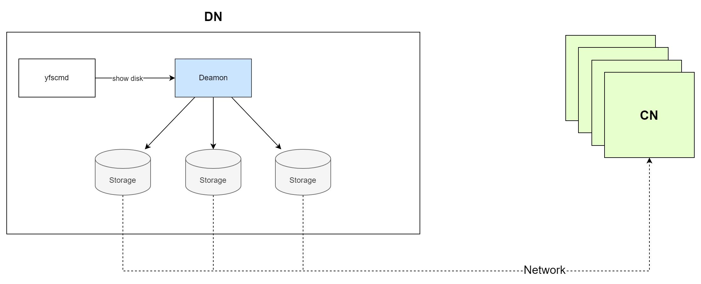

The storage network in YashanDB Distributed Cluster Deployment is provided by DN with intelligent distributed storage services. When logging into the DN server, you can use the *yfscmd* command to query the file system information on the current server.



## Query Disk Management Service

Use the following command to check if the disk management service on DN is functioning properly.

```bash
$ ps -aux | grep yasfs
user   11898  1.0  0.3 259456 112324 pts/4   Sl+  15:49   0:00 yasfs -D /YOUR/SRV/HOME -m
```

Note that `/YOUR/SRV/HOME` is related to the actual deployment environment and should be based on the actual situation.

## Query File System

DN and CN use the unified file service terminal yfscmd, which can be started in either interactive or non-interactive mode (refer to [yfscmd command guide](../../../Tools Guide/yfscmd/00yfscmd)).

On DN, you can view the disk information on this node using the `show disk` command in yfscmd.

2. Log into the disk monitoring service of DN in interactive mode and enter the `show disk` command in yfscmd to display all disks on the current node:

```bash
$ yfscmd -D /YOUR/SRV/HOME
server DISK MONITOR mode
YAS File System CMD Enterprise Edition Debug 23.4.3.102 x86_64 8451cb6
try help or ?.

YFSCMD >  show disk
id name     status   fgid dgid au_size  au_count path
0  SYSTEM_0 NORMAL   0    0    1.00MB   1024     /DISKS/disk1
2  DG0_0    NORMAL   0    1    32.00MB  640      /DISKS/disk2
```

3. Directly query all disks on the current node in non-interactive mode:

```bash
$ yfscmd -D /YOUR/SRV/HOME show disk
server DISK MONITOR mode
id name     status   fgid dgid au_size  au_count path
0  SYSTEM_0 NORMAL   0    0    1.00MB   1024     /DISKS/disk1
2  DG0_0    NORMAL   0    1    32.00MB  640      /DISKS/disk2
```