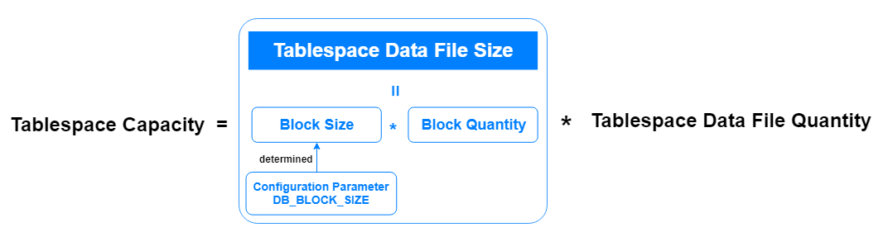

## User Tablespace Management Guidelines

It is recommended to create specific user tablespaces for business users instead of using the default USERS tablespace.

For user tablespaces, the following guidelines are suggested for creation and maintenance:

- Separate user data from data dictionary data to reduce I/O contention.
- Separate data for one application from that of another application to prevent multiple applications from being affected when a tablespace must go offline.
- Store data files of different tablespaces on different disk drives to reduce I/O contention.
- While one tablespace is offline, other tablespaces can remain online, avoiding the need to take all tablespaces offline or shut down the database, thereby providing better availability.
- Optimize the use of tablespaces by using reserved tablespaces for specific types of databases, such as high update activities, read-only activities, or temporary segment storage.
- Perform logical backups on individual tablespaces.

## YashanDB Default Tablespaces

YashanDB includes the following built-in tablespaces, which can be used with default values or specified during database creation:

- Permanent tablespaces, including the SYSTEM tablespace, SYSAUX tablespace, and USERS tablespace (i.e., DEFAULT TABLESPACE)
- TEMP tablespace
- UNDO tablespace
- SWAP tablespace
- USERS_AIM tablespace (only exists in ISC Distributed Cluster Deployment)

The calculation method for tablespace capacity is as follows: the initial database tablespace capacity (i.e., data file size and number) created during installation can be specified through the [Database Creation Parameters](../../Tools Guide/yasboot/Database Creation Parameters).

- Tablespace data file size: determined by BLOCK size and its quantity.

    - BLOCK size: determined by the configuration parameter DB_BLOCK_SIZE, which can be set to 8192, 16384, or 32768 (i.e., 8KB, 16KB, or 32KB), with a default value of 8192.

    - BLOCK quantity: the default value is 8192, and when auto-extension is enabled, it defaults to an extension of 8192 each time.

        For UNDO tablespace: BLOCK quantity can be [8192,8388608].

        For other permanent tablespaces: BLOCK quantity can be [8192,97108864].

- Tablespace data file number: can be [1,64], with a default value of 1.

The relationship of the initial database tablespace capacity created during installation with the database creation parameters and their initial default values is as follows:

|Tablespace Type |Associated Creation Parameters |Default Tablespace Capacity (bytes) |
| ---- | ---- | ---- |
|SYSTEM Tablespace      |SYSTEM_FILE_INIT_SIZE SYSTEM_FILE_NUM     | 64M * 1 = 64M       |
|SYSAUX Tablespace      |SYSAUX_FILE_INIT_SIZE SYSAUX_FILE_NUM      | 64M * 1 = 64M       |
|SWAP Tablespace      |SWAP_FILE_INIT_SIZE SWAP_FILE_NUM      | 64M * 1 = 64M       |
|UNDO Tablespace      |UNDO_FILE_INIT_SIZE UNDO_FILE_NUM      | 64M * 1 = 64M       |
|TEMP Tablespace      |TEMP_FILE_INIT_SIZE TEMP_FILE_NUM      | 64M * 1 = 64M       |
|USERS Tablespace      |DATA_FILE_INIT_SIZE DATA_FILE_NUM      | 64M * 1 = 64M       |
|USERS_AIM Tablespace      |MMS_DATA_FILE_SIZE MMS_DATA_FILE_NUM      | 32M * 1 = 32M       |