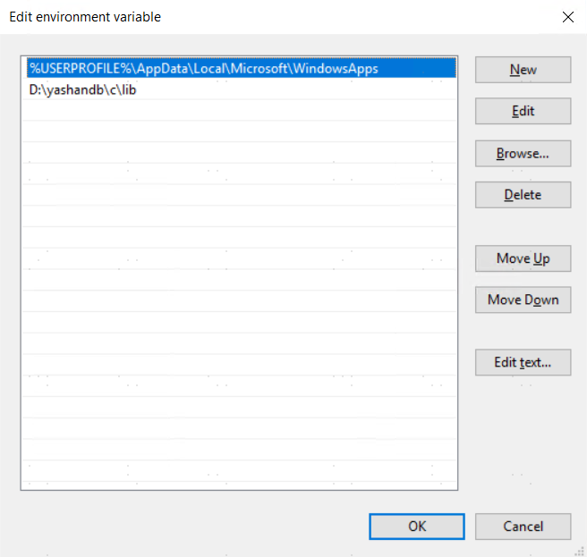
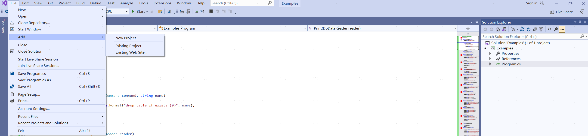
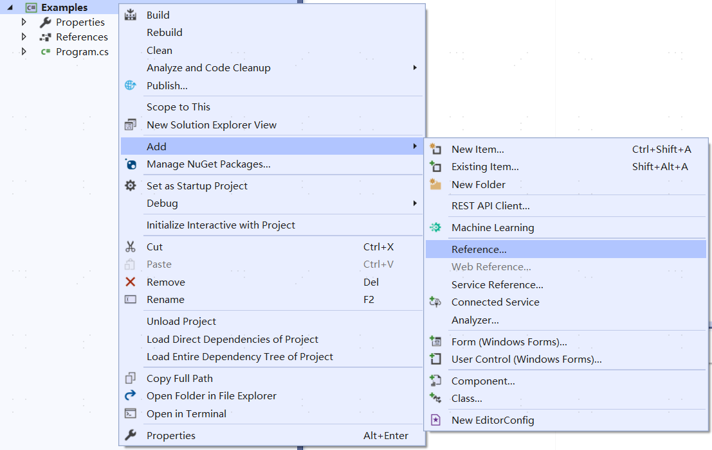
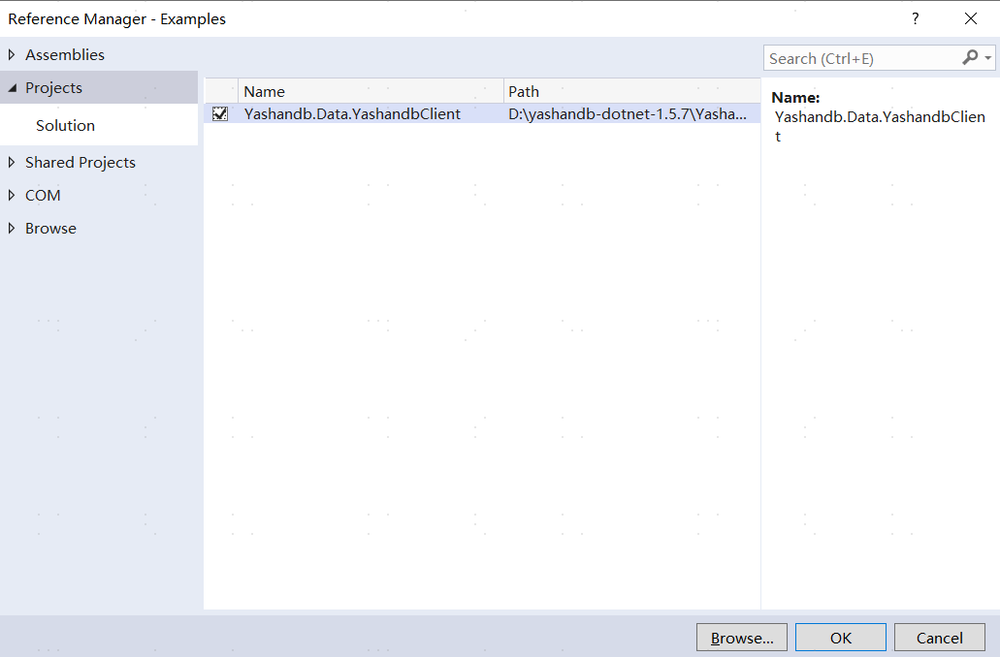

## Install .NET Environment

To develop .NET applications, it is necessary to install the .NET development environment. The .NET versions required by the YashanDB ADO.NET driver are as follows:

- .NET 2.0
- .NET 5.0
- .NET 6.0

**For Windows Platform**

> **Note**:
> 
> Currently, only Windows 10 and above versions are supported.

1. Download and install the above versions of .NET for Windows from the official path.

2. Install Visual Studio or a similar integrated development environment to write and compile C# source code. This manual takes Visual Studio as an example.

3. Run `dotnet --version` to verify if the .NET environment is functioning properly:

    ```shell
    C:\>dotnet --version
    6.0.301

    C:\>
    ```

**For Linux Platform**

1. Download and install the above versions of .NET for Linux from the official path.

2. Run `dotnet --version` to verify if the .NET environment is functioning properly:

    ```shell
    $ dotnet --version
    6.0.301
    $ 
    ```

## Install Dependencies

To use the YashanDB ADO.NET driver correctly, it is also necessary to install the YashanDB C driver client and set the environment variables. You can choose to use the current or previous version of the YashanDB C driver client.

**For Windows Platform**

1. Refer to the [YashanDB Software Package List](../../Installation and Upgrade/Installation and Deployment/Pre-Installation Preparation/Downloading Software Packages) to obtain the YashanDB client installation package `yashandb-client-*version*-windows-x86.zip`.

2. Download and extract it to a local path, for example, `D:\yashandb\client`.
3. Set the environment variable `PATH` to point to the `lib` folder under that file path.

    

**For Linux Platform**

1. Refer to the [YashanDB Software Package List](../../Installation and Upgrade/Installation and Deployment/Pre-Installation Preparation/Downloading Software Packages) to obtain the YashanDB client installation package `yashandb-client-*version*-linux-x86_64.tar.gz`.

2. Download and extract it to a local path, for example, `/opt/yashandb/client`.
3. Set the environment variable.

    ```shell
    export LD_LIBRARY_PATH=/opt/yashandb/c/lib:$LD_LIBRARY_PATH
    ```

## Install YashanDB ADO.NET Driver

1. Refer to the [YashanDB Software Package List](../../Installation and Upgrade/Installation and Deployment/Pre-Installation Preparation/Downloading Software Packages) to obtain the YashanDB ADO.NET driver installation package `yashandb-dotnet-*version*.zip`.

2. Download and extract the zip file to a local path, for example, `/path/Yashandb.Data.YashandbClient`.

3. Edit the application project to reference the `Yashandb.Data.YashandbClient` project in that project. The project file example used in this manual is `Examples`. For specific content, refer to the section [YashanDB ADO.NET Driver Usage Examples](YashanDB ADO.NET Driver Usage Examples).

    **For applications developed in Visual Studio**

    1. Open the application project `Examples`, click on **File > Add > Existing Project**, click on the path where `Yashandb.Data.YashandbClient` is located, and select the `Yashandb.Data.YashandbClient.csproj` file to add `Yashandb.Data.YashandbClient` to the solution of the application.
    
	
    
	2. Right-click on the `Examples` application project, select **Add > Project Reference > Projects**, and check the `Yashandb.Data.YashandbClient` option.

        
		
        
    
    **For .NET applications developed via command line (using Linux environment as an example)**

    1. Navigate to the folder where the `Examples` application project is located, and use the dotnet command to add the `Yashandb.Data.YashandbClient` project to the application project.

        ```bash
        dotnet add reference /path/Yashandb.Data.YashandbClient/Yashandb.Data.YashandbClient.csproj
        ```

    After completing the project reference, this application can access the YashanDB database.

### Download DLL Linking Library Installation

1. Copy the DLL files to the project path.

2. Add a project reference in the project csproj file.

    ```xml
    <ItemGroup>
        <Reference Include="Yashandb.Data.YashandbClient">
            <HintPath>Yashandb.Data.YashandbClient.dll</HintPath>
        </Reference>
    </ItemGroup>
    ```

    After completing the project reference, this application can access the YashanDB database.