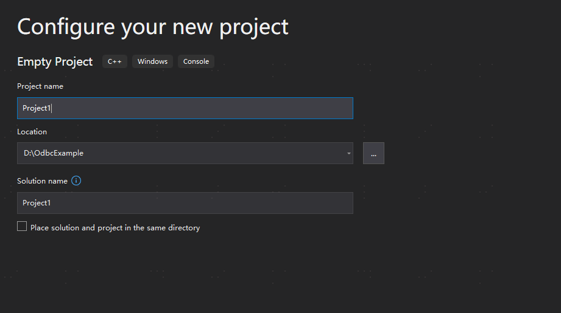
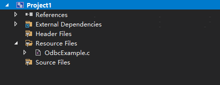

The basic ODBC calling process can be referred to in the official documentation [Basic ODBC Application - ODBC API Reference | Microsoft Docs](https://docs.microsoft.com/zh-cn/sql/odbc/reference/develop-app/basic-odbc-application-steps?view=sql-server-ver16).

The official ODBC demo can be found in [C/C++ ODBC Application Accessing SQL Database - ODBC Driver for SQL Server | Microsoft Docs](https://docs.microsoft.com/zh-cn/sql/connect/odbc/cpp-code-example-app-connect-access-sql-db?view=sql-server-ver16).

## YashanDB ODBC Driver Example

This example uses Visual Studio as the tool for compilation and execution:

1. Create a new project:

    

2. Create a file named OdbcExample.c:

    

3. Write user program code as follows: (YashanDB_Default_DSN is the ODBC data source name configured in the [Installation Guide](ODBC Driver Installation/00ODBC Driver Installation))

    ```c
    #include <windows.h>

    #include <sql.h>
    #include <sqlext.h>
    #include <stdio.h>
    #include <stdlib.h>
    #include <string.h>
    #include <assert.h>

    void HandleDiagnosticRecord(SQLHANDLE hHandle, SQLSMALLINT hType, RETCODE RetCode)
    {
        SQLSMALLINT iRec = 0;
        SQLINTEGER  iError;
        CHAR        wszMessage[1000];
        CHAR        wszState[SQL_SQLSTATE_SIZE + 1];

        if (RetCode == SQL_INVALID_HANDLE) {
            printf("Invalid handle!\n");
            return;
        }

        while (SQLGetDiagRec(hType, hHandle, ++iRec, wszState, &iError, wszMessage,
            (SQLSMALLINT)(sizeof(wszMessage) / sizeof(CHAR)), (SQLSMALLINT*)NULL) == SQL_SUCCESS) {
            // Hide data truncated..
            if (strcmp(wszState, "01004")) {
                printf("[%5.5s] %s (%d)\n", wszState, wszMessage, iError);
            }
        }
    }

    #define ODBC_TEST_CALL(yocFunc)                                             \
        do {                                                                    \
            SQLRETURN r = yocFunc;                                              \
            if (r == SQL_ERROR || r == SQL_NO_DATA_FOUND) {                     \
                HandleDiagnosticRecord(gTestHandles.hStmt, SQL_HANDLE_STMT, r); \
                return r;                                                       \
            }                                                                   \
        } while (0)

    #define CI_DATA_SOURCE "YashanDB_Default_DSN"

    typedef struct {
        SQLHENV  hEnv;
        SQLHDBC  hDbc;
        SQLHSTMT hStmt;
    } SQLHandles;

    SQLHandles gTestHandles;

    int main(int argc, char** argv)
    {
        if (SQLAllocHandle(SQL_HANDLE_ENV, SQL_NULL_HANDLE, &gTestHandles.hEnv) != SQL_SUCCESS) {
            printf("Unable to allocate an environment handle\n");
            return SQL_ERROR;
        }

        SQLSetEnvAttr(gTestHandles.hEnv, SQL_ATTR_ODBC_VERSION, (SQLPOINTER)SQL_OV_ODBC3, 0);

        if (SQLAllocHandle(SQL_HANDLE_DBC, gTestHandles.hEnv, &gTestHandles.hDbc) != SQL_SUCCESS) {
            printf("Unable to allocate an connection handle\n");
            return SQL_ERROR;
        }

        if (SQLConnect(gTestHandles.hDbc, CI_DATA_SOURCE, SQL_NTS, NULL, SQL_NTS, NULL, SQL_NTS) != SQL_SUCCESS) {
            printf("Unable to connect\n");
            return SQL_ERROR;
        }

        // Alternatively, you can use SQLDriverConnect with a graphical interface instead of SQLConnect
        // SQLCHAR driverConnStr[100] = "DSN=";
        // strcat(driverConnStr, CI_DATA_SOURCE);
        // strcat(driverConnStr, ";");

        // if (SQLDriverConnect(gTestHandles.hDbc, NULL, driverConnStr, SQL_NTS, NULL, 0, NULL, SQL_DRIVER_PROMPT) !=
        //     SQL_SUCCESS) {
        //     printf("Unable to Dirver connect\n");
        //     return SQL_ERROR;
        // }

        if (SQLAllocHandle(SQL_HANDLE_STMT, gTestHandles.hDbc, &gTestHandles.hStmt) != SQL_SUCCESS) {
            printf("Unable to allocate an connection handle\n");
            return SQL_ERROR;
        }

        // Simple binding of input parameters and fetching data
        // For example, for the product information table 'product', the following example will get the product_name where product_no equals 11001
        ODBC_TEST_CALL(SQLPrepare(gTestHandles.hStmt, "select product_name from product where product_no = ?", SQL_NTS));
        SQLINTEGER productNo = 11001;
        SQLLEN     indicator = sizeof(SQLINTEGER);
        ODBC_TEST_CALL(SQLBindParameter(gTestHandles.hStmt, 1, SQL_PARAM_INPUT, SQL_C_LONG, SQL_INTEGER, 0, 0, &productNo,
            indicator, &indicator));
        ODBC_TEST_CALL(SQLExecute(gTestHandles.hStmt));
        SQLCHAR productName[100];
        ODBC_TEST_CALL(SQLBindCol(gTestHandles.hStmt, 1, SQL_C_CHAR, &productName, 100, NULL));
        ODBC_TEST_CALL(SQLFetch(gTestHandles.hStmt));
        ODBC_TEST_CALL(SQLCloseCursor(gTestHandles.hStmt));  // This step is necessary, otherwise subsequent calls to other functions will return SQL_ERROR
        printf("product_no %d's product_name is \"%s\"\n", productNo, productName);

        // Release resources
        if (SQLFreeHandle(SQL_HANDLE_STMT, gTestHandles.hStmt) != SQL_SUCCESS) {
            printf("Unable to free stmt\n");
            return SQL_ERROR;
        }

        if (SQLDisconnect(gTestHandles.hDbc) != SQL_SUCCESS) {
            printf("Unable to disconnect\n");
            return SQL_ERROR;
        }

        if (SQLFreeHandle(SQL_HANDLE_DBC, gTestHandles.hDbc) != SQL_SUCCESS) {
            printf("Unable to free conn\n");
            return SQL_ERROR;
        }

        if (SQLFreeHandle(SQL_HANDLE_ENV, gTestHandles.hEnv) != SQL_SUCCESS) {
            printf("Unable to free env\n");
            return SQL_ERROR;
        }

        return SQL_SUCCESS;
    }
    ```

4. Build the solution. (Please note that the platform in the Visual Studio solution configuration must be set to x64, and the character set in the debug properties must be set to use Multi-Byte Character Set)

5. Execute the solution, output as follows:

    ```shell
    D:\OdbcExample\Project1\x64\Debug>Project1.exe
    product_no 11001's product_name is "YashanDB"
    ```
