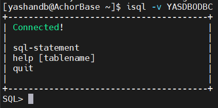
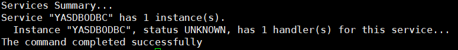
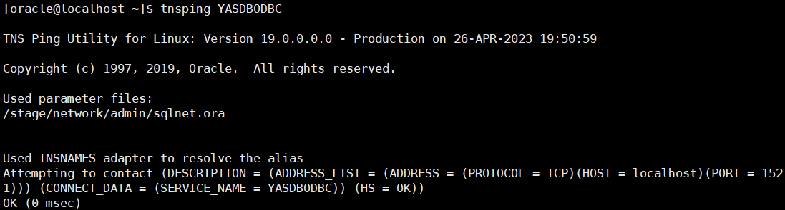

This chapter will guide users to configure DBLINK in Oracle Database and connect to the YashanDB database through the ODBC data source. Users must ensure that the Oracle server and YashanDB ODBC driver are on the same machine.

## Step 1: Configure YashanDB ODBC Driver

The operation to configure DBLINK and connect to YashanDB database in Oracle requires the ODBC driver. You can install and configure the ODBC driver by checking [ODBC Driver Installation (Linux)](../ODBC Driver Installation/Installing ODBC Driver (Linux)).

## Step 2: Create Data Source

Create the data source by executing the `vi /etc/odbc.ini` command and write the following content, modifying the username, password, and server address as needed:

```sql
vi /etc/odbc.ini

[YASDBODBC]
Description  = YashanTest
Driver       = YashanDB
SERVER       = 127.0.0.1
PORT         = 1688
USER         = sys
PWD          = sys
```

## Step 3: Test Connection

Test whether the data source is successfully connected by executing the `isql -v YASDBODBC` command. If "Connected" is displayed, the data source connection is successful.



## Step 4: Configure DBLINK File in Oracle

Check if the dg4odbc driver is installed by executing the `dg4odbc` command.


Locate the directory where the `initdg4odbc.ora` file is located and execute the following commands:

```bash
cd /stage/hs/admin
touch initYASDBODBC.ora
vi /stage/hs/admin/initYASDBODBC.ora
 
HS_FDS_CONNECT_INFO = odbc_datasource_name # ODBC data source name, corresponding to the name configured in /etc/odbc.ini
HS_FDS_TRACE_LEVEL = off
HS_FDS_SHAREABLE_NAME = /usr/lib64/libodbc.so # The current environment libodbc.so location, based on the environment
HS_LANGUAGE = AMERICAN_AMERICA.AL32UTF8
HS_NLS_NCHAR = UCS2
 
SET ODBCINI= /etc/odbc.ini
# Save the initYASDBODBC.ora file
```

## Step 5: Configure Listener File

1. Add the following content to the `/stage/network/admin/listener.ora` file:

```bash
SID_LIST_LISTENER =
  (SID_LIST =
    (SID_DESC =
      (SID_NAME = YASDBODBC) # Same as the transparent gateway configuration init*.ora file name
      (ORACLE_HOME = /stage) # Current environment ORACLE_HOME path
      (PROGRAM = dg4odbc)
    )
  )
```

2. Add the following content to the `/stage/network/admin/tnsnames.ora` file:

```bash
# The TNS name should match the transparent gateway configuration init*.ora file name
YASDBODBC =
  (DESCRIPTION =
    (ADDRESS_LIST =
      (ADDRESS = (PROTOCOL = TCP)(HOST = localhost)(PORT = 1521))
    )
    (CONNECT_DATA =
      (SERVICE_NAME = YASDBODBC) # Same as the transparent gateway configuration init*.ora file name
    )
    (HS = OK)
  )
```

## Step 6: Restart Listener

Restart the Oracle listener by executing the following commands:

```bash
lsnrctl stop
lsnrctl start
lsnrctl status
```

After restarting, you can see that the YASDBODBC instance is being listened to and its status is unknown.



Check if the YASDBODBC listener service is enabled by executing the following command:

```bash
tnsping YASDBODBC
```



## Step 7: Create DBLINK

Execute the following command to create DBLINK in the Oracle database, modifying the username and password as needed:

```sql
DROP DATABASE link dblink_name; -- dblink_name TO be specified
CREATE DATABASE link dblink_name CONNECT TO "sys" IDENTIFIED BY "sys" USING 'YASDBODBC'; -- the name after USING should match the transparent gateway configuration init*.ora file name
```

## Step 8: Test DBLINK

Test whether the DBLINK is configured successfully with the following command, a successful query indicates that the dblink is configured successfully:

```sql
SELECT USERNAME,STATUS,TYPE FROM V$SESSION@dblink_name;
```

If you need to verify DBLINK Chinese support in sqlplus, set the Oracle NLS_LANG client character set to match the terminal, for example:

```bash
export NLS_LANG=american_america.AL32UTF8
```

## View Logs

To trace ODBC behavior, execute the following statement:

```bash
vi /etc/odbcinst.ini
```

Add the following content, TraceFile is the output file path:

```bash
[ODBC]
TraceFile = /home/odbcsql.log
Trace = Yes
```

Modify `HS_FDS_TRACE_LEVEL = debug` in initYASDBODBC.ora.