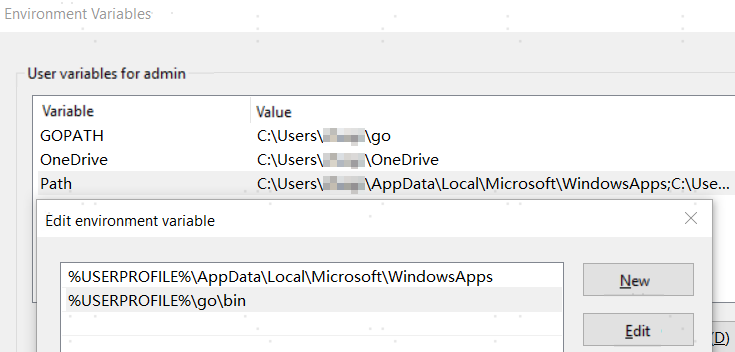
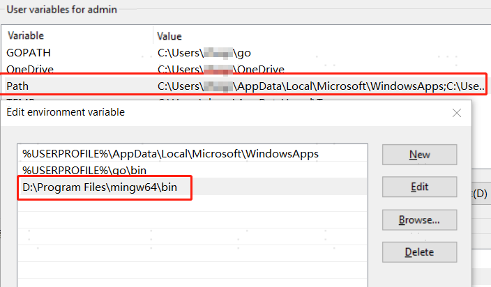
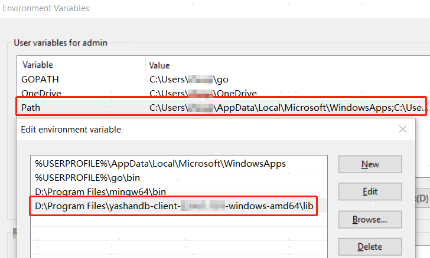

This article takes Windows 10 Professional Edition, go1.18 windows/amd64 and above versions, and the YashanDB client installation package yashandb-client-xx.xx-windows-amd64.zip as examples to introduce the installation and configuration process of the YashanDB Go driver in this environment.

## Go Environment Installation

The Go language program version using the YashanDB Go driver must be 1.18 or above, and the development environment is Windows for x86_64. Please download it from the Golang official website. Taking go1.22.7 as an example:


After downloading and installing, configure the following environment variables (the paths below are examples; please modify them to the actual installation paths):



Use `go version` to check if the compilation environment is normal:

```shell
$ go.exe version
go version go1.22.7 windows/amd64
```

## YashanDB Go Driver Installation

### Step 1: Install GCC

The YashanDB Go driver involves cgo calls and requires the installation of gcc compiling tools on the Windows operating system. This article uses MinGW version 12.1.0 as an example. After installation, set the environment variable PATH to point to the bin directory of the installation path.



### Step 2: Download the YashanDB Client Installation Package

1. From the [YashanDB Official Website Download Center](https://download.yashandb.com/download) or contact our technical support to obtain the corresponding software package.

2. Download the YashanDB client installation package and extract it to a local path, for example, `D:\Program Files\yashandb-client-{version_number}`.

### Step 3: Set Dynamic Library Dependency Path

Set the environment variable PATH to point to the lib folder under this file path.



### Step 4: Download the Go Driver Installation Package

1. From the [YashanDB Official Website Download Center](https://download.yashandb.com/download) or contact our technical support to obtain the corresponding software package.

2. Download the Go driver installation package and extract it to the local path `D:\yashandb\client\yasdb-go`.

### Step 5: Build the Go Driver Client

1. Write the Go application.

    ```go
    package main

    import (
    	"database/sql"
    	"fmt"

    	_ "git.yasdb.com/go/yasdb-go"
    )

    func main() {
        dsn := "sys/Cod-2022@127.0.0.1:1688"
    	db, err := sql.Open("yasdb", dsn)
    	if err != nil {
    		fmt.Println(err)
    		return
    	}
    	defer db.Close()

    	rows, err := db.Query("select version from v$instance")
    	if err != nil {
    		fmt.Println(err)
    		return
    	}
    	for rows.Next() {
    		var version string
    		err = rows.Scan(&version)
    		if err != nil {
    			fmt.Println(err)
    			return
    		}
    		fmt.Println("instance version: ", "=>", version)
    	}
    }
    ```

2. Load the dependency package, where the replace path is the installation path of the YashanDB Go driver.

    ```shell
    $ go mod init example
    $ go mod edit -replace="git.yasdb.com/go/   yasdb-go=D:\yashandb\client\yasdb-go"
    $ go mod tidy
    ```

3. Compile to generate the executable program.

    ```shell
    $ go build -o example.exe  main.go
    ```

4. Run the program.

    ```shell
    $ .\example.exe
    instance version:  => Enterprise Edition Release xx.xx x86_64
    ```
