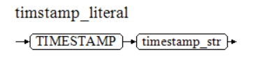
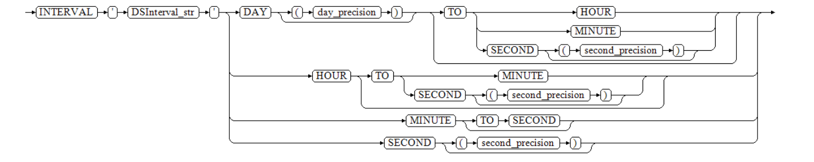

The term "Literal" refers to a constant value that appears directly in SQL and PL statements in string format. It is distinguished by type based on the format at declaration, for example, '' is used to identify character literals, and DATE is used to identify date-time literals.

Literals can be used in nearly all scenarios, such as values, parameters, formats, identifiers, or output display.

The conceptual difference between a literal and variables/constants is as follows:

- A literal is a fixed value that appears in string form, lacking a storage container; it is merely a written notation.
- A variable is a container used to store data, and the container can be assigned multiple times.
- A constant is a type of variable that can only be assigned an initial value and cannot be assigned again.

## String Literal (Character Literal)

A string literal is a combination of English letters, Chinese characters, numeric characters, and special characters enclosed in single quotes `''`, declared as follows:


YashanDB parses the string literal into CHAR type data of the same length, for instance, 'China' becomes 'CHAR(5)'.

***Example***

```sql
SELECT 'SHENZHEN', '3.14567', '!@#$',
TYPEOF('SHENZHEN') type1,
TYPEOF('3.14567') type2,
TYPEOF('!@#$') type3
FROM DUAL;
'SHENZHEN' '3.14567' '!@#$' TYPE1 TYPE2 TYPE3
---------- --------- ------ ----- ----- -----
SHENZHEN   3.14567   !@#$   char  char  char
```

## Numeric Literal

A numeric literal is a value formed by the digits 0 to 9 and a decimal point. A numeric literal can be made positive or negative with a positive (+) or negative (-) sign (default is positive). Its declaration is shown below:


Numeric literals consist of 4 data types: INT, BIGINT, NUMBER, and DOUBLE. YashanDB parses these types according to the following rules:

- If a literal ends with 'd' or 'D', it is parsed as DOUBLE type.
- Decimal values are parsed as NUMBER type.
- Integers are first attempted to be parsed as INT type (checking if within the INT value range [-2<sup>31</sup>, 2<sup>31</sup> - 1]); if this fails, it tries to parse as BIGINT type (checking if within the BIGINT value range [-2<sup>63</sup>, 2<sup>63</sup> - 1]); if that fails, it parses as NUMBER type.
- Values exceeding the NUMBER range are parsed as DOUBLE type.

For example, 11d is parsed as DOUBLE type, 2147483647 as INT type, 2147483648 as BIGINT type, and 1.1 as NUMBER type.

***Example***

```sql
SELECT 1, TYPEOF(1) FROM DUAL;
           1 TYPEOF(1)
------------ ---------
           1 integer
  
SELECT 2147483647, TYPEOF(2147483647) FROM DUAL;
  2147483647 TYPEOF(2147483647)
------------ ------------------
  2147483647 integer
  
SELECT 2147483648, TYPEOF(2147483648) FROM DUAL;
           2147483648 TYPEOF(2147483648)
--------------------- ------------------
           2147483648 bigint
  
SELECT 1.1, TYPEOF(1.1) FROM DUAL;
        1.1 TYPEOF(1.1)
----------- -----------
        1.1 number
            
SELECT 11d, TYPEOF(11d) FROM DUAL;

        11  TYPEOF(11D)
----------- -----------
   1.1E+001 double
```

**Scientific Notation Numeric Literal**

YashanDB supports parsing literals in the format of 1.24E3 as NUMBER type data in scientific notation.

***Example***

```sql
SELECT 1.24e3 FROM dual;
      1.24E3 
------------ 
        1240
```

## Date Literal

A date literal is a value that starts with the DATE keyword and ends with a single quote `''` enclosing the string value, formatted as 'yyyy-mm-dd', for example, `DATE '2020-01-01'`. Its declaration is shown below, where date_str represents a string that conforms to the DATE type standard format.


***Example***

```sql
SELECT DATE '2020-01-01', TYPEOF(DATE '2020-01-01') TYPE FROM DUAL;
DATE'2020-01-01'                 TYPE
-------------------------------- -----
2020-01-01 00:00:00              date
```

## SCN Literal (Timestamp Literal)

A SCN literal for date is a value that starts with TIMESTAMP and ends with a single quote `''` enclosing the string value, formatted as 'yyyy-mm-dd hh24:mi:ss.ff', where hours, minutes, and seconds can be omitted, for instance, `TIMESTAMP '2020-01-01 13:08:28'`. Its declaration is shown below, where timestamp_str is a string that meets the TIMESTAMP type standard format.



***Example***

```sql
SELECT TIMESTAMP '2020-01-01 13:08:28', TYPEOF(TIMESTAMP '2020-01-01 13:08:28') TYPE FROM DUAL;
TIMESTAMP'2020-01-01                                             TYPE
---------------------------------------------------------------- -------------
2020-01-01 13:08:28.000000                                       timestamp
```

## Interval Year To Month Literal

The declaration of interval year to month literal is shown below, where YMInterval_str represents a string that conforms to the INTERVAL YEAR TO MONTH type standard format, and year_precision represents the precision of the year (default value is 2).


It can specify one or more fields between year and month; if the specified month interval exceeds 11, YashanDB will automatically convert it to a year interval.

***Example***

```sql
-- Example 1: Only specifying year interval
SELECT INTERVAL '120' YEAR(3) YMINTERVAL,
TYPEOF(INTERVAL '120' YEAR(3)) TYPE
FROM DUAL;
YMINTERVAL      TYPE
--------------- -------------------------
+120-00         interval year to month
  
-- Example 2: Only specifying month interval, exceeding 11 will convert to year
SELECT INTERVAL '3' MONTH YMINTERVAL,
TYPEOF(INTERVAL '3' MONTH) TYPE
FROM DUAL;
YMINTERVAL      TYPE
--------------- -------------------------
+00-03          interval year to month
  
SELECT INTERVAL '14' MONTH YMINTERVAL,
TYPEOF(INTERVAL '14' MONTH) TYPE
FROM DUAL;
YMINTERVAL      TYPE
--------------- -------------------------
+01-02          interval year to month
  
-- Example 3: Specifying year and month intervals, here cannot convert to year if month exceeds 11
SELECT INTERVAL '100-11' YEAR(3) TO MONTH YMINTERVAL,
TYPEOF(INTERVAL '100-11' YEAR(3) TO MONTH) TYPE
FROM DUAL;
YMINTERVAL      TYPE
--------------- -------------------------
+100-11         interval year to month
  
SELECT INTERVAL '100-14' YEAR(3) TO MONTH YMINTERVAL FROM DUAL;
YAS-00008 type convert error : not a valid month
```

## Interval Day To Second Literal

The declaration of interval day to second literal is shown below, where DSInterval_str represents a string that conforms to the INTERVAL DAY TO SECOND type standard format, day_precision represents the precision of the day (default value is 2), and second_precision represents the precision of seconds (default value is 6).



It can specify one or more fields among days, hours, minutes, and seconds; if hours exceed 23, minutes and seconds exceed 59, and a higher-level field is not specified, YashanDB will automatically carry over the overflow.

***Example***

```sql
-- Example 1: Only specifying days
SELECT INTERVAL '50' DAY DSINTERVAL,
TYPEOF(INTERVAL '50' DAY) TYPE
FROM DUAL;
DSINTERVAL                       TYPE
-------------------------------- -------------------------
+50 00:00:00.000000              interval day to second
  
-- Example 2: Only specifying hours, exceeding 23 will carry over to days
SELECT INTERVAL '160' HOUR INTERVAL1, INTERVAL '13' HOUR INTERVAL2 FROM DUAL;
INTERVAL1                        INTERVAL2
-------------------------------- --------------------------------
+06 16:00:00.000000              +00 13:00:00.000000
  
-- Example 3: Only specifying minutes, exceeding 59 will carry over to hours
SELECT INTERVAL '63' MINUTE INTERVAL1,
INTERVAL '32' MINUTE INTERVAL2
FROM DUAL;
INTERVAL1                        INTERVAL2
-------------------------------- --------------------------------
+00 01:03:00.000000              +00 00:32:00.000000
  
-- Example 4: Only specifying seconds, exceeding 59 will carry over to minutes
SELECT INTERVAL '63' SECOND INTERVAL1,
INTERVAL '45' SECOND INTERVAL2,
INTERVAL '59.999999' SECOND(6)
FROM DUAL;
INTERVAL1                        INTERVAL2                        INTERVAL'59.999999'S
-------------------------------- -------------------------------- --------------------------------
+00 00:01:03.000000              +00 00:00:45.000000              +00 00:00:59.999999
  
-- Example 5: Specifying multiple fields
SELECT INTERVAL '1000 23:30' DAY(4) TO MINUTE INTERVAL1,
INTERVAL '12:15:21.647' HOUR TO SECOND(3) INTERVAL2
FROM DUAL;
INTERVAL1                        INTERVAL2
-------------------------------- --------------------------------
+1000 23:30:00.000000            +00 12:15:21.647000
  
-- Example 6: When there are higher-level fields, lower-level fields cannot carry over
SELECT INTERVAL '12:63' HOUR TO MINUTE FROM DUAL;
YAS-00008 type convert error : not a valid minute
```

## BIT Literal

Applicable only in yashan mode.

A binary literal is a value beginning with the character b and ending with a single quote `''` enclosing the string. Its declaration is as follows, where bit_str represents a string that conforms to the binary type standard format.

bit_literal :=  b'bit_str'

***Example***

```sql
SELECT b'010011101',
TYPEOF(b'010011101') TYPE
FROM DUAL;
B'010011101'                                                     TYPE
---------------------------------------------------------------- -----
10011101                                                         bit
```

## Hexadecimal Literal

Applicable only in mysql mode.

Hexadecimal literals come in two forms:

- 0xval: x must be lowercase, val can include all hexadecimal digits (0..9, A..F) but cannot be empty. If val has an odd number of digits, it will be padded with a leading 0, for example, 0x123 is equivalent to 0x0123.

- x'val': x is case insensitive, val must be an even number of hexadecimal digits and can be empty (i.e., x''). If val has an odd number of digits, an error will occur.

The default data type for hexadecimal literals is varbinary, where two hexadecimal digits represent a byte, for example, 0x41 corresponds to the ASCII character 'A', and x'' will be treated as an empty string.

In binary operations, the data type of hexadecimal literals is recognized as INT or BIGINT, for example, 0x10+0x10 will be treated as 16+16, and x'' will be considered as 0. To perform calculations using hexadecimal literals as numbers, it is recommended to first add it to 0 before other operations, for instance, 0x10+0.

## NCHAR Literal

Applicable only in Yashan mode.

A national character set literal is a value beginning with the character N and ending with a single quote `''` enclosing the string, where nchar_str is a combination of English letters, Chinese characters, numeric characters, and special characters, as shown in the declaration format below.

nchar_literal :=  N'nchar_str'

YashanDB parses national character set literals into NCHAR type data of the same length, for example, N'China' becomes 'NCHAR(5)'.

In client statements, the character set used is the client character set. When statements are transmitted from the client to the database server, the character set will be converted to the database character set. To avoid data loss due to conversion to an incompatible database character set, you can enable the NCHAR literal replacement functionality. This functionality will first transparently replace the client's national character set literals with YashanDB's internal format, and the database will decode it to Unicode when executing the statement.

The NCHAR literal replacement functionality is disabled by default. To enable it, please refer to the configuration in the [yasql usage guide](../../../Tools Guide/yasql/User Guide for yasql), C driver [yacSetEnvAttr](../../C Language Family Drivers/C Driver/C Driver Interfaces/Handle Property Setting and Query Functions/yacSetEnvAttr) interface, OCI driver [OCIEnvCreate](../../C Language Family Drivers/OCI Driver/OCI Driver Interfaces/Connection & Authorization & Initialization Functions/OCIEnvCreate) interface, and [OCIEnvNlsCreate](../../C Language Family Drivers/OCI Driver/OCI Driver Interfaces/Connection & Authorization & Initialization Functions/OCIEnvNlsCreate) interface documentation.

***Example***

```sql
-- Example 1: NCHAR literal replacement functionality not enabled 
SELECT N'12%',
TYPEOF(N'12%') TYPE
FROM DUAL;
N'12%'            TYPE
----------------- ---------
12%               nchar

-- Example 2: NCHAR literal replacement functionality enabled 
SET nchar_literal_replace true
SELECT N'12%',
TYPEOF(N'12%') TYPE
FROM DUAL;
U'\0031\0032\0025' TYPE
------------------ ---------
12%                nchar
```

## \_BINARY Literal

Applicable only in mysql mode.

_BINARY specifies constant data as a Binary character set, and _BINARY constant data can take two forms:

- String.

- Hexadecimal literal data.

***Example***

```sql
SELECT _binary x'0001',
TYPEOF(_binary x'0001') TYPE
FROM DUAL;
x'0001' TYPE
------- -----
0001    raw
```
