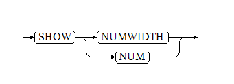

Numeric data includes positive and negative integers, decimals, 0, positive and negative infinity (Inf, -Inf), and NaN (Not a Number). It is primarily used in mathematical operations and numerical measurements. YashanDB supports addition, subtraction, multiplication, division, and modulo operations on such data, and provides statistical and aggregation functions to meet various needs.

Numeric data can be further classified into integer types, floating-point types, NUMBER types, and BIT types. YashanDB defines value ranges, byte lengths, precisions, and other attributes for different numeric types.

Integer Data Type
-----------------------

The integer type is a fixed-length, precise numeric type that does not have a decimal part. It includes four data types: TINYINT, SMALLINT, INT, BIGINT, each with different byte lengths and value ranges. When creating a table, you need to choose which type to use based on the space required for data storage.

PLS_INTEGER and INT are aliases for INTEGER and behave the same as INTEGER.

Integer types are stored using decimal precision (Decimal Precision, digits 0-9), allowing for accurate storage of decimal numbers within the value range and precision limits.

The INT type supports the definition of precision information at the syntax level, with a precision range of 0 to 255.

When the configuration parameter USE_NATIVE_TYPE is set to FALSE, the return value types for TINYINT, SMALLINT, INT, and BIGINT are NUMBER, with a precision of 38 and a scale of 0.

***Example***

```sql
CREATE TABLE int_test(c1 INT(255));
INSERT INTO int_test VALUES(128);
SELECT c1 res FROM int_test;
RES
------------
128
```

### Storage Attributes

|Type |Byte Length |Value Range |
| --- | --- |--------------------------------|
| TINYINT | 1   | \[-2<sup>7</sup> , 2<sup>7</sup> - 1\] |
| SMALLINT | 2   | \[-2<sup>15</sup>, 2<sup>15</sup> - 1\]        |
| INT | 4   | \[-2<sup>31</sup>, 2<sup>31</sup> - 1\]        |
| BIGINT | 8   | \[-2<sup>63</sup>, 2<sup>63</sup> - 1\]        |

Floating-Point Data Type
------------------------------

The floating-point type is a fixed-length, imprecise numeric type, including two data types: FLOAT and DOUBLE. In YashanDB, the behavior of the floating-point type is consistent with the industry standard IEEE Standard 754.

REAL is an alias for FLOAT and behaves identically to FLOAT.

Floating-point types are stored using binary precision (Binary Precision, digits 0 and 1).

- Floating-point types have a broader value range and can represent special values such as Inf, -Inf, and NaN, with no restrictions on the position of the decimal point.
- It is impossible to avoid errors resulting from the conversion of binary precision to decimal precision, so some numbers cannot be accurately expressed with floating-point types (e.g., 0.1). The precision varies according to the value of the USE_NATIVE_TYPE configuration parameter:
  - When USE_NATIVE_TYPE is TRUE, YashanDB offers only syntax compatibility, equivalent to the floating-point type itself (e.g., DOUBLE`(p)` is equivalent to DOUBLE).
  - When USE_NATIVE_TYPE is FALSE, the FLOAT type is not suitable for LSC tables. In heap tables, when the FLOAT type does not carry precision information, it defaults to FLOAT(126). When precision information is provided, the precision value corresponds to the specified value.

### Storage Attributes

|Type |Byte Length |Value Range |Accurate Decimal Precision |
| --- | --- |-----------------------------------------------------------------------------------------------------------------------------------------------------------------------------------------| --- |
| FLOAT  | 4           | \[-3.402823E38, -1.401298E-45\]<br>0<br>[1.401298E-45, 3.402823E38\]<br>Numbers 3.402823 and 1.401298 are rounded values, not the most precise values | 6 digits                    |
| DOUBLE | 8           | \[-1.79769313486232E308, -4.94065645841247E-324\]<br>0<br>[4.94065645841247E-324, 1.79769313486232E308\]<br>Numbers 1.797693134862315807 and 4.94065645841247 are rounded values, not the most precise values | 15 digits                   |

### Usage Rules

#### Definition Formats

The floating-point type has the following definition formats:

```sql
FLOAT
DOUBLE
FLOAT(m,d)
DOUBLE(m,d)
FLOAT(p)
DOUBLE(p)
```

When USE_NATIVE_TYPE is TRUE, the `(m,d)` and `(p)` formats are syntax-compatible, meaning DOUBLE`(m,d)` and DOUBLE`(p)` are equivalent to DOUBLE and have no actual meaning but are subject to the following constraint rules:

- m: Magnitude, 0 < m <= 255
- d: Division, 0 <= d <= 30
- d <= m
- p: Precision, 0 <= p <= 53
- When defining FLOAT, 0 <= p <= 126; values greater than 53 and less than or equal to 126 will be treated as 53. If either m or p exceeds 23, the system will convert the type to DOUBLE.

***Example***

```sql
-- Define FLOAT type with m exceeding 23
DROP TABLE IF EXISTS float_tb;
CREATE TABLE float_tb(c FLOAT(24,1));

-- The system will convert it to DOUBLE type
DESC float_tb
NAME              NULL?     DATATYPE       
----------------- --------- ---------------
C                           DOUBLE  
```

When USE_NATIVE_TYPE is FALSE, the implementation supports FLOAT without precision information or with precision information, following these rules:

- When without precision information, p = 126
- When with precision information, 1 <= p <= 126

***Example*** for Heap tables

```sql
DROP TABLE IF EXISTS float_tb;
CREATE TABLE float_tb(c FLOAT(2));

DESC float_tb
NAME              NULL?     DATATYPE       
----------------- --------- ---------------
C                           FLOAT(2)  
```

#### Display Method

Floating-point types are displayed in scientific notation.

#### Special Values

Floating-point types have three special values: NaN, Inf, and -Inf. Their size order is: NaN > Inf > positive number > 0 > negative number > -Inf.

The following table lists some special scenarios that generate these special values or 0:

|Special Scenario |Generated Value |
| --- | --- |
| Greater than the maximum value of the floating-point type but represented as a floating-point number | Inf             |
| Less than the minimum value of the floating-point type but represented as a floating-point number  | -Inf            |
| Absolute value less than the minimum absolute value of the value range but represented as a floating-point number | 0               |
| Positive floating-point number or Inf as the dividend divided by 0                             | Inf             |
| Negative floating-point number or -Inf as the dividend divided by 0                           | -Inf            |
| Dividing Inf by -Inf                                    | NaN             |
| Dividing NaN by 0                                     | NaN             |

When the size of a floating-point number exceeds the maximum absolute value of the value range, it will be represented as Inf or -Inf; when the size is less than the minimum absolute value of the value range, it will be represented as 0.

#### Precision Constraints

When the actual precision of the floating-point type exceeds its maximum precision limit, the excess will be discarded, and the method of discarding cannot be determined as rounding or truncation. The result of the maximum precision digits cannot be predicted.

Due to differences in storage methods, converting other numeric types to floating-point types may result in unavoidable errors.

Therefore, floating-point types are not suitable for scenarios requiring high precision and are not suitable for scenarios involving a large number of equality comparisons and boundary values.

***Example***

```sql
SET NUMWIDTH 30;
-- Example 1: Inserting a number exceeding maximum precision into FLOAT; excess digits are discarded, and the method of discarding is neither rounding nor truncation
CREATE TABLE number_f (c1 FLOAT);
INSERT INTO number_f VALUES (10.567895678956789);
COMMIT;
   
SELECT c1 FROM number_f;
                             C1
-------------------------------
                1.05678959E+001

-- Example 2: Converting NUMBER and integer types to floating-point types results in errors
CREATE TABLE number_bn (c1 BIGINT, c2 NUMBER(38, 60));
INSERT INTO number_bn VALUES (9223372036854775800, 0.000000000000000000000000000000000000000000000401298);
COMMIT;
  
SELECT c1,c2 FROM number_bn;
                   C1                              C2
--------------------- -------------------------------
  9223372036854775800  4.012980000000000000000000E-46
  
SELECT CAST(C1 AS FLOAT) float1,
CAST(C2 AS FLOAT) float2
FROM number_bn;
                         FLOAT1                          FLOAT2
------------------------------- -------------------------------
                9.22337204E+018                               0
```

NUMBER Data Type
--------------------------

The NUMBER type is a variable-length, precise numeric type that allows for arbitrary precision (P, Precision) and scale (S, Scale) specification. The NUMBER type can accurately represent any number within the specified precision and scale requirements, making it ideal for scenarios requiring high precision calculations involving decimals.

DECIMAL and NUMERIC are aliases for NUMBER and behave the same as NUMBER.

### Storage Attributes

|Type |Byte Length |Value Range |Storage Method |
| --- | --- | --- | --- |
| NUMBER | 1~22       | 0<br>Absolute value `[1E-130, 1E126)` | Stored using decimal precision (Decimal Precision, digits 0-9), accurate storage within the value range and precision limits. |

### Usage Rules

#### Definition Formats

The definition format for NUMBER types is `NUMBER(P,S)` or `NUMBER`, where the meanings of P and S are as follows:

- P: Precision, representing the number of significant digits (excluding the digits of the decimal point and sign), with a range of [1,38]; or can be \*, indicating the precision is 38.
- S: Scale, indicating the number of digits to the right of the decimal point, with a range of [-84,127]. A positive scale indicates the decimal point is to the left of the least significant digit (e.g., the format definition for 3.14 can be `NUMBER(3, 2)`); a negative scale indicates the decimal point is to the right of the least significant digit (e.g., the format definition for 31400 can be `NUMBER(3, -2)`).

When the format is defined as NUMBER and P/S is not specified, it indicates floating precision.

#### Precision Constraints

When P/S is not specified, it indicates floating precision, and the actual computed value will determine the precision, with no limits.

When P/S is specified:

- If the actual scale exceeds defined S, the system will round the excess to the minimum scale digit.
- If the actual precision exceeds defined P, the system will throw an error.

#### Support for Scientific Notation as Value Input

- Supports formatting such as 1.24E3.
- Abnormal numerical formats with E such as E1, 1E, 1.3E2A will throw corresponding errors.

***Example***

```sql
-- Example 1: Representing 31401 as NUMBER(3, -2). Because the minimum scale is hundredth place, 31401 will be rounded to 31400
SELECT CAST(31401 AS NUMBER(3,-2)) FROM DUAL;
                               CAST(31401ASNUMBER(3
---------------------------------------------------
                                              31400
   
-- Example 2: Representing 31400 as NUMBER(1, -2). Because the maximum precision is 1, but 31400 has three significant digits, an error will occur
SELECT CAST(31400 AS NUMBER(1, -2)) FROM DUAL;
[1:34]YAS-00025 value is larger than specified precision allowed for this column

-- Example 3: Supports scientific notation as value input, obtaining consistent results with full numeric input
SELECT CAST('1.24E3' AS NUMBER) FROM DUAL;
                               CAST('1.24E3'ASNUMBE
---------------------------------------------------
                                               1240
-- Example 4: Supports specifying precision with * for input; when precision is *, it indicates 38                                
SELECT CAST('12.38' AS NUMBER(*,0)) FROM DUAL;

CAST('12.38'ASNUMBER
--------------------
                  12
                                   
CREATE TABLE Etest7293 (NUM1 NUMBER(*,0),NUM2 NUMBER(*), NUM3 NUMBER, NUM4 NUMBER(*,23));

desc Etest7293;
NAME            NULL?     DATATYPE
--------------- --------- ---------------------
NUM1                      NUMBER(38)
NUM2                      NUMBER
NUM3                      NUMBER
NUM4                      NUMBER(38,23)
```

BIT Data Type
--------------------

The BIT type supports a binary bitmap with a width (Size) of 1 to 64 bits, where each BIT can only store values of 0 or 1. Other values will be considered invalid BIT types.

When inserting/updating BIT types in string form, strings beginning with the letter "b" are handled as binary values, while others are treated as decimal strings.

The BIT type outputs in binary format.

The definition format for the BIT type is `BIT[(Size)]`, where Size indicates the width of the BIT, with a range of `[1,64]`. If omitted, the default value of 1 will be used.

The BIT type is only applicable to HEAP tables, and distributed row tables do not support the BIT type.

***Example*** for Heap tables

```sql
CREATE TABLE number_nb (numbera NUMBER,numberb BIT(64));
INSERT INTO number_nb VALUES (10,10);
  
SELECT numbera,numberb FROM number_nb;
    NUMBERA NUMBERB                                                         
----------- ----------------------------------------------------------------
         10 1010
```

Display Width Adjustment
------

SET NUMWIDTH is used to set the display width for floating-point and NUMBER types during output, which is effective only for the current session.

Where SET NUMWIDTH=SET NUM is used to set the display width; SHOW NUMWIDTH=SHOW NUM is used to display the set width value.

The system defaults the display width of floating-point and NUMBER type outputs to 10.

YashanDB displays floating-point numbers in scientific notation; the display format is:

*   Positive numbers: x.yyyyE{+|-}zzz
*   Negative numbers: -x.yyyyE{+|-}zzz

Only the content length of yyyy is subject to the width restriction; the exponent zzz displays 3 bytes with a fixed sign of '+' or '-' in front.

YashanDB's display rules for NUMBER type numbers are as follows:

*   If it is purely decimal, leading zeros before the decimal point will be omitted. If a pure decimal is 0.00000xxx, where xxx is any digit, scientific notation will be used; otherwise, non-scientific notation will be used.
*   If it is a non-pure decimal, and the given width can fully display the integer content, scientific notation will not be used; otherwise, scientific notation will be used.
*   The scientific notation display format for NUMBER type numbers is:
    *   Positive: x.yyyyE{+|-}zz
    *   Negative: -x.yyyyE{+|-}zz

Here, the content length of yyyy is subject to the width restriction; the exponent zz defaults to 2 bytes, with a maximum of 3 bytes, with a fixed sign of '+' or '-'.

### Statement Definitions

**set numwidth::=**


**show numwidth::=**



width

This statement is used to specify the display width value, which ranges from `[2,128]`.

When this value is set too small, resulting in a number not being fully displayed, the system will output a number of '#' equal to this value.

***Example***

```sql
-- Create the numbers_nfd table, containing fields of NUMBER, FLOAT, and DOUBLE types
CREATE TABLE numbers_nfd (cnumber NUMBER, fnumber FLOAT, dnumber DOUBLE);
INSERT INTO numbers_nfd VALUES (0.0000002334, 0.0000002334, -0.0000002334);
INSERT INTO numbers_nfd VALUES (2334.0000002334, 2334.0000002334, -2334.0000002334);
INSERT INTO numbers_nfd VALUES (233423342334.0000002334, 233423342334.0000002334, -233423342334.0000002334);
COMMIT;
   
-- Display with default width
SELECT cnumber,fnumber,dnumber FROM numbers_nfd;
    CNUMBER     FNUMBER     DNUMBER
----------- ----------- -----------
 2.3340E-07  2.334E-007  -2.33E-007
       2334  2.334E+003  -2.33E+003
 2.3342E+11  2.334E+011  -2.33E+011
   
-- Set display width to 20
SET NUMWIDTH 20;
SELECT cnumber,fnumber,dnumber FROM numbers_nfd;
              CNUMBER               FNUMBER               DNUMBER
--------------------- --------------------- ---------------------
          .0000002334       2.33400002E-007           -2.334E-007
      2334.0000002334            2.334E+003  -2.334000000233E+003
 233423342334.0000002        2.3342334E+011   -2.33423342334E+011
   
-- Set display width to 8
SET NUMWIDTH 8;
SELECT cnumber,fnumber,dnumber FROM numbers_nfd;
  CNUMBER   FNUMBER   DNUMBER
--------- --------- ---------
 2.33E-07  2.3E-007  ########
     2334  2.3E+003  ########
 2.33E+11  2.3E+011  ########
   
-- Set display width to 5
SET NUMWIDTH 5;
SELECT cnumber,fnumber,dnumber FROM numbers_nfd;
CNUMBER FNUMBER DNUMBER
------- ------- -------
      0   #####   #####
   2334   #####   #####
  #####   #####   #####
```
