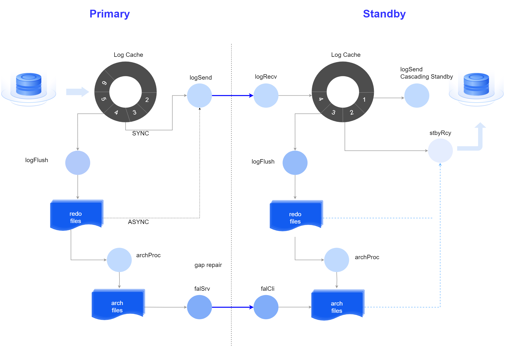
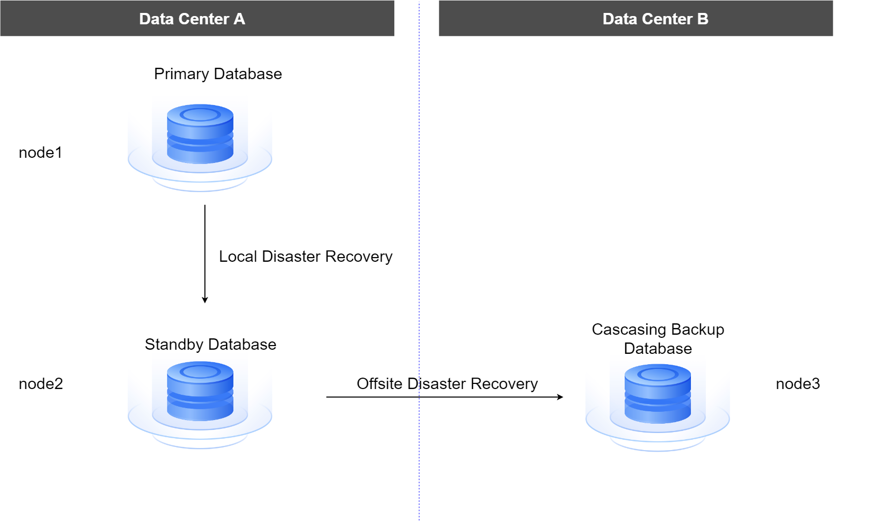
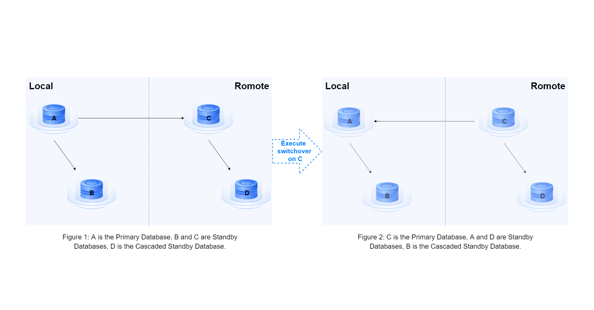
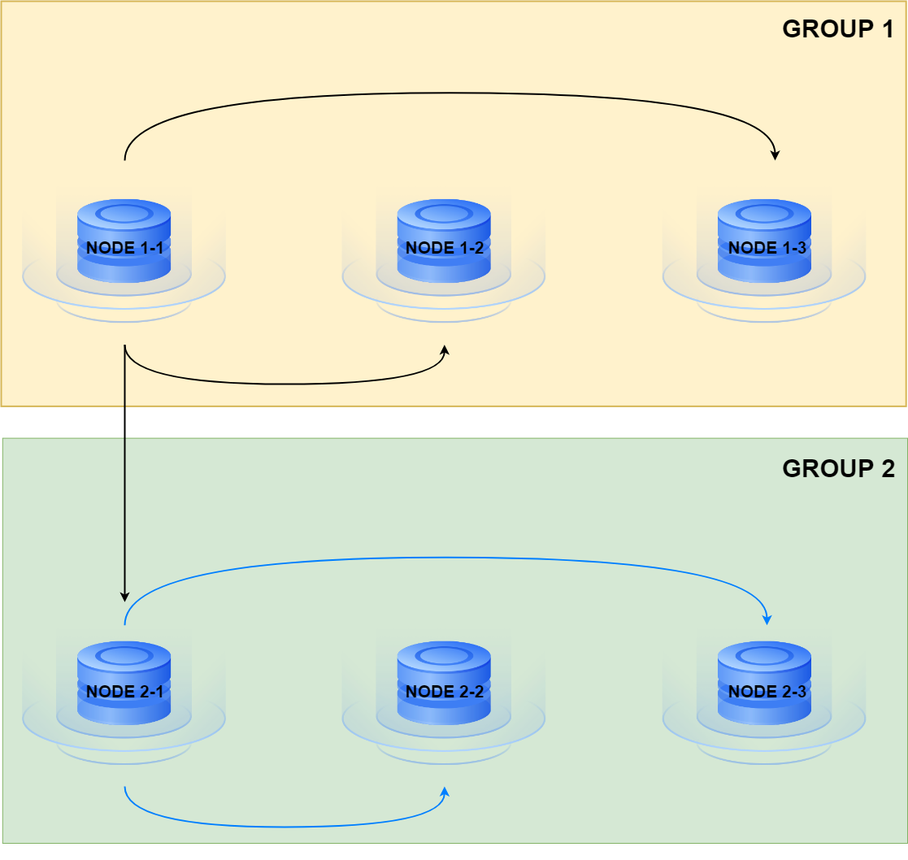
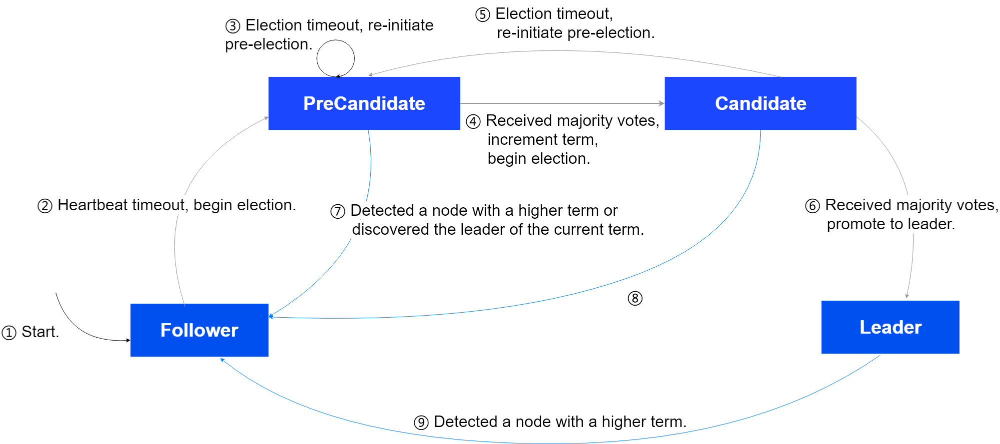

High Availability (HA) refers to various technical measures that reduce the system's downtime and ensure business continuity. For example, if a system is unable to provide services for 1 time unit out of every 100 time units, its availability is 99%. In practical scenarios, most enterprises aim for system availability as close to 100% as possible, meaning continuous operation 24/7.

The high availability architecture of YashanDB is primarily designed from the following aspects to help enterprises achieve the above goals:

- Rich high availability deployment options:

  - Standalone Deployment primary/standby deployment: The primary and standby databases are deployed on different servers connected to the same switch, ensuring low network latency and avoiding single points of failure.

  - Standalone Deployment cascade standby deployment: An asynchronous standby database deployed at a different location reduces bandwidth load on the primary database and ensures high availability for disaster recovery.

  - Dual-replication group primary/standby deployment: Two Standalone Deployment primary/standby environments are divided into two groups, with asynchronous data synchronization between the groups. Each group can be deployed in different regions/data centers to achieve disaster recovery.

  - YAC Deployment: Multiple instances use an active-active deployment approach, ensuring [high availability for cluster databases](../YashanDB for Cluster/High Availability of YAC/00High Availability of YAC) through client TAF technology and server-side automatic failover capabilities.
  
  - Primary/standby cluster deployment: Primary/standby clusters can be deployed in different locations to create a cluster disaster recovery environment.

  - ISC Distributed Cluster Deployment: MN group and DN group use primary/standby deployment. When the primary node is unavailable, it can automatically elect a new primary from the standby node to achieve automatic switching in the event of a failure. CN nodes use an active-active deployment, providing online services simultaneously, so that a single point of failure does not affect the entire system.

- Leader election mechanism: When the primary database node is unavailable, a standby database node is automatically elected to become the new primary, achieving automatic switching in case of a failure. This includes [one-primary/multi-standby leader election](Configuring Leader Election/Configuring Leader Election for One Primary and Multi-Standby) and [one-primary/one-standby yasom election](Configuring Leader Election/Configuring yasom Election for One Primary and One Standby).

- [Backup and Recovery](../Database Administration/Backup and Recovery/00Backup and Recovery): As a routine measure for database management, backup and recovery ensure the security of the database data, which is the most fundamental capability for high availability.

## Primary/Standby Deployment

Replication is the main high availability measure for databases, achieved by real-time copying data from the primary database to the standby database. The primary database is the instance executing business operations, while the standby database is the instance that copies data from the primary database. When a failure occurs in the primary database, the business can shift to the standby database to continue execution, reducing the impact of the failure on business operations and improving database availability.

It also supports on-demand scaling of standby database nodes, allowing users to flexibly adjust the scale of their high availability deployment based on business load and resource conditions.

**Primary Database**:

The primary node of the database currently provides online database services in read-write mode.

In YAC Deployment, it is referred to as **Main Cluster**, where multiple instances of the main cluster provide online services simultaneously and transfer logs to the master instance of the standby cluster.

**Standby Database**:

As a redundant node of the database cluster, it supports the creation of up to 32 standby databases. Its core operating mechanism is to synchronize data by real-time receiving redo logs from the primary database and applying them locally.

In YAC Deployment, it is referred to as **Standby Cluster**, where the master instance of the standby cluster starts multiple threads to receive logs from all instances of the main cluster and apply them.

### Primary-standby Replication Link

Real-time data replication from the primary database to the standby database is achieved through transferring redo logs, as shown below:

Replication link for primary/standby database:

Replication link for primary/standby cluster:

1. **Log Sending**

  There are two modes: SYNC (synchronous) and ASYNC (asynchronous):

  - SYNC: The primary database reads data from the Log Cache and sends it to the standby database, providing higher performance.
  - ASYNC: The primary database reads data from the redo file and sends it to the standby database, generally suitable for remote standby databases.

  The system automatically selects whether to take SYNC or ASYNC mode for log sending.

2. **Log Application**

  The standby database applies redo logs sent by the primary database to maintain data consistency with the primary database.

  If the required data is not found in both the Log Cache and the redo file, a thread will initiate to synchronize the primary database's archive log files to the standby database and search for the required data, maximizing data consistency for the primary and standby databases.

  The main differences between physical standby databases and logical standby databases lie in the log application methods:

  * Physical standby databases use a redo apply mechanism.

  * Logical standby databases use an SQL Apply mechanism to convert received redo logs into SQL statements, which are then executed on the logical standby database.

### Protection Mode

Since primary-standby replication relies on network transmission, there will inevitably be some delays and instability. YashanDB offers three different protection modes for configuration, allowing users to choose a suitable one based on their performance or data security needs, as detailed in [Managing Protection Mode](Managing Protection Mode).

|Protection Mode |Transaction Behavior (default) |Advantages and Disadvantages |
|--------------------|------------|--------------------------|
| **maximize protection**   | Once the primary database transaction finishes, it must wait for at least one synchronous standby database to flush the corresponding redo logs to disk before returning a successful transaction commit to the client.   | In case of primary database failure, switching to a synchronous standby database ensures no data loss.   If the synchronous standby database encounters network issues or failures, it will block primary database operations. |
| **maximize availability**  | Once the primary database transaction finishes, it waits for transferring redo logs to the synchronous standby database (not waiting for the standby database's flush result) and can return a successful transaction commit to the client. | Higher performance for the primary database, and network issues or failures on the standby database do not affect the primary database's operations.   Potential data loss may occur when switching to a standby database after a primary database failure. |
| **maximize performance** | Once all redo logs corresponding to the primary database transaction are written to the primary database's redo file, it can return a successful transaction commit to the client without waiting for the standby database to receive redo logs.  This is the default protection mode of the database, which aims to maximize the primary database's availability while still providing some data protection.   When any synchronous standby database connection is normal, it operates in maximize protection mode; when all synchronous standby databases experience network failures or failures, it operates in maximize performance mode. | There is a risk of data loss. |

In Standalone Deployment or ISC Distributed Cluster Deployment, users can define specific configurations for maximize protection mode based on actual business needs and performance considerations, allowing flexible adjustments to the synchronous mechanisms for transaction commit success on the primary database.

>**Note**:
>
> If the COMMIT_WAIT parameter is configured as NOWAIT, the primary database transaction does not need to wait for log persistence. It is recommended to use the default value WAIT for COMMIT_WAIT.

### Primary/Standby Switching

YashanDB supports executing switchover when both the primary and standby databases are normal and failover when the primary database is abnormal.

**Switchover**

This is performed on the standby database, requiring normal network connectivity between the primary and standby databases, and both instances must be in OPEN state.

The execution flow for switchover is as follows:

**Failover**

This must be performed on the standby database, with the standby database instance required to be in OPEN state. Since the primary database has failed, its redo logs may not be completely synchronized with the primary database, leading to potential data loss. Therefore, after failover, the redo timeline needs to be reset to distinguish between the old primary database and the new primary database's redo logs.

After initiating failover, the system executes the following flow:

## Cascade Standby Deployment

Cascade standby refers to a standby database's standby database. Ordinary standby databases receive logs from the primary database, while cascade standbys receive logs from their upstream standby databases.

When a certain cascade standby's upstream standby database becomes the primary database, that cascade standby converts to an ordinary standby database.

Cascade standby is generally used in remote disaster recovery deployments, as illustrated below:

A standby database can connect to a maximum of 32 cascade standbys, and the cascade standby can continue connecting to further cascade standbys, without a limit on the number of layers, but circular connections are not permitted.

The cascade standby mode is only applicable to Standalone Deployment.

**Primary/Standby Switching**

Since cascade standbys do not connect directly to the primary database, they cannot execute switchover; only failover can be performed. However, if the upstream standby database of the cascade standby executes a switchover, the role of that cascade standby will change, and the primary/standby switching will depend on the current role status in the system, as shown in the figure:

## Dual Replication Group Primary/Standby Deployment

Deploying two Standalone Deployment primary/standby environments in different data centers/regions, where each primary/standby environment acts as a replication group. Data is synchronized from one replication group (primary replication group) to another replication group (standby replication group) to create a remote disaster recovery architecture. For deployment operations, please refer to [Dual Replication Group Primary/Standby Deployment](../Installation and Upgrade/Installation and Deployment/YashanDB Installation via CLI/Standalone (Primary-Standby) Deployment.html#Manual).

Dual replication group primary/standby deployment consists of the following roles:

- Primary Database: Responsible for sending redo logs to all standby databases; the primary database's replication group is called the primary replication group.

- Standby Database:

  - Synchronous Standby: All standby databases in the primary replication group, responsible for receiving redo logs sent by the primary database and applying them.
  
  - Asynchronous Standby: The primary node in the standby replication group, responsible for receiving redo logs sent by the primary database and applying them, while also serving as the upstream standby database for other nodes in the standby replication group to forward the received redo logs.

- Cascade Standby: Other nodes in the standby replication group except the primary node, receiving and applying redo logs sent by the primary node.

Taking the following figure of dual replication group primary/standby deployment as an example, GROUP 1 is the primary replication group: NODE1-1 is the primary database, and NODE1-2 and NODE1-3 are synchronous standby databases. GROUP 2 is the standby replication group: NODE2-1 is the asynchronous standby database (the primary node of the standby replication group), and NODE2-2 and NODE2-3 are cascade standby databases.

### Intra-Group Primary/Standby Switching

**Primary Replication Group**

- Automatic Switching: When the number of nodes in the primary replication group is greater than or equal to 3, leader election can be configured.

- Manual Switching: The primary standby database in the primary replication group supports manual execution of switchover and failover.

**Standby Replication Group**

Nodes in the standby replication group do not possess direct switching capabilities between primary and standby and always maintain only the primary node receiving data from the primary replication group. If the primary node fails, data synchronization in the replication group will be interrupted.

To change the primary node of the standby replication group, the relevant counterpart database link parameters ARCHIVE_DEST_* must be reconfigured:

- All nodes must add counterpart database link parameters ARCHIVE_DEST_* pointing to the primary database in the primary replication group, formatted as `ARCHIVE_DEST_*='SERVICE=Target Node's REPLICATION_ADDR',DISABLE_ELECTION=TRUE,VALID_FOR=PRIMARY_ROLE`.

- Counterpart database link parameters ARCHIVE_DEST_* pointing to group nodes:

    - For the primary node, the configuration format is `ARCHIVE_DEST_*='SERVICE=Target Node's REPLICATION_ADDR',VALID_FOR=ALL_ROLES`.

    - For other nodes, the configuration format is `ARCHIVE_DEST_*='SERVICE=Target Node's REPLICATION_ADDR',VALID_FOR=PRIMARY_ROLE`.

### Inter-Group Primary/Standby Switching

The primary replication group and standby replication group support manual switching of group roles (switchover and failover) but with the following rules:

- If the original primary replication group has leader election configured, the corresponding functionality must be disabled before switching. After the switch is complete, the new primary replication group will support leader election configuration, which can be selected according to actual needs.

- Failover between groups can only be executed when all primary standby databases in the original primary replication group have failed. After the switch is completed, the original primary replication group's (now newly designated standby replication group's) all nodes need to be manually brought back up to ensure normal operation of the dual replication group configuration.

## Leader Election

Leader election occurs in Standalone Deployment one-primary/multi-standby (non-cascade), distributed cluster node groups one-primary/multi-standby deployment scenarios. When the primary node cannot provide services due to an exception, the system elects one of the multiple standby nodes to promote as the new primary node, while the old primary node demotes to a standby node.

In YashanDB, whether to enable leader election is controlled via a switch. When disabled, users can manually choose one standby database to execute switchover or failover as needed based on the scenario. When enabled, users can still choose one standby database to execute switchover, but when the primary node fails, the system automatically selects a standby database to perform failover and promote it, requiring no manual intervention.

**Leader Election Mechanism**

YashanDB's leader election is implemented based on the Raft protocol, utilizing the election algorithm from the Raft consistency algorithm:

- Each Leader has a term. If no failures occur, the term is indefinite.

- Leaders periodically send heartbeat messages to Followers.

- If a Follower does not receive a Leader's heartbeat message within an election timeout, it becomes a PreCandidate and initiates a pre-election.

- When PreCandidate finds it can obtain the votes from the majority of nodes, it transitions to Candidate, initiates an election, and increments the term.

- After the Candidate's voting request is approved by the majority of nodes (casting affirmative votes), it promotes itself as the primary node.

- If the Candidate's vote does not pass, it enters the next election round until it is elected as Leader or another node is elected as Leader.

- If the Leader receives heartbeat messages or voting requests with a term greater than its own, it demotes to Follower.

The implementation process is illustrated in the following diagram:

**Quorum Mechanism**

The Raft election algorithm in YashanDB enables the Quorum mechanism for selecting a primary under the maximize protection mode, with the voting rules as follows:

- Nodes with Log Flush Number (LFN) greater than or equal to themselves will be cast votes of approval.

- Nodes with term greater than or equal to themselves will be cast votes of approval.

**Node Priority**

Under the prerequisite of satisfying the Quorum mechanism, node priority (HA_ELECTION_PRIORITY) greater than or equal to itself will be cast votes of approval.

The rules for selecting a primary are:

- When QUORUM_SYNC_STANDBYS is configured to MAJORITY, the Candidate needs to receive affirmative votes from the majority of nodes `(N/2 + 1)` to become the Leader.

- When QUORUM_SYNC_STANDBYS is configured to the number of synchronous standby databases:

  - When syncNum >= `[N/2]`, the Candidate needs to receive `(N/2 + 1)` affirmative votes to become the Leader.

  - When syncNum < `[N/2]`, the Candidate needs to receive `(N - syncNum)` affirmative votes to become the Leader.

Where N is the number of nodes, and syncNum is the number of synchronous standby databases defined by the user.

**Extensible Capabilities**

- Automatic Demotion: In scenarios with leader election enabled, the primary node actively demotes itself when it does not receive majority responses from standby nodes' heartbeats. This functionality is controlled via the HA_ELECTION_LEADER_LEASE_ENABLED parameter.

- Automatic Promotion: In scenarios with leader election enabled, the primary node actively demotes itself upon discovering higher-priority nodes, allowing the higher-priority node to promote itself. This functionality is controlled by the HA_ELECTION_AUTO_PRIMARY_SWITCH parameter.

## *yasom* Election

*yasom* election occurs in Standalone Deployment one-primary/one-standby or distributed DN group nodes one-primary/one-standby deployment scenarios. When the primary node fails and cannot provide services, the system promotes the standby node to primary through yasom arbitration, demoting the original primary node to standby.

When election is enabled, only manual switching of primary/standby can be performed by the user through the `yasboot node switchover` command. If the primary node fails, yasom automatically performs primary/standby switching, and users do not need, nor can, execute failover.

The choice to enable [yasom election](Configuring Leader Election/Configuring yasom Election for One Primary and One Standby) is available as needed.

## Parallel BUILD Standby Database

YashanDB supports initiating a build operation on the standby database to achieve initialization. When creating a one-primary/multi-standby configuration or adding several standby databases online, utilizing parallel build can significantly enhance deployment efficiency.

Parallel build is initiated by the primary database, which instructs multiple standby databases to start build operations, sending data to multiple standby databases simultaneously (up to the maximum allowable standby database data volume for primary/standby deployment), allowing multiple standby databases to execute restore concurrently. The cascading standby's parallel build is initiated by its upstream standby database.