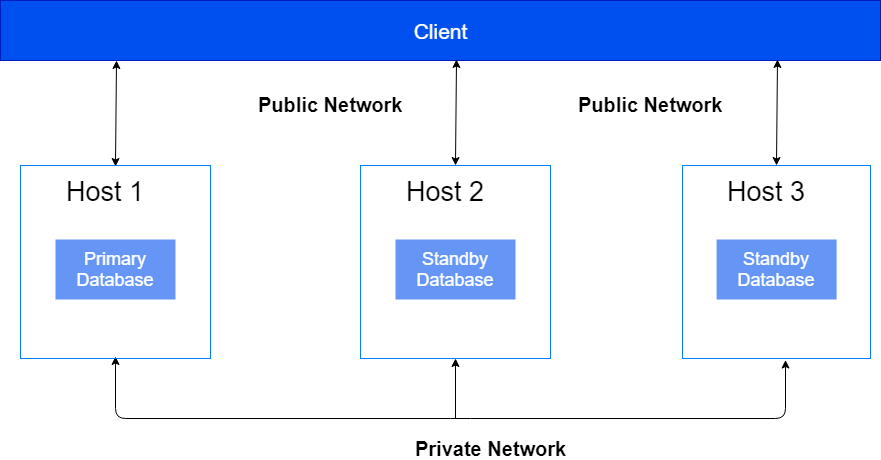
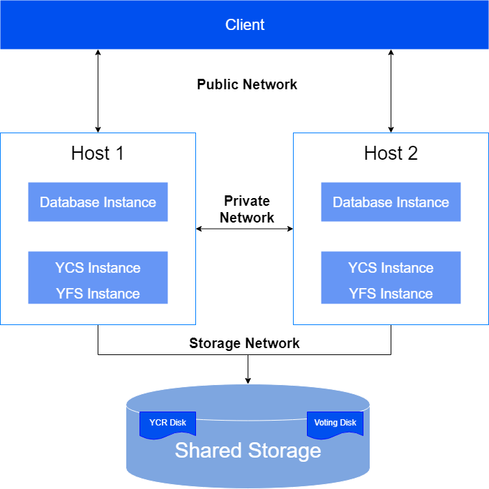
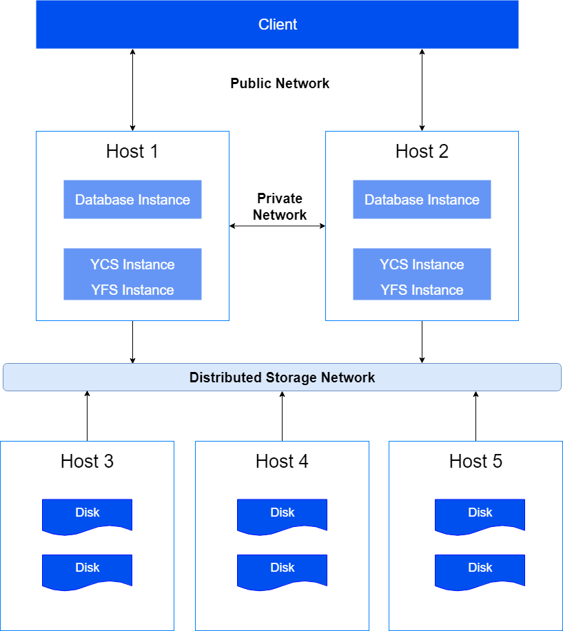
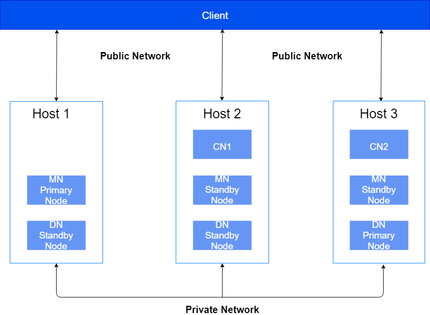

To ensure the security of application data and isolate illegal commands from the internet, it is recommended to divide the networking of YashanDB based on functionality into independent and isolated networks.

- Public Network: Mainly used for external business access to YashanDB, DBA for database management, and database tools for database command invocation, etc.
- Private Network: Mainly used for internal communication of YashanDB.
- Storage Network: including used for YAC instances to access shared storage, and used for Distributed cluster CNs to access storage cluster.

## Standalone Deployment

The typical networking of Standalone Deployment is shown in the figure below. This network scheme uses one primary and two standby examples, and it is recommended that the primary database and each standby database be deployed on different servers.

|Address |Description |Suggested Subnet |
|--------------------|-------------|-----------------|
| LISTEN_ADDR          | Used to connect to the database, providing external database services | Public Network        |
| REPLICATION_ADDR (required for primary/standby deployment) | Used for internal communication between primary and standby databases, inaccessible to database users   Only required for primary/standby deployment, this address needs to be planned | Private Network    |

## YAC Deployment

The typical networking of YAC Deployment is shown in the figure below. This network scheme uses 2 servers + 1 shared storage to construct a dual-instance single database YAC Deployment as an example. The instances should be deployed on different servers.

|Address |Description |Suggested Subnet |
|--------------------|-------------|-----------------|
| LISTEN_ADDR SCAN VIP VIP  | Both are used to connect to the database, providing external database services   The SCAN VIP and VIP are only applicable to YAC Deployment, and must be in the same subnet and on the same network card as LISTEN_ADDR | Public Network         |
| CLUSTER_INTERCONNECT INTER_URL REPLICATION_ADDR (required for primary/standby deployment) | CLUSTER_INTERCONNECT is used for communication between database instances within the cluster, INTER_URL is used for internal communication between YCS instances within the cluster, REPLICATION_ADDR is used for communication between primary clusters within the same group, inaccessible to database users   These three types of addresses on the same server can use the same IP + different port numbers | Private Network    |

## Distributed Cluster Deployment

The typical networking of Distributed Cluster Deployment is shown in the figure below. This network scheme uses 5 servers (three are mounted with NVMe storage) to construct a 2CN+3DN distributed cluster as an example. The nodes should be deployed on different servers.

|Address                   |Description                                         |Suggested Subnet |
| ---------------------------------- | ------------------------------------------------------------ | ----------------------------- |
| LISTEN_ADDR                        | used to connect to the database, providing external database services | Public Network                |
| CLUSTER_INTERCONNECT INTER_URL | CLUSTER_INTERCONNECT is used for communication between database instances within the cluster, INTER_URL is used for internal communication between YCS instances within the cluster, inaccessible to database users   These two types of addresses on the same server can use the same IP + different port numbers | Private Network               |

## ISC Distributed Cluster Deployment

The typical networking of ISC Distributed Cluster Deployment is shown in the figure below. This network scheme uses 1 MN group, 2 CNs, and 1 DN group (both DN group and MN group are configured with 1 primary and 2 standby) as an example. It is recommended that the primary/standby nodes of each group be deployed on different servers.

  

|Address |Description |Suggested Subnet |
|--------------------|-------------|-----------------|
| LISTEN_ADDR           | The listening address of the CN node used to connect to the database, providing external database services | Public Network         |
| REPLICATION_ADDR (required for primary/standby deployment in MN/DN groups) DIN_ADDR | REPLICATION_ADDR is used for communication between primary/standby nodes within the same group, DIN_ADDR is used for internal communication between MN, CN, and DN nodes across groups, inaccessible to database users   Each node group has different port numbers, and these two types of addresses on the same server can use the same IP | Private Network    |