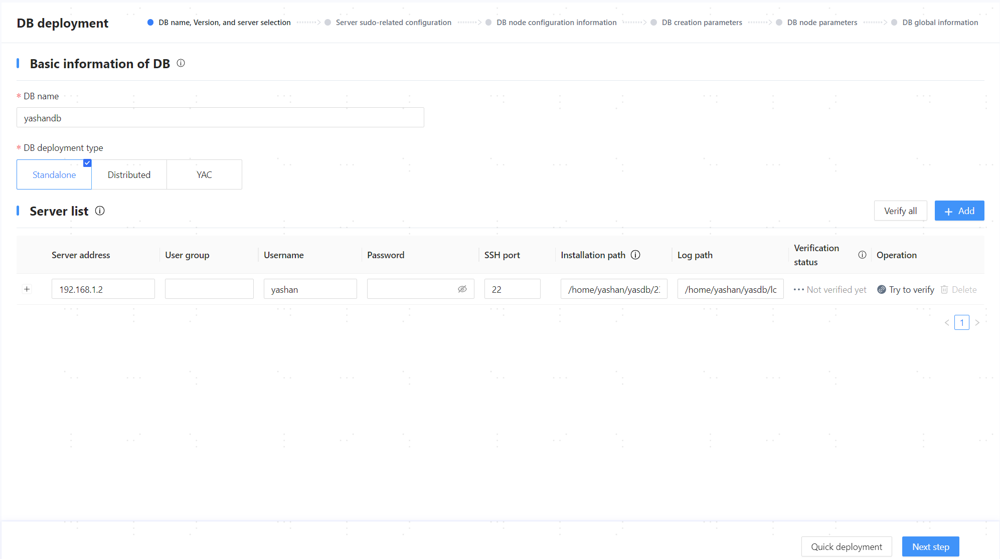
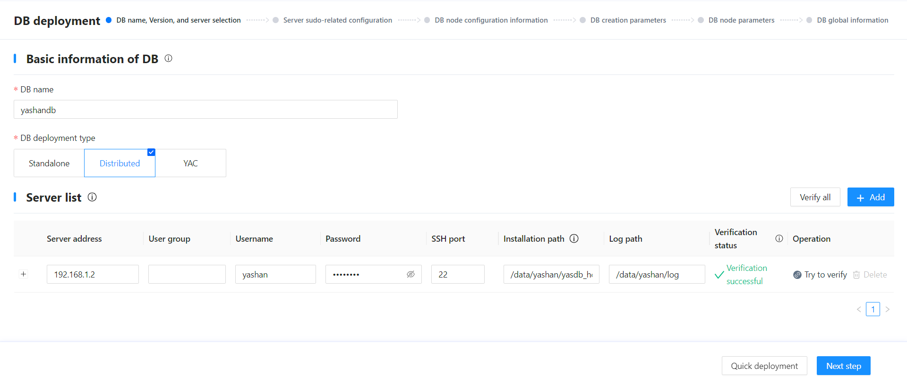
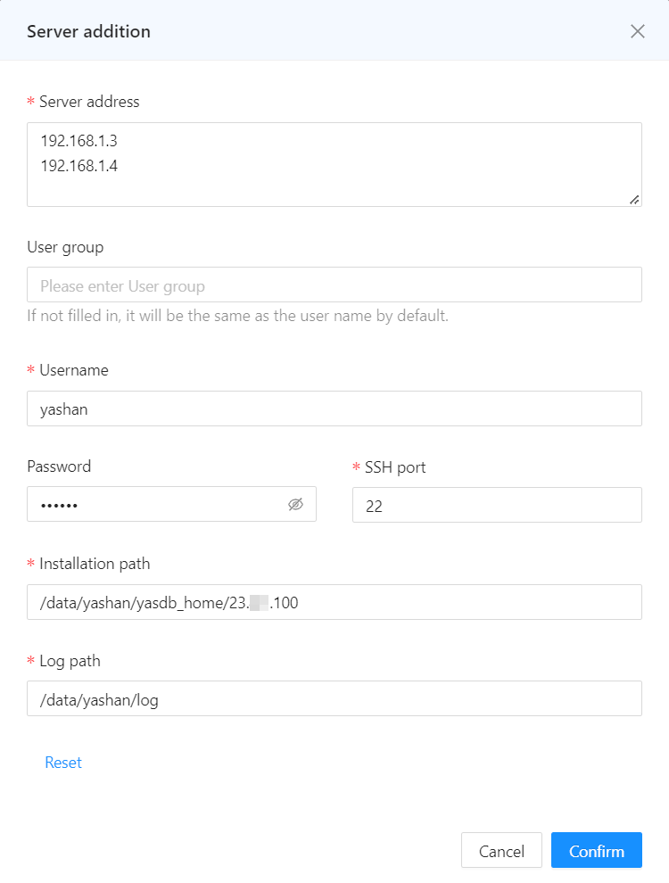
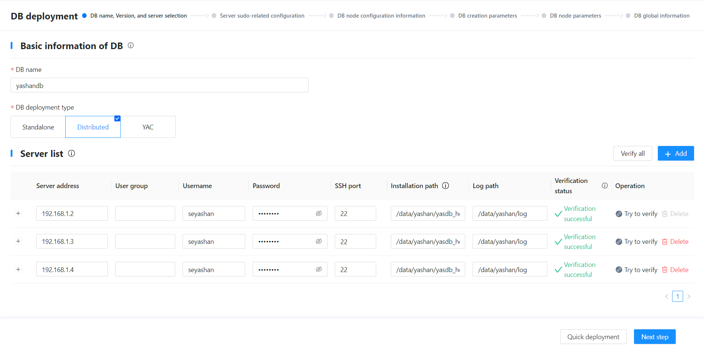
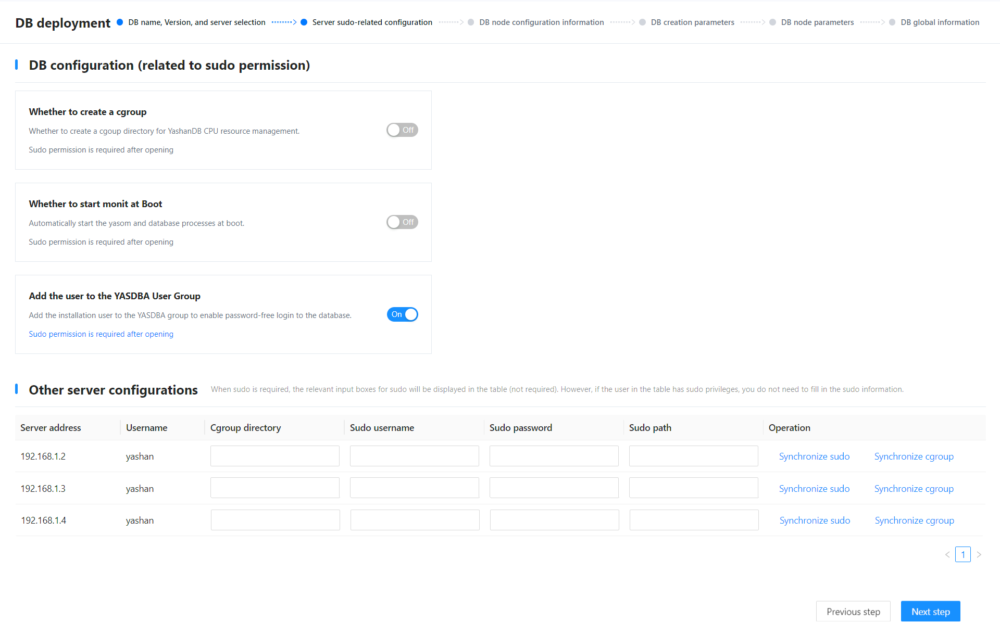
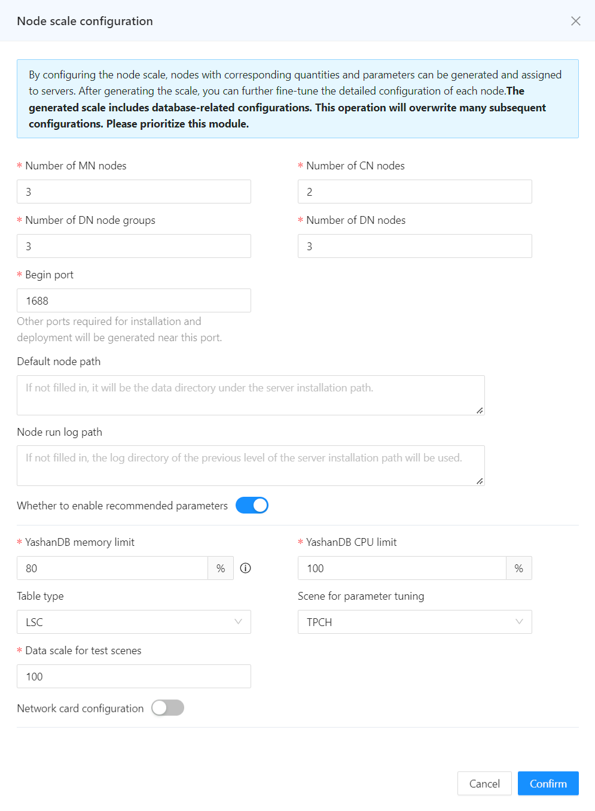
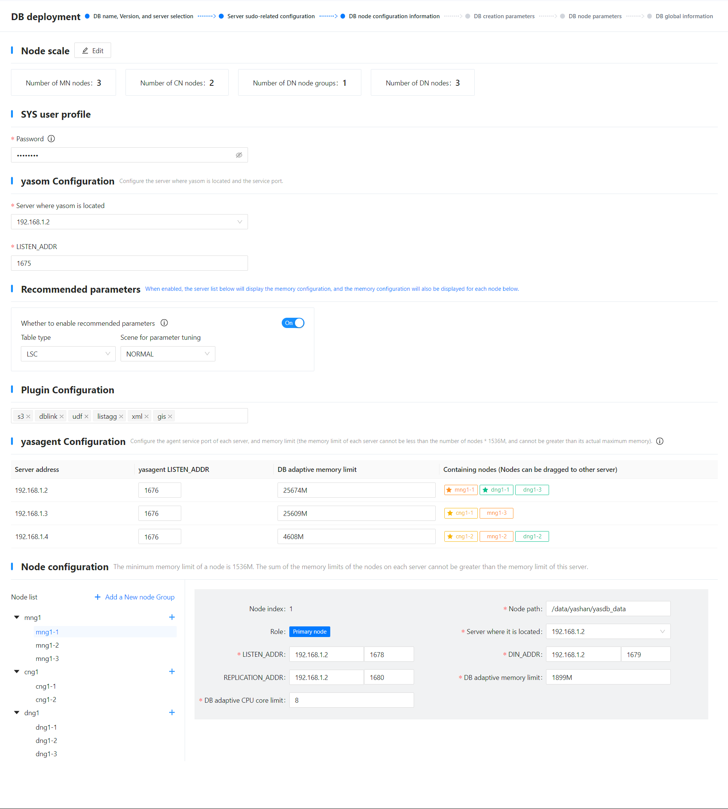
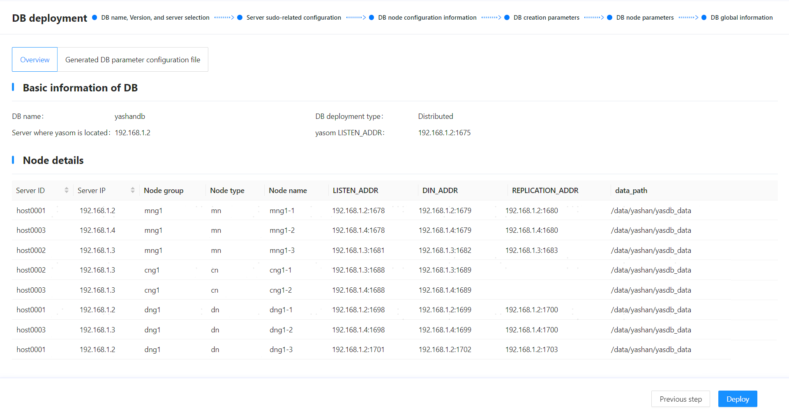
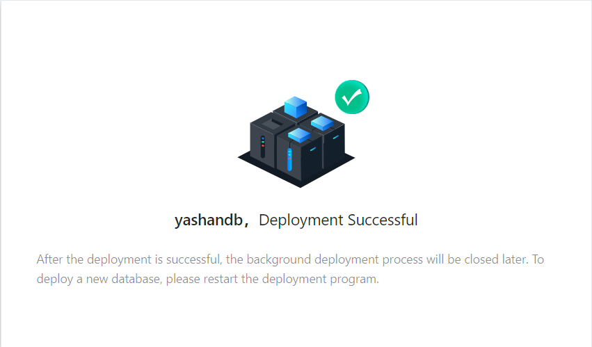

## Step 1: Start the Web Service
1. Log in to the 192.168.1.2 server as the yashan user.

2. Execute the following command to navigate to the directory where the Web service is installed:
    ```shell
    $ cd /home/yashan/install/om
    ```

3. Execute the following command to start the Web service using yasom:
    ```shell
    $ ./bin/yasom --web --listen 192.168.1.2:9001
    ```

    - --web: Specifies to start as a Web server.

    - --listen: Specifies the listening address (the address for the visual installation web page), in the format `IP:PORT`, usually set to the current server's IP, with port 9001 recommended.

4. Access the visual installation web page using a browser on the PC.

   

## Step 2: Configure Database Basic Information and Server Information

1. Configure the basic information of the database based on actual conditions:
   
   - DB name: Fill in the database cluster name, which will also serve as the name of the initial database. It must start with a letter and be [1,63] characters long, e.g., yashandb.

   - DB deployment type: Choose the type of database deployment, such as ISC Distributed Cluster Deployment.

> **Note**:
>
> To reuse/clean the configuration record in the current environment (possible situations for retaining configuration information: success in visual installation followed by uninstallation, failure in visual installation, etc.), click the [Database Name] input box, and select/clean the corresponding configuration from the dropdown options.
> 
> 

2. In the server list, the information of the server where the Web service is located is recognized by default. After checking that the installation path and other information are correct, click [Try Verification] to check for correctness.

   

3. Click [Add] at the top of the server list.

4. In the pop-up dialog box, configure the information for other servers and click [Confirm] to save the configuration.
   
   - Server address: The IP address of the server, in the format: `192.168.1.3` or `192.168.1.[3-4]`, multiple IP addresses/sets are allowed, separated by a newline.

   - User group: The user group to which the installation user belongs, left blank defaults to the same as the username.

   - Username: The name of the installation user, e.g., yashan.

   - Password: An optional parameter, the password for the installation user. If SSH passwordless access to other servers is already configured for the current server, the password is not required.

   - SSH port: The SSH port, e.g., 22.

   - Installation path: The database installation path, recommended to be configured as the planned [HOME directory](../Pre-Installation Preparation/Partitioning Directories)/{version number} (this does not check whether the /{version number} subdirectory exists; it will be created automatically during installation), supporting numbers, letters (case-sensitive), and special symbols ( `/`, `-`, `_`, `.`), e.g., /data/yashan/yasdb_home/{version number}.

   - Log path: [Log directory](../Pre-Installation Preparation/Partitioning Directories), e.g., /data/yashan/log.

   

5. Click [Try All Verification] to check for correctness.

   

6. After confirming that the information is correct, click [Next step].

## Step 3: Configure Server Sudo

1. In the database configuration area, the following functionalities can be configured:

   - Whether to create a cgroup: Enable to create a cgroup directory for YashanDB CPU resource management and fill in the cgroup directory from other configuration areas on the server. This parameter needs to be configured only when installing a database capable of opening CPU resource management (not a cascade backup), for specifics please refer to [Resource Management Configuration](../../../Database Administration/Resource Management/Configuring Resource Management).

   - Whether to start monit at Boot: When enabled, the daemon process will start automatically after the server boots up and bring up all YashanDB processes, indirectly achieving database auto-start on boot.

   - Add user to YASDBA user group: When enabled, it indicates that the installation user will be added to the YASDBA group, allowing passwordless login to the database.

   The above functionalities require the installation user to have sudo privilege once enabled. This example uses the default configuration, which only enables adding the user to the YASDBA user group.
   
   > **Note**:
   >
   > If the [Whether to start monit at Boot] parameter is set to off but there is a subsequent need to use relevant functionalities, refer to [Configuring Boot Autostart](../Initial Environment after Installation/Configuring Boot Autostart) to complete the related configurations.
   
   

2. After confirming that the information is correct, click [Next step].

## Step 4: Configure Database Node Information

1. In the pop-up dialog for node scale configuration, adjust the relevant configurations based on the [actual planning](../Pre-Installation Preparation/Preparing the Servers) for the number of nodes, and click [Confirm] to save the information.

   - Number of MN nodes: Select the number of MN nodes.

   - Number of CN nodes: Select the number of CN nodes.

   - Number of DN node groups: Select the number of DN node groups.

   - Number of DN nodes: Select the number of DN nodes.

   - Begin port: Fill in the starting value for the database listening port. If there are multiple listening ports, the system will calculate based on the [port allocation rules](../Pre-Installation Preparation/Configuring the Pre-Installation Environment), with a default value of 1688.

   - Default node path: Fill in the data directory for YashanDB. If left empty, it defaults to the yasdb_data directory of the parent directory of the server installation path. **Changes made after installation will not take effect**, supporting numbers, letters (case sensitive), and some symbols (`/`, `-`, `_`, `.`), up to 75 characters, e.g., /data/yashan/yasdb_data.

   - Node run log path: Fill in the running log path for YashanDB. If left empty, it defaults to the log directory of the parent directory of the server installation path, recommended to be consistent with the log path in the host list, e.g., /data/yashan/log.

   - Whether to enable recommended parameters: When enabled, yasom will call the [DBMS_PARAM](../../../Development Guide/PL Reference Manual/Built-in Advanced PL Packages/DBMS_PARAM) advanced package to generate recommended parameters that override the same named configuration parameters; the default is to enable. When enabled, the following parameters also need to be configured:

      - YashanDB memory limit: Set the percentage of available server memory for YashanDB, yasom will calculate the specific memory limit based on this percentage.

      - YashanDB CPU limit: Set the percentage of available server CPU for YashanDB, yasom will calculate the specific CPU limit based on this percentage.

      - Table type: Choose the table type commonly used in primary business, modifying database configuration parameters to maximize performance when this table type is used in the database, the default is LSC.

      - Scene for parameter tuning: Parameter tuning scenario, default is NORMAL.

      - Data scale for test scenes: Data scale for testing scenarios like TPCH, default is 100, representing 100G test data.

   

2. In the [SYS user profile] area, set the password for the database super administrator SYS user, with the following configuration requirements:

    - Password length is 8 - 64 characters.
    
    - The password must not contain the corresponding database username.
    
    - The password must include numbers, letters, and special characters.

    - Special characters related to Linux OS commands (such as `@`, `/`, `.`, `!`, `$`, `'`, etc.) need to be escaped.

3. In the [yasom Configuration] area, adjust the main yasom server and listening port as needed.

   - Server where yasom is located: Defaults to the current server IP.

   - LISTEN_ADDR: The listening port for yasom, default is 1675.

4. In the [Recommended parameters] area, check the configuration information, this configuration is derived from the corresponding configuration in the node scale.
   
   ```shell
   After enabling recommended configuration, some parameters will have fixed values and cannot be modified. The following parameters:
   +--------------------------------+-------------+---------+
   |            name                |  recommend  | restart |
   +--------------------------------+-------------+---------+
   | DATA_BUFFER_SIZE               |       5498M |  True   |
   | VM_BUFFER_SIZE                 |        741M |  True   |
   | WORK_AREA_STACK_SIZE           |          1M |  True   |
   | WORK_AREA_POOL_SIZE            |         16M |  True   |
   | WORK_AREA_HEAP_SIZE            |       2048K |  True   |
   | SHARE_POOL_SIZE                |        741M |  True   |
   | LARGE_POOL_SIZE                |        112M |  True   |
   | MAX_PARALLEL_WORKERS           |          12 |  True   |
   | SCOL_DATA_BUFFER_SIZE          |        128M |  True   |
   | SCOL_DATA_PRELOADERS           |           2 |  True   |
   | COLUMNAR_WORK_AREA_HEAP_SIZE   |         32M |  True   |
   | COLUMNAR_VM_BUFFER_SIZE        |        128M |  True   |
   | COLUMNAR_BULK_SIZE             |        1024 |  True   |
   | COMPRESSION                    |         LZ4 |  True   |
   | PQ_POOL_SIZE                   |        128M |  True   |
   | MAX_SESSIONS                   |         128 |  True   |
   | MAX_WORKERS                    |           0 |  True   |
   | TAB_QUEUE_WINDOW_SIZE          |           8 |  True   |
   | BLOOM_FILTER_FACTOR            |         0.5 |  True   |
   | DEGREE_OF_PARALLEL             |           1 |  True   |
   | MMS_DATA_LOADERS               |           3 |  True   |
   | CHECKPOINT_INTERVAL            |        192M |  False  |
   | CHECKPOINT_TIMEOUT             |          60 |  False  |
   | REDOFILE_IO_MODE               |      DIRECT |  True   |
   | DATAFILE_IO_MODE               |     DEFAULT |  True   |
   | COMMIT_LOGGING                 |   IMMEDIATE |  False  |
   | RECOVERY_PARALLELISM           |           2 |  True   |
   | REDO_BUFFER_SIZE               |         16M |  True   |
   +--------------------------------+-------------+---------+
   ```

5. In the [Plugin Configuration] area, select the plugins to install as needed.

6. In the [yasagent Configuration] area, adjust the following configurations as needed:

   - yasagent LISTEN_ADDR: The listening port for yasagent, default is 1676.

   - DB adaptive memory limit: Only when the recommended configuration is enabled, the memory limit must be configured in the format of `number + space/K/M/G/T`, with a value range of [number of nodes * 1536M, maximum memory of the server].

   - Containing nodes: Display the corresponding deployed node information on each server, starred nodes are primary, others are standby. Nodes can be dragged to adjust the distribution.

7. In the [Node configuration] area, adjust the following configurations as needed:
   
   - Modify node scale: Add or delete nodes/node groups. For example, clicking [Add a New node Group] can add a DN node group; clicking the [+] next to the node group (as shown below mng1) can add nodes to that MN group; clicking the delete flag next to the node name (as shown below mng1-1) can delete that node.

     

   - Expand the database node list, click the node name (as shown below mng1-1) can view node information and adjust related configurations as needed.

8. After confirming that the information is correct, click [Next step].

## Step 5: Set Database Creation Parameters

On the [DB creation parameters] page, refer to the [ISC Distributed Cluster Deployment Configuration File](../../../Tools Guide/yasboot/Configuration Files/ISC Distributed Cluster Deployment Configuration File) to add/delete/modify parameters for each node group as needed, and click [Next step] after confirming the information is correct.

## Step 6: Set Configuration Parameters

On the [DB node parameters] page, add/delete/modify parameters for each node as needed, and click [Save and Go to the Next Step] after confirming the information is correct.

## Step 7: Deploy the Database

1. On the [DB global information] page, confirm the information is correct, then click [Deploy].

   


2. When the message below appears, deployment is complete; you can manually close the page, as the server will automatically exit after a period of time.
 
   

> **Note**:
>
> After deployment, yasom will generate hosts.toml and yashandb.toml files in the `/home/yashan/install/conf/SE/yashandb` directory, where yashandb is the database name, and this directory is the installation directory.

## Step 8: Configure Environment Variables

After a successful deployment, a subdirectory `/conf` will be generated under the installation path configured in the previous steps (e.g., /data/yashan/yasdb_home/{version number}), and the YashanDB-related environment variable file `{cluster name}.bashrc` will be automatically generated in this directory. It needs to be applied to the operating system.

Log in as the installation user to each server and execute the following commands to activate the environment variables.

```shell
# Navigate to the directory containing the environment variable file, e.g., /data/yashan/yasdb_home/{version number}/conf
$ cd /data/yashan/yasdb_home/{version number}/conf

# Activate the environment variables
$ cat yashandb.bashrc >> ~/.bashrc
$ source ~/.bashrc

# Verify if Environment Variables Are Effective (Please use actual paths from the echo output)
$ echo $YASDB_DATA
/data/yashan/yasdb_data/cn-2-1
```

For detailed information about environment variables, please refer to [Initial Environment After Installation > Environment Variables](../安装后初始环境/环境变量).

## Step 9: Check Installation Results

If there are connection errors or SQL statement execution errors, please check the installation steps based on the error prompt or consult our technical support.

1. Use the [yasql](../../../Tools Guide/yasql/User Guide for yasql) tool to connect to the database and check the instance status.

    ```shell
    $ yasql sys/********@192.168.1.3:1688
    SQL> SELECT STATUS FROM V$INSTANCE;
    
    STATUS        
    ------------- 
    OPEN        
    
    SQL> SELECT database_name FROM v$database;
    
    DATABASE_NAME                                                    
    ---------------------------------------------------------------- 
    yashandb
    ```

2. (Optional) Create database users and grant permissions; for more operations, please refer to [User Management](../../../Product Security/Identity Identification and Authentication/User/00User).

    ```shell
    SQL> CREATE USER sales IDENTIFIED BY sales;
    
    SQL> GRANT CONNECT TO SALES;
    ```

## Step 10 (Optional): Enable *yasom* Election

If the number of DN nodes is configured to be 2 (i.e., DN nodes adopt a one-primary/one-standby specification), the primary/standby automatic switching of nodes within the DN group can be achieved using the [yasom election](../../../Tools Guide/yasboot/Introduction to yasboot Command/yasboot election).
