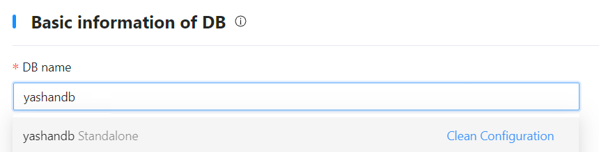

## Step 1: Start Web Service

1. Log in to the server 192.168.1.2 as the yashan user.

2. Execute the following command to enter the directory where the Web service is located in the installation directory.
    ```shell
    $ cd /home/yashan/install/om
    ```

3. Execute the following command to start the Web service using yasom:
    ```shell
    $ ./bin/yasom --web --listen 192.168.1.2:9001
    ```

    - --web: Specifies to start as a Web server.

    - --listen: Specifies the address to listen to (the URL for the visual installation), in the format `IP:PORT`. It is usually set to the current server's IP, with the port recommended to be 9001.

4. Access the visual installation web address in the browser on your PC.

## Step 2: Configure Database Basic Information and Server Information

1. Configure database basic information based on actual conditions:
   
   - DB name: Enter the database cluster name, which will also serve as the initial database name (database name). It must start with a letter, supports letters (case-sensitive), numbers, and underscores, and has a length of [4,64] characters, e.g., yashandb.

   - DB deployment type: Select the database deployment form, such as YAC.

> **Note**:
>
> To reuse/clear the configuration information records in the current environment (possible scenarios that may retain configuration information: visual installation successful but then uninstalled the database, visual installation failed, etc.), click the database name input box and select/clear the corresponding configuration from the dropdown options.
> 
> 

2. In the server list, the information of the server where the Web service is located will be automatically recognized. After confirming the installation path and other information are correct, click [Try to verify] to check for accuracy.

3. Click [Add] in the upper right corner of the server list.

4. In the pop-up dialog, configure other server information and click [Confirm] to save the configuration.
   
   - Server address: The IP address of the server, format: `192.168.1.3` or `192.168.1.[3-4]`, allows multiple IP addresses/sets to be configured, separated by new lines.

   - User group: The user group to which the installation user belongs. If left blank, it defaults to the same as the username.

   - Username: The name of the installation user, e.g., yashan.

   - Password: Optional parameter, the password of the installation user. If the current server has been configured for SSH keyless access to other servers, password entry is not required.

   - SSH port: SSH port, e.g., 22.

   - Installation path: The database installation path, recommended to be configured as the planned [HOME directory](../安装前准备/创建用户和目录.html#HOMEDirectory)/{version_number} (this does not check whether the /{version_number} subdirectory exists; it will be created automatically during installation), supports numbers, letters (case-sensitive), and certain symbols (`/`, `-`, `_`, `.`), e.g., /data/yashan/yasdb_home/{version_number}.

   - Log path: [Run log directory](../安装前准备/创建用户和目录.html#run_log_path), e.g., /data/yashan/log.

5. Click [Verify All] to check for accuracy.

6. After confirming the information is correct, click [Next step].

## Step 3: Configure Server Sudo

1. In the database configuration area, the following functionalities can be configured:

   - Whether to start monit at Boot: When enabled, the daemon will automatically start after the server boots and launch various YashanDB processes, indirectly achieving automatic database startup on boot.

   - Add the user to the YASDBA User Group: When enabled, the installation user will be added to the YASDBA group, allowing passwordless login to the database.

   After enabling the above functionalities, the installation user must have sudo privileges. This example uses the default configuration, which only enables adding the user to the YASDBA user group.
   
   > **Note**:
   >
   > If the [Whether to start monit at Boot] parameter is set to off but the related functionalities need to be used later, please refer to [Configure Boot Autostart](../Initial Environment after Installation/Configuring Boot Autostart) to complete the relevant configuration.

2. After confirming the information is correct, click [Next step].

## Step 4: Configure Cluster Node Information

1. In the pop-up node scale configuration dialog, adjust the relevant configurations based on the [actual planning](../Pre-Installation Preparation/Preparing the Servers) for the number of instances, and click [Confirm] to save the information.

   - Number of cluster groups: The number of YAC groups. For example, 1 for building 1 cluster, 2 for building a one-primary/one-standby cluster, 3 for building a one-primary two-standby cluster, and so on. This example illustrates building 1 cluster.

   - Number of primary cluster nodes: Select the number of database instances in the primary cluster.

   - Number of standby cluster nodes: Select the number of database instances in the standby cluster. This input box will appear if the number of cluster groups is greater than 1.

   - Begin port: Enter the starting value for the database listener port. If there are multiple listener ports, the system will calculate them based on the [port allocation rules](../安装前准备/网络准备.html#openports), with the default value being 1688.

   - Default node path: Enter the data directory for YashanDB. If left blank, it defaults to the yasdb_data directory in the parent directory of the server installation path. **Changes made after installation do not take effect**, and supports numbers, letters (case-sensitive), and certain symbols (`/`, `-`, `_`, `.`) with a maximum length of 71 characters, e.g., /data/yashan/yasdb_data.

   - Node run log path: Enter the running log path for YashanDB. If left blank, it defaults to the log directory in the parent directory of the server installation path. It is recommended to be consistent with the log path in the host list. For example, /data/yashan/log.

   - Disk discovery path: Enter the path for disk discovery, used to discover the disks of the shared storage cluster. This path is the parent directory of the shared storage data disk path and the system data disk path, e.g., /dev/yfs.

   - Data disks: Enter the shared storage LUN path planned for the data disk, e.g., /dev/yfs/data0.

   - System data disks: Enter the shared storage LUN path planned for the system data disks, e.g., /dev/yfs/sys0, /dev/yfs/sys1, and /dev/yfs/sys2.

   - Network card configuration: You can configure the [DB listening Address], [Primary-standby replication link address] and [YAC network communication link address] to different segments, formatted as `192.168.1.0/24`.

   - scan configuration: configure public network subnet, SCAN domain name, or VIP information. 

      - public_network：Public network subnet of YAC, in format subnet/subnet_mask[/network_interface_name], where the network interface name is optional, for example: 192.168.1.0/24
   
      - scan_name：SCAN domain name of YAC, must be used with --public-network parameter
   
      - vips：VIP configuration information for YAC, in the format IP_address/subnet_mask[/network_interface_name], for example: 192.168.1.62/255.255.255.0/ens192. If it is not possible to ensure that all servers in the same cluster have consistent public network interface names, the network interface name must be omitted. --vips must be used with --public-network parameter, and the IP address should belong to the public network. The number of VIPs should match the number of nodes, and multiple VIP configurations are separated by commas `,`
   
2. In the [SYS user profile] Area, set the password for the database super administrator SYS user, with the following requirements:

    - Password length must be between 8 - 64 characters.
    
    - The password cannot contain the corresponding database username.
    
    - The password must include numbers, letters, and special characters.

    - Special characters related to Linux OS commands (e.g., `@`, `/`, `.`, `!`, `$`, `'`, etc.) must be escaped.

3. In the [yasom Configuration] area, adjust the server where yasom is located and the listening port as needed.

   - Server where yasom is located: Defaults to the current server IP.

   - LISTEN_ADDR: The listening port of yasom, defaulting to 1675.

4. In the [Plugin Configuration] Area, select the plugins to install as needed.

5. In the yasagent configuration area, adjust the following configurations as needed:

   - yasagent LISTEN_ADDR: The listening port of yasagent, defaulting to 1676.

   - Containing nodes: Displays the database instance information deployed on each server. Instances marked with a star are primary, others are standby. Instances can be dragged to adjust their distribution.

6. In the [Node configuration] Area, adjust the following configurations as needed:
   
   - Click the node group (e.g., ceg1) to modify the disk-related configuration for that node group. The system disk group configuration **cannot be adjusted after installation**. Please complete the configuration of AU size, redundancy level, number of FailureGroups, and disk grouping according to your requirements at this step.

   - Adjust node scale: add/delete nodes/node groups. For example, click [Add Node Group] to add a standby cluster; click the [+] icon to the right of the node group (e.g., ceg1) to add instances to that cluster; click the delete icon to the right of the instance name (e.g., ceg1-1) to delete that instance.

   - Expand the database instance list, click the instance name (e.g., ceg1-1) to view instance details, and adjust configurations as needed.

7. After confirming the information is correct, click [Next step].

## Step 5: Set Database Creation Parameters

On the [DB creation parameters] page, refer to [Database Creation Parameters](../../../工具手册/yasboot/建库参数) to add/delete/edit corresponding parameters as needed, refer to [YFS Configuration](../../../数据库管理/存储管理/集群文件系统管理/YFS参数配置) to add/delete/edit YFS parameters as needed, refer to [YAC Configuration](../../../数据库管理/集群管理/集群参数配置) to add/delete/edit YCS parameters as needed, and after confirming the information is correct, click [Next step].

## Step 6: Set Configuration Parameters

On the [DB node parameters] page, add/delete/edit parameters for each database instance as needed, and after confirming the information is correct, click [Save and Go to the Next Step].

## Step 7: Deploy Database

1. On the [DB global information] page, after confirming the information is correct, click [Deploy].

2. When the following prompt appears, it indicates that the deployment is complete, and you can manually close the web page. The server will automatically exit after a period of time.

> **Note**:
>
> After deployment, yasom will generate hosts.toml and yashandb.toml files in the directory `/home/yashan/install/conf/CE/yashandb`, where yashandb is the database name, and this directory is the installation directory.

## Step 8: Configure Environment Variables

After a successful deployment, a subdirectory /conf will be generated under the installation path configured in previous steps (e.g., /data/yashan/yasdb_home/{version_number}), where environment variable files related to YashanDB such as `{cluster name}.bashrc` will be automatically generated. These need to be applied to the operating system.

Log in to each server as the installation user and execute the following commands to activate the environment variables.

```shell
# Navigate to the directory containing the environment variable file, e.g., /data/yashan/yasdb_home/{version_number}/conf
$ cd /data/yashan/yasdb_home/{version_number}/conf

# Activate environment variables
$ cat yashandb.bashrc >> ~/.bashrc
$ source ~/.bashrc

# Configure the $YASCS_HOME environment variable
# Based on the installation example instance 1-1 from the previous text, the path example values are as follows, but the node paths should be based on actual values.
$ export YASCS_HOME=/data/yashan/yasdb_data/ycs/ce-1-1

# Verify if Environment Variables Are Effective (Please use actual paths from the echo output)
$ echo $YASDB_DATA
/data/yashan/yasdb_data/ce-1-1
```

For detailed information about environment variables, please refer to [Initial Environment After Installation > Environment Variables](../安装后初始环境/环境变量).

## Step 9: Check Installation Results

If there are connection errors or SQL statement execution errors, please check the installation steps based on error messages or consult our technical support.

1. Use the [yasql](../../../Tools Guide/yasql/User Guide for yasql) tool to connect to the database and check the instance status.

    ```shell
    $ yasql sys/********@192.168.1.2:1688
    SQL> SELECT STATUS FROM V$INSTANCE;

    STATUS        
    ------------- 
    OPEN        

    SQL> SELECT database_name FROM v$database;

    DATABASE_NAME                                                    
    ---------------------------------------------------------------- 
    yashandb
    ```

2. (Optional) Create a database user and grant privileges. For more operations, please refer to [User Management](../../../Product Security/Identity Identification and Authentication/Managing Users).

    ```shell
    SQL> CREATE USER sales IDENTIFIED BY sales;
    
    SQL> GRANT CONNECT TO SALES;
    ```
