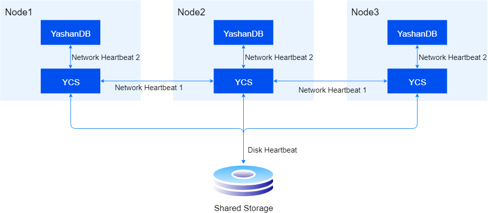
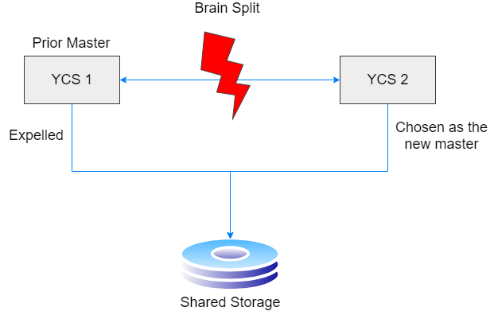

High availability of cluster services refers to the ability to ensure that when a server in the cluster fails due to software, hardware, or operational errors, it will be removed from the cluster, and the business workloads running on that server will be migrated to other servers, ensuring that the database service can continue normally. At the same time, when the failed server recovers, it will be readmitted to the cluster.

## Heartbeat Mechanism

YCS uses a heartbeat mechanism to monitor the occurrence and recovery of failures. When a failure is detected, it enters the corresponding failure handling process; when failure recovery is detected, the server or resource is readmitted to the cluster management.

To ensure timely awareness of changes in the state of servers and resources, YCS has established various heartbeat mechanisms, including:

- **Disk Heartbeat**

  All servers periodically update the heartbeat sequence number and write it to the voting disk while reading the disk heartbeat of other servers. The system assesses whether other servers are abnormal based on whether the heartbeat was updated in a timely manner.

  The configuration parameter DISK_HB_KEEP_ALIVE determines the wait time for judging the timeout of the server's disk heartbeat. If a particular server does not update its disk heartbeat within the time configured in DISK_HB_KEEP_ALIVE, it is considered abnormal, and the failure handling process is initiated.

- **Network Heartbeat**

  This includes Network Heartbeat One and Network Heartbeat Two:

  - Network Heartbeat One: All YCS servers send heartbeats to each other periodically. If a heartbeat is not received in time, the server is considered abnormal.
  - Network Heartbeat Two: The DB periodically sends heartbeats to the YCS server via UDS connection. If a heartbeat is not received in time, the resource is deemed abnormal.

  The configuration parameter NETWORK_HB_TIMEOUT determines the wait time for judging the timeout of the server/resource network heartbeat. If a particular server/database instance does not update its network heartbeat within the time configured in NETWORK_HB_TIMEOUT, it is considered abnormal, and the failure handling process is initiated.



## Voting Arbitration

When there is no master in the cluster or when a server is deemed abnormal through the heartbeat mechanism, the cluster will enter the voting arbitration process.



The voting process first selects a counting server. The counting server then determines whether the old cluster has been partitioned into multiple split sub-clusters due to network isolation, based on each node's network visible list, operational status, and other information. If this is the case, the counting server will choose the sub-cluster with the highest number of members as the surviving one (if the number of members is the same, the one with the old master survives) and select the master server within the surviving sub-cluster, while all servers outside the surviving sub-cluster will be included in the eviction list. If not, only the abnormal servers within the cluster will be included in the eviction list, and if the master server is abnormal, a new master will be chosen.

After the voting arbitration is completed, the counting server writes the member information of the surviving sub-cluster and the information of the servers to be evicted into the voting disk for processing by the master server. The master server will first execute the corresponding I/O Fencing operation on each server to be evicted according to the cluster configuration's FENCE_TYPE, in order to prevent ongoing I/O writes from damaging the data files of database instances on the evicted servers. After all eviction processes are completed, the master server will update the server status, regenerate the cluster member relationships, and synchronize the topology across the entire cluster.

## Topology Status View

The status of the YCS topology can be checked using the ycsctl status command, which includes the server ID, master server, resources, etc.

1. The topology information of the two YCS servers before a failure occurs (the displayed number of servers equals the number of deployed servers):

  ``` shell
  $ ycsctl status
  ---------------------------------------------------------------------------------------------
  Self Host ID|Cluster Master ID|YasFS Master ID|YasDB Master ID|Active Host Count
  ---------------------------------------------------------------------------------------------
  1            1                 1               1               2
  ---------------------------------------------------------------------------------------------
  Host ID   |Target    |State     |YasFS     |YasDB     |VIP
  ---------------------------------------------------------------------------------------------
  1          online     online     online     online     host1.online
  2          online     online     online     online     host2.online
  ```

2. When a YCS server fails, it will enter the failure handling process. For example, if Host1 experiences a disk heartbeat failure, Host2 will detect Host1's failure and enter the voting arbitration process. When the cluster initiates voting, it will log "vote" related information:

  ```shell
  abnormal found, trigger a new vote cycle
  ```

3. Once the cluster votes successfully and a new master server is designated, the logs will print the following information:

	```shell
	ycs run as primary successfully
	```

   For non-master servers, the logs will print the following information:

	```shell
	try join primary
	```

4. After the voting arbitration is concluded, checking the topology information will show:

	```shell
	$ ycsctl status
	-----------------------------------------------------------------------------------------
	Self Host ID|Cluster Master ID|YasFS Master ID|YasDB Master ID|Active Host Count
	-----------------------------------------------------------------------------------------
	2       2            2                 2               2                1         
	-----------------------------------------------------------------------------------------
	Host ID   |Target    |State     |YasFS     |YasDB     |VIP
	-----------------------------------------------------------------------------------------
	1          online     offline    offline    offline    host2.online
	2          online     online     online     online     host2.online
	```

## YCSM Monitoring

The YCSM monitoring process is an independently running process that starts first when the YCS process is initiated and exits when the YCS process shuts down. It is used to continuously monitor the state of the YCS process. The YCSM process has the following capabilities:

- **Monitor YCS Process Status and Handling**

  The YCSM process maintains a local heartbeat with the YCS process. If the local heartbeat times out, the YCSM process will forcibly stop and restart the YCS process and the database instances it manages. The timeout of the local heartbeat matches the timeout of the disk heartbeat.

- **Pull Up YCS Process When Offline**

  When the YCS process is not present and is in an abnormal stop state, the YCSM process will actively pull up the YCS process.