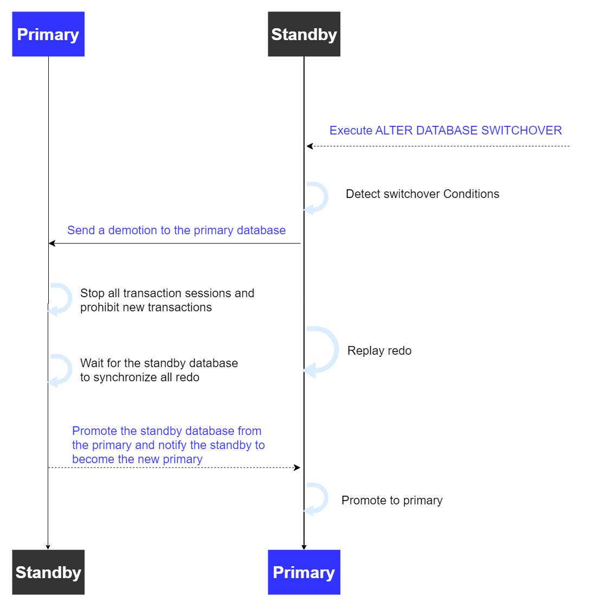
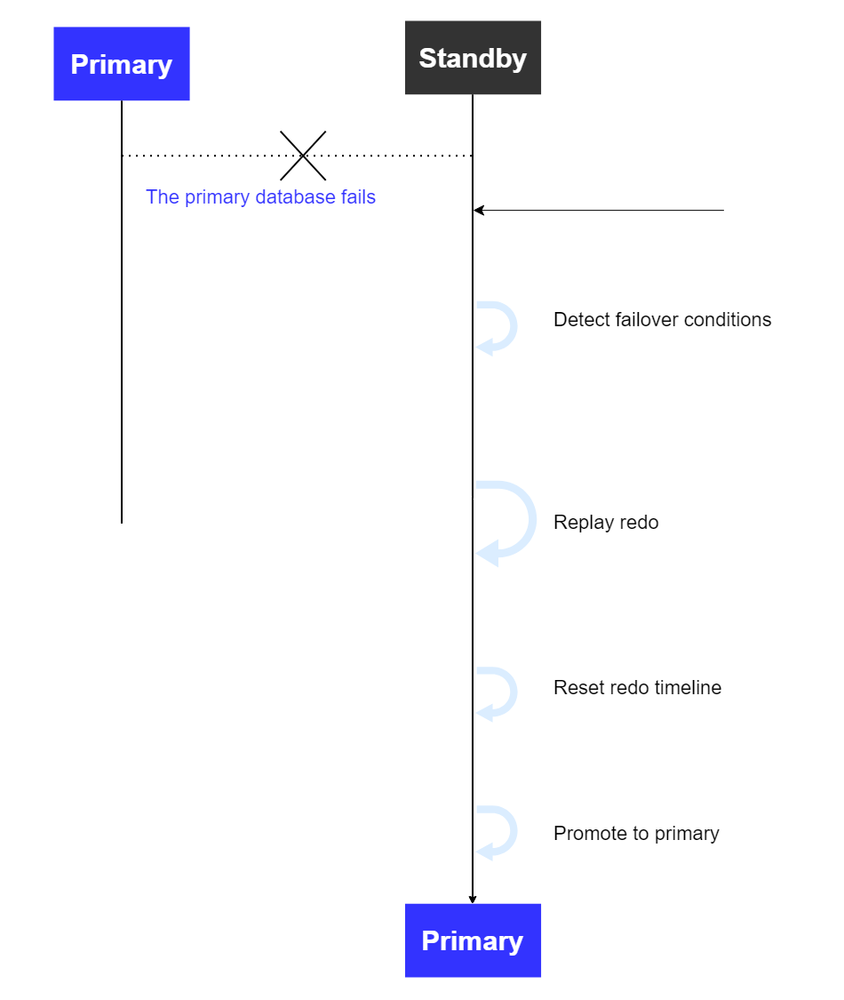

## Primary-standby Replication

Replication refers to the implementation of high availability by real-time copying data from the primary database to the standby database. It is the primary measure for achieving high availability in databases.

The primary database refers to the database instance that executes business operations, while the standby database is the database instance that copies the data from the primary database. When the primary database fails, business operations can be shifted to the standby database to continue execution, reducing the impact of the failure on business and improving database availability.

Replication is divided into physical replication and logical replication. Physical replication copies the physical storage contents of the primary database to the standby database, while logical replication recreates primary database data on the standby database based on logical change records (such as SQL statements).

- Physical standby database: The physical standby database stays synchronized with the primary database by applying redo data received from the primary database. The physical standby database is a physical replica of the primary database, with the same block-by-block disk database structure and exactly the same database schema (including indexes) as the primary database.

- Logical standby database: The logical standby database stays synchronized with the primary database by applying logical changes. It first converts the redo data received from the primary database into SQL statements, and then executes the corresponding SQL statements. The logical standby database contains the same logical information as the primary database, meaning both contain completely identical business data and metadata, but can have differences in physical storage structures (such as data file distribution and index organization).

### Primary Database Replication

#### Log Transmission

YashanDB's primary database synchronizes data by sending redo logs to the standby database. The primary database transmits redo logs to the standby database, which, upon receipt, writes them to its own redo files and sends an acknowledgment message back to the primary database. One primary database can simultaneously send redo logs to multiple standby databases, while a standby database can only receive redo logs from one primary database.

Based on the relationship between the standby database's receipt of redo logs and the primary database's transaction commits, there are two modes: synchronous replication and asynchronous replication.

- Synchronous replication means that before the primary database commits a transaction, it must first send the redo logs to the standby database. The data in the standby database is always consistent with the primary database, meaning the redo synchronization delay is 0. In synchronous replication mode, the standby database is referred to as a synchronous standby database.

- Asynchronous replication means that the sending of redo logs does not affect the primary database's ability to commit transactions. The data in the standby database may lag behind that of the primary database, meaning there is a non-zero redo synchronization delay.

#### Protection Modes

YashanDB's high availability architecture includes three protection modes: maximize performance, maximize availability, and maximize protection. By default, the database is set to the maximize performance mode after it is created.

- **Maximize Performance**

    This is the default protection mode of the database. It aims to protect data as much as possible without affecting the performance of the primary database. Transactions corresponding to the primary database's redo logs can be committed immediately after writing to the primary database's redo files. The sending of redo logs is completed asynchronously by a separate thread, and transaction commits do not require waiting for the standby database to receive the redo logs, hence the performance of the primary database is not affected by the standby database.

    This protection mode has minimal impact on the performance of the primary database and does not block primary database transactions in the event of a standby database failure, but there is a certain risk of data loss.

- **Maximize Availability**

    This protection mode aims to protect data as much as possible without affecting the availability of the primary database. When the synchronous standby database is available, transactions from the primary database can only be committed after the redo logs are transmitted to the synchronous standby database (whether to wait for writing to the redo file depends on the configuration). If the primary database cannot transmit the redo logs to at least one synchronous standby database, it will operate as if in the maximize performance mode, not blocking transaction commits on the primary database, thus maintaining its availability until it can resume normal transmission of redo logs to the synchronous standby database.

    This protection mode ensures zero data loss, except in the case of consecutive failures. For example, if the standby database fails and then the primary database fails, when the standby database is brought back online, it may lose some data.
    
    The performance of the Maximize Availability mode is essentially the same as that of the Maximize Protection mode.

- **Maximize Protection**

    This protection mode ensures that data loss does not occur when the primary database fails. In this mode, redo logs must be transmitted to the specified synchronous standby database and written to the redo files before transaction commits. This ensures that after a failure of the primary database, the synchronous standby database does not incur data loss. If, for a certain amount of time, the primary database cannot write its redo logs to the synchronous standby database (which must have at least one synchronous standby database), the database will be set to an ABNORMAL state, protecting the transactions that have already been performed and blocking subsequent transactions, requiring manual intervention by the database administrator to resolve the failure.

    This protection mode strictly guarantees zero data loss, but after a failure of the synchronous standby database, transaction commits on the primary database will be blocked. Additionally, because redo logs must be sent to the synchronous standby database, there will be a certain level of impact on the performance of the primary database.

- **Quorum**

    YashanDB supports the Quorum mechanism, allowing users to customize the number of synchronous standby databases. In both the Maximize Availability mode and the Maximize Protection mode, transactions in the primary database can only be committed after redo logs have been received by the synchronous standby databases.

    By default, the number of synchronous standby databases is defined as a majority of the entire cluster (assuming N is the total number of databases in the cluster, including the primary database, then the number of synchronous standby databases is N/2). For example, if there are two standby databases, then the number of synchronous standby databases is 1; thus, after either standby database receives the redo logs from the primary database, transactions in the primary database can be committed. The failure of one standby database does not affect the availability of the primary database.

    Under the Quorum mechanism, the number of synchronous standby databases is fixed, but which specific standby databases are designated as synchronous is uncertain. It can generally be assumed that the fastest progressing few standby databases are designated as the synchronous standby databases.

### Standby Database Synchronization

#### Physical Apply

Once the standby database receives redo logs, it must apply these logs to update the data pages of the standby database, so that its data is consistent with that of the primary database. This process is called log apply. During the log apply process, the consistency of the data is guaranteed, and read-only operations on the standby database are supported.

Before applying the redo logs, the standby database confirm that the corresponding transactions have been committed on the primary database to ensure that the transaction state of the primary database does not lag behind that of the standby database.

YashanDB's standby database has log apply enabled by default. After the standby database receives redo logs, it will immediately apply them, allowing for faster data querying and quicker completion of switchover and failover operations. Log apply can be paused and resumed at any time.

#### Logical Apply

After the standby database receives redo logs, it parses the redo logs into SQL statements. The standby database maintains logical consistency with the primary database by executing these SQL statements.

YashanDB's logical standby database has logical apply disabled by default and requires manual activation by the user.

#### Archive Recovery

When the standby database experiences network issues or is offline for a period of time, the redo logs generated by the primary database during this time are unable to be sent to the standby database. When the standby database becomes operational again, it starts receiving from the latest redo logs of the primary database to expedite redo synchronization.

This mechanism may result in missing redo files, causing the standby database redo files or archive log files to become discontinuous. This gap is referred to as a GAP. When a GAP occurs, the standby database will initiate an archive recovery thread to retrieve the corresponding archive log files from the primary database, addressing the discontinuity of the standby database redo files (or archive log files). This process is called archive recovery.

The archive recovery and redo log reception can be executed in parallel on the standby database, allowing the standby database to catch up with the primary database more rapidly, thus enhancing the synchronization performance of the standby database.

#### Cascade Standby

While the standby database is receiving redo logs from the primary database, it can also transmit its own redo logs to its respective standby database. The standby database's standby database is referred to as a cascade standby database.

For cost and performance considerations, cascade standby databases are commonly used for remote deployment and disaster recovery, utilizing synchronous standby databases (often found in the same city) to indirectly transmit the redo logs from the primary database, achieving disaster recovery at different locations.

The redo logs of a cascade standby database are indirectly transmitted by the standby database, not directly received from the primary database. Furthermore, the transmission of redo logs between the standby database and the cascade standby database constitutes asynchronous replication; the primary database's transaction commits are not related to the redo log receipt of the cascade standby database, meaning the cascade standby database may have potential data loss when it becomes the primary.

## Primary/Standby Switching

Primary/standby switching refers to the process of switching roles between primary and standby, where the primary database becomes a standby database, and the standby database becomes the primary database. It is generally divided into switchover and failover.

### Switchover

Switchover represents a planned switch where the primary and standby roles are exchanged with the assurance of zero data loss. During the execution of the switchover, business operations on the primary database are halted, and after all redo logs from the primary database are synchronized to the target standby database, the roles of the primary and standby databases are exchanged. After the switchover, the original primary database becomes a standby database, and the original standby database becomes the primary database, ensuring that the new primary database does not lose any data.

Switchover is typically used in database maintenance operations, such as rolling upgrades or server maintenance.

### Failover

Failover refers to an unplanned switching process that allows one standby database to be chosen as the new primary database in the event of a failure or downtime of the primary database to restore business operations. The target standby database may not contain all data from the original primary database, which might result in data loss after failover.

Failover is usually used for the rapid recovery of business operations after the primary database has failed. The original primary database, once failed, can be manually demoted to standby; if leader election or arbitration is enabled, it will automatically be demoted.

#### Log Reversion

Before the original primary database experiences failure, there might be some logs that were not synchronized with the standby database. After the failover, where the standby database becomes the primary and the original primary is demoted to standby, the redo logs from the original primary database and the new primary database may differ. If these logs have not been committed (or, in the case of the standby, not yet applied), it is possible to revert these logs to ensure data consistency for the primary-standby database.

If the database is in maximize protection mode, these logs will automatically be reverted. If the database is in maximize availability or maximize performance mode, the user must decide whether to revert the logs from the original primary database to eliminate log divergence (once reverted, those logs cannot be restored), allowing the standby database to synchronize correctly with the new primary database's logs.

#### Split-brain

Before the original primary database experiences failure, some redo logs may not have been synchronized with the standby database. After failover, where the standby database becomes the primary, and the original primary becomes the standby, discrepancies may arise between the logs of the original primary database and the new primary database. If these logs have been committed (or have been applied on the standby database), the standby database's data may become inconsistent, resulting in a split-brain situation. In this case, it is not possible to ensure consistency of the primary-standby database's data through log reversion; instead, split-brain recovery measures must be taken to attempt a rapid fix of the standby database. If the original primary database is not immediately demoted and the protection mode is set to maximize performance, then after the original primary database restarts, both primary databases might be providing services, and after the original primary database is demoted, a split-brain will also occur with the new primary database.