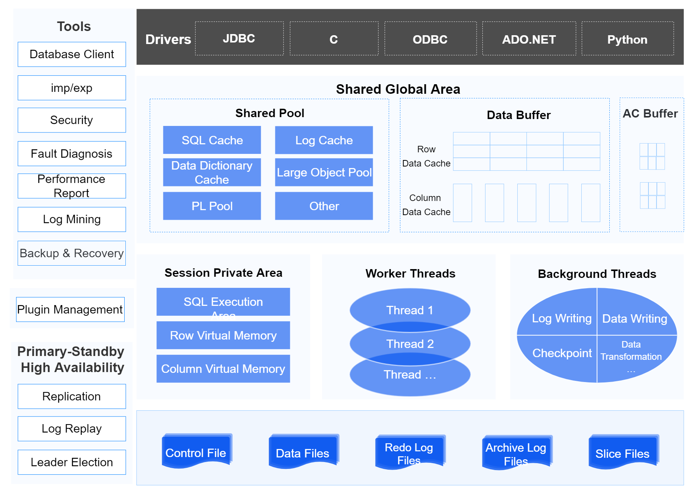
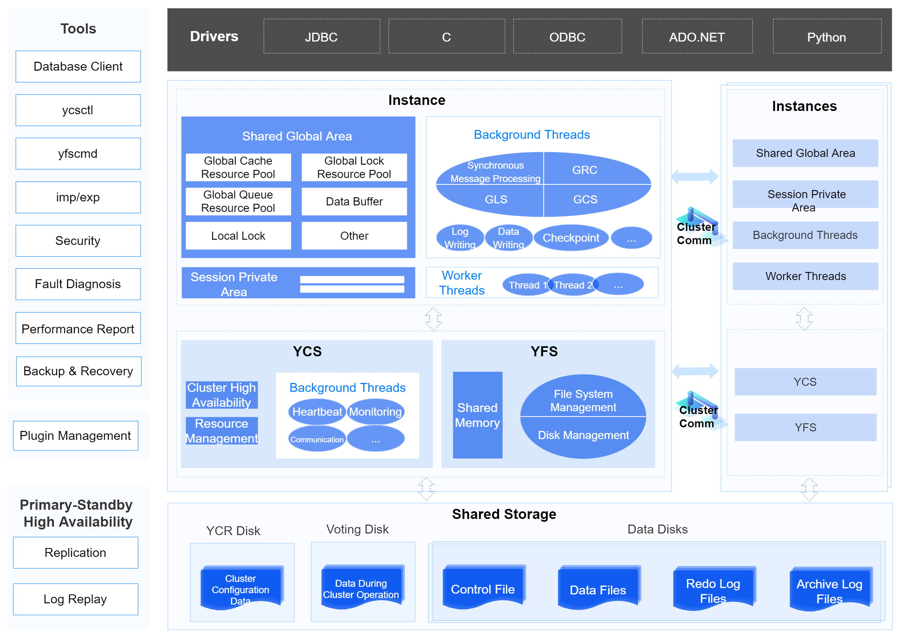
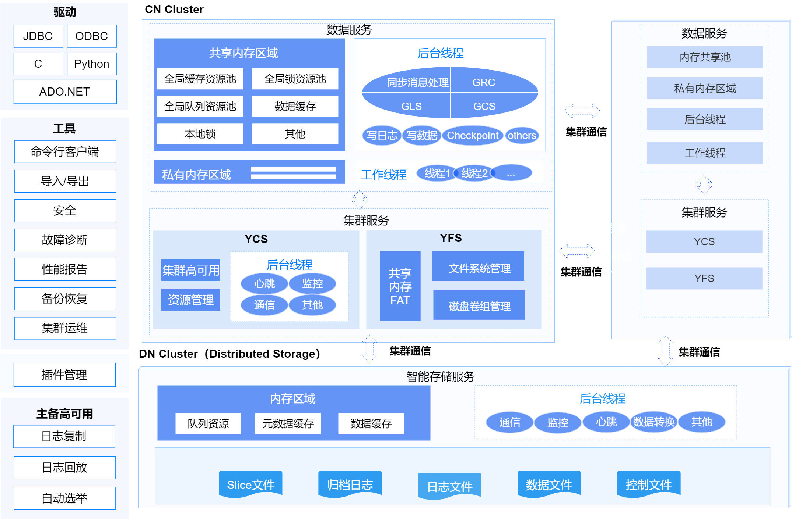

The database is a physical concept, referring to a collection of various persistent data files stored on the disk.

A database instance exists only in the running state and includes a set of threads and memory space. YashanDB adopts a multi-threaded architecture, and the memory space consists of two parts: SGA and SPA. Each running database is associated with at least one database instance.

There are slight diffrences in instance architecture under YashanDB's diffrent deployment (Standalone(primary/standby)/YAC/Distributed) forms by the following description.

## Instance Architecture in Standalone Deployment

## Instance Architecture in YAC Deployment

## Instance Architecture in Distributed Deployment

## Introduction to Major Modules

**Database Client**

Generally refers to applications developed based on YashanDB drivers or client tools provided by YashanDB.

- Driver: An interface between the application and the database storage, each driver implements calls to various database operation commands for a specific programming language.

- Tool: A type of software application or toolset designed to assist database administrators (DBAs) and developers in managing and maintaining database systems.

**Plugin Management**

Plugin management is a development framework provided by YashanDB for collaborating with third parties to develop plugins to expand richer functionality.

**Standalone Database Server**

Includes the database instance and a series of persistent files.

The database instance exists only in the running state and includes a set of threads and memory space. YashanDB adopts a multi-threaded architecture, and the memory space consists of two parts: SGA and SPA.

**YAC Database Server**

Includes the database instance, cluster service components, and persistent files managed by shared storage.

YashanDB YAC is a multi-active cluster with a single database and multiple instances, based on a Shared-Disk architecture. The components are described as follows:

- Instance: Database instances on multiple servers use cohesive memory technology to collaboratively access data pages and non-data resources through global resource management, global buffer management, and global lock management, providing equivalent, strongly consistent concurrent read and write capabilities.

- YCS: The core component for high availability of the cluster database, uniformly managing resources such as the cluster file system and database, providing capabilities for configuration, starting and stopping, monitoring, and arbitration services in various fault scenarios to maintain a globally unified topology state.

- YFS: Responsible for managing the cluster file system, directly managing raw devices, and providing strongly consistent file system services for database use.

**Distributed Database Server**

Includes database instances and a series of persistent files.

YashanDB Distributed Cluster Deployment adopts a separated deployment of storage clusters and compute clusters architecture. The service components are described as follows:

- CN Cluster: The CN compute cluster, encompassing distributed transaction management, distributed parallel execution, cluster management services, and storage management services, handles requests from business applications.

    - Distributed Transaction Management: Essential to preserve transactional properties across the environment. By employing decentralization and global high-precision logical clock synchronization, this approach delivers real-time strong data consistency across distributed instances while avoiding the scalability bottlenecks inherent to Global Transaction Manager (GTM) architectures.

    - Distributed Parallel Execution: The compute cluster employs distributed parallel execution scheduling to coordinate multiple instances in collaboratively processing data computation tasks. This architecture maximizes utilization of distributed multi-instance resources, significantly accelerating massive-scale data analytics.

    - YCS: The core component for high availability of the distributed cluster, uniformly managing resources such as the cluster file system and database, providing capabilities for configuration, starting and stopping, monitoring, and arbitration services in various fault scenarios to maintain a globally unified topology state.

    - YFS: Responsible for managing the distributed cluster file system, directly managing raw devices, and providing strongly consistent file system services for database use.

- DN Cluster: The DN storage cluster, composed of multiple storage servers, deploys one intelligent storage service per server.
  
  - YASFS: Includs data storage media, storage management and monitoring, data lifecycle management, and lightweight compute capabilities.

**Persistent Files**

The persistent files of the database ensure that the database can still start and operate normally in scenarios of unexpected shutdowns such as power outages, including:

- Control File: The most critical entry information for the database, storing basic metadata and persistent-related information.

- Data File: Stores all system tables, user tables (HEAP tables/TAC tables/LSC tables), and data such as undo.

- Slice File: Stores the cold data of LSC tables.

- Redo Log File: Stores redo logs, used to repair dirty pages in recovery scenarios and to replicate to standby databases in primary/standby scenarios.

- Archive Log Files: Stores archived redo logs, used in recovery scenarios to restore the database to a specific point in time in conjunction with backup files.

- Cluster Configuration Data: Stores management configuration information for the cluster, such as nodes and resources.

- Cluster Runtime Data: Records relevant information during the operation of the cluster, especially related process data during voting.

**Memory Areas**

For details, please refer to [Database Memory](Database Memory).

**Processes and Threads**

For details, please refer to [Database Process and Thread](Database Process and Thread).