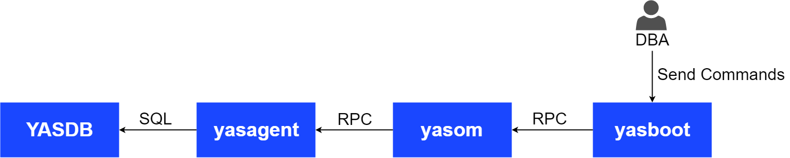

YashanDB adopts a multithreaded architecture that fully utilizes the computing power of multi-core processors, improving the system's concurrency and responsiveness. In this architecture, a main thread is responsible for program initialization and coordination, followed by the creation of multiple child threads to perform specific tasks. Each thread can execute a specific code block independently, but they share the resources and memory space of the process.

Depending on the deployment form and division of labor, YashanDB processes can be categorized into the following types:

- Server core process

- YAC process

- Distributed process

- yasboot process

## Server Core Process (YASDB)

After the YashanDB instance starts, it creates the YASDB process to handle requests from client processes connecting to the database instance. The YASDB process mainly includes background threads and worker threads that handle client requests.

### Resident Background Threads

- Main Thread (yasdb)

   The main thread's primary functionality is to start various modules during database startup and handle operations such as shutdown and primary/standby switching. During database operation, the main thread is also responsible for cleaning up the resources of ended threads.

- TCP Listener Thread (TCP_LSNR)

   The main functionality of the TCP listener thread is to listen on a specified TCP port, handle client connection requests, and create sessions. This thread starts during the NOMOUNT phase of database startup and has a lifecycle consistent with the database instance.

- UDP Listener Thread (UDP_LSNR)

   The main functionality of the UDP listener thread is to listen on a specified UDP port and handle client connection requests. This thread starts during the NOMOUNT phase of database startup and has a lifecycle consistent with the database instance.

- Listener Log Thread (LISTENER_LOG)

   The primary functionality of the LISTENER_LOG thread is for asynchronous flushing of listener logs. This thread starts during the NOMOUNT phase of database startup and has a lifecycle consistent with the database instance.

   The TCP/UDP listener threads generate login success or failure text logs, referred to as listener logs, when handling connection requests.

- Logical Clock Thread (TIMER)

   The main functionality of the TIMER thread is to manage and update the logical clock, with a precision of 1ms. This thread starts during the NOMOUNT phase of database startup and has a lifecycle consistent with the database instance.

- System Monitor Thread (SMON)

   The SMON thread starts during the NOMOUNT phase of database startup and has a lifecycle consistent with the database. Its main functionalities are as follows:

   - Deadlock detection

   - Undo timing balancing

   - Background rollback of transactions that exited abnormally

   - Background undo and transaction area automatic expansion

   - Background statistics refreshing

- Rollback Thread (ROLLBACK)

   The primary functionality of the ROLLBACK thread is to roll back residual transactions after database restart. This thread starts during the OPEN phase of the main instance and exits after the rollback task is completed. This thread only runs on the main instance and can be configured to start as a group of threads for improved processing power. The number of threads is configured through the STARTUP_ROLLBACK_PARALLELISM parameter, with a default of 2.

- Checkpoint Task Scheduling Thread (CKPT)

   The main functionality of the CKPT thread is to schedule full and incremental checkpoint tasks. This thread starts during the NOMOUNT phase of database startup and has a lifecycle consistent with the database instance.

- Database Writer (DBWR) Thread

   The primary functionality of the DBWR thread is to write dirty blocks from the DBWR Buffer (the size of each thread's cache is configured via the DBWR_BUFFER_SIZE parameter) back to the data files on disk. This thread starts during the NOMOUNT phase of database startup and has a lifecycle consistent with the database instance. The default number of DBWR threads is 2, with a maximum of 16, configured through the DBWR_COUNT parameter. The specific functionalities are as follows:

   - Dirty blocks flushing: The DBWR thread periodically or under specific conditions flushes dirty blocks to the data files on disk.

   - Data write-back strategy: The DBWR thread determines which dirty blocks need to be written back to disk based on specific strategies.

   - Write-back Optimization: The DBWR thread attempts to merge multiple data blocks (the number of blocks allowed to be merged is configured via the DBWR_FLUSH_NEIGHBORS_COUNT parameter) into a single write-back operation, reducing the number of disk I/O operations and improving write performance.

   - Checkpoint processing: When a checkpoint occurs, the DBWR thread writes all dirty blocks back to disk to ensure database consistency.

- Redo Log Sending Thread (RD_SEND)

   The main functionality of the RD_SEND thread is to transfer redo logs from the primary database to the standby database. This thread only starts during the MOUNT phase of the main instance and shuts down after a shutdown or when the primary database is demoted.

- Redo Flush Thread (LOGW)

   The main functionality of the LOGW thread is to flush the redo logs in memory to the redo log file based on certain strategies (periodically or when the redo quantity reaches a threshold). This thread only starts during the OPEN phase of the main instance and has a lifecycle consistent with the database instance.

- Job Scheduling Thread (DBMS_SCHEDULER)

   The main functionality of the DBMS_SCHEDULER thread is to schedule job tasks and trigger timed tasks. This thread only starts during the OPEN phase of the main instance and has a lifecycle consistent with the database instance.

- Job Execution Thread (JOB_QUEUE)

   The primary functionality of the JOB_QUEUE thread is to execute job tasks. When a job task is initiated, the DBMS_SCHEDULER thread is responsible for creating this thread and executing related tasks, which exits after the task execution is completed.

- Performance Reports Snapshot Automatic Management Thread (MMON)

   The main functionality of the MMON thread is to create and clean up performance reports snapshots. This thread only starts during the NOMOUNT phase of the main instance and has a lifecycle consistent with the database instance.

- Hot Block Recycle Thread (HOT_CACHE_RECYC)

   The primary functionality of the HOT_CACHE_RECYC thread is to process tasks related to hot block recycling. This thread only starts during the OPEN phase of the main instance, exiting when the primary database is demoted or the instance exits.
   
   Hot block recycling is a performance optimization technique in the YashanDB database aimed at reducing the residency time of frequently accessed blocks (also known as hot blocks) in memory, thereby freeing space for other blocks that need to be accessed. When a block is accessed frequently, it is marked as a hot block and remains in the cache pool for an extended period. A high number of hot blocks can diminish the available space for other blocks in the cache pool, thus reducing overall database performance. The HOT_CACHE_RECYC thread is responsible for releasing hot blocks back to free space for other blocks to use, improving cache utilization.

- Cold Data Table Scan Prefetch Thread (PRELOADER)

   The main functionality of the PRELOADER thread is to prefetch cold data accesses. The number of threads is configured through the SCOL_DATA_PRELOADERS parameter, with a default of 2. This thread starts during the NOMOUNT phase of database startup and has a lifecycle consistent with the database instance.

- Transform in Background Scheduling Thread (XFMR)

   The XFMR thread's primary functionality is to schedule LSC transformations in background, including tasks such as converting cold data to hot data, compacting cold data, and detecting cold data compact tasks. This thread is mainly used to manage the scheduling order, priority, and control the number of background tasks. The XFMR thread only runs on the primary database, starting during the OPEN phase and exiting when the primary database is demoted or the instance exits.

- SLICES File Synchronization Thread (SCF_SENDER)

   The main functionality of the SCF_SENDER thread is to send slice files generated by the primary instance to the standby instance.

- Preload Memory File Thread (MMS_PRELOAD)

   The main functionality of the MMS_PRELOAD thread is to preload BIT MAP pages from the MMS tablespace to improve data access performance. This thread starts during the NOMOUNT phase of database startup, exiting after the preload task is completed, with the number of threads configured through the MMS_DATA_LOADERS parameter.

- BUFFER_POOL Auxiliary Thread (BUFFER_POOL)

   The BUFFER_POOL thread is a background auxiliary thread for the buffer pool, responsible for resource balancing within the buffer pool and processing asynchronous block access requests. This thread starts during the NOMOUNT phase of database startup and has a lifecycle consistent with the database instance. Each instance has exactly one of these threads.

- LSC Transform in Background Execution Thread (XFMR_WORKER)

   The XFMR_WORKER thread is primarily responsible for executing LSC transformations in the background. The threads within this thread pool (XFMR_WORKER_x) execute tasks assigned by the XFMR scheduling thread, with the number of threads configured through the DATA_TRANSFORMER_MAX_WORKERS parameter. It starts during the OPEN phase of the main instance and exits after a long time without background tasks, when the primary database is demoted, or the instance exits.

- Shared Mode Session Worker Thread (SESS_WORKER)

   The SESS_WORKER_x thread is the execution scheduling thread for session business in shared mode. The number of threads is configured through the MAX_WORKERS parameter, with a default quantity of twice the number of CPU cores on the current server. Threads are created upon session login, with a lifecycle consistent with the database instance.

- Dedicated Mode Session Worker Thread (WORKER)

   The WORKER thread is the execution scheduling thread for session business in dedicated mode. The number of threads equals the current number of connections, and threads are created upon session login and destroyed when the session exits.

- Parallel Execution Task Thread (PARAL_WORKER)

   The PARAL_WORKER_x thread is primarily responsible for executing tasks in parallel. The number of threads is configured through the MAX_PARALLEL_WORKERS parameter, with threads starting when there are insufficient parallel execution threads, having a lifecycle consistent with the database instance.

- High-Precision Timer Thread (SCHD_TIMER)

   The SCHD_TIMER thread is YashanDB's high-precision timer thread used to register timeout events and awaken corresponding waiting threads after timed out. There is exactly one of these threads, with a lifecycle consistent with the database instance.

### Optional Background Threads

**Backup-Related Threads**

- Backup Recovery Data Thread (RST_WORKER)

   The primary functionality of the RST_WORKER thread is to restore data to the database from the backup set during backup recovery. The number of threads depends on the user-specified concurrency (optional concurrency is between 1 and 8). This thread starts during database recovery (at which point the database is in the NOMOUNT phase) and exits after the database recovery is completed.

- Backup Recovery Data Backup Thread (BAK_WORKER)

   The primary functionality of the BAK_WORKER thread is to copy data to the backup set during database backup. The number of threads depends on the user-specified concurrency (optional concurrency is between 1 and 8). This thread starts during database backup execution (when the database is in the OPEN phase) and exits after the database backup is completed.

**HA-Related Threads**

- HA Listener Thread (REPL_TCP_LSNR)

   The REPL_TCP_LSNR thread is the HA listener thread, responsible for receiving network messages transmitted through the replication_addr. This thread mainly listens for and schedules HA tasks and starts during the MOUNT phase of database startup when YashanDB is deployed in primary/standby mode, with a lifecycle consistent with the database instance.

- HA Task Worker Thread (REPL_WORKER)

   The REPL_WORKER thread's primary functionality is to handle tasks received by the HA listener thread (REPL_TCP_LSNR), mainly involving data transfer and synchronization.

**Standby Database Related Threads**

- Redo Log Receive Thread (RD_RECV)

   The primary functionality of the RD_RECV thread is to receive redo logs on the standby database. This thread is created only on the standby database, starting during the NOMOUNT phase and shutting down after a shutdown or when the standby database is promoted.

- Redo Apply Scheduling Thread (STBY_RCY)

   The STBY_RCY thread is the scheduling thread for applying redo logs on the standby database, primarily responsible for starting online apply tasks for the standby database's redo logs. After receiving a task, STBY_RCY analyzes the logs and allocates them to the apply threads, controlling the parallel application of the standby database's redo logs. This thread starts during the OPEN phase of the standby database and exits when the standby database is promoted or when the instance exits.

- Redo Apply Worker Thread (RCY_REPL)

   The primary functionality of the RCY_REPL thread is to serve as a parallel apply thread for redo logs. The redo apply scheduling thread (STBY_RCY) allocates tasks to this thread after analyzing the logs, and the RCY_REPL thread executes apply operations in parallel upon receiving tasks. This thread only runs on the standby database, with the number of threads configured through the RECOVERY_PARALLELISM parameter, with a default of 16. It only starts during the OPEN phase of the standby database and exits when the standby database is promoted or when the instance exits.

- Archive Log Files Repair Thread (FAL_CLI)

   The main functionality of the FAL_CLI thread is to repair the archival gap on the standby database. When a gap in the logs is detected, this thread will start to receive archived modifications from the primary database. This thread only starts on the standby database, with the thread initiated by the apply thread (RCY_REPL) after the database enters the OPEN phase. It exits after the gap repair is completed.

**Archiving Related Threads**

- Archive File Transfer Thread (RD_ARCH)

   The primary functionality of the RD_ARCH thread is to copy redo log files to physical storage when an online redo log switch occurs. The RD_ARCH thread only exists when the database is in ARCHIVELOG mode. This thread starts during the MOUNT phase of database startup and exits when archiving mode is turned off or when the database is shut down.

- Archive File Cleanup Thread (ARCH_DATA)

   The primary functionality of the ARCH_DATA thread is to clean up archived slice files. This thread regularly checks whether archived slice files meet the cleanup criteria and performs the cleanup. When archiving mode is enabled, this thread starts during the MOUNT phase of database startup, with a lifecycle consistent with the database instance.

**Shared Thread Session Mode Related Threads**

- Session Scheduling Thread (REACTOR)

   The REACTOR thread is the session scheduling thread in shared thread session mode, responsible for scheduling tasks to the designated SESS_WORKER for execution. This thread starts during the NOMOUNT phase of database startup and has a lifecycle consistent with the database instance.

- Session Login Thread

   The LOGIN_WORKER_X thread mainly handles login tasks when sessions connect in shared thread session mode. This thread is created during the NOMOUNT phase of database startup and has a lifecycle consistent with the database instance.

**Other Threads**

- Health Check Monitoring Thread (HEALTH_MONITOR)

   The primary functionality of the HEALTH_MONITOR thread is to monitor health check items, perform fault detection, and handle database anomalies. This thread needs to be configured to open or close through the DIAG_ADR_ENABLED parameter (default is open). When open, this thread starts during the MOUNT phase of database startup and has a lifecycle consistent with the database instance.

- BUILD DATABASE Managed Thread (BUILD_SEND)

   The primary functionality of the BUILD_SEND thread during the BUILD DATABASE operation is to start a background thread to manage execution when a specified session includes the `DISCONNECT FROM SESSION` field, leaving the specified session's operation unaffected. This thread starts after the managed task is executed and exits after the BUILD DATABASE is completed. Each session can have at most one managed thread.
   
- Statistics Collection Thread (STATS)

   The main functionality of the STATS thread is to collect statistics. This thread only starts when dynamic sampling is enabled or when statistics collection is executed, automatically exiting after sampling is completed. Dynamic sampling can be started by configuring the OPTIMIZER_DYNAMIC_SAMPLING parameter, with the default sampling period automatically starting collection at 2 AM every day, which can be modified through relevant advanced packages.

- Parallel Index Creation Thread (BUILD_INDEX)

   The primary functionality of the BUILD_INDEX thread is to create indexes concurrently. The thread runs during command execution (create / rebuild index ... parall) and exits after execution is completed. This thread defaults to the number of CPU cores and can be specified by the user for an alternate thread count, with each thread responsible for scanning a portion of data before sorting it.

- Transform Table to LOGGING Thread (SET_LOGGING)

   The SET_LOGGING thread's primary functionality is to asynchronously modify tables to LOGGING in the background. This thread starts when specific SQL commands are executed (alter table logging async) and exits after execution is completed.

- Concurrent Formatting File Thread (PARALLEL_BUILD)

   The PARALLEL_BUILD thread's primary functionality is to concurrently format data files. This thread starts when the degree of concurrency is specified for data file creation or when the file exceeds 1GB, exiting after data file creation is completed.

- Flashback Log Writer Thread (RVWR)

   The RVWR thread's primary function is to periodically write database flashback logs to flashback log files. This thread is created when database flashback is enabled and terminated when flashback is disabled. If flashback remains enabled, the thread's lifecycle aligns with the database instance.

- GLS Fault Recovery Thread (GLS_RECOVER)

   The GLS_RECOVER thread's main functionality is to handle the state recovery of global lock resources during YAC failure. This thread runs on all instances and is triggered during YAC fault recovery reform process by master broadcasting, exiting after YAC fault recovery reform is completed.

**Internal Network Communication Related Threads**

Internal network communication-related threads start in Distributed Cluster Deployment and YAC Deployment, including:

- ICS Monitoring Thread (ICS_MONITOR)

   The ICS_MONITOR thread is primarily responsible for heartbeating and activating abnormal links in the internal network communication module. It starts during the OPEN phase of database startup and has a lifecycle consistent with the database instance.

   The Internal Communications Service (ICS) is YashanDB's unified internal network framework responsible for message interaction between internal instances.

- ICS Sending Link Service Thread (ICS_SENDx_y_z)

   The ICS_SENDx_y_z thread is an ICS internal network data sending thread that starts when the sending link is first created. It has a lifecycle consistent with the database instance. The thread name's x, y, z meanings are as follows:

   - x: Node ID

   - y: Link Level

   - z: Link ID

- ICS Receiving Link Service Thread (ICS_RECVx_y_z)

   The ICS_RECVx_y_z thread is an ICS internal network data receiving thread that starts when the sending link is first created, with a lifecycle consistent with the database instance. The thread name's x, y, z meanings are as follows:

   - x: Node ID

   - y: Link Level
   
   - z: Link ID   

- ICS TCP Listener Thread (ICS_TCP_LSNR)

   The main functionality of the ICS_TCP_LSNR thread is to listen on a specified TCP port to create corresponding network connections. This thread starts during the OPEN phase of database startup and has a lifecycle consistent with the database instance.

**Leader Election Related Threads**

Leader election related threads activate when the leader election switch is turned on, including:

- Leader Election Main Thread (ELECTION_MAIN)

   The ELECTION_MAIN thread is primarily responsible for sending and receiving YASDB messages during self-election and handling interaction information with YASDB. This thread starts during the NOMOUNT phase of database startup and has a lifecycle consistent with the database instance.

- Election Thread (ELECT_WORKER)

   The election thread pool (ELECT_WORKER) is primarily responsible for executing tasks related to elections. The threads in this pool (ELEC_WORKER_x) are responsible for executing self-election tasks assigned by the ELECTION_MAIN thread, such as sending and receiving heartbeats, promotions, and demotions. The thread starts during the NOMOUNT phase of database startup and has a lifecycle consistent with the database instance, with a maximum of three threads in the thread pool.

## YAC Process

### Main Processes

In the YAC Deployment, the main processes include:

- YAC Management Process (YASCS, or YCS)

   YCS is mainly responsible for managing nodes, resources, cluster monitoring, and cluster high availability in YAC. This process includes the following main threads:

   - YCS service-related threads

   - YFS service-related threads

- Monitoring Process of YAC Management Process (YASCSM, or YCSM)

   The YCSM monitoring process continuously monitors the status of the YCS process and promptly restarts or terminates it if the YCS process encounters abnormalities. This process is an independent process and starts first when the YCS process starts, exiting when the YCS process stops.

- YAC Privilege Agent Process (YASROOTAGENT, or YCSRA)

   The YCSRA agent process requires root privileges to start and provides services for YCS, capable of executing high privilege operations like I/O fencing. This process starts and stops independently; ensure that YCSRA is started with sudo before starting the YCS process.

### Main Threads

#### YCS Service-Related Threads

- YCS Resource Monitoring Thread (YCS_RES_MON)

   The YCS_RES_MON thread primarily monitors the resource status of YFS and YASDB managed by YCS. Each YCS process contains two of these threads, one monitoring the status of YFS and the other for YASDB. This thread starts after YCS starts YFS or YASDB and stops before YCS halts resource monitoring of YFS or YASDB.

- YCS Topology Notification Thread (YCS_NOTIFY_TOPO)

   The YCS_NOTIFY_TOPO thread is primarily responsible for notifying the embedded resource YFS when there is a topology change in YCS. This thread is created when the YCS process starts and exits when the YCS process stops.

- YCS Client Disk Heartbeat Thread (YCSC_DISK_HB)

   The YCSC_DISK_HB thread is primarily responsible for reading and writing disk heartbeats for the YCS client, handling exceptions and protecting in-flight I/O. This thread starts after a successful handshake between YASDB and YCS and exits when the YASDB process stops.

- YCS Disk Heartbeat Monitoring Thread (YCS_DISK_HB_MON)

   The YCS_DISK_HB_MON process primarily checks disk heartbeats on the voting file and handles exceptions. This thread is created when the YCS process starts and exits when the YCS process stops.

- YCS Internal Monitoring Thread (YASCM_MON)

   The YASCM_MON thread is mainly responsible for writing network and disk heartbeats. This thread is created when the YCS process starts and exits when the YCS process stops.

- YCS Resource Management Thread (YCS_RES_MNGR)

   The YCS_RES_MNGR thread is mainly responsible for starting and stopping resources, controlling resource monitoring, and managing resource topology information. This thread starts when the YCS instance joins or becomes the primary and exits when YCS restarts or exits.

- YCS Operating System Load Monitoring Thread (YCS_OS_WATCHER)

   The main functionality of the YCS_OS_WATCHER thread is to periodically collect operating system load information and save it to the corresponding files. This thread can be started and stopped by the user and defaults to starting when the YCS process begins, exiting when the YCS process stops.

- YCS Heartbeat Thread (YCS_HEARTBEAT)

   The YCS_HEARTBEAT thread is the thread that writes network and disk heartbeats for YCS. This thread is created when the YCS process starts and exits when the YCS process stops.

- YCS Resource Start Thread (YCS_RES_START_SH)

   The YCS_RES_START_SH thread is the thread that executes the resource start script. When YCS needs to start YASDB, this thread executes the YASDB start script. It starts when YCS needs to start YASDB and exits after the script execution is completed.

- YCS Resource Stop Thread (YCS_RES_STOP_SH)

   The YCS_RES_STOP_SH thread is responsible for executing the resource stop script. When YCS needs to stop YASDB, this thread will execute the YASDB stop script. This thread starts when YCS needs to stop YASDB and exits after the script execution is finished.

- YCS to YASDB Heartbeat Thread (YCSC_TOPO)

   The YCSC_TOPO thread is mainly responsible for sending and receiving topology information between YASDB and YCS. YASDB sends heartbeats to YCS at regular intervals to obtain topology information. This thread starts after a successful handshake between YCS and YASDB and exits when they lose connection.

- YCS-YASDB Message Handling Thread (YCS_RES_SVR)

   The YCS_RES_SVR thread is mainly responsible for processing requests from YASDB, including sending topology information to YASDB, refreshing and broadcasting topology after a YASDB promotion, etc. This thread is created when the YCS process starts and exits when the YCS process stops.

- YCS Internal Tool Message Handling Thread (YCS_TOOL_SVR)

   The YCS_TOOL_SVR thread is mainly responsible for handling execution requests from internal tools (e.g., *ycsctl*). This thread starts after the resource listening thread detects a message and after a successful handshake, exiting once message processing is completed.

- YCS Local Network Listening Thread (YCS_UDS_LSNR)

   The YCS_UDS_LSNR thread is the UDS service listening thread responsible for receiving connection requests from internal tools (e.g., *ycsctl*) and YASDB. This thread is created when the YCS process starts and exits when the YCS process stops.

- YCS Client Thread (YCSC_PROC)

   The YCSC_PROC thread primarily handles connections with YCS, sending and receiving topology information, etc. This thread starts after a successful handshake between YCS and YASDB and exits when they lose connection.

- YCS Client Disk Heartbeat Thread (YCSC_DHB_PROC)

   The YCSC_DHB_PROC thread is mainly responsible for reading and writing disk heartbeats, handling exceptions and protecting in-flight I/O. This thread starts after a successful handshake between YCS and YASDB and exits when they disconnect or are kicked out of the cluster.

#### YFS Service Related Threads

- YFS Listener Client Connection Thread (YFS_UDS_LSNR)

   The YFS_UDS_LSNR thread is the UDS service listener thread for YFS, mainly responsible for handling connections from YASDB. This thread is created when the YFS instance starts and exits when the YFS instance stops.

- YFS Forwarding Request Handler Thread (YFS_REDI_SERVICE)

   The YFS_REDI_SERVICE thread primarily handles forwarding requests. Operations involving metadata changes within YAC can only be processed by a specific YFS instance. Other YFS instances that receive related operation requests will forward them to this specific YFS instance, which will handle the request with the relevant thread.

- YFS Resource Recycling Thread (YFS_RECYCLE)

   The YFS_RECYCLE thread is the resource recycling thread for YFS, used for recycling directories, disk space, and shared memory. This thread starts when the YFS instance starts and exits when the YFS instance stops.

- YFS Incremental Replication Thread (YFS_INC_SYNC_TASK)

   The YFS_INC_SYNC_TASK thread is an incremental replication thread used for data synchronization between YFS instances. As previously mentioned, only a specific YFS instance can handle operations that involve metadata changes. After processing, it will synchronize to other YFS instances through the incremental replication thread (the number of threads equals the number of other YFS instances). If other YFS instances are offline, the corresponding incremental replication threads will exit; if no YFS instances are offline, all incremental replication threads will exit when the specific YFS instance process ends.

- YFS Session Handling Thread (YFS_HANDLER)

   The YFS_HANDLER thread is the YFS session thread, responsible for handling requests from client connections. A YFS_HANDLER thread is started for each session connection, and this thread exits when the client connection exits.

- YFS Topology Information Processing Thread (YFS_TOPO_CHANGE_PROCESS)

   The YFS_TOPO_CHANGE_PROCESS thread is responsible for handling requests related to topology changes when a YFS instance re-applies to join the cluster. This thread is created when the YFS instance starts and exits when the YFS instance stops.

## Distributed Cluster Process

### Main Processes

In the Distributed Cluster Deployment, the main processes include:

- The compute cluster consists of multiple compute nodes (Compute Node, abbreviated as CN), each comprising the following processes:

    - CN Process

      The CN (Compute Node) process is responsible for exposing external interfaces, receiving user requests, generating distributed query plans, and coordinating multiple instances to execute computations.        

- The storage cluster consists of multiple storage nodes (Data Node, abbreviated as DN), each comprising the following processes:

    - DN Process

      The DN (Data Node) process primarily handles storage management and monitoring, data lifecycle management, resource affinity computation, and execution of compute pushdown operations.

### Main Threads

- Parallel Execution Coordination Thread (WORKER)

  The WORKER process primarily handles receiving service requests, generating distributed execution plans, and orchestrating parallel execution across local and remote compute instances as the execution coordination thread. Its lifecycle is bound to the database instance.

- Distributed Transaction Coordinator Thread (TM_SERVICE)

  The TM_SERVICE thread primarily performs periodic detection and recovery of pending transactions. It activates during the database startup phase until OPEN state, with its lifecycle bound to the database instance.

- GTS Service Thread (GTS_SERVICE)

  The GTS_SERVICE thread is primarily responsible for synchronizing global timestamps across all instances in a distributed cluster. It activates during the database startup phase until the OPEN state, with its lifecycle strictly bound to the database instance.

- GTS Client Thread (LGTS_SERVICE)

  The LGTS_SERVICE thread is responsible for receiving global timestamps synchronized by the GTS_SERVICE thread. It activates during the database startup phase until the OPEN state, with its lifecycle strictly bound to the database instance.

- Disk Monitor Thread (DISK_MONITOR)

  The DISK_MONITOR thread handles disk discovery and monitoring, with its lifecycle synchronized with the DN (Data Node) instance.

## yasboot Process

When the YashanDB product is installed via *yasboot*, it will start the yasom process (a globally unique instance) and the yasagent process (one per server). The operation of *yasboot* relies on these two processes.

- yasboot

   The command line tool for YashanDB operational management.

- yasom

    The YashanDB operational service process that receives commands from *yasboot* for instruction issuance and control, managing the yasagent process.

    Yasom is an independent process that supports primary/standby (primary/secondary), allowing only one primary yasom process worldwide and N (N ≥ 0, default is 0) standby yasom processes. Each server in the same database environment can only run one yasom process. The primary yasom process starts after product installation, and operations can be started and stopped through *yasboot* related commands.

    The main functions of the primary yasom process are complete, but standby yasom processes cannot use functionalities like database deployment, management, uninstallation, standby database scaling, server scaling, upgrades, rollback, arbitration, jobs, inspections, etc. 

    Multiple yasom processes are not allowed to simultaneously operate on the database within the same database environment.

- yasagent

   A stateless operational service process that runs on the server where the YASDB process resides, receives instructions from yasom, and executes queries and operations on the YASDB process or file system through tools, drivers, or commands.

   Yasagent is an independent process that starts after product installation and can be started and stopped using the *yasboot* command.