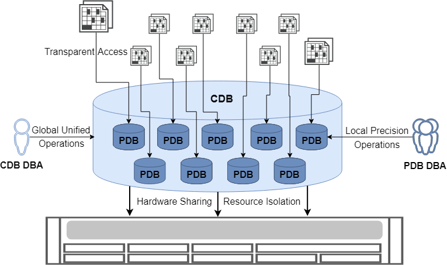

Multitenant architecture endows YashanDB with native multi-tenancy capabilities, providing a database deployment solution for complex business systems that balances cost, security, and performance.

## Tenant Definition

A tenant is the basic entity unit that YashanDB allocates database services to business systems. Under the multi-tenant architecture, YashanDB instances are created as Container Databases (CDB), centrally managing multiple Pluggable Databases (PDB). A single CDB instance can support managing up to 8192 PDBs.

YashanDB adopts the "database-as-a-tenant" design concept, using PDB as the core carrier of tenants. Business systems obtain independent database tenant identities by creating PDBs in CDB, thereby enjoying complete database service capabilities and resource isolation guarantees.

## Tenant Resources

When business systems use YashanDB as tenants, the system allocates dedicated resource collections to ensure resource isolation and performance stability among tenants.

- Computational Resources

  Supports allocating dedicated computational resources to tenants based on CPU cores or threads, and provides intelligent dynamic adjustment mechanisms. The system can automatically scale CPU quotas based on business load changes, effectively avoiding performance bottlenecks caused by resource contention and ensuring service quality for critical businesses.

- Memory Resources

  Supports precisely specifying memory quotas for each tenant. The system automatically allocates memory resources to different memory pools according to preset quotas, achieving refined memory management.

- IO Resources

  Provides IOPS (Input/Output Operations Per Second) quota limitation mechanisms based on storage devices, effectively ensuring bandwidth stability and response performance of storage access for each tenant.

- Storage Resources

  Allocates dedicated tablespaces to each tenant, supporting intelligent automatic expansion of data files and capacity upper limit control, ensuring rational utilization of storage resources and cost control.

- Object Resources

  Each tenant possesses a completely independent database logical object namespace, including schemas, users, tables, indexes, views, etc., achieving true data and logical isolation.

## Value of Multi-Tenant Architecture

Through multitenant architecture, YashanDB helps enterprises achieve a fundamental transformation from "chimney-style" decentralized deployment to "pool-style" centralized management, maximizing resource utilization efficiency and reducing total cost of ownership while ensuring the independence and security of various business systems. Whether in large enterprise hybrid IT environments or cloud-native deployment scenarios for small and medium-sized enterprises, YashanDB's multi-tenant architecture can provide flexible, efficient, and secure database services.

### Significantly Reduce Database Deployment Costs

Through deep integration of hardware resources and optimization of the underlying database architecture, YashanDB significantly improves resource utilization and greatly reduces infrastructure investment and operations management costs. A single YashanDB CDB instance can support managing up to 8192 PDBs, enabling enterprises to consolidate business originally scattered across thousands of independent database systems into a unified database platform and hardware environment. Under this architecture, the independent operations capabilities of the original systems can mostly be incorporated into CDB's unified operations management system, allowing DBA team size and operations investment costs to significantly decrease compared to traditional deployment models, bringing substantial TCO (Total Cost of Ownership) optimization benefits to enterprises.

### Tenant Identity Transparent to Applications

PDBs in YashanDB's multitenant architecture maintain 100% compatibility with traditional non-CDBs. When applications obtain tenant identity through PDBs, all usage patterns and database behavioral performances are completely consistent with independent non-CDBs, providing individual applications with the usage experience of exclusively using a complete YashanDB instance. Business systems can create PDBs with different compatibility modes (such as Oracle compatibility mode or MySQL compatibility mode) for different applications within YashanDB's CDB. Each application can use the most suitable database compatibility mode by connecting to its corresponding PDB, truly achieving flexible deployment of "one platform, multiple choices".

### Fine-Grained Resource Isolation

To effectively limit resource occupation of each PDB and resolve resource contention issues among different PDBs in the same environment, YashanDB's multi-tenant architecture provides refined resource isolation mechanisms, supporting independent allocation and control of the following key system resources for each PDB:

- Computational resources: Precise quota management of CPU cores and threads

- Memory resources: Independent memory pool allocation and dynamic adjustment mechanisms

- IO resources: IOPS quota limits and bandwidth guarantees based on storage devices

- Storage resources: Dedicated tablespace and capacity upper limit control

Through this comprehensive resource isolation mechanism, fairness and performance stability among tenants are ensured. Meanwhile, each tenant's data achieves complete isolation at both physical storage and logical access levels, fundamentally preventing security risks of data leakage across tenants.

### Flexible Operations Methods

YashanDB's multi-tenant architecture provides hierarchical flexible operations capabilities to meet operations requirements of different roles and scenarios:

- Global unified operations: Support centralized management operations at CDB level, including:

    - Overall architecture upgrades and patch management

    - Global backup and recovery strategy formulation

    - Unified configuration management and parameter tuning

    - Cross-tenant resource scheduling and optimization

- Local fine-grained operations: Provide independent operations capabilities at PDB level, covering:
    
    - Tenant's local user and permission management

    - Backup and recovery operations for individual tenants

    - Tenant-specific primary-standby replication configuration

    - Tenant-level flashback and recovery

    - Performance monitoring and tuning at tenant level

This flexible hierarchical operations model ensures unified management efficiency of the overall architecture while meeting personalized operations requirements of various business tenants, truly realizing the operations philosophy of "unified management, personalized services".