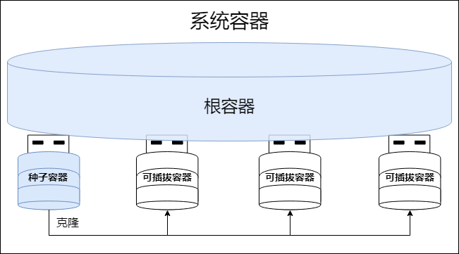

Container Database (CDB) serves as the core engine and key implementation carrier of YashanDB's multi-tenant architecture. It employs database virtualization technology to efficiently host hundreds or even thousands of mutually independent and completely isolated logical database instances within a single physical database instance, providing enterprise-level applications with truly native database multitenant service capabilities.

CDB integrates multiple different types of containers into a unified shared resource pool, achieving efficient resource utilization and flexible management.

## System Container

As a CDB, CDB itself is also a container entity that can host other containers. The system container is the logical container corresponding to CDB, responsible for managing the unified resource pool containing various types of physical containers.

## CDB Root

Each CDB instance has a unique and automatically created CDB Root named CDB$ROOT. The CDB root serves as the "management center" and "scheduling hub" of the entire CDB, undertaking dual core responsibilities:

- Connection management: Serving as the unified listening entry for database requests, responsible for intelligent redirection and routing distribution of all container connections.

- Operations and control: Serving as the global management container of CDB, responsible for lifecycle management (creation, deletion, etc.) of all containers and coordination of global operations.

Although the CDB root possesses complete database service capabilities, it is typically recommended to use it only as a management container for security and management compliance considerations, avoiding direct hosting of actual business.

## PDB Seed

The PDB seed, as the name suggests, is a template container used for standardized PDB creation, aiming to achieve rapid PDB creation and standardized deployment. When creating a CDB, the system automatically creates a PDB seed named PDB$SEED.

The PDB seed has the following characteristics:

- Defaults to closed state and does not provide external services.

- Cannot be deleted, ensuring persistent availability of the template.

- Can only be started in read-only mode, guaranteeing consistency and security of the template.

- Has no primary-standby roles.

## PDB

Pluggable Databases (PDBs) are core containers specifically designed to provide database services, essentially complete logical database objects. Similar to traditional non-container physical databases, PDBs possess equally complete database service capabilities, with independent users, objects, tablespaces, and other logical resources, as well as data files and other physical resources.

PDBs have excellent flexibility and portability, and new PDB instances can be rapidly cloned from PDB seeds, avoiding repetitive initialization configuration work.

Different business systems can be separately planned to use independent PDB instances. The way business systems access YashanDB through PDBs is completely consistent with traditional non-container physical databases, providing a usage experience as if exclusively using a database. Different PDBs can either be independently managed for operations (such as startup/shutdown, configuration optimization, backup and recovery, etc.) or achieve global unified operations control through the CDB root.