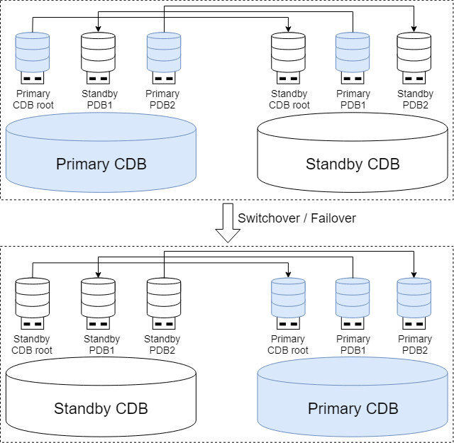
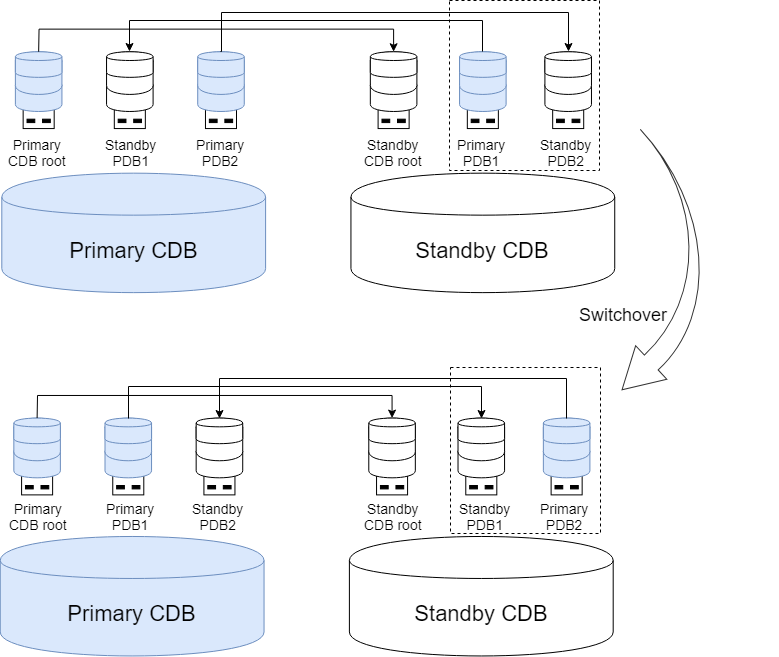

## CDB in Standalone (Primary-Standby) Deployment

Building multitenant environments in Standalone (Primary-Standby) Deployment, typically multiple servers run 1 primary CDB + 1 or more standby CDBs respectively, with data synchronization achieved through primary-standby replication. 

In scenarios with lower high availability requirements, a single server can be used to deploy and run a single CDB.

### Primary-Standby CDB

In primary-standby deployed CDBs, the system consists of one primary CDB and several standby CDBs. The CDB corresponding to the primary CDB root is defined as the primary CDB, and the CDB corresponding to the standby CDB root is defined as the standby CDB. 

PDB creation and deletion operations can only be executed in the primary CDB and will be automatically synchronized to the standby CDB to ensure metadata consistency between primary and standby CDBs. Other daily operations of PDBs, such as PDB startup and shutdown, can be executed in both primary and standby CDBs.

Newly created PDBs default to following the CDB's primary-standby role, meaning they are primary PDBs in the primary CDB. Subsequently, they can be freely converted to standby PDBs through PDB-level primary-standby switching.

PDB primary-standby roles are not constrained by CDB roles - a primary CDB can contain standby PDBs, and a standby CDB can contain primary PDBs. PDBs can perform independent primary-standby switching, but when performing primary-standby switching for the entire CDB, PDB roles will be switched accordingly:

- Switchover of the entire CDB: Roles of the CDB root and all PDBs are converted.

- Failover of the entire CDB: After the standby CDB root is promoted to primary, all PDBs on it are converted to primary roles.

### Tenant-Level Primary-Standby High Availability

Based on the cross-PDB deployment architecture of primary-standby CDBs, load pressure can be dynamically balanced, effectively improving overall resource utilization and system performance.

#### PDB Primary-Standby Replication

Although the primary-standby replication links between PDBs depend on the connection configuration between primary and standby CDB roots, log transmission between different primary-standby PDB pairs is independent. Differentiated high availability strategies can be configured as needed:

- Protection mode: Each PDB can independently select an appropriate protection level to meet reliability requirements for different business scenarios.

- Diversified primary-standby replication methods: Supports both physical replication and logical replication, allowing users to make independent selections and configurations based on specific business needs.

#### PDB Primary-Standby Switching

Primary-standby role switching between PDBs does not interfere with each other. Differentiated automatic primary selection strategies can be configured as needed, and manual switching can also be performed as required:

- Automatic primary selection strategy: Each PDB can customize and configure personalized primary-standby switching strategies to achieve business-level flexible disaster recovery.

- Manual primary-standby switching:

    - Global operations: Perform directed operations on specified single or multiple PDBs for primary-standby switching through the CDB root.

    - Local operations: Directly connect to the target PDB to execute primary-standby switching.

## CDB in YAC/Distributed Cluster Deployment

Building multitenant environments in YAC/Distributed Cluster Deployment, multiple active instances are typically run on multiple servers respectively. Users connecting to any instance can access the same container (the CDB root or PDB). Multiple instances can concurrently read and write the same data, ensuring strong consistency of reads and writes between instances, with characteristics of high availability, high scalability, and high performance.

In the cluster, each server runs 1 YCS instance, 1 YFS instance, 1 CDB root instance, and instances of several PDBs, with each PDB capable of starting 0 - 1 instances on each server. Each CDB root instance can independently manage its subordinate PDB instances, with CDB root instance and all PDB instance(s) on the same server sharing the same YCS and YFS instances.

In actual usage, the number of PDB instances running on each server can be flexibly managed based on server resource conditions, different tenants' high availability requirements, and load levels. For example, adopting a cross-running approach to distribute multiple PDB instances relatively evenly across different servers, avoiding single-point resource bottlenecks, and improving resource optimization and load balancing effects.

PDB instances of the same PDB started on different servers can be accessed equivalently, while different PDBs maintain complete isolation, ensuring security and independence between tenants.