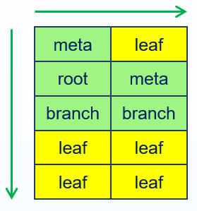
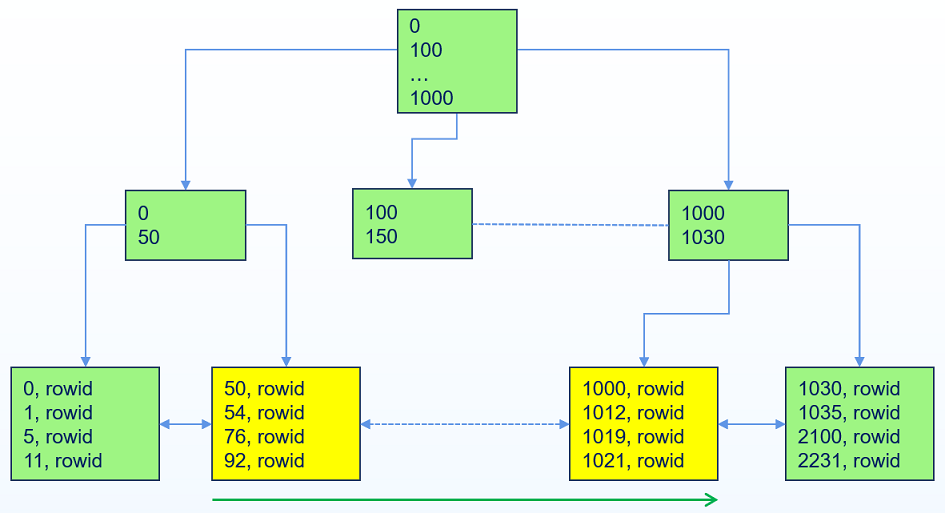
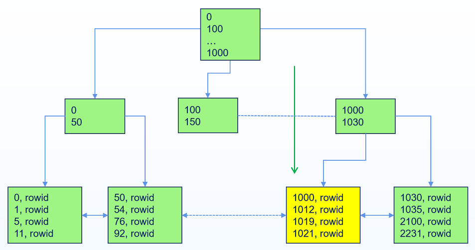
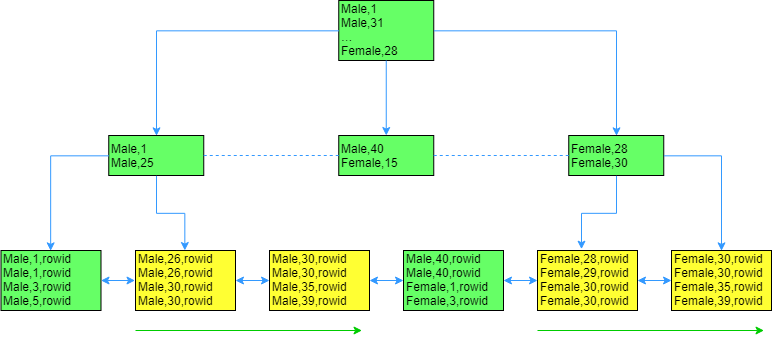

## Index Overview

In a database system, an index is an independent object and an optional structure for a table. The index contains all data of the indexed columns of the table (including NULL).

Index data is ordered, and creating a proper index for a table is equivalent to creating a directory for the table, which can improve the access efficiency of that table regarding indexed columns. The characteristics of columns suitable for indexing are as follows:

- Columns are frequently queried.

- Columns are often used as query conditions.

- Foreign key columns (creating an index on foreign key columns can avoid exclusive locks on the child table caused by operations on the parent table, changing it to shared locks).

- Columns that need to be unique (a unique index can be created).

### Advantages and Disadvantages of Indexes

**Advantages**

- Reduced I/O overhead

    Data in a table is stored randomly, and if there is no index on the table, queries must perform a full table scan to obtain results, meaning the database needs to access every data block of the table, which brings significant I/O overhead.

- Improved query speed
    
    If an index is created on one or more columns of a table, when executing queries filtering on those indexed columns, only a small portion of data blocks (or possibly no data blocks) need to be retrieved based on the index to quickly obtain query results.

**Disadvantages**

- Additional space overhead
    
    An index is an independent object, and creating an index incurs additional space overhead.
    
- Increased execution overhead for DML statements

- Possible performance loss
    
    Creating appropriate indexes can greatly improve business performance, but if indexes are misused, it can lead to a decrease in business performance.

### Availability and Visibility of Indexes

**Availability**

Indexes can be usable (default) or unusable.

YashanDB does not maintain unusable indexes during DML operations, and the optimizer will not choose unusable indexes to execute query operations.

When an index changes from a usable state to an unusable state, YashanDB will delete the corresponding segment of that index, meaning unusable indexes do not occupy physical space.

Unusable indexes or index partitions can be made usable through the rebuild statement.

Typically, when importing large tables, the index is first set to an unusable state, and after the import is complete, it is rebuilt to make it usable, which can improve import performance.

```sql
ALTER INDEX idxtest UNUSABLE;
ALTER INDEX idxtest REBUILD;
```

**Visibility**

Indexes can be visible (default) or invisible.

YashanDB still maintains invisible indexes during DML operations, but the optimizer will not choose invisible indexes to execute query operations.

When adjusting business operations, visibility settings for indexes can be used to test the impact of indexes on business performance.

```sql
ALTER INDEX idxtest INVISIBLE;
ALTER INDEX idxtest VISIBLE;
```

### Unique Indexes and Non-Unique Indexes

When creating an index, you can set the uniqueness of the index.

Unique Index: Requires each value in the indexed column to be unique, meaning duplicate values are not allowed (except for NULL; YashanDB will also store rows where the indexed column is all NULL in the index), typically sorted by indexed column, if the unique indexed column is all NULL, it is sorted by RowId.

Non-Unique Index: Does not require unique values; for non-unique index values, sorting is done based on indexed column values, and if indexed column values are the same, sorting is done based on RowId.

### Storage of Indexes

An index is an independent object that has its own segment. The default tablespace for an index segment is the default tablespace of the index owner, which can be customized when creating or rebuilding the index.

The rows in the index correspond one-to-one with the table, used to store the values of indexed columns and the RowId of corresponding rows in the table. The index is strictly ordered according to the values of indexed columns (when values are the same, ordered by RowId).

### Maintenance of Indexes

An index is an optional structure of the table and changes with the changes of the table:

- When a row of data is inserted into the table, the index also inserts a row of data (only storing the indexed column) at the appropriate position.

- When a row of data is deleted from the table, the index also deletes the corresponding row data.

- When the indexed columns of the table are not updated, the index does not need maintenance.

- When the indexed columns of the table are updated, to maintain the ordered nature of the index, the index cannot perform in-place updates like the table; instead, it must first delete the old indexed rows constructed from the old data, then insert new values at the appropriate locations to construct the new indexed rows.

## BTree Index

BTree indexes maintain the ordered nature of the index by managing a B-tree data structure.

In YashanDB, a data block is the smallest unit of physical storage, and the indexed rows stored in a single data block of a BTree index are ordered, and the data blocks themselves are also ordered, ensuring that the entire BTree index is ordered.


### Branch Block and Leaf Block

BTree indexes have two types of data blocks: leaf blocks that store indexed column data, and branch blocks that store routing information (for user lookups). 

- Leaf block: Stores the values of the indexed column and the RowId of the corresponding rows in the table. Leaf blocks are linked using a doubly linked list.

- Branch block: Stores pointers to down-level data blocks, as well as data size information for the corresponding down-level data blocks. The topmost branch block is referred to as the root branch block.

BTree indexes are balanced trees, where all leaf blocks are at the same depth (typically, the level of a leaf block is referred to as level 0, and the branch block one level above it is level 1, and so on). The number of blocks traversed from the root branch block to access any leaf block (known as the height of the BTree index) is equal, meaning the level of the root branch block = BTree height - 1. This also implies that the time taken to look up any indexed column data is almost the same.

### Index Scanning

Assuming the height of a BTree index in a YashanDB database is h, it can be deduced from the structure of the B-tree that for any indexed column data, at most h data blocks need to be accessed to retrieve the required data. If non-indexed column data of the row containing that data is needed (i.e., using the indexed column as a filter condition in the query), then one additional data block must be accessed.

When the indexed column is used as a filter condition in a query, YashanDB can speed up the lookup through the index. If the data to be queried is itself the indexed column, it can be quickly retrieved by querying directly within the index data block.

#### Index Full Scan

When a query requires scanning all data of a table while needing to sort by the leading columns of the indexed column, YashanDB performs an index full scan. The index full scan is equivalent to scanning from the leftmost leaf block of the index to the rightmost leaf block (or vice versa).

Suppose there is a table idxtest with an index on column a; the following query will execute an index full scan.

```sql
SELECT a FROM idxtest ORDER BY a;
```

Index full scan utilizes the ordered nature of the index, which allows it to skip the sorting process directly.


#### Index Fast Full Scan

Building on the index full scan, if the scanned results do not require ordering, YashanDB executes an index fast full scan, such as count(*), sum(), and other scans unrelated to order.

Index fast full scan is characterized by the need to access all rows of the whole table but only accessing indexed column data without requiring sorting.

Suppose there is a table idxtest with an index on column a; the following query will execute an index fast full scan.

```sql
SELECT SUM(a) FROM idxtest;
```

Index fast full scan will scan the data according to the physical storage order of the indexed data blocks (prefetching can speed up the Index fast full scan).



#### Index Range Scan

When the leading column of the index is involved in the query and more than one result may be returned, YashanDB executes an index range scan. The index range scan will locate the position of the index row satisfying the first condition from the root branch block based on the set left boundary, then successively scan to the right until reaching the right boundary. If it is a descending scan, the right boundary is located first, and then it scans left until reaching the left boundary.

Suppose there is a table idxtest with an index on column a; the following query will execute an index range scan.

```sql
SELECT * FROM idxtest WHERE a > 50 AND a < 1020;
```

In this query, YashanDB will first locate the value 50 (scan the left boundary) in the index block, then successively scan to the right until the index column value exceeds 1020 (scan the right boundary).

If there is only column a in the table idxtest, the above scan does not require additional I/O for querying back to the table. If there are more than one column in the table idxtest, the above scan will require additional sequential I/O for each row that meets the conditions.



#### Index Unique Scan

When a filter condition uses an equality operator and includes all columns of a unique index, YashanDB executes an index unique scan. An index unique scan will either retrieve one row of data or no data at all.

Suppose there is a table idxtest with a unique index on column a; the following query will execute an index unique scan.

```sql
SELECT * FROM idxtest WHERE a = 1000;
```

In executing the above scan, YashanDB will stop scanning after locating the first occurrence of 1000 (the unique index ensures that at most one occurrence of 1000 can exist).



#### Index Skip Scan

When the cardinality of the leading column of the index is very low (the distinct values of the leading column relative to the total number of rows in the table are very low), and the query condition is on indexed columns following the leading column, YashanDB executes an index skip scan.

For example, if a table person has gender and age columns, and there is an index built on (gender, age), then `select * from person where age = 30` will execute an index skip scan. YashanDB will first find the first (male, 30), then scan until it finds age = 30, then relocate to the first (female, 30), and scan until it finds age = 30.

The index skip scan effectively splits the scanning process into several index range scans.



#### Index Clustering Factor

The index clustering factor describes the degree of order of index corresponding table data blocks. The more ordered the table data, the smaller the index clustering factor and the lower the scanning cost. If the table data is fully distributed according to the index order, the clustering factor of the index is at its minimum, equal to the number of data blocks in the table.

- If the index clustering factor is relatively high, it indicates that during large index range scans, YashanDB may need to execute a high number of I/Os.
- If the index clustering factor is relatively low, it indicates that during large index range scans, YashanDB only needs to execute a low number of I/Os.

### Reverse Index

A reverse index is also a type of BTree index, but it stores values in reverse byte order (the order of indexed columns remains unchanged).

Storing values in reverse byte order leads to more dispersed index distribution. For example, when using an auto-increment column as the indexed column, the business always inserts larger index column values into the index and deletes smaller index column values. If using a normal BTree index, as the business progresses, it would lead to an entire index skew. However, with a reverse index, values are reversed byte-wise, allowing newly inserted values to distribute across the entire leaf blocks of the B-tree.

At the same time, due to the change in storage structure, reverse indexes also lose the ability for range queries found in regular BTree indexes.

### Ascending Indexes and Descending Indexes

By default, YashanDB creates indexes in ascending order, meaning the indexed column values are stored from smallest to largest. For example, `create index ageIdx on teachers(age)` creates an index that is stored in ascending order based on teachers' ages.

YashanDB also supports descending indexes, which can be created by specifying the column as `desc`. For example, `create index ageIdx on teachers(age desc)` creates an index stored in descending order based on teachers' ages.

YashanDB supports setting ascending or descending order separately for columns of composite indexes, such as `create index nameAgeIdx on teachers(name asc, age desc)`. The created index is first stored in ascending order based on the teachers' names in dictionary order, and when the names are the same, it is stored in descending order based on the teachers' ages.

### Function Index

YashanDB supports user-defined indexes based on a function or an expression related to one or more columns of the base table. Such indexes are called function indexes. Function indexes calculate a value based on data from a row and the function or expression, storing that value in the index.

#### Usage of Function Index

If a table is defined to store teacher information, including base salary, teacher title, etc., and the actual salary of the teacher is based on an expression of the base salary and teacher title, a function index can be created on the base salary and teacher title columns, which can accelerate the query of the actual salary of teachers.

```sql
CREATE TABLE teachers(id INT, teachingAge INT, salary INT, title INT);
CREATE INDEX payment ON teachers(salary * title);

SELECT * FROM teachers WHERE salary * title > 8000;
```

When the query contains the expression of the function index, YashanDB will use the function index in the query.

#### Optimization of Function Index Execution

When the expression of the function index appears in the WHERE clause, the optimizer can choose to execute the function index using indexed scan operators (index full scan / index fast scan / index range scan / index unique scan / index skip scan). At this point, the expression of the function index is treated as a virtual column of the table, and the optimizer handles the index for that virtual column in the same way as it does for ordinary column indexes.