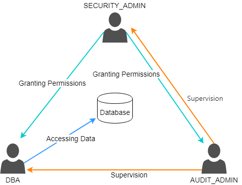

## Role-Based Access Control
YashanDB adopts RBAC (Role-Based Access Control) to restrict authorized users' access to the system.

Roles contain a set of privileges, which effectively manage privileges through roles. Administrators only need to focus on users' roles, while for roles, the focus is only on their privilege set.

**Separation of Duties**

During the operation of the database, continuous maintenance and management are required. Theoretically, the sys user can perform all management operations, but this poses significant security risks:

- sys is the super administrator account of YashanDB, possessing complete privileges, able to execute all operations on the database, which may lead to severe failures due to operational mistakes.

- Actions performed using the sys account are all logged or recorded as sys, making it impossible to track back to the actual executor.

- If the sys account is used for daily management of the database and is accessed too frequently, it easily becomes a target for hackers to steal passwords. Once the password is successfully stolen, the entire database system may be exposed, resulting in serious consequences.

Therefore, after the product installation is completed and the system administrator takes over the management of the database, it is recommended to first create a database administrator account and grant it corresponding management privileges based on management responsibilities. Subsequent management and operational tasks should be performed using this administrator account.

In the requirements of the computer information system's Classified Protection (level 3 and above standards), it is stated that database systems must adopt a "Separation of Duties" privilege system, as shown in the figure below:

The separation of duties divides database management privileges, allowing various administrators to exercise power independently while also restraining each other, effectively avoiding the risk of excessive concentration of management privileges.

In YashanDB, the separation of duties is controlled by the ENABLE_SEPARATE_DUTY configuration parameter, and users can choose whether to enable it based on security requirements.  

If the separation of duties is enabled, the built-in users and permissions are as follows:

| Administrator Role | User | Permission Description |
|--------------------|----------------|----------------------|
| System Administrator | Built-in: SYS Custom: Users granted the DBA role before enabling the separation of duties | ALTER DATABASE ALTER SYSTEM CREATE/ALTER SESSION CREATE/ALTER/DROP USER CREATE/ALTER/DROP (ANY) ROLE CREATE/ALTER/DROP/UNLIMITED TABLESPACE CREATE TABLE CREATE TYPE  CREATE/ALTER/DROP DATABASE LINK CREATE/ALTER/DROP PUBLIC DATABASE LINK CREATE LIBRARY CREATE SEQUENCE CREATE SYNONYM CREATE VIEW CREATE PROCEDURE CREATE TRIGGER CREATE/ALTER/DROP ANY OUTLINE CREATE/ALTER/DROP PROFILE CREATE/ALTER/DROP ANY MATERIALIZED VIEW CREATE/DROP ANY DIRECTORY CREATE/DROP ANY CONTEXT ANALYZE ANY YSTREAM_CAPTURE FILE SELECT FROM SYS.OBJECT |
| Security Administrator | Built-in: SECURITOR Custom: Users granted the SECURITY_ADMIN role before enabling the separation of duties | CREATE SESSION GRANT ANY PRIVILEGE/OBJECT PRIVILEGE/ROLE SELECT ON SYS.USERAUTH$ (View permission system table)  ALL PRIVILEGES ON SYS.ANON_POLICY$  (Dynamic data masking policy) ADMINISTER KEY MANAGEMENT LBAC_DBA role (Row-level access control related permissions) SELECT_CATALOG_ROLE role |
| Audit Administrator | Built-in: AUDITOR Custom: Users granted the AUDIT_ADMIN role before enabling the separation of duties | CREATE SESSION AUDIT SYSTEM SELECT_CATALOG_ROLE role |

## Label-Based Access Control

YashanDB also provides LBAC (Label-Based Access Control), which can implement strong access control at the row level by controlling data access based on users' security labels and data's security labels, ensuring precise control over users' read and write privileges for each row of data in the table, and guaranteeing the security of read and write data.

LBAC is a method of strong access control, protecting data by applying security policies to tables and granting read and write privileges to users according to their security labels. When a user attempts to access protected data, the user's security label is compared with the security label of the protected data, thus restricting or allowing the user's access to the data.

A security policy can be applied to multiple tables, and for each application of a security policy to a table, an additional column for access control for that security policy will be automatically added.

After applying the security policy, each row in the table is associated with a corresponding security label to protect the data at the row level. Data protected by security labels is referred to as protected data.

Security administrators allow users to access the corresponding protected data by granting security labels to users.

When a user attempts to access protected data, the user's security label is compared with the security label of the protected data:

- Users are only allowed to query rows that are readable under LBAC authorization.
  
    The user's security label must have a higher level than the target data's security label and must encompass all ranges of the target data's security label for the user to read the corresponding row normally.

- Users are only allowed to modify, delete, or insert rows that are writable under LBAC authorization.

    The user's security label must have a lower minimum level than the target data's security label and must encompass all writable ranges of the target data's security label for the user to write to the corresponding row normally.
