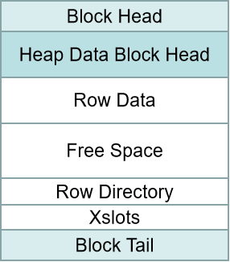
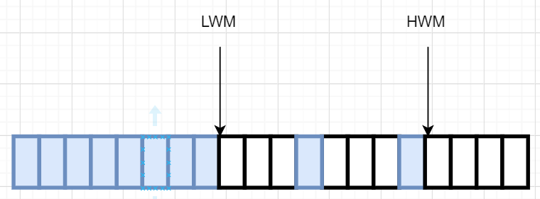
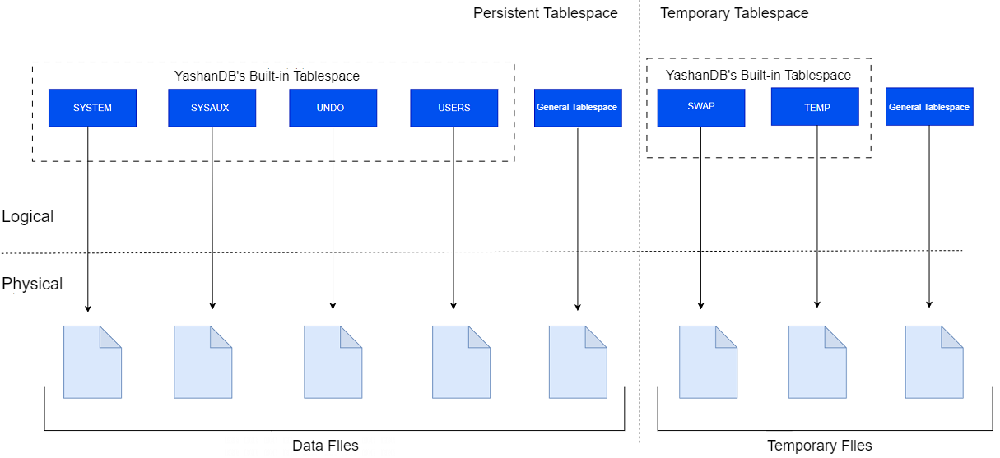

YashanDB offers a more flexible and efficient management of database storage space by providing a logical storage structure. Unlike the physical storage structure, the logical storage structure is transparent to the operating system, and all access must go through the interfaces provided by the database.

## Segment-Page Storage Structure

YashanDB's segment-page storage primarily comprises:

- Block: The smallest logical unit of data storage, such as data block, index block, undo block, etc.

- Extent: Composed of a group of physically contiguous data blocks, which can improve the efficiency of space management.

- Segment: Every database object contains at least one data segment. Spatially comprised of several data extents. Includes different types of segments such as table segments, index segments, rollback segments, etc.

- Tablespace: The logical unit allocated by the database, containing several database objects, such as tables, indexes, views, etc.

The relationships between different parts of the segment-page storage structure are illustrated in the following diagram, where Data Block corresponds one-to-one with the physical database in the physical storage structure's data file.

### Block

The data block is the smallest logical storage unit of YashanDB and also the smallest unit of I/O. The size of the data block is determined by the parameter DB_BLOCK_SIZE. YashanDB supports three different sizes of data block: 8K, 16K, and 32K.

#### Block Types

YashanDB contains blocks of different purposes and categories, common block types include:

- HEAP Block: A block used for storing data of heap tables.

- BTree Block: A block used for storing B-tree index data.

- Undo Block: A block used for storing historical version data.

- Space Head Block: A block for the tablespace header.

- LOB Block: A block used for storing large object types.

- Xact Block: A block used for storing transaction information.

#### Block Format

Taking the HEAP data block as an example, a data block contains the following parts:

- Block Header: Physical location information of the data block, block type, etc.

- HEAP Block Header: Number of rows in the data block, number of transaction entries, free space information.

- Row Data: Data organized by row units.

- Free Space: Continuous space available on the page for writing data.

- Row Directory: Describes the position of each row in the data block.

- Transaction: Describes the transaction information for updating the data block.

### Extent

An extent is the smallest unit of disk space allocation in the YashanDB database, consisting of contiguous data blocks.

#### Extent Allocation

The way YashanDB allocates data extents to objects is determined by the extent management method of the tablespace and the size of the currently requested space. The extent management of tablespaces can be divided into:

- Automatic Allocation: The tablespace dynamically allocates data extents containing a varying number of data blocks based on the size of the current object.

- Uniform Allocation: The tablespace allocates a fixed number of data blocks to the current object each time, where the number is determined by the EXTENT UNIFORM SIZE specified when creating the tablespace and cannot be changed.

#### Extent Release

When the data extents allocated to an object are no longer used, such as when they are dropped/truncated, these data extents will be returned to the corresponding tablespace and can be reused for subsequent space requests.

### Segment

A data segment consists of one or more contiguous or non-contiguous data extents and is used to store database objects. Each data segment can only belong to one tablespace, and data segments can span different data files within the same tablespace but cannot span different tablespaces.

#### Segment Types

YashanDB mainly includes the following different types of segments:

- HEAP/LSC/TAC Segment: Stores HEAP/LSC/TAC table data.

- BTree Segment: Stores BTree index data.

- Undo Segment: Stores historical version data.

- LOB Segment: Stores large object type data.

#### High Water Mark (HWM)

The high water mark is a marker point on a segment and is divided into HWM and LWM (Low Water Mark).

Data blocks above HWM have not been used and are not initialized. During data scans, data blocks above HWM will not be scanned.

When inserting data, if there is no space below HWM, the segment must be extended, and HWM will be raised. For segments with random inserts, during segment expansion, HWM will be raised first, and then a batch of data blocks will be initialized below the new HWM for insertion.

Data blocks below LWM are all initialized, and data blocks between LWM and HWM may not be fully initialized, and some of these data blocks may have been used by other deleted objects, which requires fine-grained reading using the metadata of free space management.

Data blocks below LWM can be read continuously within an extent.

During a full table scan, one can calculate how many contiguous initialized data blocks are above the original LWM and then raise LWM to the vertex of the contiguous initialized data blocks.

#### Segment Space Management

Segment space management provides a way to manage free space on segments through a three-level free list, categorizing the free space of data pages into several free descriptions on the free list. When inserting data, it searches for suitable data blocks based on data length in the free list. Segment space management, via a random manner, allows multiple sessions to be dispersed across different free lists, maximizing concurrency:

- Allows multiple sessions to concurrently initialize data pages.

- Allows multiple sessions to search different free lists.

- Provides the capability to reuse free space within transactions.

- Allows different instances to use different free lists.

Different storage structures define free space differently.

|Free Space |Status |Meaning |
| ------ | -------- | ------------------ |
| 0      | Full     | Page cannot insert more data |
| 255    | Unformatted | Not initialized           |

**HEAP**

|Free Space |Status |Meaning |
| ------ | --------------- | -------------------------------------------- |
| 1      | 0 - 25%           | Page has 0 - 25% free space and can continue to insert data    |
| 2      | 25% - 50%         | Page has 25% - 50% free space and can continue to insert data  |
| 3      | 50% - 75%         | Page has 50% - 75% free space and can continue to insert data  |
| 4      | 75% - 100%        | Page has 75% - 100% free space and can continue to insert data |
| 5      | Empty           | Page is empty, no data has been inserted or data has been deleted         |
| 6      | Shrink Complete | Page has been emptied through shrink                       |

**BTree**

|Free Space |Status |Meaning |
| ------ | ----- | ------------ |
| 0      | Full  | Page has data |
| 1      | Empty | Page is empty     |

**PCTFREE**

The percentage of space in a data block reserved for future updates of data, which means that the inserted data cannot occupy this reserved space to avoid row migration resulting from subsequent data updates.

### Tablespace

A tablespace is the largest logical storage unit in the YashanDB database and is a logical container for data segments, allowing shared use of storage space by all objects in the same tablespace.

The overview diagram of YashanDB database tablespaces is shown below:

 

#### Tablespace Classification

From the user's perspective, YashanDB database tablespaces can be divided into built-in tablespaces and user-defined tablespaces, where built-in tablespaces include:

- SYSTEM Tablespace: Used for storing data dictionaries, tables and views for database management information, compiled storage objects (such as triggers, procedures, and packages).

- SYSAUX Tablespace: An auxiliary tablespace to SYSTEM, reducing the load on the SYSTEM tablespace and serving as the default tablespace for many features of YashanDB (such as snapshot information).

- UNDO Tablespace: Used for creating and managing rollback (undo database changes) information in the YashanDB database. This information includes records of transactional behavior, mainly before transaction commits, collectively referred to as UNDO.

- TEMP Tablespace: Primarily used for segment allocation of temporary tables and for allocation of temporary table-related UNDO space. It stores temporary table data and the associated UNDO.

- SWAP Tablespace: Used for the swap-in and swap-out of the database's virtual memory. For example, operations such as order by, hash join, and statistics collection will first use the intermediate results calculated through database virtual memory (controlled by the VM_BUFFER_SIZE parameter). However, if virtual memory is insufficient, it needs to swap out the virtual memory to the SWAP tablespace to free up memory, and as necessary swap memory back from the SWAP tablespace.

- USERS Tablespace: The default user tablespace in YashanDB, used for user permanent objects and private information.

From the perspective of object storage, YashanDB database tablespaces are divided into persistent and temporary types, both of which support user-defined creation.

- Persistent Tablespace: Persistent tablespaces store data segments of non-temporary objects, and these segments are stored in data files.

- Temporary Tablespace: Temporary tablespaces contain temporary data that only persist for the duration of a session, and persistent objects cannot reside in temporary tablespaces. Data in temporary tablespaces is stored in temporary files.

#### Online and Offline Tablespace

Tablespaces are usually online so that users can access data. You can switch the custom tablespace to an offline state using ALTER TABLESPACE [OFFLINE|ONLINE], but built-in tablespaces cannot be taken offline.

When a tablespace is offline, operations such as accessing objects in that tablespace and adding/deleting files will result in errors.

#### Tablespace File Management

- A tablespace must contain at least one data file.

- Supports expansion/shrinkage of the tablespace's storage space by adding/deleting files within the tablespace.

- Supports resizing of individual tablespace files.

- Supports taking individual tablespace files offline.

#### Tablespace Space Management

Tablespaces manage free space using bitmap blocks for each data file, where one bit on the bitmap block corresponds to a group of data blocks; 1 indicates that the corresponding space has been allocated, and 0 indicates that the space is free.

When an object (such as a table or index) requires new storage space, it will request it from the owning tablespace. The tablespace will then search for suitable free space from the included data files based on the requested size.

## Object Storage Structure

### Slice

A Slice is the storage unit of cold data in LSC tables. When a user creates an LSC table, the data within the partition is horizontally divided into multiple slices upon partition cutting, with each slice's maximum row capacity controlled by the configuration item SCOL_SLICE_ROWS.

Each slice consists of a directory and multiple files (i.e., physical storage structure's [slice file](Physical Storage Structure)), within each slice directory, there are multiple files with .meta and .bin suffixes, where 32767.meta is the entry file for the entire slice, and the other meta and bin files contain column data and metadata.

### Databucket

Databucket, or data bucket, is an object-oriented space composed of a set of data file directories forming a Tablespace, supporting specification of local disks or cloud storage.

## Distributed Data Space

Distributed data space management provides the capability of splitting data, allowing users to choose appropriate strategies to distribute data across different data spaces and nodes, isolating data from resources. The diagram is shown below:

**DataSpace**

A logical space for distributed data, linking databases with DN. When creating a DataSpace, you must specify the associated node group and the number of Chunks, with the system automatically calculating the distribution of Chunks within the node group.

**TableSpaceSet**

Used for storing sharded tables (Sharded Table), a tablespace set. When creating a tablespace set, the system automatically creates corresponding tablespaces on the node group associated with the DataSpace.

When creating a sharded table, users must specify the tablespace set it belongs to or use the default tablespace set. Table data will be distributed across different node groups based on Chunk distribution.

**TableSpace**

Used for storing duplicated tables (Duplicated Table). The tablespace will be created on all node groups associated with the DataSpace.

When creating a duplicated table, users need to specify the tablespace it belongs to or use the default tablespace. Table data will be fully replicated across different node groups based on Chunks.

**Chunk**

The smallest logical unit of data splitting and migration. A Chunk under a TableSpaceSet has exactly one tablespace.

Each tablespace within a Chunk is the smallest physical unit for data splitting and migration.

**Default Data Space**

To simplify storage management, YashanDB includes scripts to create DataSpace and TableSpaceSet during installation, serving as the default data space. Users do not need to specify them when creating tables, as data will be distributed to DN groups according to default rules.