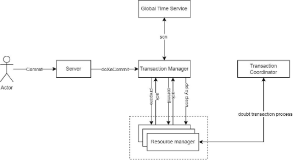

## Transaction Structure

YashanDB transactions consist of one or more SQL statements (DML or DDL) and a special SET TRANSACTION statement.

Transactions can be categorized into the following two types:

- A combination of one or more DML statements, together forming an atomic modification to the database.

- A single DDL statement.

Taking the example of transferring 100 yuan from account A to account B, the operation includes the following steps:

1. Decrease the balance of account A.

2. Increase the balance of account B.

3. Record the transfer operation in the transaction log.

Under normal circumstances, these three steps complete successfully, the transaction is committed, and all modifications take effect.

If a failure occurs during the operation, such as insufficient balance, account freeze, or power outage at the service hall, the transaction cannot be completed, and it must be fully rolled back. After rollback, all account balances remain unchanged.

The transaction corresponding to this operation is shown below:

```sql
INSERT INTO ACCOUNTS VALUES(10, 500);
UPDATE ACCOUNTS SET MONEY = MONEY - 100 WHERE ID = 'A';
UPDATE ACCOUNTS SET MONEY = MONEY + 100 WHERE ID = 'B'; 
INSERT INTO transaction_log (from_account, to_account, amount, transaction_time)
VALUES ('A', 'B', 100, NOW()); 
COMMIT;
```

## Transaction Status

Once a transaction is started, it remains in an active state until it ends.

An active transaction can accept new modifications, but they will only take effect after the transaction is committed. During the active period of a transaction, the following contents will result in buffer changes:

- Data cache page modifications

- Undo logs

- Redo logs

- Rows with data changes are locked

An example of querying the transaction active status is shown below:

```sql
INSERT INTO TABLE_TEST VALUES(1);
SELECT xid, status FROM V$TRANSACTION;

                  XID STATUS
--------------------- ---------
           4371578888 OPEN
```

## Transaction Control

### Transaction Start

YashanDB transactions are implicitly started and triggered by the first executable SQL statement.

When a transaction starts, YashanDB allocates the resources required during its execution, including memory, lock areas, UNDO, etc.. Simultaneously, it assigns a globally unique transaction ID. This transaction ID consists of the transaction area number (XEXT), the transaction's sequence number within that area (XNODE), and the transaction version number (XSN).  

After the transaction starts, relevant transaction information can be found through the V$TRANSACTION view.

### Transaction End

YashanDB transactions can be terminated manually or automatically, usually including the following methods:

- Manually executing COMMIT to submit the transaction, making all transaction changes permanent.

- Manually executing ROLLBACK without specifying TO SAVEPOINT, causing the entire transaction to roll back.

- Running a DDL statement, such as CREATE TABLE, causes YashanDB's transaction to automatically commit before the DDL executes. After the auto-commit, the DDL will run as a new transaction.

- Users exiting the connection through disconnection, logout, etc. Upon exiting, depending on the driver or client tool's instructions, the transaction may be automatically committed or rolled back. Typically, a normal exit triggers a commit while an abnormal exit triggers a rollback.

```sql
INSERT INTO TABLE_TEST(1,2,3);
COMMIT;
```

As illustrated in the example above, after committing a transaction, the data (1,2,3) will persist in the table, and the transaction modification will take effect.

### Transaction Control Statements

Transaction control statements can be used to manage the behavior of transactions, including the following statements:

- COMMIT statement:
  
  Used to commit the current transaction, making all modifications of the transaction persistent and effective. After committing the transaction, all resources occupied by the transaction will be released, including SAVEPOINT, locked resources, memory resources, and UNDO.

- ROLLBACK statement:
 
  - ROLLBACK: Used to roll back the current transaction, discarding all modifications.
  - ROLLBACK TO SAVEPOINT: Only rolls back transaction data and resources to the state at SAVEPOINT, without ending the entire transaction.

- SAVEPOINT:

  Used to mark a save point, recording the current transaction state and resource holding situation; subsequent transactions can roll back to the marked save point.

Below is an example of using transaction control statements:

|Number |Statement |Description |
| ---- |---- | ---- |
| 0 | UPDATE MONEY SET SALARY=SALARY-100 WHERE ACCOUNT = A | This statement performs a DML and triggers the transaction to start, reducing the balance of account A by 100. |
| 1 | UPDATE MONEY SET SALARY=SALARY+100 WHERE ACCOUNT = B | This statement performs a DML and triggers the transaction to start, increasing the balance of account B by 100. |
| 2 | SAVEPOINT TRANSFER_MONEY | Creates a save point TRANSFER_MONEY. |
| 3 | DELETE MONEY WHERE ACCOUNT = A | Deletes the record of account A in the balance table, performing account closure. |
| 4 | ROLLBACK TO TRANSFER_MONEY | Rolls back the transaction to the save point TRANSFER_MONEY, undoing the previous account closure operation. |
| 5 | COMMIT | Commits the transaction, finalizing the transfer operation. |

### SAVEPOINT

When a save point is set within an active transaction, any subsequent operations can be undone using ROLLBACK TO SAVEPOINT, reverting data and resources to the state at the save point.

YashanDB performs the following operations when executing ROLLBACK TO SAVEPOINT:

- Rolls back all statements following the SAVEPOINT.

- Releases all other save points after the specified SAVEPOINT.

- Releases all table and row lock resources after the specified SAVEPOINT.

Data and locks prior to the specified SAVEPOINT remain unaffected, and the transaction remains in an active state, allowing further transaction operations to continue.

The following is an example using SAVEPOINT; if ROLLBACK TO A is executed first, the SAVEPOINT B recorded after A will be automatically released:

```sql
SAVEPOINT A;
INSERT INTO TEST_TABLE VALUES(1);
SAVEPOINT B;
DELETE FROM TEST_TABLE;
ROLLBACK TO B;
ROLLBACK TO A;
```

## Autonomous Transactions

Autonomous transactions are independent transactions that can be nested within the main transaction. YashanDB allows users to use autonomous transactions to execute SQL operations and independently end the autonomous transaction. After ending an autonomous transaction, operations can continue with the main transaction.

Autonomous transactions are generally used for operations that must execute independently, without needing to consider how the calling main transaction ultimately ends. Autonomous transactions have the following characteristics:

- Autonomous transactions do not see uncommitted modifications in the main transaction and do not share locks or resources with the main transaction.

- After an autonomous transaction is committed, its modifications become visible to other transactions without requiring the main transaction to commit.

- Autonomous transactions can initiate autonomous transactions within themselves, allowing for multiple layers of nesting.

In PL, after initiating an autonomous transaction, a set of SQL statements can be freely used to modify data. Within the range of the autonomous transaction, resources are executed independently of its parent transaction.

***Example*** follows; for detailed usage, see the [PL Reference Manual](../../Development Guide/PL Reference Manual/00PL Reference Manual) for related syntax.

```sql
CREATE OR REPLACE PROCEDURE AUTON_INSERT
AS
   PRAGMA autonomous_transaction;
BEGIN
    INSERT INTO test VALUES ( 'Autonomous Insert' );
    INSERT INTO test VALUES ( 'Autonomous Insert' );
    COMMIT;
END;
/
```

<span id="DstbTm" name="DstbTm" class="yaslink"></span>

### Distributed Transaction Management

In distributed systems where transactional operations span multiple instances, distributed transaction management is essential to preserve transactional properties across the environment. By employing decentralization and global high-precision logical clock synchronization, this approach delivers real-time strong data consistency across distributed instances while avoiding the scalability bottlenecks inherent to Global Transaction Manager (GTM) architectures.



- Transaction Coordinator (TC)

  - Provide the ability to collect and present the overall status of distributed transactions and local transactions

  - Provide the recovery capability for residual distributed transactions under abnormal conditions

- Transaction Manager (TM)

  - Provide the ability of two-phase commit

  - Provide the capabilities of commit, rollback, and savepoint for distributed transactions under normal scenarios

- Resource Manager (RM)

  - Provide management of local transaction status

  - Provide ACID capabilities for local transactions
  
  - Provide XA interface for local transactions

- Global Time Service (GTS)

  - Provide a globally unique monotonically increasing timestamp