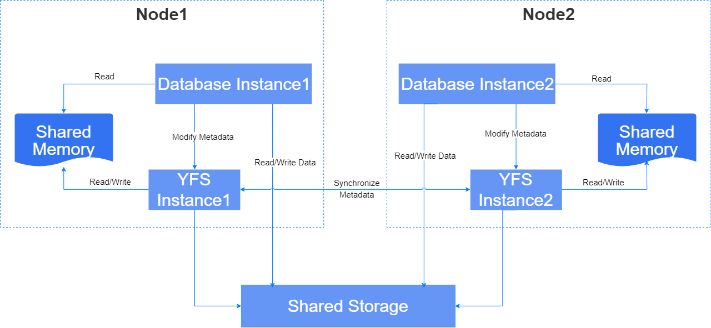

The YFS (Yashan File System) is a dedicated parallel file system for YashanDB, providing functionality such as storage device management, high availability storage, and file system interfaces.

A group of YFS-related threads running on each server in a cluster is called a YFS instance. The YFS instance runs in the same process (YCS process) as the YCS instance. In a production environment, typically only one YFS instance runs on each server.

The core server process, YASDB, acts as the client for the YFS instance, communicating only with the YFS instance on the same server. The YASDB process initiates metadata change requests to the YFS instance through a Unix Domain Socket, which updates the metadata buffer in shared memory and persists the metadata changes to shared storage. The YASDB process reads metadata from shared memory and performs read/write operations directly on the disk without going through the YFS instance, achieving I/O performance close to direct reads/writes on raw devices.

The YFS instance manages global storage metadata, ensuring the atomicity of operations through transactions. Metadata is synchronized across YFS services via a network, and consistency protocols guarantee global consistency, ensuring that the file states seen by each YFS instance are consistent.

## Disk Management

YFS has disk management capabilities, dividing raw disk devices into logical concepts such as DiskGroups and FailureGroups, managed in a hierarchical structure.

### DiskGroup

The DiskGroup is the top-level logical unit for managing disk devices in YFS.

In YFS, multiple DiskGroups may exist, with resource and fault isolation between DiskGroups. Different DiskGroups can be managed with differentiated storage policies, such as assigning different redundancy levels.

####  DiskGroup Classification

YFS classifies DiskGroups based on their functions:

- System DiskGroup: Used to store YFS's own metadata. It is recommended that the capacity be no less than 500MB. YFS relies on this disk to complete startup and initialization.

- Data DiskGroup: Used to store business data.

The minimum viable YFS configuration is as follows:

- At least one physical disk device must be logically grouped into one fault group (default name: SDG0_0), which further forms one system DiskGroup (default name: SYSTEM).

- At least one physical disk device must be logically grouped into one fault group (default name: DG0_0), which further forms one data DiskGroup (default name: DG0).

#### Redundancy Level

The redundancy level is a core parameter in YFS used to define the data protection capability of a DiskGroup. It determines the number of data file replicas, thereby affecting the level of data high availability and reliability.

The redundancy level is divided into External, Normal, and High, with increasing levels of high availability and reliability. If set to External, there is no data redundancy, and data reliability relies on external mechanisms, such as RAID.

The relationship between redundancy level and file replica count is shown in the table below.

|Redundancy | System DiskGroup Number of file replicas | Data DiskGroup Number of user data replicas | Data DiskGroup Number of YFS metadata replicas |
| ---------- | ------ | ----------- | --------------- |
| External   | 1      | 1           | 1               |
| Normal     | 3      | 2           | 2 ~ 3           |
| High       | 5      | 3           | 3 ~ 5           |

The redundancy level of each DiskGroup is independent and must be specified when creating the DiskGroup; it cannot be changed afterward.

#### Allocate Unit

The Allocate Unit (AU) is the smallest unit for YFS to allocate disk space. YFS divides disks into fixed-size allocation units for management, and all disks within the same DiskGroup use the same allocation unit size.

The allocation unit granularity options include 1MB (default), 4MB, 8MB, 16MB, and 32MB. This attribute is specified when creating a DiskGroup and cannot be changed afterward.

Larger allocation unit granularities allow for larger files and better contiguous I/O performance, but they also consume more memory and waste some disk space. In practice, you should choose an appropriate allocation unit granularity based on your workload characteristics. Configuration recommendations are as follows:

- If the system primarily handles small files, a smaller AU size is recommended.

- If the system primarily handles large files, a larger AU size is recommended.

- Better performance can be obtained when AU size is greater than or equal to the vast majority of I/O sizes.

### FailureGroup

YFS defines disks that may fail simultaneously as FailureGroup, working in conjunction with the multi-replication mechanism to achieve data redundancy. Each FailureGroup stores one replica; as long as at least one complete replica remains, the corresponding data remains accessible. Failures across different FailureGroups are independent events, with a very low probability of simultaneous occurrence, thus making it highly unlikely that all replicas of a data item will be lost — ensuring high data availability.

There is no absolute standard for FailureGroup partitioning; instead, groups are formed based on specific operational conditions and the correlation of failure probabilities among disks, aiming to reduce the probability that all FailureGroups fail simultaneously and to minimize the likelihood of multiple groups failing concurrently.

Each FailureGroup contains one or more disks, which may be:

- Some LUNs from the same shared storage array

- Disks from the same cabinet

- Multiple storage devices powered by the same power supply

- Multiple storage devices from the same data center

YFS selects one disk from each FailureGroup to form a partner disk set, and each disk can belong to at most one partner disk set (no overlap). The N replicas of the same data file are stored on N different disks within the same partner disk set. Based on this, the redundancy level and the number of FailureGroups are related as follows:

- The number of FailureGroups in a DiskGroup must be greater than or equal to the minimum number of replicas required by the redundancy level.

- For data DiskGroups with redundancy levels Normal or High, the actual number of YFS metadata replicas is also tied to the number of FailureGroups — for example, if a data DiskGroup has a redundancy level of High but only 3 FailureGroups, the actual YFS metadata replicas will be 3.

- If the number of disks in a partner disk set is less than the minimum number of replicas required by the redundancy level, that disk set will be considered unavailable; you must add disks or FailureGroups to meet the requirement before it becomes usable.

> **Note**:
> 
> The `PARTNERS` field in the [V$YFS_DISK](../../参考手册/系统视图/动态视图/V$YFS_DISK) view can be used to view the partner relationships of disks.
> 
> After adding or removing disks from a DiskGroup, the peer relationships among disks may change.

### Disk Devices

All data in YFS is stored on disks according to specified policies, including YFS's own metadata, metadata for YFS files and directories, and user data.

The same disk cannot be reused in YFS, which may result in data loss.

YFS only supports Direct IO mode for read and write operations, and the disks added to YFS must support DIO mode read and write with a block size of 512B - 64MB.

## File and Directory Management

YFS provides a set of file operation APIs that abstract the details of underlying storage management. The semantics of these APIs are compatible with most file system operations, incorporating basic file system concepts such as files, directories, and paths.

YFS also provides a dedicated management terminal, *yfscmd*, offering a file management interface similar to the Linux Shell, including common commands like cd, ls, mv, cp, etc.

### Directory

YFS organizes and manages files in a directory tree structure, with paths formatted as `+DG_NAME/DIR/PATH/file.name`.

In YFS, the root is +, and the first-level directories are the names of DiskGroups. Other sub-levels are the general directory and filename meanings. DiskGroup directories are virtual directories and cannot be directly added, deleted, or modified — changes must be made indirectly by adding or deleting DiskGroups.

Files can be identified by the file system type in absolute paths; those starting with `+` indicate a YFS path, while those starting with `/` indicate a local system path. The `yfscmd cp` command recognizes the filesystem based on the root path character to achieve cross-copying between YFS and local file systems.

### File

In addition to user data, YFS files contain some abbreviated attribute information, such as creation time and file size. Since YFS only supports direct I/O read and write operations, the file sizes in YFS are all multiples of 512 bytes.

The actual disk space occupied by a file may be greater than its file size, approximately `Round(FileSize/AuSize) * Redundancy`. The file's metadata will also occupy a small additional amount of space.
