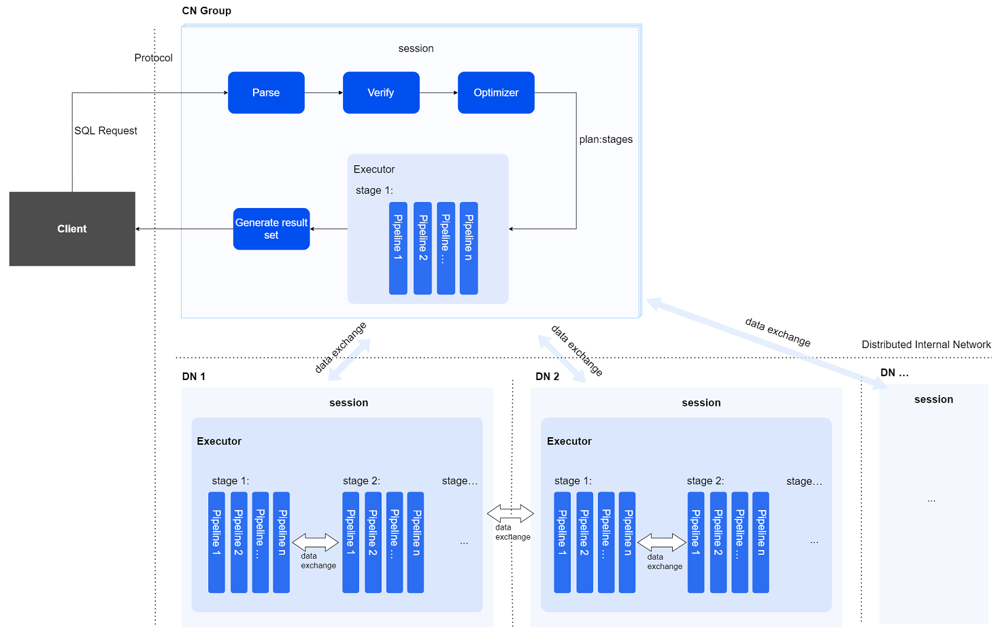

The SQL engine is one of the core components of the database. Its main responsibilities are to process SQL requests submitted in text form by clients and execute them, as well as to return the query result set to clients when necessary.

## SQL Execution Process

A complete SQL execution process consists of four stages: parsing, verification, optimization, and execution. The optimization stage is further divided into REWRITE, execution plan generation, and dynamic rewriting.

- **Parse Stage**

    In the parse stage, lexical, syntactical, and semantic parsing are performed, generating a tree-like parsing result called the Parse Tree.

- **Verify Stage**

    In the verify stage, user role privilege verification, data validity checks, and syntactic constraint validations are conducted. Additionally, part of the work of the optimizer is brought forward to optimize the Parse Tree structure, thereby reducing the burden on subsequent stages for performance acceleration.

- **Optimize Stage**

    In the optimize stage, the final executable SQL execution plan is generated based on the input Parse Tree.

- **Execute Stage**

    In the execute stage, operators in the SQL execution plan are executed, supporting parallel computation to improve efficiency.

## Optimizer

The optimizer is a core component of the SQL engine. The YashanDB optimizer employs a Cost Based Optimizer (CBO) mode.

The optimizer generates the optimal execution plan as much as possible based on the input Parse Tree and provides it as input for the executor to complete the subsequent execution process. The execution plan includes data access paths, table join order, and other execution operator information. The CBO optimizer of YashanDB calculates the cost required for data access and processing based on statistics, selecting the best scheme to generate the execution plan.

- **Statistics**

    This mainly includes statistics of tables, columns, and indexes, such as the number of rows in a table, the average length of the columns, and the number of columns in the index. Statistics can be collected dynamically, through scheduled tasks, and manually triggered methods. Meanwhile, technologies like parallel statistics and sampling statistics are used to accelerate the efficiency of statistics collection, providing timely updated information for the optimizer.

- **Execution Operators**

    Operators define specific types of computational operations and are the basic building blocks of the execution plan. YashanDB implements the following basic operators:

    - Scan Operator

    - Join Operator

    - Query Operator

    - Sort Operator

    - Auxiliary Functionality Operator

    - PX Parallel Execution Operator

- **HINT**

    HINT provides measures for users to intervene in the SQL execution plan, such as specifying the table scan method, execution order, and parallel degree. The optimizer will generate the optimal execution plan based on these hints in conjunction with the statistics.

- **Parallelism**

    Parallelism describes the level of concurrent processing during SQL execution. The parallel degree can be specified through parameters or HINTs, allowing SQL to be executed using multi-threaded concurrent execution, thereby improving the execution efficiency of SQL statements.

## Vectorization Calculation

YashanDB supports vectorization calculation, where the core principle is to utilize SIMD (Single Instruction Multiple Data) technology for batch computations, improving calculation efficiency.

The content of vectorization calculation includes:

- Batch processing: Data transmitted between operators is no longer individual records but a batch of data.

- Parallel computation: Operators are executed concurrently.

The vectorization calculation framework includes:

- Vectors: The data structure used for transmitting data between operators, consisting of a batch of contiguous memory that stores column data of the same type and known length.

- Expressions: General expressions such as literals, columns, and functions. By establishing a computational expression structure and binding it to the required context information and schema, an executable expression is created for computation.

- Execution Operators: Operators are functionality units in SQL that execute the query plan. They process input vector data and output results, which are also vector data.

## Distributed SQL Execution Process

In a distributed SQL execution process, there are mainly two types of instances involved:

- ‌Coordinating Instance: Any compute node (CN) can accept SQL requests to serve as the coordinating instance for the current SQL execution. It parses the SQL, generates a distributed execution plan, distributes the plan to all participating instances (including itself) for execution, and aggregates the results.

- Compute Instance: Any compute node may serve as a compute instance for SQL execution. The coordinating instance selects a group of compute instances (which may include all nodes, including itself) to collectively execute the current SQL statement based on: 1.The executed SQL and data distribution patterns, 2.Data affinity requirements, 3.Specified degree of parallelism.

The distributed SQL engine parses, verifies, optimizes the user's textual SQL statements, the coordinating instance distributes execution plans to compute instances, multiple compute instances execute in parallel, and finally returns the query result set to the user.

- **session**

    Session management is used for managing the interaction between nodes, overseeing the final status of execution between nodes, and scheduling the execution process among nodes.

- **Distributed Interconnect Network**

    This distributed communication component uses an asynchronous network communication framework responsible for network communication between nodes, including dispatching the execution plans and data exchange between nodes.

- **Data Exchange Mechanism**

    While every compute instance can access all data in a distributed cluster database, the system groups data by partition granularity to leverage multi-instance resources for accelerated massive data computation. Each data partition is exclusively assigned to one compute instance. The coordinating node schedules execution plans based on parallelism and data affinity. When a SQL computation requires data sources from different partitions, a specific PX parallel execution operator is needed to transport data to a specified location in the designated manner.

    During a distributed SQL execution process, the following types of data exchanges may occur:

    - Result data from compute instances consolidates at the coordinating instance to form distributed SQL query results.

    - When computation on a compute instance requires data from other instances, it necessitates transferring said data from those remote instances.
    
    - Data is exchanged between stages on the same compute instance.

- **Parallel Execution**

    YashanDB's distributed SQL parallel execution is divided into two levels:

    - **First Level: Inter-node Parallelism**

        The optimizer on the coordinating instance splits a complex query into multiple plan stages based on parallelism and table data affinity. These stages are dispatched to different compute instances for parallel execution.

    - **Second Level: Intra-node Parallelism**

        Plan stages generated by the optimizer's partitioning on the coordinating instance are further decomposed into multiple pipeline task instances at compute instances, based on data shard information and parallelism. These task instances are then executed in parallel by multiple worker threads.