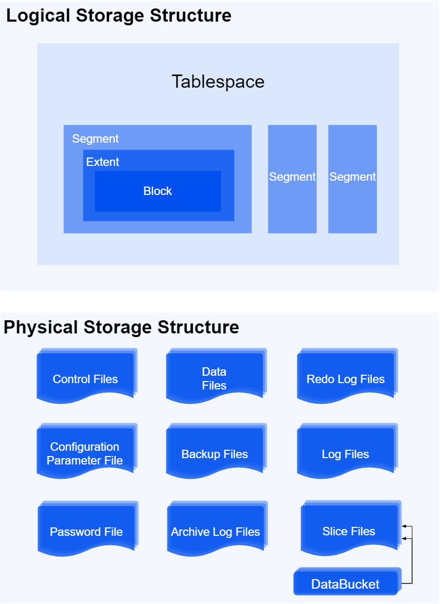
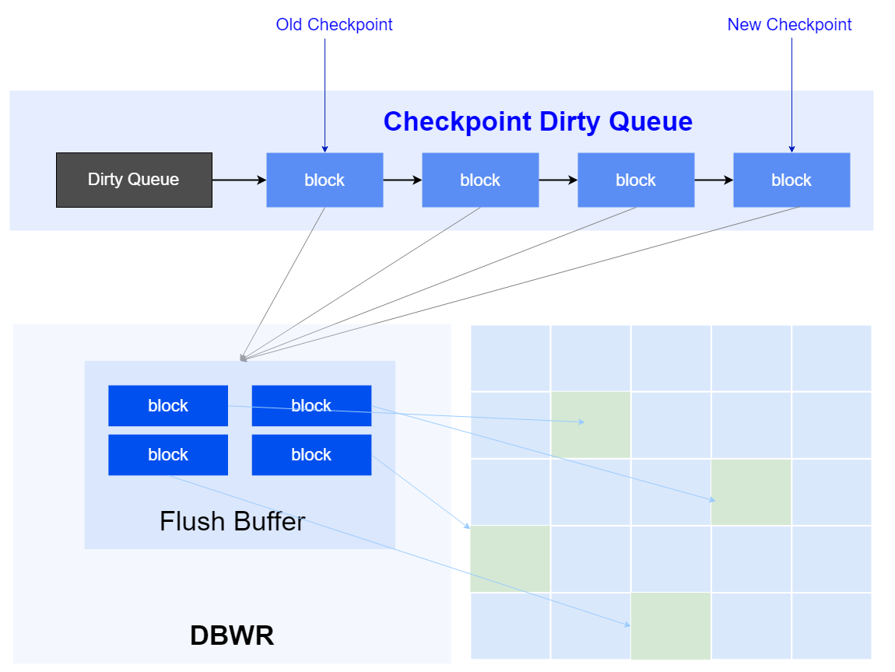
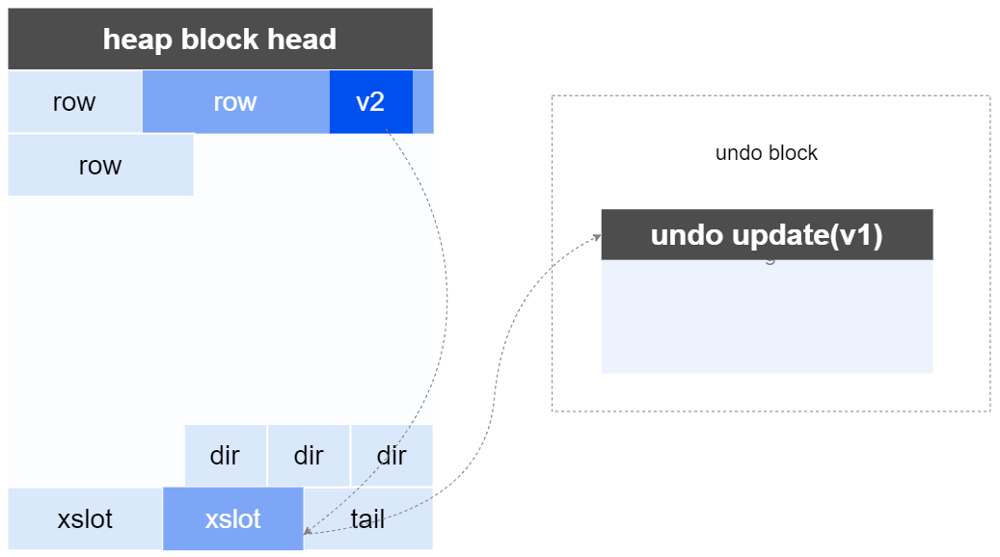
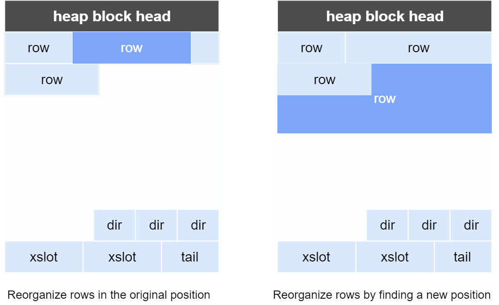
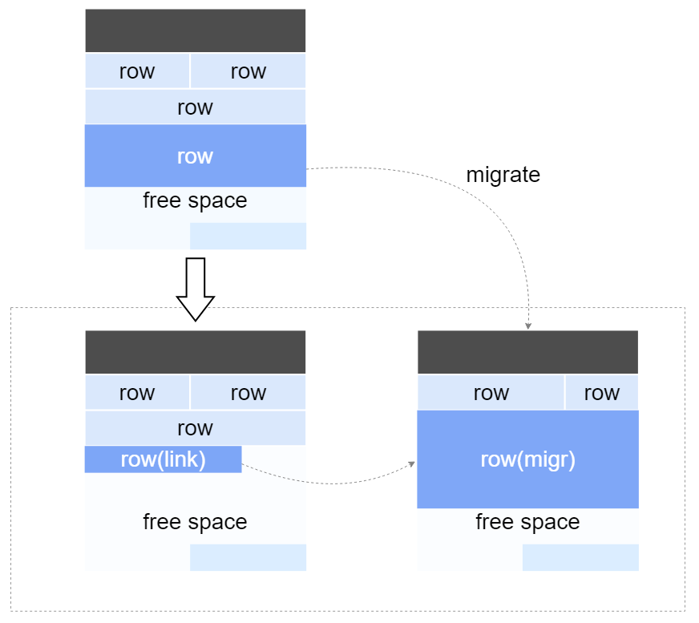
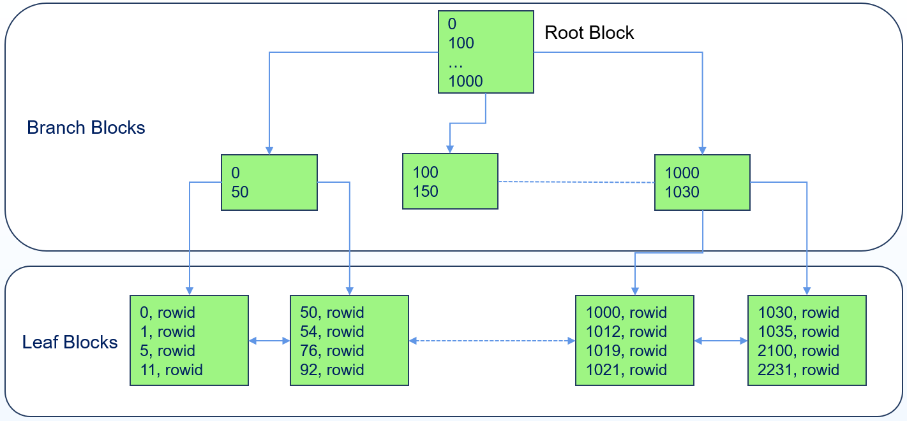
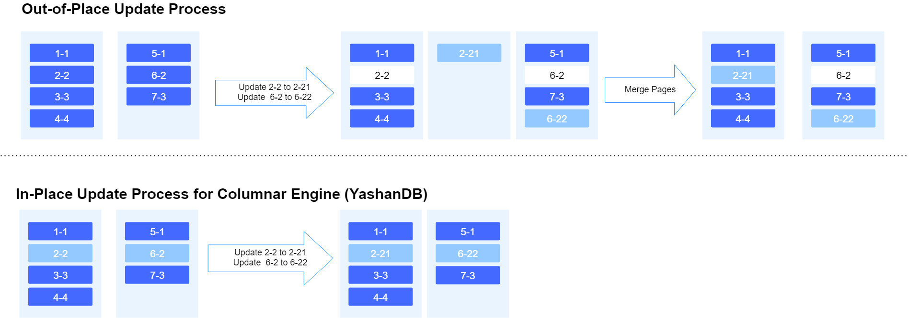
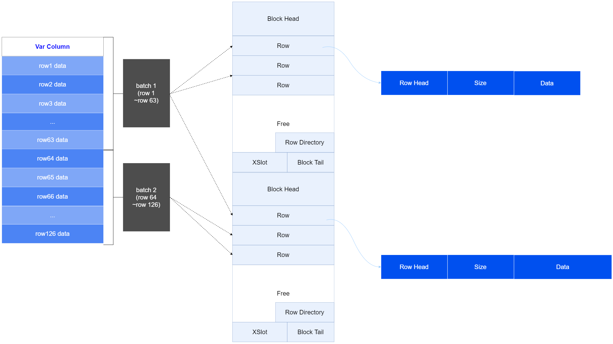

The storage engine is one of the core components of a database. YashanDB adapts to different application scenarios through various storage engines to achieve efficient transaction processing capabilities for online transaction scenarios, balanced capabilities for transaction and analysis in real-time analysis scenarios, and high performance for massive stable data analysis scenarios.

YashanDB supports the following storage structures: HEAP, BTREE, MCOL, and SCOL.

- HEAP: Heap storage, characterized by unordered storage, where data is written randomly to a suitable position upon insertion.

- BTREE: B-tree storage, characterized by ordered storage of one-dimensional data, where data is written in order according to key values to improve query efficiency.

- MCOL: Mutable columnar storage, characterized by segment-page storage, where each column's data is stored continuously in data segments, supporting in-place updates and dictionary encoding.

- SCOL: Stable columnar storage, characterized by slice-based storage, where data is sliced by rows, with the column data stored continuously within each slice, supporting compression and encoding.

Based on different storage structures, YashanDB supports the following storage object types: heap table, LSC table, and BTree index:

- Heap Table: Uses the HEAP storage structure, primarily targeting online transaction processing (OLTP) scenarios.

- LSC Table:

    - TAC Table (Transaction Analytics Columnar Table): An LSC table using the MCOL storage structure, primarily targeting Hybrid Transaction and Analytical Process (HTAP) scenarios.

    - LSC Table (Large-scale Storage Columnar Table): An LSC table using both MCOL and SCOL storage structures, primarily targeting Online Analytical Processing (OLAP) scenarios.
    
- BTree Index: A B-tree index, the default index type supported by YashanDB.

## Tablespace Management

A tablespace is a container that can allocate space to table and index entities.

YashanDB divides the database storage space into several tablespaces that are isolated from one another. Each tablespace manages storage space using segment-page or object-based methods.

### Segment-page Management

The segment type of a segment-page tablespace includes logical segments of different types, such as data segments, index segments, and rollback segments. Logical segments manage space using data areas and data blocks, making space usage more flexible, management more efficient, and utilization higher.

- **Datafile**

    A data file consists of a group of data files forming a segment-page space for a Tablespace. When the segment-page space in the Tablespace is insufficient, the size of the data file can be expanded, or new data files can be added.

- **Segment**

    Data segments in the database carry the data of table, index, and other entity objects through segments.

- **Extent**

    Data areas request space from the Tablespace in the smallest granularity of an extent, which generally includes several blocks. YashanDB manages extents within segments using an Extent Map.

- **Block**

    Data blocks organize the database data by blocks; when data needs to be persisted, blocks are the smallest unit of disk I/O. Normally, the block size of the database is a multiple of the block size of the operating system, with YashanDB's default block size being 8K.

- **Transactions and MVCC**

    Transactions are the logical basic units of database operations, maintaining the integrity and consistency of the database, featuring ACID properties. All table objects in YashanDB implement the ACID features of transactions as well as Multi-Version Concurrency Control (MVCC), providing complete transaction capabilities, including commit and rollback operations, and supporting multi-version control for consistent reads, enabling operations like flashback queries.
 
- **Persistence**

    Persistence refers to writing the in-memory data of the segment-page logical structure to disk for permanent storage.

    

    - **redo**

        Modifications to data in the database must be recorded in redo logs for fault recovery, primary-standby replication, etc. YashanDB uses the Write Ahead Log (WAL) mechanism to first log data modification operations in redo, and then batch write to disk to reduce the performance impact of directly writing data to disk.

    - **Checkpoint**

        Data modified in memory is not directly written to disk but is handled by YashanDB's Checkpoint mechanism. These data are queued based on the order of redo records, and when a checkpoint is triggered, the write process will read the data and insert it into the data file, while also updating the queue and releasing redo space.

        

        The system employs multi-threaded writing, I/O merging, I/O sorting, and other optimization methods to enhance disk write efficiency. Meanwhile, YashanDB introduces a double-write mechanism to avoid potential partial write issues that may occur in unexpected situations such as server power loss, strictly ensuring data integrity.

### Object-based Management

The object types in object-based tablespaces include slice metadata objects, columnar data objects, etc., managed as physical files, with one object written to one file for continuous storage of data on disk, resulting in efficient read performance and good support for compression encoding.

Data in SCOL format will be persistently stored in corresponding data buckets as slice files, where a data bucket consists of a set of data file directories forming an object-based space for a Tablespace, supporting specifications for local disk or cloud storage.

## Storage Structure

### HEAP Storage Structure

HEAP storage organizes and stores data in an unordered manner. Records of user add/delete/update/query operations are organized and stored in row format. The row format describes the length of each column field, supporting data row storage with variable-length columns (e.g., VARCHAR, LOB), where each data row is stored sequentially according to the order declared by the columns.

Heap storage maintains a free space management structure. When data needs to be written, it quickly finds a suitable position in the space for writing. Since there is no need to maintain data order, the writing process is efficient, suitable for high-speed insertion of row tables.

When updating a variable-length column field for a given row, the system adopts the following storage methods:

- in-place update

    If the field length changes during the update or remains unchanged, data can be directly replaced in place. Only the modified parts of the column are recorded in the undo logs.

    

    If the column field length decreases after the update, the row becomes shorter, and the row is reorganized at the original position; if it increases, the row becomes longer, and if there is enough free space on the page, the row is reorganized on the same page.

    

- Row migration and row linking

    If the field length increases after the update and the page does not have enough free space to reorganize the row on the same page, the entire row data will be migrated to another page. If the variable-length row exceeds the capacity of the entire page, the row data will be split across multiple pages, with links between pages identifying a single row.

    

- PCT Free

    PCT Free indicates the proportion of free space required on a page; that is, after data insertion, the size of the free space cannot be less than this value. The PCT Free setting aims to mitigate the occurrence of row migrations, which can affect the efficiency of data scanning as well as updates and deletions.

### BTREE Storage Structure

BTREE is a multi-way balanced search tree, featuring a structure that stores data in an ordered manner according to key values. The BTREE storage structure uses a B-Link Tree, with tree nodes organized in blocks, defining the lowest level of the tree as level 0, where the blocks at level 0 are called leaf blocks, and blocks at levels greater than 0 are called branch blocks. The topmost level of the tree contains only one block, known as the root block (which is a special branch block).

The BTREE storage structure is used to store BTree indexes, where the indexed rows stored in a single block are ordered, and the blocks themselves are also ordered, ensuring that the entire BTree index is ordered.

### MCOL Storage Structure

The Mutable columnar storage area adopts the Mutable Columnar Storage (MCOL) format for storage. MCOL is a columnar storage structure based on segment-page management, supporting real-time business, with the smallest access data unit being a block.

The Mutable columnar storage format consists of several data segments: meta management segment, transaction management segment, fixed columnar segment, and variable columnar segment, among others:

- Batch: Mutable columnar storage organizes data in column format, where a batch of records for each column constitutes a Batch, serving as the basic unit for data reading.

- Meta Management Segment: This segment records the overall entry information of the mutable columnar storage area and other metadata.

    - Entry Block: The entry block records statistics related to the mutable columnar storage area, the free bitmap of slices, and auxiliary information.

    - Segment Entry Block: Records all segment information after the table is logically split into columns.

    - Column Entry Block: Records metadata information for all columns.

- Transaction Management Segment: Manages transaction information within the mutable storage area, where the minimum transaction unit is Xslot. It ensures transactional consistency for data writes by managing transactions executed on Fix Col Blocks and Var Col Blocks through Xslots.

- Fix Col Segment: Each fixed-length column is independently allocated into a segment, containing several blocks.

- Var Col Segment: Each variable-length column is independently allocated into a set of segments composed of metadata segments and data segments. The metadata is stored on logically contiguous segments organized in fixed-length format, while the data portion is stored in heap storage segments.

In MCOL, columns are subdivided into one or more data segments, with each column's data stored continuously and implementing in-place updates. Compared to HEAP storage structures for full table queries, MCOL enhances the query speed for projection operations while also enabling rapid in-place updates.

**in-place update**

Traditional analytical databases employing columnar storage insert and update operations by appending a new value at the end and marking the data being replaced. MCOL achieves in-place updates, avoiding the generation of "tombstones" in the storage area, mitigating space inflation and garbage scanning, and effectively improving the efficiency of storing and retrieving data.

**Columnar Variable-length Field Storage**: MCOL employs columnar storage or hybrid techniques for variable-length fields (e.g., LOB, VARCHAR), where each column independently has one or more segments.

- For shorter variable-length fields, a pure columnar storage format is adopted.

- For longer variable-length fields, a method combining row numbers and data is used, containing a metadata segment for storing row numbers and a heap segment for actual data storage. Each row of data in the column is stored using a Row format.

    

If variable-length field data uses HEAP storage, it still follows the [HEAP storage structure](#HEAP), enabling efficient modifications and deletions of columnar data, while RowId logical mapping structures facilitate row-column correspondence and batch transaction processing, maintaining the advantages of batch insertion and querying for columnar data.

### SCOL Storage Structure

The Stable columnar storage area adopts the Stable Columnar Storage (SCOL) format for storage. SCOL is a columnar storage structure based on object-based management, supporting massive data storage.

In SCOL, each column is divided into several objects, each stored continuously in the disk directory as files. By conceiving pre-loading or real-time loading, data can be buffered into memory cache. Different objects can utilize the optimal compression and encoding methods based on their data types to save storage space and enhance access speed.

- Table/Partition Segment: Records the overall entry information of the table.

    - Entry Block: The entry block records the distribution of slices for table data, statistics, and auxiliary information.

    - Active Slice Entry: Records metadata information for active slices.

    - Stable Slice Entry: Records metadata information for stable slices.

- Active Slice: Records information about active slices. When the volume of data in an active slice reaches a threshold, it will automatically transition to stable slices.

    - Segment Entry Block: Records all segment information after the slice is logically divided by columns.

    - Column Entry Block: Records metadata information for all columns.

    - Tran Mgmt Segment: Transaction management segment, manages transaction consistency for data writes via Xslots in segments for each Fix Col Block and Var Col Block.

    - Fix Col Segment: Each fixed-length column is independently allocated into a segment, containing several blocks.

    - Var Col Segment: For variable-length columns, row-to-column transformations will be utilized, supporting transaction processing capabilities for variable-length columns.

- Stable Slice: Records information about stable slices. Stable slices compress and encode data for improved data storage and access efficiency and support merge operations.

Compared to MCOL data, SCOL format data showcases superior query performance. Configuring MCPOL TTL can determine the retention time for mutable data, and setting a smaller MCOL TTL can facilitate the quick transformation of data into stable data, enhancing query performance.

Data in MCOL format, after being compressed via transform in background, will transition to SCOL format. Transform in background is transparent to the business layer's query requests. Query requests will merge and present the MCOL format data with SCOL format data to the user while satisfying transaction requirements. Transform in background supports batch automatic conversions of active/stable slices. When incrementally writing data, it is stored as active slices and will undergo batch conversion to stable slices once certain conditions are met.

## Storage Object

### Heap Table

Heap table uses the [HEAP storage structure](#HEAP), where data is organized and stored in ROW format within the HEAP storage area. The data within each data row is stored in a variable-length format, organized in Row format as "data length + actual data."

### LSC Table

#### TAC Table

The TAC table uses [MCOL storage structure](#MCOL) to support real-time business.

#### LSC Table

LSC table data is organized in slice format (Slices), divided into active slices (Active Slices) and stable slices (Stable Slices).

In typical Online Analytical Processing (OLAP) applications, data is unstable for a certain period after being written; it needs to undergo updates/deletes for accuracy verification, data cleaning to eliminate noise, etc. After this period, the data becomes relatively stable, suitable for business model analysis, business intelligence, and other analytical work. For the ease of understanding, in YashanDB's conceptual documentation, we refer to data that requires frequent updates/deletes as "hot data," and relatively stable data that doesn't require frequent updates/deletes as "cold data."

The LSC table automatically determines the temperature of the data based on user input, with active slices used by default to store hot data and stable slices for cold data (the default storage method will be used in subsequent descriptions). Users may also customize adjustments according to their actual needs, for instance, storing both hot and cold data in stable slices, although this may impact performance.

- **Active Slices**

    Data adopts the [MCOL architecture](#MCOL), being friendly to storing hot data. It accommodates update and delete operations and supports incremental writing (real-time) business.

    Active slices are persistent; their data is safeguarded by the database persistence mechanism as soon as it is written to active slices, thereby ensuring data safety.

    

- **Stable Slices**

    Data adopts the [SCOL architecture](#SCOL), being friendly for storing cold data. The data undergoes encoding, compression, and supports data sorting along with sparse index filtering, condition-pushdown filtering, etc., capable of supporting high-performance queries for massive data.

    The stable slices support modification operations via a mark-delete approach. When the modifications within stable slices reach a certain extent, the backend cleanup and merging operations are automatically triggered. Slices with all data being marked for deletion will be cleaned up automatically to release disk space, while several slices with only a small amount of valid data will be merged into one slice to improve both data access and storage efficiency.

When accessing LSC table data, processed queries begin by referencing the Entry Block to ascertain the organization of table data, followed by scanning the corresponding slices for the next level of data retrieval.

### BTree Index

Databases can accelerate data access by creating indexes, which are data structures associated with tables. Creating appropriate indexes on a table can reduce the number of rows that need to be accessed and the I/O operations, significantly enhancing business performance.

BTree indexes are the most common and widely used indexes in databases (generally speaking, the term index refers to B-tree index), and it is also the default index type supported by YashanDB, utilizing the [BTREE storage structure](#BTREE).