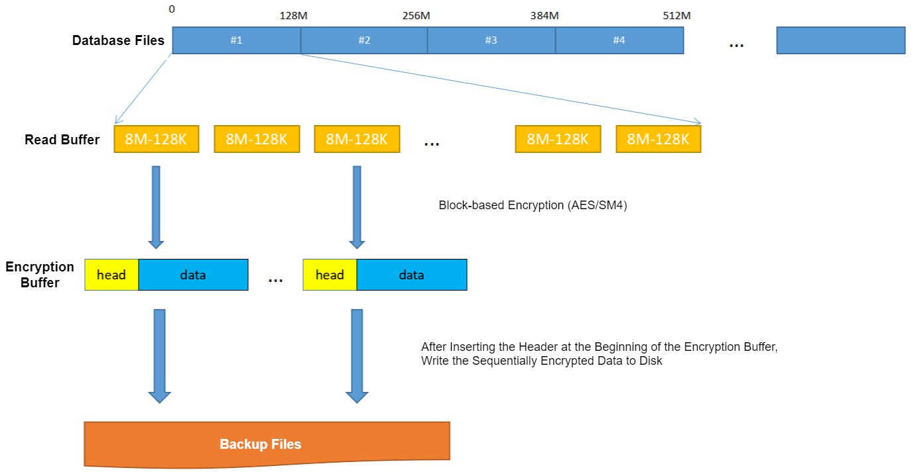

YashanDB supports specifying encryption strategies during backups to ensure the security of backup data. Users can choose from AES128, AES192, AES256, or SM4 encryption algorithms according to their actual needs, with SM4 as the default.

> **Note**:
>
> If you need to use the SM4 algorithm and require the OpenSSL tool, please refer to [Dependency Preparation](../../../Installation and Upgrade/Installation and Deployment/Pre-Installation Preparation/Preparing Dependencies) to check and ensure that the required tools are installed on the server system.

The backup encryption key adopts the same strategy as the YashanDB user password and uses the same key protection mechanism, ensuring it cannot be cracked without the plaintext password, further guaranteeing data security.



Backup encryption can be used with any backup method provided by YashanDB. For details, please refer to [Backup and Recovery](../../../Database Administration/Backup and Recovery/00Backup and Recovery). Each backup set of incremental backups must maintain a consistent encryption strategy (either all encrypted or all unencrypted), and the keys of each backup set must remain the same.

***Example*** for Standalone Deployment and YAC Deployment

```sql
BACKUP DATABASE INCREMENTAL LEVEL 0 ENCRYPTION IDENTIFIED BY 12345;

BACKUP DATABASE INCREMENTAL LEVEL 1 ENCRYPTION SM4 IDENTIFIED BY 12345;
```

Encrypted backup sets must be decrypted before they can be used during restoration, with decryption performed by inputting the password for consistency checking.

***Example*** for Standalone Deployment and YAC Deployment

```sql
RESTORE DATABASE DECRYPTION 12345 FROM 'backup';
```
