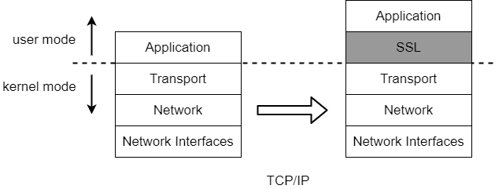
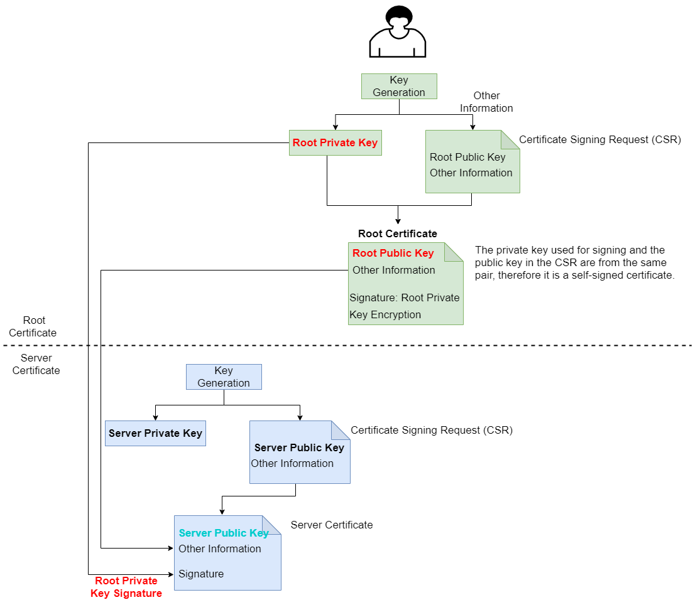
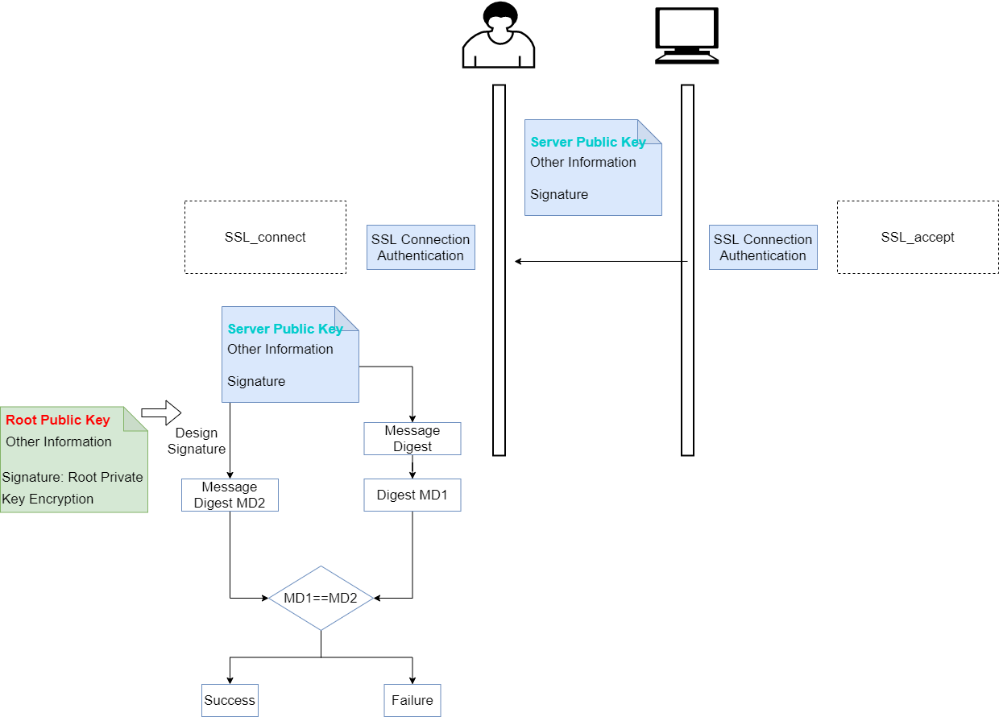

A secure communication channel should be established between the database client and server, as well as between different nodes of the database, to ensure the confidentiality and integrity of the communication data.

YashanDB supports communication channel encryption and server authentication through the SSL or TLCP protocols.

## Trusted Channel of SSL Protocol

### SSL Protocol

The SSL protocol is a protocol between the application layer (YashanDB) and the transport layer (TCP). SSL is transparent to the application layer, and users remain unaware of it.

**SSL Handshake**

This phase mainly accomplishes the following operations:

- Security authentication of the client and server.

- Generation of the master key and session key for subsequent symmetric encryption of the transmission.

**SSL Record**

In this phase, data is encrypted and transmitted using the keys of both parties. The sender goes through processes such as chunking, compression, and encryption, while the receiver unpacks in the reverse order.

### SSL Authentication

YashanDB uses SSL digital certificate authentication for login requests over SSL connections, including the creation and verification of certificates.

**Certificate Creation**

Generate a key pair (public/private key) on the server; generate a root certificate (self-signed, containing the server's public key); use the root certificate to generate a server certificate, signed with the private key.

**Certificate Verification**

The client retains the server's root certificate. The server sends its server certificate to the client, which uses the root public key to verify the signature and compares it with the computed message digest.

## Trusted Channel of TLCP Protocol

### TLCP Protocol

The TLCP protocol uses SM series cryptographic algorithms and digital certificates to ensure confidentiality, integrity, authentication, and resistance to attacks at the transport layer. It is a type of SSL-like security protocol based on domestic cryptographic algorithms, functioning similarly to the SSL protocol.

### TLCP Authentication

TLCP adopts a dual certificate system based on SM2 for authentication, where a CA issues encryption certificates for session key generation and issues signing certificates for identity verification.

## Configuring Trusted Channels

Trusted channels are turned off by default. To enable them, digital certificates must be configured simultaneously; otherwise, the database will fail to start.

- Trusted Channel of SSL Protocol

    - A trusted SSL channel is supported between the database client and server. For configuration operations, please refer to [SSL Trusted Channel Between Database Server and Client](../../Database Administration/Basic Database Management/SSL Trusted Channel Configuration/SSL Trusted Channel Between Database Server and Client).

    - A trusted SSL channel is supported between HA primary and standby nodes. For configuration operations, please refer to [SSL Trusted Channel Between HA Nodes](../../Database Administration/Basic Database Management/SSL Trusted Channel Configuration/SSL Trusted Channel Between HA Nodes).

    - A trusted SSL channel is supported for communication networks between distributed nodes (DIN). For configuration operations, please refer to [SSL Trusted Channel Between Distributed Nodes](../../Database Administration/Basic Database Management/SSL Trusted Channel Configuration/SSL Trusted Channel Between Distributed Nodes).

- Trusted Channel of TLCP Protocol
    
    A trusted TLCP channel is supported between the database client and server. For configuration operations, please refer to [TLCP Trusted Channel of Database Server](../../Database Administration/Basic Database Management/TLCP Trusted Channel Configuration).