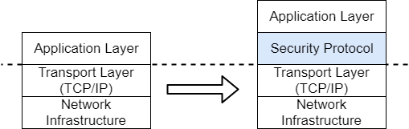

##  Feature Overview

Trusted channels are key components in the database security system, designed to establish secure and reliable transmission channels between clients and database servers, as well as between database nodes. Its main functions include:

- Data confidentiality protection: Encrypting transmitted data to prevent sensitive information from being stolen or leaked during transmission.

- Data integrity assurance: Using mechanisms such as Message Authentication Codes (MAC) to ensure data has not been tampered with or corrupted during transmission.

- Identity authenticity verification: Verifying the true identity of both communicating parties through digital certificates and PKI systems to prevent man-in-the-middle attacks.

- Anti-replay attack capability: Preventing attackers from replaying intercepted packets through sequence numbers and timestamp mechanisms.

In YashanDB, trusted channels adopt a layered security architecture, establishing a security protocol layer above the TCP/IP protocol to provide transparent security services for upper-layer applications.

When enabling trusted channel functionality, a complete identity authentication and trust chain must be established based on various certificates (public/private keys), and trust chain validity must be continuously maintained according to mechanisms such as expiration dates. During data communication, asymmetric encryption technology is used to complete identity authentication of both communicating parties and negotiate session keys, then the negotiated session keys are used to efficiently encrypt and transmit actual business data.

##  Supported Encryption Protocols

In YashanDB, trusted channels can currently be configured for communication between database clients and servers, primary-standby replication networks, and the internal interconnect bus (DIN) in integrated compute-storage distributed cluster deployments. The specific encryption protocols supported by each channel are shown in the table below.

| Channel      | Supported Protocols     |
|---------------------------|-----------|
| Database Client \<-> Server | * SSL   * TLCP  |
| Primary-Standby Replication Network | SSL |
| DIN  | SSL |

When configuring trusted channels between database servers and clients, appropriate encryption protocols can be selected based on actual requirements.

| Differences  | SSL    | TLCP      |
|--------------------|-------------------|-------------------|
| Standards | IETF international standards (RFC 5246/6176, etc.) | National Cryptography Administration standards (GMT 0024-2014) |
| Algorithm Suite | Supports multiple international standard cryptographic algorithms including RSA, ECC, AES, ChaCha20, with strong global compatibility | Fully based on national cryptographic algorithm standards such as SM2 public key encryption, SM3 hash algorithm, SM4 symmetric encryption, fully meeting domestic cryptographic compliance requirements |
| Certificate System | Single certificate system | Dual certificate system with separate signing and encryption certificates |
| Forward Secrecy | Supported (ECDHE, etc.) | Supported (SM2 key exchange) |

##  Trusted Channel Configuration Rules

- Trusted channels are turned off by default. To enable them, certificates must be configured simultaneously; otherwise, the database will fail to start.

- The storage path (absolute path) for certificate files on the database installation server must not exceed 254 bytes.

- If enabling database client \<-> server trusted channel:

    - Only one of SSL protocol or TLCP protocol can be selected, they cannot be mixed or coexist.

    - Trusted channels are not associated with user authentication; users still need to authenticate when logging into the database.

- If enabling DIN trusted channel:

    - Whether DIN trusted channel is enabled (DIN_SSL_ENABLE parameter) must be uniform across the entire cluster. It is not allowed to enable the corresponding function for only some nodes.

    - All distributed nodes' server certificates should be signed with the same root certificate; otherwise, an error will occur.