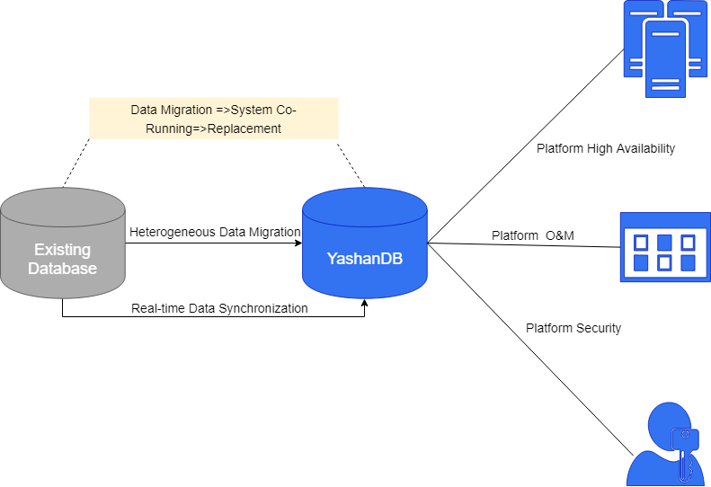

## Standby Database Data Synchronization

Standby database data synchronization, also known as replication, refers to the real-time copying of data from the primary database to the standby database, which is the main high-availability measure of the database.

The implementation process of replication involves the primary database sending redo logs to the standby database. The standby database processes and applies the redo logs accordingly, achieving online synchronization between the standby database and the primary database. According to the log application mechanism, replication is divided into physical replication and logical replication.

For detailed operations regarding primary/standby deployment and high availability maintenance, please refer to [High Availability](../../高可用/YashanDB高可用概述).

### Physical Replication

After the standby database receives the redo logs, it directly applies the redo logs to update the data pages of the standby database, making the data in the standby database completely consistent with that of the primary database. This method is called physical replication, and the standby database can be referred to as a physical standby database. A physical standby database is a physical copy of the primary database, and its disk database structure is identical to that of the primary database block by block, with the database architecture (including indexes) being exactly the same as that of the primary database.

The main process of physical replication between primary and standby databases is as follows:

1. Create the physical standby database. If the standby database is created later than the primary database (for example, in an expansion scenario), it must first be initialized based on the primary database data.

2. The logs from the primary database are sent to the standby database over the network.

3. The standby database applies the logs (enabled by default, no manual configuration required), achieving data synchronization with the primary database.

### Logical Replication

After the standby database receives the redo logs, it parses the redo logs into SQL statements, and then executes these SQL statements to maintain logical consistency between the standby database and the primary database. This method is called logical replication, and the standby database can be referred to as a logical standby database. The logical standby database contains the same logical information as the primary database, but its physical organization and structure may differ from that of the primary database.

The main process of logical replication between primary and standby databases is as follows:

1. Create the standby database (at this point, the standby database is in the physical standby state), and complete the necessary configuration to convert it to a logical standby database, such as adding STANDBY LOG files, stopping redo apply on the standby database, executing build operations, etc. For specific operations, please refer to [Configuring Logical Standby Database](../../高可用/逻辑备库/逻辑备库配置).

2. Enable logical apply on the logical standby database (default is disabled).

3. The logs from the primary database are sent to the standby database over the network.

4. The standby database parses the redo logs into SQL statements and then executes the parsed SQL statements.

## Heterogeneous Database Data Synchronization

YashanDB supports data change capture functionality. Through the logical log parsing interface YStream, data can be synchronized in real-time to other databases (which can be heterogeneous databases such as Oracle, MySQL, etc., or another set of YashanDB).

When switching the database currently in use, directly switching the application system's database may lead to data loss, misalignment, or abnormal situations such as the application system being unable to run. Therefore, it is generally adopted to run both the old and new systems simultaneously, as illustrated in the figure below:

During the simultaneous operation of the systems, real-time data synchronization between the old and new databases can be achieved through the data change capture functionality and logical log parsing interface provided by YashanDB.

The main process of heterogeneous database data synchronization is as follows:

1. Enable supplemental logging for the YashanDB database ([database-level supplemental logging](../../Development Guide/SQL Reference Manual/SQL Statements/ALTER DATABASE.html#supplementallogclauses) or [table-level supplemental logging](../../Development Guide/SQL Reference Manual/SQL Statements/ALTER TABLE.html#supplementaltablelogging)).

2. Create and start the YStream server for CDC parsing of the database supplemental logs. For specific operations, please refer to [DBMS_YSTREAM_ADM](../../Development Guide/PL Reference Manual/Built-in Advanced PL Packages/DBMS_YSTREAM_ADM).

3. Use the [YStream API](../../Development Guide/YStream Reference Manual/00YStream Reference Manual) to parse the redo logs and assemble them into SQL.

4. Execute the parsed SQL statements in another database to restore the relevant database operations, thereby achieving data synchronization.