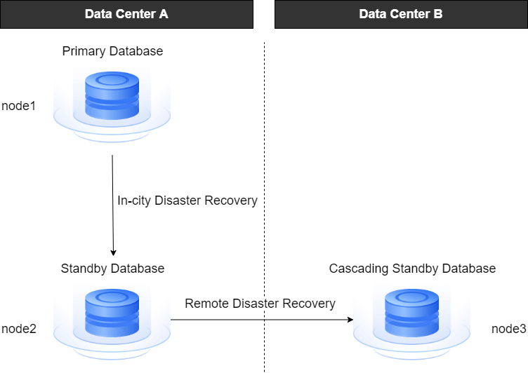

## Disaster Recovery Deployment Plan

### Primary/Standby Deployment

YashanDB supports a high-availability deployment architecture in primary/standby mode, allowing one-primary/one-standby or one-primary/multi-standby configurations.

**Standalone Primary/Standby High Availability Deployment**

The primary/standby database is deployed on different servers, with multiple servers typically connected to the same switch to ensure low network latency. Consideration should also be given to redundant configurations of the switch to avoid single points of failure and ensure high availability.

According to the different types of [ primary-standby replication ](Data Synchronization), the standby database can be further divided into physical standby databases and logical standby databases.

**Primary/Standby Cluster High Availability Deployment**

The primary database is extended to the concept of a primary cluster, where multiple instances in the primary cluster provide online database services concurrently, all in read-write mode.

The standby database is extended to the concept of a standby cluster, where instance 1 in each standby cluster is responsible for log reception and application.

**ISC Distributed High Availability Deployment**

In an ISC Distributed Cluster Deployment, CN nodes naturally allow for active-active deployments without the concept of primary/standby, where high availability deployments apply only to the MN and DN groups.

- CN Active-Active Deployment: Multiple CN nodes operate independently, supporting load balancing.

- MN Primary/Standby Deployment: One primary node + multiple standby nodes, can be configured for leader election (at least 1 primary and 2 standby to build a Raft cluster).

- DN Primary/Standby Deployment:

    - one-primary/one-standby: yasom election can be configured.

    - one-primary/multi-standby: leader election can be configured (at least 1 primary and 2 standby to build a Raft cluster).

### Cascade Standby Deployment

Cascade standby, which refers to the standby database of a standby database, is an asynchronous standby database. It receives logs from its parent standby database and applies them, which can reduce the bandwidth load on the primary database and is typically used in remote disaster recovery scenarios.

A standby database can connect to up to 32 cascade standbys, and cascade standbys can further connect to additional cascade standbys, with no limit on the number of layers; however, circular connections are not allowed.

When the upper standby database is promoted to a primary database, the cascade standby is converted to a regular standby database; when the primary database becomes a standby database, its standby database becomes a cascade standby.

There are no cascade standbys in YAC Deployment and ISC Distributed Cluster Deployment.

### Dual Replication Group Primary/Standby Deployment

In the dual replication group primary/standby deployment of Standalone Deployment, there are primary replication groups and standby replication groups, each of which can be deployed in different regions/data centers, thus forming a remote disaster recovery architecture.

The primary replication group can further establish node-level primary/standby relationships, while in the standby replication group, the first node is by default a standby database, and the remaining nodes are all cascade standbys.

Only nodes in the primary replication group participate in the leader election or yasom election processes, and an appropriate leader election mechanism should be selected based on the number of nodes in the primary replication group.

## Primary/Standby Switching

Primary/standby switching refers to the process of switching roles between the primary and standby databases, where the primary database is demoted to a standby database, and the standby database is promoted to a primary database. YashanDB supports manual switching of the primary and standby databases and leader election that does not require external intervention in specific scenarios.

### Manual Switching

This is generally divided into switchover and failover.

- Switchover refers to a planned switch. In scenarios where the primary/standby databases are synchronized properly, the roles of primary and standby are exchanged. This is typically applied during database maintenance processes, such as rolling upgrades or server maintenance.

- Failover refers to a fault switch. In cases where the primary database is damaged or unavailable due to system issues, a standby database is selected to become the new primary database, in order to restore service. This is used for quickly restoring services after the primary database failure.

### Leader Election

Based on different deployment forms, YashanDB implements various mechanisms for leader election, including primary/standby leader election and yasom election, to reduce operational complexity. When the primary database encounters an issue and cannot serve external requests, the system selects a new primary database among the standby databases based on the corresponding mechanism and automatically executes the primary/standby switching.

- Leader election: In a standalone one-primary/multi-standby (non-cascade standby) or distributed cluster node group one-primary/multi-standby deployment, when the primary database node encounters an issue and cannot serve external requests, the system uses the election algorithm from the Raft consistency algorithm to elect one node among multiple standby database nodes to be promoted to the primary database, while the remaining nodes continue as standby databases. The old primary database is demoted to a standby database.

- Yasom election: In a standalone one-primary/one-standby or distributed cluster node group one-primary/one-standby deployment, when the primary database encounters an issue and cannot serve external requests, the system arbitrates through yasom to promote the standby database to be the primary database, and demotes the original primary database to standby database.