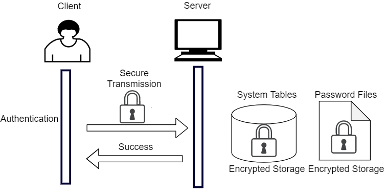

YashanDB stores user passwords in an encrypted manner, adding salt to the stored passwords to effectively prevent rainbow table attacks. During the authentication process, the user-input password is transmitted in an encrypted format to ensure the security of the password during storage and transmission.

The server calculates the password hash and compares it with the stored password to verify its correctness. YashanDB implements password authentication by combining password files and system tables, and supports password authentication in various states of the database.



Although YashanDB supports multiple authentication methods, for the vast majority of users, password authentication is the only method for logging into the database. Properly safeguarding one's password ensures the security of the database. Meanwhile, YashanDB also supports the establishment of password policies to strengthen user management of passwords.

Users must keep and safeguard their passwords. To ensure system security, users must securely manage their passwords, usually by adhering to the following practices:

- Do not share passwords with others to prevent data leakage or identity theft for executing database operations.

- When logging into the database via command line, use the input prompt functionality provided by YashanDB, rather than explicitly entering the password in the command line to prevent eavesdropping and theft.

    For example:

    ```shell
    -- shell command
    $ yasql sales@192.168.1.2:1688
    YashanDB SQL Enterprise Edition Release {version_number} x86_64
    please input password: 

    -- SQL command
    SQL> conn sales
    please input password: 
    ```

- When initiating database login requests within applications, do not record plain text passwords directly in the code. A designated individual can safeguard the password, allowing other developers to use it through configuration without being aware of the password content, or encrypt the password before it is provided to developers for use.