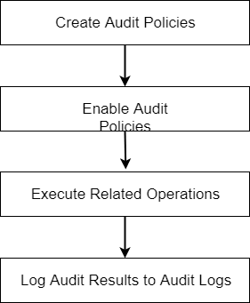

YashanDB database supports unified auditing, which can record every user operation for later review of issues.

Unified auditing primarily utilizes policies and conditions to selectively execute effective audits within the database. It consolidates existing audit trails into a single audit trail, thereby simplifying management and enhancing the security of the audit data generated by the database.

The unified auditing operation process is as follows:



## Audit Item Classification

YashanDB syntax supports privilege auditing, behavior auditing, and role auditing, logically including system-level, statement-level, and object-level auditing, supporting auditing for specified users or all users.

-  Privilege Auditing: When an auditing policy is enabled for a certain system privilege, any use of that system privilege in SQL statements or other operations will be audited. The [DBA_SYS_PRIVS](../../Reference Manual/System Views/DBA Views/DBA_SYS_PRIVS) view can be used to query the authorization records of system privileges.

- Role Auditing: When an auditing policy is enabled for a certain role, all system privileges directly granted to that role will be audited. The [DBA_ROLE_PRIVS](../../Reference Manual/System Views/DBA Views/DBA_ROLE_PRIVS) view can be used to query the authorization records of system privileges.

- Behavior Auditing: This includes system operation behavior auditing and object operation behavior auditing.

    - System Operation Behavior Auditing: This refers to auditing system operations such as creating/deleting objects, opening/closing databases, committing/rolling back, etc. The AUDITABLE_SYSTEM_ACTIONS view shows all system operation behaviors that can be audited, where ALL indicates auditing for all system operation behaviors.

    - Object Operation Behavior Auditing: This refers to auditing operation behaviors on specific existing objects, such as SELECT/INSERT/UPDATE/DELETE operations on a table. The AUDITABLE_OBJECT_ACTIONS view shows all object operation behaviors that can be audited, where ALL indicates auditing for all operations on an object.

Audit records are stored in physical tables, and users with AUDIT_ADMIN or AUDIT_VIEWER role privileges can view audit log information through the audit view UNIFIED_AUDIT_TRAIL.

## Enabling Audit Functionality

This functionality is controlled by the value of the UNIFIED_AUDITING parameter. After installation, YashanDB defaults UNIFIED_AUDITING = FALSE, which means auditing functionality is turned off, and no auditing will take place in this state.

> **Note**: 
>
>  Standby databases will never perform auditing regardless of the UNIFIED_AUDITING parameter value.

1. Log in to the database with a user having ALTER SYSTEM privilege.

2. Execute the ALTER SYSTEM SET PARAMETER statement to modify the UNIFIED_AUDITING parameter value.

    ```sql
    ALTER SYSTEM SET UNIFIED_AUDITING=TRUE;

    -- For ISC Distributed Cluster Deployment, TYPE must also be specified, with values CN|DN|MN|ALL
    ALTER SYSTEM SET UNIFIED_AUDITING=TRUE TYPE=ALL;
    ```
    After the audit functionality is enabled, the system will execute the enabled [audit policies](Audit Policy Management).

## Asynchronous Auditing

To reduce the impact of auditing on database performance, YashanDB supports writing audit records in an asynchronous manner. This functionality is controlled by the AUDIT_QUEUE_WRITE parameter, with the default UNIFIED_AUDITING = TRUE, which means asynchronous auditing is enabled.

Asynchronous auditing writes audit data information to the audit data queue first. When the audit data queue reaches a threshold (data refresh time interval, data queue full), the data is then batch inserted into the audit record table. The threshold can be adjusted via AUDIT_FLUSH_INTERVAL and AUDIT_QUEUE_SIZE.

Asynchronous auditing can reduce the impact on database performance, but in some exceptional cases (such as abnormal database crashes), it may lead to the loss of some audit data.