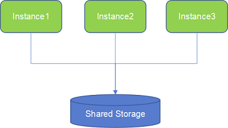
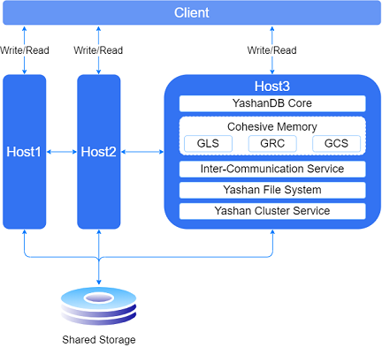

When installing the YashanDB product, selecting the YAC Deployment mode will set up a single database multi-instance cluster for the user, as follows:

YAC Deployment relies on shared storage (Shared Storage, typically a disk array) at the hardware level.

Each instance (instance1, instance2, ...) runs on different servers, with each server connected to shared storage via fiber or network.

There is only one persistent file for a database stored on shared storage, which can be read and written by all instances. All instances form a peer-to-peer cluster, and any instance can read and write all data.

## Overview of Functionality Modules

The following diagram illustrates the main functionality modules on a server within YAC Deployment:

The YashanDB YAC is derived from the logical evolution of the YashanDB database kernel and introduces the Cohesive Memory core technology based on shared storage, which facilitates coordinated read and write access to data pages and concurrent control of various non-data resources among cluster database instances. Among them, GRC (Global Resource Catalog) is responsible for global resource management, GCS (Global Cache Service) manages global data pages, and GLS (Global Lock Service) oversees global lock management.

The Internal Communication Service (ICS, Inter-Communication Service) is used to establish a connection pool between instances and enable mutual communication.

The Yashan File System (YFS) takes on the responsibilities of the cluster file system, directly managing raw devices and providing a strongly consistent file system service for database use.

The Yashan Cluster Service (YCS) is the core component for high availability of the cluster database, managing resources such as the Yashan File System and databases, including configuration, start/stop, monitoring, and providing arbitration services in various fault scenarios to maintain a globally unified topology state.

**High Availability of Cluster Database**

The YashanDB YAC provides cluster-level high availability capabilities.

For the server side, if any server in the cluster encounters an exception, such as server downtime or network issues, the system will automatically handle the fault and recover without the need for operational intervention; for the client side, through TAF technology, connections can automatically switch to a live cluster instance when a fault occurs.

This technology ensures that online instance services remain uninterrupted during the entire cluster fault recovery process, and the business remains unaware of any issues.