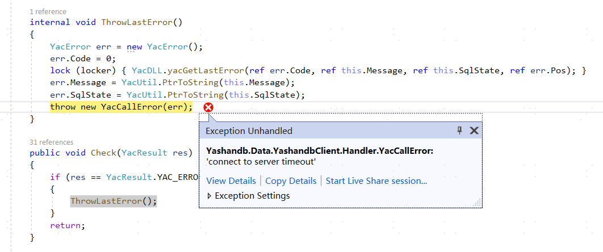

## Connect to Database

Establish a database connection using the YasdbConnection class provided by Yashandb.Data.YashandbClient:

```c#
var connection = new YasdbConnection("Data Source=192.168.31.139:1688;User ID=sys;Password=yasdb_123");
connection.Open();
```

**Connection String Explanation**

|Parameter |Description |
| ----------- | ------------------------------------------------------------ |
| Data Source  | Database connection descriptor. The format is as follows: host:port <br>\* host: Server domain name or IP address, configured to the address of a standalone instance server or distributed CN server; <br>\* port: Database server port, such as 1688. |
| User ID      | Database username.                                          |
| Password     | Database user password.                                    |

***Example***

```c#
using System;
using System.Data;
using System.Data.Common;
using Yashandb.Data.YashandbClient;

namespace Examples
{
    public class Program
    {
        public static void Main(string[] args)
        {
            var connection = new YasdbConnection("Data Source=192.168.31.139:1688;User ID=sys;Password=yasdb_123");
            connection.Open();
            
            // do something...

            connection.Dispose();
    
            Console.WriteLine("Done.");
            Console.ReadKey();
        }
    }
}
```

## Execute SQL

The application operates on database data by executing SQL statements, calling the CreateCommand method of YasdbConnection to create the statement object.

```c#
 var command = (YasdbCommand)connection.CreateCommand();
```

### Execute Normal SQL

Call the ExecuteNonQuery method of YasdbCommand to execute the SQL statement.

```c#
command.CommandText = "drop table if exists example_table";
command.ExecuteNonQuery();
command.CommandText = $"create table example_table(a int, b varchar(32))";
command.ExecuteNonQuery();
```

### Execute Parameterized SQL

Invoke the Parameters.Add method of YasdbCommand for parameter binding.

```c#
command.CommandText = "insert into example_table values(?, ?)";
command.Parameters.Add(1);
command.Parameters.Add("test1");
command.ExecuteNonQuery();

command.CommandText = "insert into example_table values(@a, @b)";
command.Parameters.Add("@a", 2);
command.Parameters.Add("@b", "test2");
command.ExecuteNonQuery();
```

### Retrieve Result Set

Call the ExecuteReader method of YasdbCommand to execute the SQL statement, returning a YasdbDataReader object, from which rows can be retrieved using the YasdbDataReader.Read method.

```c#
command.CommandText = "select a, b from example_table";
var reader = command.ExecuteReader();
```

### Locate in Result Set

You can search the retrieved result set using the YasdbDataReader class provided by Yashandb.Data.YashandbClient. For optimal performance, this class provides methods to access its native data types (GetDateTime, GetDouble, GetGuid, GetInt32, etc.).

The YasdbDataReader object has a cursor pointing to its current data row. Initially, the cursor is positioned before the first row. Executing the Read method will return one row of data and move the cursor to the next row; if the Read method does not fetch a row of data, it will return false. Therefore, this method can be used in a while loop to iterate through the result set.

```c#
while (reader.Read()) 
{
    Console.WriteLine(reader.GetInt64(0));
    Console.WriteLine(reader.GetString(1));
}
reader.Close();
```

### Close Command

```c#
command.Dispose();
```

### Exception Situations

- **connect to server timeout**
  When running the application project in Visual Studio, if the data connection descriptor is entered correctly and if the following situation occurs, it may be due to the server firewall being enabled.

  

  This can be resolved by opening the corresponding port on the server side.

## Batch Execute SQL

The YashanDB ADO.NET driver supports batch INSERT/UPDATE/DELETE operations through Array Binding technology, requiring only one network round trip and one SQL compilation to complete batch operations, significantly improving performance.

### Constraints

- Batch mode is enabled only when ArrayBindCount is greater than 1; when ArrayBindCount is 1, it executes in normal mode.
- All array parameters must have the same length and match the ArrayBindCount.
- Batch operations are not supported for LOB types (BLOB/CLOB/NCLOB).

### Usage

Enable batch execution mode by setting the ArrayBindCount property of YasdbCommand to specify the batch size and setting parameter values to arrays.

**Batch INSERT**

```c#
var cmd = conn.CreateCommand();
cmd.CommandText = "INSERT INTO employees (employee_id, first_name, salary) VALUES (:id, :name, :salary)";
cmd.ArrayBindCount = 1000;

var ids = Enumerable.Range(1, 1000).Select(i => (int)i).ToArray();
var names = Enumerable.Range(1, 1000).Select(i => $"Employee_{i}").ToArray();
var salaries = Enumerable.Range(1, 1000).Select(i => (decimal)(5000 + i * 10)).ToArray();

cmd.Parameters.Add(":id", ids);
cmd.Parameters.Add(":name", names);
cmd.Parameters.Add(":salary", salaries);

int affectedRows = cmd.ExecuteNonQuery();
Console.WriteLine($"Inserted {affectedRows} rows");
```

**Batch UPDATE**

```c#
var cmd = conn.CreateCommand();
cmd.CommandText = "UPDATE employees SET salary = :new_salary WHERE employee_id = :id";
cmd.ArrayBindCount = 3;

var newSalaries = new decimal[] { 6000, 7000, 8000 };
var employeeIds = new int[] { 1, 2, 3 };

cmd.Parameters.Add(":new_salary", newSalaries);
cmd.Parameters.Add(":id", employeeIds);

int affected = cmd.ExecuteNonQuery();
```

**Batch DELETE**

```c#
var cmd = conn.CreateCommand();
cmd.CommandText = "DELETE FROM employees WHERE employee_id = :id";
cmd.ArrayBindCount = 3;

var idsToDelete = new int[] { 1001, 1002, 1003 };
cmd.Parameters.Add(":id", idsToDelete);

int affected = cmd.ExecuteNonQuery();
```