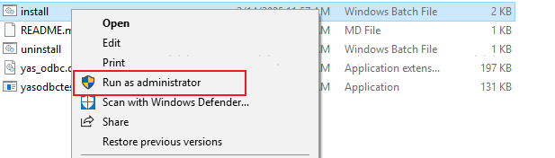
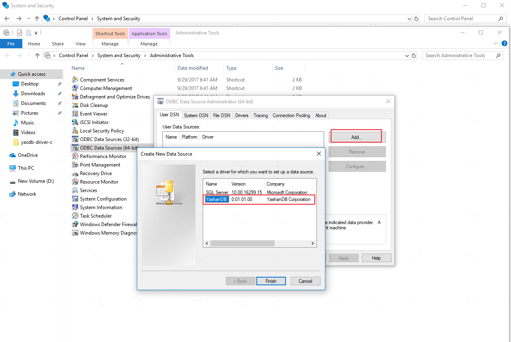
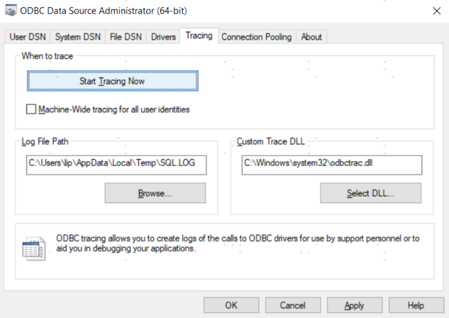

This article takes Windows 10 Professional as an example to introduce the installation and configuration process of the YashanDB ODBC driver in this environment.

> **Note**:
> 
> The YashanDB ODBC driver relies on the C basic development library, so the application side also needs to install C compilation tools, such as gcc, Visual Studio, etc.

## Step 1: Install YashanDB C Driver

Using YashanDB ODBC driver requires first installing YashanDB C driver and setting environment variables. The YashanDB C driver installation files are integrated in the YashanDB client installation package, and the corresponding client installation package needs to be obtained during installation.


### Step 1. 1: Download the C Driver Installation Package

1. From the [YashanDB Official Website Download Center](https://download.yashandb.com/download), or contact our technical support to obtain the corresponding software package. 

2. Download and extract the YashanDB client installation package to a local path, such as D:\yasdb-driver-c\.

   After extraction, the following folders can be found:

### Step 1. 1: Download the C Driver Installation Package


1. From the [YashanDB Official Website Download Center](https://download.yashandb.com/download), or contact our technical support to obtain the corresponding software package. 

2. Download and extract the YashanDB client installation package to a local path, for example, /home/yasdb-driver-c/.

   After extracting the installation package, the files required for the C driver can be obtained:

   * Header files for C driver: Located in the include folder.

   * Library files for C driver: Located in the lib folder.


### Step 1. 2: Set Environment Variables


Set the folder containing the C driver's library files to the Windows environment variable PATH. The specific operations are:

1. Right-click the "This PC" icon on the desktop and select [Properties].

2. Click on [Advanced system settings].

3. Click on [Environment Variables].

4. In the [System variables] area, select the [Path] item and click the [Edit] button below.

5. Click [New] and enter the folder where the C driver's library files are located, for example, `D:\yasdb-driver-c\lib`.

6. Click [OK] to save the configuration.


## Step 2: Install YashanDB ODBC Driver

1. From the [YashanDB Official Website Download Center](https://download.yashandb.com/download), or contact our technical support to obtain the corresponding software package. 

2. Download the ODBC driver installation package and unzip it to a local path, for example, `D:\yasdb-driver-odbc`.

3. Ensure that install.bat, uninstall.bat, and yas_odbc.dll are in the same path.

   ```bash
   D:\yasdb-driver-odbc>dir
   2022/11/10  10:18    <DIR>          .
   2022/11/10  10:18    <DIR>          ..
   2022/11/09  05:43             1,041 install.bat
   2022/11/09  05:43               183 README.md
   2022/11/09  05:43               181 uninstall.bat
   2022/11/09  05:43            41,984 yasodbctest.exe
   2022/11/09  05:43           144,896 yas_odbc.dll
   ```

4. Run install.bat; this operation must be run as an administrator, as follows:

   

5. Upon successful completion, press any key to exit the installation.

## Step 3 (Optional): Check Dependencies (32-bit)

This operation is necessary only when installing the 32-bit driver.


1. Check if **32-bit** versions of ucrtbased.dll and vcruntime140d.dll are included in the `C:\Windows\SysWOW64` folder.
   
   - If not, you need to first obtain the ucrtbased.dll and vcruntime140d.dll files and save them to the `C:\Windows\SysWOW64` folder, for example, by installing Visual Studio or other methods.

   - If yes, you can directly execute subsequent operations.


<span id="datasource" name="datasource"></span>

## Step 4: Configure Data Source

Use the built-in ODBC Data Source Administrator in Windows to configure the YashanDB ODBC data source.

1. Access the ODBC Data Source Administrator and add a user data source.

   - 64-bit: [Control Panel > System and Security > Administrative Tools > ODBC Data Source Administrator (64-bit)], taking 64-bit as an example.

   - 32-bit: [Control Panel > System and Security > Administrative Tools > ODBC Data Source Administrator (32-bit)]
   
   

   The YashanDB option will only appear after the YashanDB ODBC driver is successfully installed.

2. Fill in the data source information.

   

   Parameters Explanation:

   - Data Source Name: The name of the ODBC data source, which uniquely identifies a data source (required).
   
   - Description: Data source description, equivalent to a comment (optional).
   
   - Server: The connection IP address of the data source, i.e., the server IP address (optional).
   
   - Port: The data source port, i.e., the currently listening IP port of the server (optional).
   
   - Url: The complete URL of the data source (optional, After configuring the URL parameter, the Server and Port parameters will no longer be effective). URL format is as follows:

      * Single IP: `host:port[/pdb_name]`.

      * Multiple IPs: `serverType:host:port,host:port,host:port,host:port[/pdb_name]`, multiple addresses are separated by `,`, connections will poll to corresponding nodes based on serverType configuration.

      * Multiple IP groups: `serverType:host:port,host:port;host:port,host:port[/pdb_name]`, multiple IP groups are separated by `;`, when connecting, it will first poll the corresponding nodes within the group according to the serverType configuration. If all connections within the group fail, it will access the next group in order of priority (the higher the position, the higher the priority).

   - Url: The complete URL of the data source (optional, After configuring the URL parameter, the Server and Port parameters will no longer be effective). URL format is as follows:

      * Single address connection: `host:port[/pdb_name]`.

      * Multiple addresses connection: `serverType:host:port,host:port,host:port,host:port[/pdb_name]`, multiple addresses are separated by `,`, and the connection is made to the corresponding node based on the serverType configuration during connection.

      * Multiple address groups connection: `serverType:host:port,host:port;host:port,host:port[/pdb_name]`, multiple groups of addresses are separated by `;` and multiple addresses within the same group are separated by `,`. During connection, the connection is first made to the corresponding node within the group based on the serverType configuration. When all connections within the group fail, the next group is accessed in order of priority (the earlier, the higher priority).

      Parameter meanings:

      * host: The network address of the server where the database resides, which can be an IPv4 address, an IPv6 address, or a domain name. In YAC deployment, if [SCAN](../../../../Database Administration/Cluster Management/SCAN Management) or [VIP](../../../../Database Administration/Cluster Management/VIP Management) has been configured, it can also be the corresponding domain name or IP address.

      * port: The listening port of the YashanDB server. If not adjusted during installation, the default is 1688. 
      
      * pdb_name: Only applicable to CDBs. Specifies connecting to a specific PDB. If omitted, defaults to connecting to the CDB root.

      * serverType: The connection type for multi-address connection. Optional values include primary, standby, loadBalance, primaryLoadBalance, and standbyLoadBalance. If serverType is not specified, primary is used by default when multiple IPs are entered. The detailed introduction of each type is as follows:

    |serverType |Description |
    |--------------------|---------------|
    | primary | This is the default type and can be omitted.<br />The driver will connect to the nodes in the order of the specified listening addresses, determine the node roles by executing `SELECT * FROM DATABASE_ROLE`, and retain the connection established with the primary node for the first time. |
    | standby | The driver will connect to the nodes in the order of the specified listening addresses, determine the node roles by executing `SELECT * FROM DATABASE_ROLE`, and retain the connection established with the standby node for the first time.  |
    | loadBalance | The driver will randomly shuffle the specified listening addresses and then establish connections. It will obtain the current session count for each node and the node with the minimum session count as the target node (if there are multiple nodes with the same minimum count, the first node to establish connection is selected). It will retain the connection to the target node and close the other connections.  |
    | primaryLoadBalance | The driver randomly shuffles the specified listening addresses and then attempts connections. It will obtain the current session count and role of each node and select the node with the minimum session count among primary nodes as the target node (if there are multiple nodes with the same  minimum count, the first node to establish connection is selected). It will retain the connection to the target node and close the other connections.  |
    | standbyLoadBalance | The driver randomly shuffles the specified listening addresses and then attempts connections. It will obtain the current session count and role of each node and select the node with the minimum session count among standby nodes as the target node (if there are multiple nodes with the same  minimum count, the first node to establish connection is selected). It will retain the connection to the target node and close the other connections.  |


3. Click [OK] to save the data source information. If modifications are needed later, click [Configure] to modify the current data source information.

4. Click [Test Connection], and if the connection is normal, the installation is complete.

   The user can now start using the YashanDB ODBC driver to develop their own client program.

## Step 5: Check Log Status

> **caution**:
>
> During tracing, logs continuously expand and degrade performance of all ODBC applications. Global tracing should only be enabled during temporary troubleshooting and **must be disabled** at all other times.

1. Access the ODBC Data Source Administrator and switch to the [Tracing] tab.

   - 64-bit: [Control Panel > System and Security > Administrative Tools > ODBC Data Source Administrator (64-bit)]
   - 32-bit: [Control Panel > System and Security > Administrative Tools > ODBC Data Source Administrator (32-bit)]

2. Confirm that the [Start Tracing Now] button is clickable (i.e., tracing is currently disabled). If the button shows [Stop Tracing Now] (indicating tracing is active), click [Stop Tracing Now] to disable it.

  
