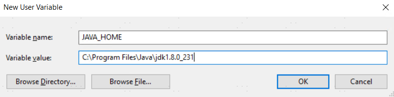
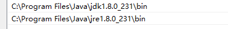
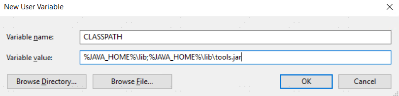

## JVM Environment Installation

To connect to YashanDB using the JDBC driver, you need to install the JDK first. The compatibility information for the YashanDB JDBC driver with JDK versions is as follows:

- JDK: 1.8 and above
- JRE: 1.8 and above

> **Note**:
>
> The YashanDB JDBC driver primarily supports JDK1.8 and above versions. For convenience, a compatible driver package yasdb-jdbc-*version*-jre6.jar is also provided for users using JDK1.6 and JDK1.7, but this installation package can only be [installed offline](#offline).

After successfully downloading and installing the aforementioned JDK version through the official Java path, you also need to configure the following environment variables (using Windows 10 as an example):

-  **JAVA_HOME**: Path to the JDK directory, e.g., C:\Program Files\Java\jdk1.8.0_231

  

- **PATH**: Add %JAVA_HOME%\bin and %JAVA_HOME%\jre\bin separately

  

- **CLASSPATH**: .;%JAVA_HOME%\lib;%JAVA_HOME%\lib\tools.jar

  

After the configuration, verify whether the Java environment is working properly by running java -version:

```shell
>java -version
java version "1.8.0_231"
Java(TM) SE Runtime Environment (build 1.8.0_231-b11)
Java HotSpot(TM) 64-Bit Server VM (build 25.231-b11, mixed mode)
```

## Install YashanDB JDBC Driver
### Method 1: Install YashanDB JDBC Driver via Maven

Configure the yashandb-jdbc library using the Maven manager in your project.

The yashandb-jdbc is already published on [The Maven](https://central.sonatype.com/search?q=yashandb-jdbc&smo=true) and has the following Group ID and artifactId:

- Group ID: com.yashandb
- artifactId: yashandb-jdbc

::: tabs

== Add the dependencies to the pom.xml file:

```xml
<dependency>
    <groupId>com.yashandb</groupId>
    <artifactId>yashandb-jdbc</artifactId>
    <version>x.y.z</version>
</dependency>
```
== Add the dependencies to the build.gradle file:

```groovy
dependencies {
    implementation 'com.yashandb:yashandb-jdbc:x.y.z'
}
```

:::

> **Note**:
>
> x.y.z represents the available jdbc version number, e.g., 1.9.27.


### Method 2: Install YashanDB JDBC Driver via Gradle

Configure the yashandb-jdbc library using the Gradle manager in your project.

The yashandb-jdbc is already published on [The Maven](https://central.sonatype.com/search?q=yashandb-jdbc&smo=true) and has the following Group ID and artifactId:

- Group ID: com.yashandb
- artifactId: yashandb-jdbc

Add the following dependencies to the build.gradle file in your project:

```groovy
dependencies {
    implementation 'com.yashandb:yashandb-jdbc:x.y.z'
}
```

> **Note**:
>
> x.y.z represents the available jdbc version number, e.g., 1.6.1.

<span id="offline" name="offline"></span>

### Method 3: Offline Installation of YashanDB JDBC Driver

1. Download the latest JDBC installation package from the [YashanDB Official Website Download Center](https://download.yashandb.com/download), or contact our technical support to obtain the corresponding software package.

2. Download the jar file to a local path, e.g., /path/yasdb-jdbc-{version_number}.jar.

3. Add the YashanDB JDBC driver to the JDK environment:

    - **For Java applications running from the command line** (using Linux as an example)

    ```shell
    # Pre-adding method
    export CLASSPATH=/path/yasdb-jdbc-{version_number}.jar:${CLASSPATH}

    # Compile Java source file (assuming the source file is named HelloWorld.java)
    javac HelloWorld.java

    # Adding at JVM runtime, Jdbcexample is the application name
    java -cp .:/path/yasdb-jdbc-{version_number}.jar Jdbcexample
    ```

    - **For Java applications running in an IDE**

      Each IDE product will provide an interface for configuring external libraries.  For example, in IDEA, select [Project Settings > Libraries] from the menu, and follow the prompts to add the YashanDB JDBC driver JAR file to the project.

4. Load the YashanDB JDBC driver in your Java application; the driver name is com.yashandb.jdbc.Driver:

    ```shell
    # Method 1: Implicitly load anywhere before creating a connection in the code
    Class.forName("com.yashandb.jdbc.Driver");

    # Method 2: Pass the parameter at JVM startup, Jdbcexample is the application name
    java -Djdbc.drivers=com.yashandb.jdbc.Driver Jdbcexample
    ```

  After loading is completed, you can start connecting to and operating the database using the YashanDB JDBC driver.