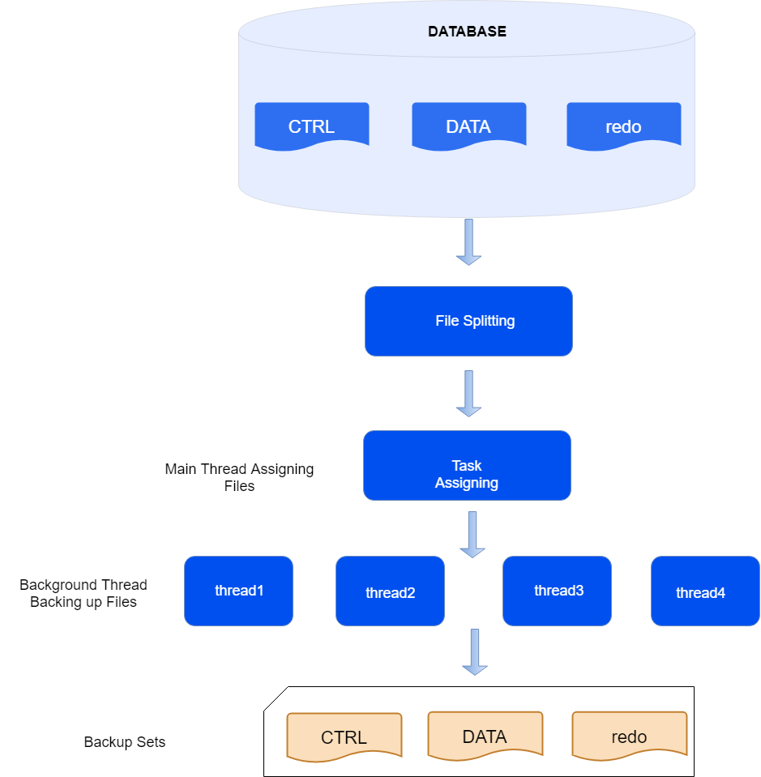
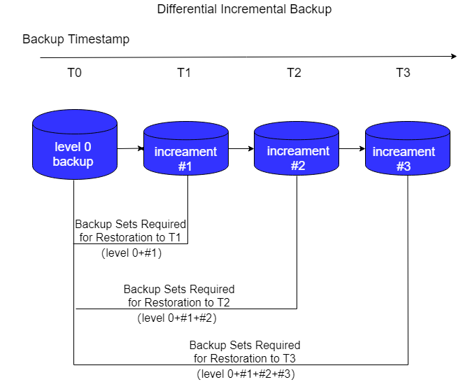
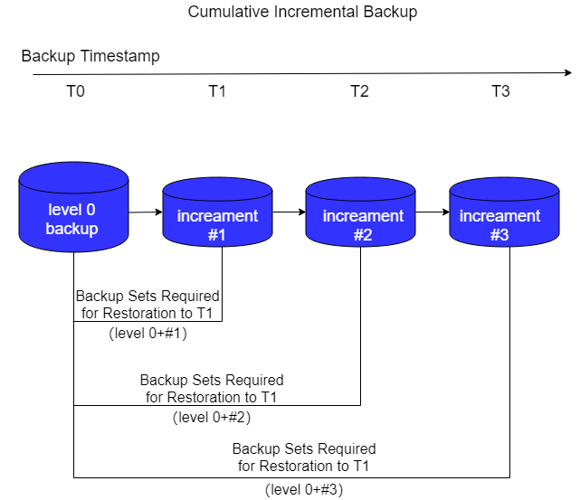
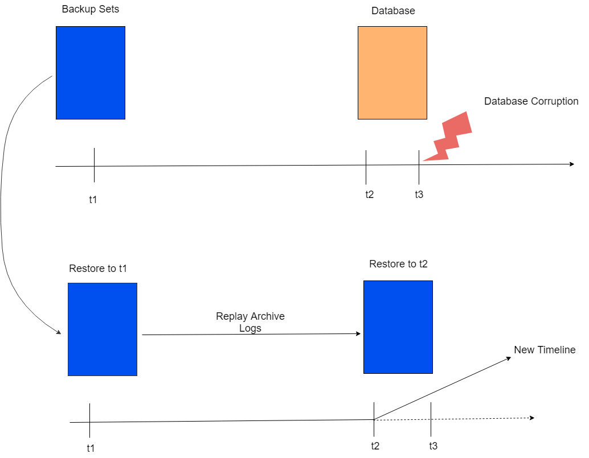

Backup and recovery is a common recovery measure after database corruption. Regularly backing up the database allows for the appropriate backup set to be used to restore the database when a fault causes data corruption, thereby minimizing losses.

Database backups are divided into physical backups and logical backups. Physical backups (the backups mentioned in this document are all physical backups) directly copy the physical files of the database as duplicates, while logical backups export database objects in a logical format (e.g., SQL) to files.

## Backup Set

A backup set refers to a collection of files generated after performing backup operations on the database. When the backup medium is disk, it exists in the form of folders, and users can customize the backup set name and path. A backup set must include a backup_profile file (records the metadata of the backup set), a backup_filelist file (list of backup file names), and the backup files of the target files (e.g., control files, data files, redo files, slice files, etc.).

During the process of generating backup files from the target files, operations such as slicing, compression, and encryption may take place, so the size and number of backup files may not equal that of the target files.

The contents of a backup set include the following:

- ctrl*.bak files: Backup of the database control files.

- data*.bak files: Backup of all data files in the database.

- arch*.bak files: Collection of backups for the database archive log files.

- redo*.bak files: Backup collection of the database redo files, generally included in the backup set generated during standby database backups.

- bucket*.bak files: Collection of backups for slice files.

- backup_profile file: Metadata information of the backup set.

- backup_filelist file: Checksum information of all files in the current backup set.

## Backup Granularity

### Full Database Backup

A full database backup refers to a copy of all data files in the entire database (including control files, data files, archive files, etc.).

Using the full database backup command will copy all database files to a specified location, generating an independent full database backup set. This backup set represents a full database backup.

Using a full database backup set can restore the database to a brand new state that is entirely consistent with the original database data.

During the backup process, the main thread will slice the data file and allocate it to different sub-threads, which will copy the file slices as backup files.

Full database backup of a ISC distributed database requires backing up the primary databases of MN, all CNs, and all DN groups. The backup is divided into two stages: the first stage involves backing up control files and data files at all target nodes. In the second stage, a consistent redo log point is obtained on all target nodes, and then the archive log files prior to the consistent redo log point are backed up. When restoring a distributed backup set, all nodes only apply redo to the consistency point recorded at the time of backup, ensuring the consistency of distributed transactions after restoration.

### Archive Backup

Archive backup refers to the backup operation performed on the currently existing archive files of the target database, with the user specifying the backup range of archive log files (can specify SEQUENCE, SCN, TIME, or ALL range mode), copying the specified range of archive files to the target location, existing in a set format.

In an archive backup set, the archive log files included are continuous across each instance, and there will be no gaps.

Archive backup sets can be used for PITR.

## Backup Methods

### Full Backup

Full backup refers to completely copying the files of the backup target. The backup set generated from a full backup contains a complete set of data files and can stand alone for recovery.

When specifying a full database backup during a full backup, it means that all database files are completely copied to generate a full database backup set.

### Incremental Backup

Incremental backup refers to backing up only the modified data pages that occurred after a specific backup. Incremental backups can reduce the space occupied by the backup set, but the incremental backup set cannot stand alone for recovery; it needs to first restore its dependent baseline backup set. The baseline backup set refers to a certain historical incremental backup set used as a baseline during the incremental backup.

Incremental backup sets are divided into the following two levels:

- LEVEL 0: The first incremental backup must be LEVEL 0. Its incremental backup set content is the same as the full backup set; it is a complete backup of the data files, occupying larger space.

- LEVEL 1: Its incremental backup set only backs up the modified data pages since the baseline backup set and occupies less space.

Incremental backups are further divided based on the selection method of the baseline backup set into differential incremental backups and cumulative incremental backups.

- **Differential Incremental Backup**

    Differential incremental backup uses the most recent LEVEL 0 or LEVEL 1 incremental backup set as the baseline. The data pages in each differential incremental backup set do not repeat, resulting in a small backup set size.
    
    When restoring the backup set, it is necessary to restore all dependent incremental backup sets in sequence, which can take a longer time.

    

- **Cumulative Incremental Backup**

    Cumulative incremental backup uses the most recent LEVEL 0 incremental backup set as the baseline. The next cumulative incremental backup will include all data pages from the previous cumulative incremental backup, so the space occupied by cumulative incremental backups will increase with more backup iterations.
    
    When restoring the backup set, it is only necessary to restore the incremental backup set corresponding to LEVEL 0 first, along with the current latest cumulative incremental backup set.

    

## Backup Destination

### Local Backup

Local backup refers to storing the backup set on the local disk of the executing instance server or on shared storage accessible by the executing instance.

### Streaming Backup

Streaming backup (also known as remote backup) refers to transmitting the backup data to a remote server over the network, where the backup set is stored.

Streaming backup requires using the *yasrman* tool, and the backup set will be saved on the server where the *yasrman* tool is located. Additionally, *yasrman* supports streaming backups based on the XBSA protocol.

## Recovery

### Complete Recovery

Backup files from the full database backup set are decompressed and decrypted to the database directory, and then the archive log files in the backup set are applied to restore the database to a consistent state, which can completely restore the database to the backup moment.

For full backup sets, all files, including control files, data files, and archive log files, are restored directly from the backup set.

For incremental backup sets, the data files from the LEVEL 0 backup set are first restored, and then the pages from subsequent LEVEL 1 backup sets are sequentially used to overwrite the database pages. Finally, the archive log files from the current incremental backup set are applied to maintain the database in a consistent state.

### Archive Recovery

Files from the archive backup set are restored to the database's archive directory and registered in the database, provided the database has been restored from the full database backup set. Archive recovery is then used to supplement the archive log files not included in the full backup set, allowing the database to recover more data.

### PITR (Point-in-Time Recovery)

The backup set can only restore the database to the backup time point. If archive log files exist after the backup time point (or have been backed up), it is possible to apply these archive files to restore the database to any time point, which is referred to as PITR (Point-in-Time Recovery).

PITR allows the database to be restored to any time between the backup time point and the latest time, which can be used to roll back erroneous operations or repair damaged databases.

As illustrated, a full database or incremental backup is executed at time t1. If a database corruption occurs after running the database until time t3, PITR can apply archive log files to restore the database to time t2 with the backup set from time t1 and the archive files between time t1 and t2, thereby repairing the anomalous damage to the database.