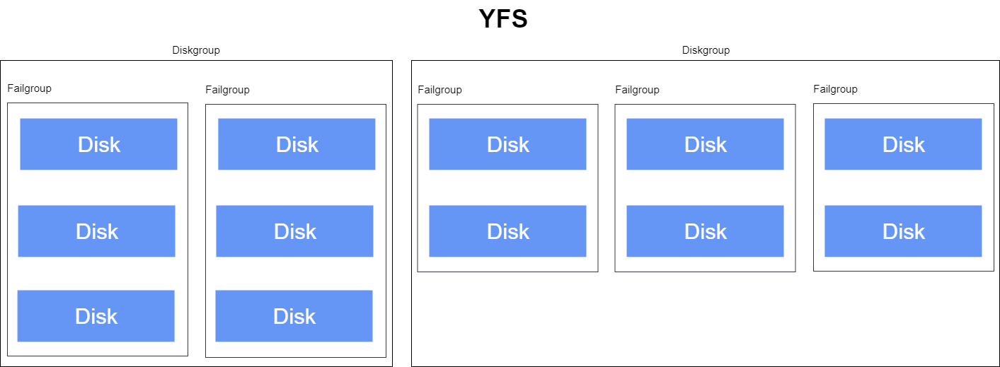
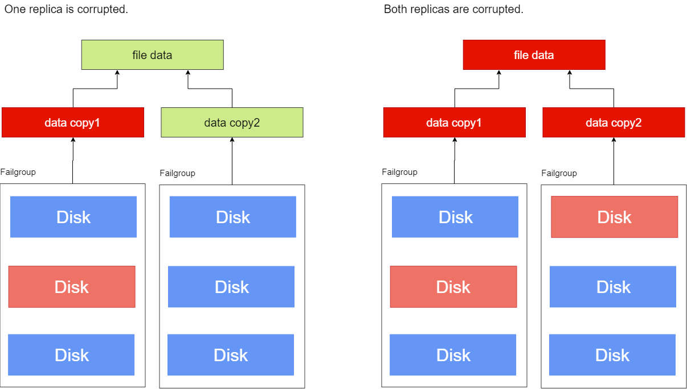
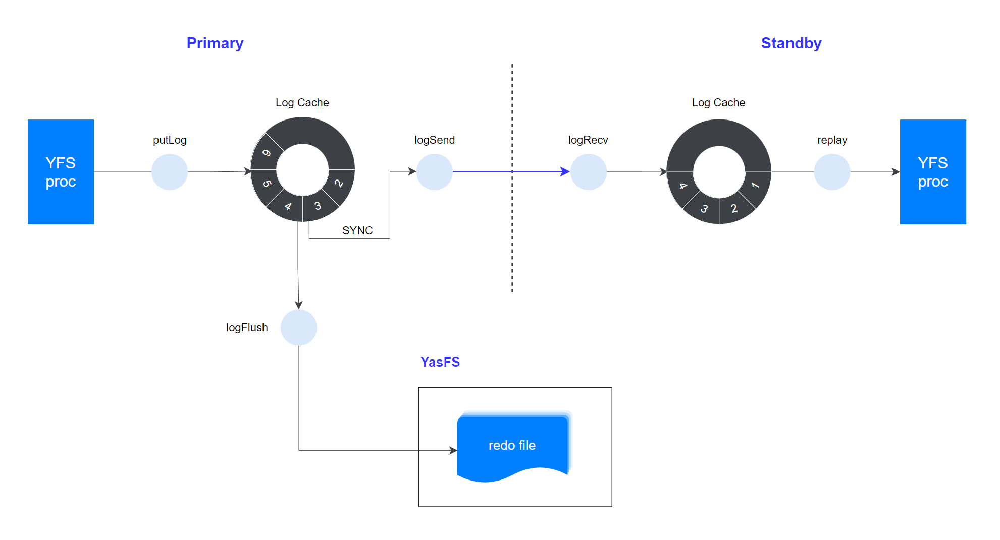

YFS achieves data high availability through disk group and multi-replica technology, and service high availability through clustered deployment.

## Data High Availability

### Disk Group, Failure Group, and Redundancy

A Disk group is a collection of disks managed by YFS. Depending on business needs, there can be multiple Disk groups in YFS. YFS requires all disks in a Disk group to be of equal size. If the disk sizes are different, one can specify the available space for the added disk to be the minimum value among all disks when adding disks to the Disk group, which may result in disk space waste. It is recommended to use a group of disks with the same size.



YFS supports configuring three levels of disk redundancy for Disk groups: External, Normal, and High. Files created in Disk groups with Normal and High redundancy will have several data replicas created by YFS. Each replica of a file is termed as one copy of that file. The file copies will be distributed across different failure groups to ensure that partial disk failures do not cause damage to all copies, thereby ensuring the integrity of the file. The number of copies of a file in YFS is determined by the redundancy of the Disk group it resides in, which can be specified when creating the Disk group. The space consumption for multiple copies will also proportionately increase, thus, it is necessary to balance the strength of data protection and disk space efficiency when specifying Disk group redundancy.

|Redundancy |Description |
|----|-----|
|External|Only one copy of the data is kept, with no multi-replica protection.|
|Normal|Two copies of user data, with up to three copies of YFS metadata.|
|High|Three copies of user data, with up to five copies of YFS metadata.|

For Normal and High redundancy, a higher redundancy implies that YFS has more copies internally, providing a greater tolerance for disk failure without data loss, thus offering higher data availability protection. When a disk failure occurs, YFS checks the integrity of the file copies. If all copies are damaged, YFS will dismount that Disk group; if at least one copy is intact, the database will remain unaware of the disk failure and can continue to provide services.

Files in an External redundancy Disk group do not have additional copies, and YFS does not provide protection; the data availability relies on external storage, like RAID. When the external storage device fails, the corresponding Disk group is dismounted and becomes unavailable. Since External redundancy has no extra copies, it maximizes disk space utilization. Please carefully consider data value and the reliability of external storage before choosing this option.

> **Warn**:
>
> The Disk group with External redundancy does not support data high availability. Once a disk failure occurs, the entire Disk group will become unavailable, potentially leading to data loss. Please ensure proper data backups.

A Failure group is a subset of a Disk group used to store data copies. When creating a Disk group, it is necessary to configure each Disk group's Failure group based on redundancy requirements. The configuration requirements for Failure groups are as follows:

1. The failure rate of the disks in the same failure group is highly correlated. They can typically be divided based on physical relationships, such as disks in the same rack, disks sharing the same power supply, or disks sharing the same network connection. When some disks fail, it is common for those disks to all become unavailable.

2. All Failure groups within the same Disk group must have the same number of disks.

3. All disks in YFS must belong to a failure group. If a disk is not assigned to a failure group, YFS will automatically create a default failure group for that disk, which contains only one disk. After creating the Disk group, the failure group can be modified using an Alter operation to add or remove disks or add or remove failure groups, but the number of disks in all failure groups of that Disk group must remain equal.

4. For Disk groups with External redundancy, at least one failure group is required, and the number of user data and YFS metadata copies is one; for Disk groups with Normal redundancy, at least two failure groups are required, with two copies of user data and YFS metadata. If there are more than three failure groups, the number of user data copies will be two while the number of YFS metadata copies will be three; for Disk groups with High redundancy, at least three failure groups are required, with three copies of user data and YFS metadata. If there are more than four failure groups, the number of YFS metadata copies must be at least four and can be up to five copies.

5. YFS's failure groups are used to store data copies; disk space allocation for failure groups always requires multiples of the number of copies. If the number of failure groups in the Disk group is not a multiple of the number of copies, the remaining disk space in those failure groups will be unavailable. Please ensure that the number of failure groups is a multiple of the user file copy count to improve space utilization.

It is recommended to create a sufficient number of failure groups to provide extra copy protection for YFS metadata. Adding failure groups after creating a Disk group cannot change the number of copies of YFS metadata; please plan accordingly when creating the Disk group.

Taking a Disk group with Normal redundancy as an example, where the files have two copies, YFS will select two different failure groups from the Disk group to store two data copies. When a disk in one failure group fails, the data copy in the other failure group can ensure the integrity of the file data. If both failure groups have disk failures, both copies of the file may be damaged, leading to incomplete file data.



### Failure Scenarios

#### Data Block Error

The smallest unit managed by YFS is called an AU (Allocation Unit), which can be 1M (default), 4M, 8M, 16M, or 32M. Files in YFS consist of several discrete AUs on the disk, and YFS uses file metadata for the disk addressing of AUs. For files in Normal and High redundancy Disk groups, redundancy is implemented at the AU level. For files in Normal redundancy Disk groups, there are two data copies, meaning that for every 1 AU size of file data, there is 1 AU on two different disks in different failure groups corresponding to it, containing the same data.


When writing to a YFS file, YFS simultaneously updates the two AUs corresponding to the file location; during file reading, YFS performs data integrity checks (such as checksum verification), sequentially reading the two AUs at the corresponding locations. When any complete data is read, it is considered that the data at that position is complete, and later replicas are no longer read. For example, if Disk1 experiences a data block error due to a bad sector or an incomplete last write, causing the data of AU2<sup>1</sup> to be erroneous (not an IO error), YFS detects the data incompleteness through data integrity checks and then continues to read AU2<sup>2</sup>. If the data read from AU2<sup>2</sup> passes the data integrity check, then the data at AU2 remains complete, and the business layer is unaware of the data block error.


When YFS reads data and detects a block-level data error, if at least one complete copy exists, YFS will attempt to write the complete data to the damaged data block, automatically completing the bad block repair. YFS's bad block repair can be seen in the corresponding YFS instance log:

```text
[YFS] repair dg: disk group id, fd: file fd, offset: file offset, len: repair length, copyIndex: repaired copy number
```

If all copies corresponding to the file AUs are in error, the data at that point is considered damaged and unrecoverable. In such cases, the corresponding YFS instance log will show:
```text
[YFS IO] all copies corrupted, message: dgid= disk group id, fd= file fd, offset= file offset, size= IO length
```

#### Disk Failure

- When reading or writing files, if a read or write to a disk fails, it is deemed that the disk has failed. YFS checks the fault state of other replicas located in failure groups. If the disk stored the last available copy, it indicates the current node has not modified any copies of that file, and YFS only needs to take the faulty disk offline in this instance and dismount its Disk group. The current instance will not be able to perform any IO operations on that Disk group, resulting in an IO error reported by the database.
- If the disk holds data that has available copies on other failure groups, it indicates that the current node cannot update the copy on the faulty disk but may update the data on other copies. In this case, the multiple copies may exhibit inconsistencies. YFS will broadcast to all instances that the faulty disk is offline to avoid inconsistent results from various instances reading different copies.

For example, consider a YFS cluster comprising instances sharing three disks (with each instance depicted having three disks, though in practice, each instance sees three shared disks). Using three copies as an example, each data copy is stored on a different disk.


**When only one disk fails**

If the database on instance 1 fails to read or write Disk1, it detects Disk1's failure and reports this failure to YFS on this instance. YFS detects that Disk2 and Disk3 are still available in this Disk group, allowing two copies of the data to remain valid, so the Disk group remains operational and is still usable but marks Disk1 as offline. At the same time, YFS broadcasts a message notifying other nodes in the cluster to also set Disk1 as offline. The offline disk log will show the following content:

```text
[YFS DISK] offline disk name: disk name, path: disk path, diskstatus: current disk status
```

The status of Disk1 for all nodes can be queried using the *yfscmd* tool, showing Disk1 as Offline while Disk2 and Disk3 remain Normal.

At this point, the shared disk status across the three nodes in the cluster is consistent: Disk1 is Offline, while Disk2 and Disk3 are Normal, maintaining the Disk group normally. After the database finishes its error reporting, it continues executing read and write operations until all copies are written to either Disk2 or Disk3 or a complete copy is read from either Disk2 or Disk3, remaining unaware of the failure in Disk1.

**When multiple disks fail**

If Disk2 and Disk3 are already offline and the database fails to read or write Disk1, it reports the disk failure to YFS on this instance. YFS detects that all three disks in the Disk group on the current instance have failed, rendering all copies inaccessible. YFS will take Disk1 offline and dismount the Disk group. The following log entry can be seen in the YFS log of the current instance:

```text
[YFS DISK] offline disk: disk path cause data lost, diskgroup disk group name will dismount
```

The database operation log will display:

```text
[YFS IO] all copies corrupted, message: dgid= disk group id, fd= file fd, offset= IO offset, size= IO size
```

Since the current node will not update any data, the disk failure will not introduce inconsistencies among the multiple copies, so YFS does not need to notify other cluster nodes of the change in Disk1's status. Due to differences in connection status with the shared disks, the disk group statuses seen by nodes in the cluster may differ: for example, node 1 shows Disk1 as Offline and the Disk group status as Dismount, while the other two nodes may see Disk1 as Normal and the Disk group status as normal. This difference prevents the faults in node 1 from spreading to the other nodes in the cluster, ensuring the maximized availability of the cluster.

YFS metadata operations (such as adding, deleting, modifying, and querying files, directories, etc.) will be executed by the elected primary node in the YFS cluster. If the state of a Disk group in the primary node is Dismount, any metadata operations on that Disk group initiated from any node will fail, indicating that the Disk group is in a Dismount state, irrespective of the state seen by the instance making the request. If the disk group status is normal on any node in the YFS cluster, please refer to the following steps to make the normal node the new primary node, restoring YFS metadata operations.

For example, in a three-node cluster, log in to any node and use the following command to check the current primary node of the YFS cluster:

```bash
$ export YASCS_HOME=/your/yascs/home
$ ycsctl status
---------------------------------------------------------------------------------------------
Self Host ID|Cluster Master ID|YasFS Master ID|YasDB Master ID|Active Host Count
---------------------------------------------------------------------------------------------
1            1                 1               1               3         
---------------------------------------------------------------------------------------------
Host ID   |Target    |State     |YasFS     |YasDB     |VIP
---------------------------------------------------------------------------------------------
1          online     online     online     online                                                                 
2          online     online     online     online                                                                 
3          online     online     online     online
```

According to the `YasFS Master ID` column, the YFS primary node is node 1, and logging into node 1 shows the Disk group DG0 in a Dismount state:

```bash
$ export YASCS_HOME=/your/yascs/home
$ yfscmd show diskgroup
id name     type     level    au_size  stat     block_size  total_mb    free_mb     usable_file_mb
0  SYSTEM   SYSTEM   0        1.00MB   MOUNTED  4096        1024        764         764        
1  DG0      USER     0        32.00MB  DISMOUNTED 4096        0           0           0
```

At this point, the Disk group DG0 on node 1 is unavailable. If the database is using this Disk group, it will not be able to serve properly. Please execute the following command on node 1 to shut down that node:

```bash
$ ycsctl stop ycs
```

At this point, node 1 will go offline from the cluster, automatically triggering a reconstruction of the YFS cluster, and the cluster will automatically elect a new primary from nodes 2 and 3. You can log into node 2 or node 3 to check the latest cluster status:

```bash
$ export YASCS_HOME=/your/yascs/home
$ ycsctl status
---------------------------------------------------------------------------------------------
Self Host ID|Cluster Master ID|YasFS Master ID|YasDB Master ID|Active Host Count
---------------------------------------------------------------------------------------------
2            2                 2               2               2         
---------------------------------------------------------------------------------------------
Host ID   |Target    |State     |YasFS     |YasDB     |VIP
---------------------------------------------------------------------------------------------
1          online     offline    offline    offline
2          online     online     online     online
3          online     online     online     online
```

It can be seen that node 2 is now the YFS primary node. As long as the Disk group DG0 on node 2 is normal, YFS metadata operations in the cluster can resume.

Service High Availability
------
With YFS deployed in a clustered mode, if the number of servers changes or if a server fails and cannot provide service, YFS automatically reconstructs to restore services. As long as there is at least one available server in the cluster, YFS cluster services remain available.

Additionally, YFS uses redo and checkpoint mechanisms to ensure data consistency and reliability. In the event of an extreme failure, YFS can restart to recover to an effective state by applying the redo logs.

Primary-Standby Replication
------

Consistency of the YFS cluster state is crucial. The primary YFS instance performs real-time data replication to all standby instances through the transmission of redo logs, as illustrated below:



**1. Log Insertion**

The YFS cluster must contain at least one primary instance and several standby instances. The primary instance is responsible for processing all metadata changes while generating corresponding redo logs, which are inserted into the Log Cache.

**2. Log Persistence**

YFS manages its own redo files, which are protected by YFS's multi-replica technology.

The redo logs are persisted to the redo files, and this data is stored on shared storage to ensure that all YFS instances can access this file during recovery.

**3. Log Sending**

The primary instance sends its logs to all standby instances. Since the delta for YFS metadata changes is small, synchronous sending is used here.

**4. Log Application**

Upon receiving the logs, the standby instances update their metadata pages by replaying the redo logs from the primary instance, ultimately synchronizing their states with that of the primary instance.