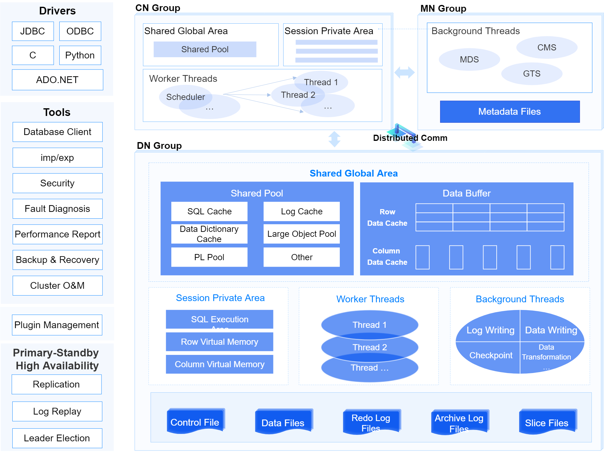

The database is a physical concept, referring to a collection of various persistent data files stored on the disk.

A database instance exists only in the running state and includes a set of threads and memory space. YashanDB adopts a multi-threaded architecture, and the memory space consists of two parts: SGA and SPA. Each running database is associated with at least one database instance.

## Standalone Deployment

## YAC Deployment

## ISC Distributed Cluster Deployment

## Introduction to Major Modules

**Database Client**

Generally refers to applications developed based on YashanDB drivers or client tools provided by YashanDB.

- Driver: An interface between the application and the database storage, each driver implements calls to various database operation commands for a specific programming language.

- Tool: A type of software application or toolset designed to assist database administrators (DBAs) and developers in managing and maintaining database systems.

**Plugin Management**

Plugin management is a development framework provided by YashanDB for collaborating with third parties to develop plugins to expand richer functionality.

**Standalone Database Server**

Includes the database instance and a series of persistent files.

The database instance exists only in the running state and includes a set of threads and memory space. YashanDB adopts a multi-threaded architecture, and the memory space consists of two parts: SGA and SPA.

**YAC Database Server**

Includes the database instance, cluster service components, and persistent files managed by shared storage.

YashanDB YAC is a multi-active cluster with a single database and multiple instances, based on a Shared-Disk architecture. The components are described as follows:

- Instance: Database instances on multiple servers use cohesive memory technology to collaboratively access data pages and non-data resources through global resource management, global buffer management, and global lock management, providing equivalent, strongly consistent concurrent read and write capabilities.

- YCS: The core component for high availability of the cluster database, uniformly managing resources such as the cluster file system and database, providing capabilities for configuration, starting and stopping, monitoring, and arbitration services in various fault scenarios to maintain a globally unified topology state.

- YFS: Responsible for managing the cluster file system, directly managing raw devices, and providing strongly consistent file system services for database use.

**Distributed Database Server**

Includes distributed service components, database instances on nodes, and a series of persistent files.

YashanDB ISC Distributed Cluster Deployment adopts a Shared-Nothing architecture. The service components are described as follows:

- MN Group: MN is responsible for the management of the cluster nodes, metadata management, and distributed transaction management. Nodes within the MN group have primary/standby relationships, achieving consistency between nodes through the Raft protocol.

- CN Group: CN is responsible for providing external interfaces, receiving user requests, generating distributed query plans, distributing query plans to DN, and summarizing execution results. CN nodes adopt a multi-active deployment, with multiple CN nodes providing services simultaneously and supporting load balancing. When a node fails, other nodes remain available without affecting the overall system.

- DN Group: DN is responsible for storing data and executing the query plans issued by CN. The DN group provides high availability, with nodes within the group having primary/standby relationships, achieving data consistency between nodes through the Raft protocol.

- PN Group: PN is responsible for intermediate calculations, isolating storage from computation nodes. This feature is a lab feature and is not recommended for use in a production environment.

**Persistent Files**

The persistent files of the database ensure that the database can still start and operate normally in scenarios of unexpected shutdowns such as power outages, including:

- Control File: The most critical entry information for the database, storing basic metadata and persistent-related information.

- Data File: Stores all system tables, user tables (HEAP tables/TAC tables/LSC tables), and data such as undo.

- Slice File: Stores the cold data of LSC tables.

- Redo Log File: Stores redo logs, used to repair dirty pages in recovery scenarios and to replicate to standby databases in primary/standby scenarios.

- Archive Log Files: Stores archived redo logs, used in recovery scenarios to restore the database to a specific point in time in conjunction with backup files.

- Cluster Configuration Data: Stores management configuration information for YAC, such as nodes and resources.

- Cluster Runtime Data: Records relevant information during the operation of YAC, especially related process data during voting.

**Memory Areas**

For details, please refer to [Database Memory](Database Memory).

**Processes and Threads**

For details, please refer to [Database Process and Thread](Database Process and Thread).