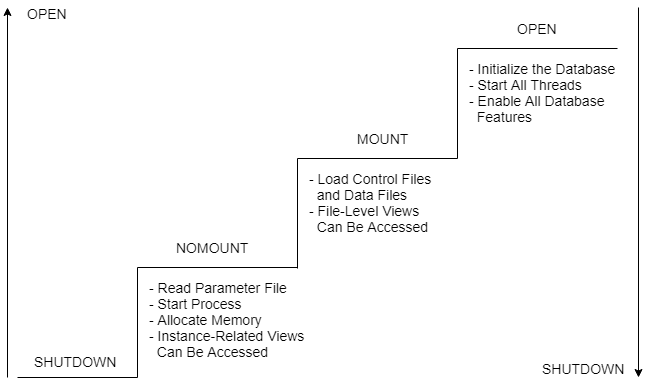
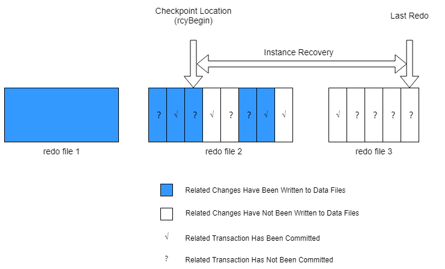
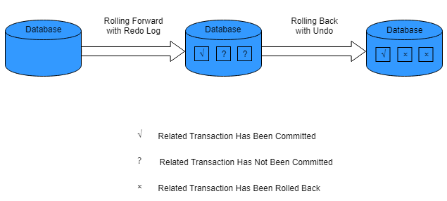
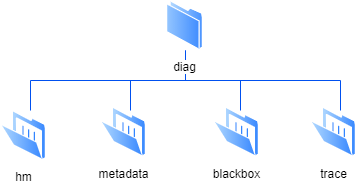

## Instance Startup and Shutdown Mechanism

Database startup and shutdown process:

### Database Startup Phase

The database instance goes through three stages: NOMOUNT, MOUNT, and OPEN from a closed state to an open state.

You can start the database instance using the *yasboot* tool or by using the ALTER DATABASE statement.

- **NOMOUNT**: Start the instance but do not load the database.

  When YashanDB starts the instance, the following steps need to be executed:
  - Launch the instance based on the provided instance type (e.g., STANDALONE, MN, CN, DN).

  - Initialize the runtime logging module to write the logs of the instance startup process into the runtime log file.
   
  - Read the configuration parameter file to obtain system configuration and initialize the basic instance operating environment, such as global memory area, basic background threads, connection listener, etc.

  You can verify a successful startup to NOMOUNT state by checking V$INSTANCE view's STATUS updated to STARTED. After success, you can view system views related to the instance.

- **MOUNT**: The instance is started, and the database is loaded, but the database is still in a closed state.

  The process of loading the database is as follows:

  - Load the database control file.

  - Load tablespaces and data files.

  You can verify a successful startup to MOUNT state by checking V$INSTANCE view's STATUS updated to MOUNTED. After success, you can view system views at the database and file level.

- **OPEN**: The instance is started, and the database is in an open state.

  The process of opening the database is as follows:

  - Load the system tables's DC.

  - Start the forward thread and rollback thread for database recovery.

  - Start all threads required for the database operation.

  - If it is a ISC Distributed Cluster Deployment, load and start the distribution-related capabilities.

  You can verify a successful startup to OPEN state by checking V$INSTANCE view's STATUS updated to OPEN. After success, all normal database services can be provided.

### Database Open Modes

When the database instance moves from the NOMOUNT or MOUNT stage to the OPEN stage, it supports four open modes: READWRITE, READONLY, RESETLOGS, and UPGRADE.

- **READWRITE**: The database defaults to opening in READWRITE mode. In this mode, the database supports full transactional read/write operations and is used in formal production environments.

- **READONLY**: The database is opened in read-only mode, restricting the database to read-only operations without generating any redo. 
  
  - In YAC Deployment, the database cannot be opened in read-only mode.

  - In Standalone Primary/Standby Deployment, the physical standby database opens in this mode by default.

- **UPGRADE**: The upgrade tool *yasboot* opens the database in this mode during the upgrade process. In this mode, new session connections are not allowed, and manual OPEN operations are also not permitted.

- **RESETLOGS**: When a PITR (Point In Time Recovery), database flashback, or logical standby database configuration has occurred, and if a complete recovery cannot be performed, the database must be opened in RESETLOGS mode. This mode will reset the redo log sequence number.

### Database Shutdown Modes

You can close the database instance using the *yasboot* tool or by using the SHUTDOWN statement.

During database shutdown, you can choose from the following three modes:

- **SHUTDOWN NORMAL**

  The database will wait for ongoing transactions to complete normally before shutting down. This mode is used by default.

- **SHUTDOWN IMMEDIATE**

  The database will terminate any ongoing transaction operations, rollback uncommitted transactions, and disconnect user connections before shutting down the database.

- **SHUTDOWN ABORT**

  The database will forcibly terminate all operations and immediately shut down. However, subsequent database startups may take longer due to data recovery requirements. This is typically used only in emergency situations.

## Instance Configuration Parameters

When starting the instance, configuration parameters are read from the configuration file to control/affect database behavior to fit various user scenarios.

All configuration parameters have default values, and the instance can start without any configuration during product installation. However, it is recommended to adjust configurations based on actual needs in production environments for better performance.

Configuration parameters can be modified using ALTER SYSTEM SET and ALTER SESSION SET statements.

From the perspective of modification effectiveness, instance configuration parameters can be classified into read-only parameters, parameters effective upon restart, and parameters that take effect immediately.

- Read-only parameters

  These parameters cannot be modified after the database instance is created. They are generally related to deployment planning, storage formats, etc. For example, the node ID allocated during database instance deployment is not supported for modification thereafter.

- Restart effective parameters

  These are parameters that need a database instance restart to take effect after modification. The instance reads these configuration parameters only once at startup for use. For example, network addresses, etc. When using ALTER SYSTEM SET, specifying SCOPE=SPFILE can write the parameter value to the configuration file, effective upon instance restart.

- Immediate effect parameters

  These are parameters that take effect immediately during normal operation of the database instance. Changes refresh the values in the program memory in real-time, and the next read will use the updated value, such as heartbeat interval times, etc. When using ALTER SYSTEM SET, specifying SCOPE=MEMORY can write the parameter value to memory and take effect immediately but will be lost upon restart; specifying SCOPE=BOTH will write the parameter value to both memory and the configuration file, take effect immediately, and remain effective upon restart.

From the perspective of the scope of influence, instance configuration parameters can be divided into system-level parameters and session-level parameters.

- System-level parameters

  These parameters have a global impact on the system, such as basic information for the entire instance, network configurations, performance parameters, etc. They can be modified using the ALTER SYSTEM SET statement.

- Session-level parameters

  These parameters only affect the session, such as the transaction isolation level of the current session. When a user connects to the database instance and creates a new session, a copy of the global session-level parameters is taken as the parameters for the current session. When session-level parameters are modified in the session using the ALTER SESSION SET statement, the changes only take effect for the current session.

In ISC Distributed Cluster Deployment, CN instances can modify the configuration parameters of all instances. By specifying `TYPE = instance type` or `NODE = instance number`, parameter modifications can be applied to the specified instance.

## Instance Persistence Mechanism

Checkpoint is a key mechanism that ensures data persistence and consistency for the database by writing dirty blocks in the database data buffer to disk, helping ensure proper database operation (releasing redo), dirty page writing, normal shutdown, instance recovery, and normal startup.

- Checkpoint Data Structure

  - truncPoint: The log point when the data page in the data buffer is first modified.

  - checkpoint dirty queue: An ordered queue of all dirty pages in the data buffer arranged by truncPoint, with only one checkpoint dirty queue per database instance.

  - rcyBegin: The redo log point recorded on the control file, marking that dirty blocks in the database instance before this log point have been written to the disk. rcyBegin serves as the starting point for redo log application, the database's restart apply point, and the checkpoint during recovery execution.

- Working Threads

  - ckpt: Starts the checkpoint and notifies dbwr to begin writing dirty pages.
  
  - dbwr: Writes the dirty pages from the checkpoint dirty queue to disk.

The database uses checkpoints for the following purposes:

- To reduce the time for instance recovery or media recovery.

- To ensure that the database regularly writes dirty pages from the data buffer to disk, controlling the number of dirty pages in the data buffer.

- To guarantee that all committed transaction data is written to disk during a consistent database shutdown.

Checkpoints can be triggered in various scenarios. YashanDB divides them into full checkpoints and incremental checkpoints.

### Full Checkpoint

Writes all dirty blocks from the checkpoint dirty queue of this instance to disk.

Full checkpoints ensure that the rcyBegin of this instance is pushed to the position right after the last dirty block in the checkpoint dirty queue, which means that all dirty blocks are flushed to disk at that moment.

Common triggering scenarios include:

- Database shutdown.

- Deletion or offline of tablespaces or data files.

- Manually initiated trigger (ALTER SYSTEM FLUSH BUFFER_CACHE or ALTER SYSTEM CHECKPOINT).

- Completion of instance recovery.

### Incremental Checkpoint

Incremental checkpoints write a portion of the dirty pages from the data buffer to disk, controlling the ratio of dirty pages in the data buffer.

The execution process of incremental checkpoints: Starting from the beginning of the checkpoint dirty queue, a portion of dirty blocks is written to disk, and the rcyBegin of this instance is advanced.

Common triggering scenarios include:

- Every 3 seconds.

- Triggered by conditions such as CHECKPOINT_TIMEOUT.

## Instance Recovery Mechanism

Instance recovery  applies all redo files to the data files from the last checkpoint to rebuild the most recent checkpoint after all changes to the database.

When opening a database that has been inconsistently shut down, the database automatically initiates instance recovery.

### Purpose of Instance Recovery

Instance recovery ensures that the database can recover to a consistent state after an abnormal shutdown.

The database redo log files record all changes made to the instance, with each database instance having a redo thread (which means multiple redo threads exist in YAC Deployment).

When a transaction is committed, the redo writing thread LGWR writes the redo log from the log buffer and the transaction SCN simultaneously into the redo log. However, upon transaction commitment, the dirty pages in the data buffer are not written to disk; instead, the DBWR thread uses the most efficient means to write modified dirty pages to the data files. As a result, uncommitted transaction changes may have been written to data files while committed changes may not have.

If an abnormally shut down database (e.g., due to server power failure or a database shutdown abort) is opened, the following situations may occur:

- Blocks modified by committed transactions have not been written to the data file, while the redo has been written.
  
  In this case, the corresponding redo needs to be applied to write the modifications to the data file.

- Data files contain modifications from uncommitted transactions.
  
  The uncommitted transaction changes need to be rolled back (rollback) to ensure transaction consistency.

During instance recovery, online redo files and online data files are utilized for data synchronization and consistency assurance.

### Triggers for Instance Recovery

The database will automatically execute instance recovery in the following scenarios:

- In Standalone Deployment or YAC, when all database instances experience an abnormal shutdown (e.g., server power failure or database shutdown abort) during the first opening.

- In YAC scenarios, if an instance closes abnormally, remaining instances will execute instance recovery.

Instance recovery is automatically executed by the database's SMON background thread.

### Importance of Instance Recovery

Instance recovery uses checkpoints to determine which redo changes must be applied to the data file. Checkpoints ensure that changes before the checkpoint's SCN have been fully written to the data file.

During instance recovery, the database must apply all redo logs from the checkpoint onwards. As shown in the diagram, some changes after the checkpoint may also have been written to the data file, but only the changes before the checkpoint are guaranteed to have been fully written to the data file.

### Phases of Instance Recovery

Instance recovery is divided into two phases; both phases must be completed for the instance recovery operation to be regarded as completed. Loss or corruption of redo logs and undo blocks may cause instance recovery to fail.

**Phase One: Rolling Forward**

The rolling forward operation, also known as cache recovery, refers to applying online redo logs forward from the checkpoint to restore the data file to the state it was in before the instance encountered an error.
  
In the rolling forward phase, recovery threads first obtain the recovery begin (rcyBegin) from the control file, and then apply all online redo logs forward from the checkpoint.

After all data from committed transaction operations in the redo logs has been written to the data file, the cache recovery in the data buffer achieves the state of the instance at the time of the error (at this point, the buffer still contains dirty blocks that were committed but not yet written to the data file and dirty blocks that were abruptly terminated and not rolled back). Thus, the rolling forward operation is complete.

Once rolling forward is complete, the database is started to the OPEN phase.

**Phase Two: Rolling Back**

The rolling back operation, also known as transaction recovery, refers to using undo blocks to revert executed but uncommitted changes back to their previous states.

In the rolling back phase, the recovery thread will use undo blocks to roll back all changes (dirty blocks) that were not written to the data file until all dirty blocks in the data buffer are restored to their initial state.

If a user process requests to read these dirty blocks before the recovery thread has completed the rollback, the user service thread will first roll back the data of the dirty blocks before returning the rolled back data to the user.

## Instance Fault Diagnosis

YashanDB provides a fault diagnosis architecture to collect and manage diagnostic data to diagnose and resolve database issues. The fault diagnosis architecture helps prevent, detect, diagnose, and resolve problems. When a critical error occurs, it triggers an automatic fault diagnosis that stores diagnostic data in the automatic diagnostic repository.

### Fault Diagnosis

**Fault Detection**

Health monitoring thread (HEALTH_MONITOR): Monitors some components of the database in real time and reports or automatically repairs immediately upon detecting a serious error. Timely identification and repair can effectively prevent more serious errors, such as data file monitoring, etc.

**Fault Reporting**

- Alert logs: The database records alert events when detecting certain anomalies, such as insufficient disk space for archiving.

- Event alerts: The database collects diagnostic data immediately after detecting a serious error, assigning an event number identifier and storing it in the automatic diagnostic repository for problem tracking and resolution.

- Trace logs: After detecting some anomalies, the database automatically records trace logs. It also supports manually executing the dump command to output thread stack calls or file storage structures to the trace file. Database administrators can quickly locate and fix anomalies by analyzing the information in the trace files.

- Black box: Collects information like the running stack of processes before a process crashes and stores it in the automatic diagnostic repository. This proactive diagnostic data is akin to the data collected by an airplane's "black box" flight recorder.

**Fault Handling**

- Automatic repair of data pages: When a primary database detects damaged data pages, it automatically retrieves normal data pages from the standby database to repair the primary database.

- Preventing fault propagation: When the database detects a critical error, it takes certain measures to prevent fault propagation.

  For instance, when insufficient archiving disk space is detected, the database is set to a fault state to prevent users from running business operations without perceiving the error. After database administrators free up space, the database will automatically recover normal status when it detects available space (the database's fault state can also be manually cleared).

### Automatic Diagnostic Repository

The automatic diagnostic repository is a file-based storage for storing diagnostic data of the database. Its directory structure is as follows (by default, it is placed in the YASDB_DATA directory, and parameters can be configured):

|Subdirectory Name |Content |
| ---------- | ----------------------------------------------------------- |
| hm                | Stores reports from health checks                             |
| metadata          | Stores metadata of the automatic diagnostic repository (mainly incident, problem, etc.) |
| blackbox          | Stores diagnostic data from the black box                    |
| trace             | Stores data from manual dumps or automatically generated trace logs |
