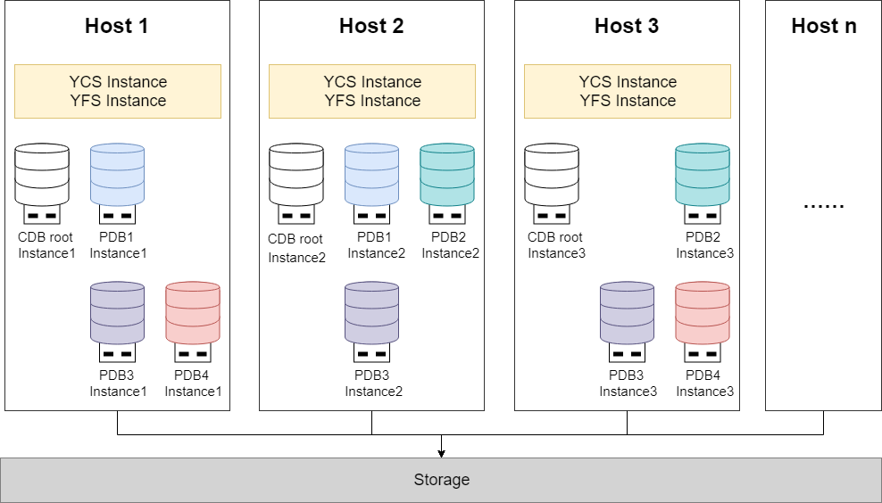

YashanDB supports building multitenant environments in Standalone Deployment, YAC/Distributed Cluster Deployment, and their respective high availability deployment modes.

## CDB in Standalone (Primary-Standby) Deployment

Building multitenant environments in Standalone (Primary-Standby) Deployment, typically multiple servers run 1 primary CDB + 1 or more standby CDBs respectively, with data synchronization achieved through primary-standby replication.

In scenarios with lower high availability requirements, a single server can be used to deploy and run a single CDB.

This deployment scheme possesses the following advantages:

- Simple architecture: Deployment method is straightforward, with relatively simple configuration management.

- Controllable cost: Hardware investment and operations costs are lower, suitable for resource-limited scenarios.

- Flexible high availability selection: Can flexibly configure the number of standby CDBs based on business needs.

## CDB in YAC/Distributed Cluster Deployment

Building multitenant environments in shared/distributed cluster deployment, typically each cluster runs multiple active instances on multiple servers respectively. Multiple instances can concurrently read and write same data, ensuring strong consistency of reads and writes between instances, with characteristics of high availability, high scalability, and high performance.

In the cluster, each server runs 1 YCS instance, 1 YFS instance, 1 CDB root instance, and instances of several PDBs, with each PDB capable of starting 0 - 1 instances on each server. Each CDB root instance can independently manage its subordinate PDB instances, with the CDB root instance and all PDB instance(s) on the same server sharing the same YCS and YFS instances.

PDB instances of the same PDB started on different servers can be accessed equivalently, while different PDBs maintain complete isolation, ensuring security and independence between tenants.

This deployment scheme possesses the following advantages and characteristics:

- PDB instance management within cluster: The number of PDB instances running on each server can be flexibly managed based on server resource conditions, different tenants' high availability requirements, and load levels. For example, adopting a cross-running approach to distribute multiple PDB instances relatively evenly across different servers, avoiding single-point resource bottlenecks, and improving resource optimization and load balancing effects.

- Concurrent access by multiple instances: The same PDB can start instances on multiple servers simultaneously for equivalent access, with load automatically distributed to different instances.

- Multi-level High Availability: Combines active-active high availability within the cluster and primary-standby cluster high availability to achieve a higher level of disaster recovery capability.

- High performance: Multiple instances read and write concurrently, fully utilizing cluster resources to provide excellent performance.
