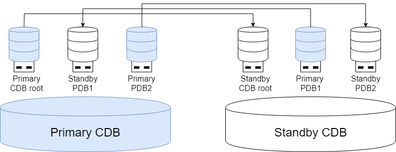

In a multi-tenant environment deployed with primary-standby high availability (e.g., Standalone (Primary-Standby) Deployment or Primary-Standby Cluster Deployment), high availability can be achieved at both the CDB (Container Database) level — ensuring overall system resilience — and also at the individual PDB level — enabling independent high availability for each tenant.

## Primary-Standby CDB Architecture

In standalone primary-standby deployment and primary-standby cluster deployment, the CDB corresponding to the primary CDB root is defined as the primary CDB, and the CDB corresponding to the standby CDB root is defined as the standby CDB. The system consists of one primary CDB and several standby CDBs.

### Metadata Management

PDB creation and deletion operations can only be executed in the primary CDB root and will be automatically synchronized to the standby CDB root to ensure metadata consistency between primary and standby CDB roots. Other daily operations of PDBs, such as PDB startup and shutdown, can be executed in both the primary and standby CDB roots.

### Primary-Standby Role Management

Through the cross-PDB deployment architecture of primary-standby CDBs, the load pressure can be dynamically balanced, effectively improving overall resource utilization and system performance. The primary-standby role of the PDB is not restricted by the role of the CDB root. A standby PDB can be located in the node where the primary CDB root is located, and a primary PDB can also be located in the node where the standby CDB root is located. The PDB can perform independent primary-standby switching, achieving flexible disaster recovery and load management at the tenant level.

Newly created PDBs default to following the primary-standby role of the CDB root. Subsequently, through primary-standby switching at the PDB level, the distribution of primary and standby PDBs can be freely changed.

PDBs can perform independent primary-standby switching, but when performing primary-standby switching for the entire CDB, PDB roles will be switched accordingly:

- Switchover of the entire CDB: Roles of the CDB root and all PDBs are converted.

- Failover of the entire CDB: After the standby CDB root is promoted to primary, all PDBs on it are converted to primary roles.

Primary-standby role switching between PDBs does not interfere with each other. Differentiated automatic primary selection strategies can be configured as needed, and manual switching can also be performed as required:

- Automatic primary selection strategy: Each PDB can customize and configure personalized primary-standby switching strategies to achieve business-level flexible disaster recovery.

- Manual primary-standby switching:

    - Global operations: Perform directed operations on specified single or multiple PDBs for primary-standby switching through the CDB root.

    - Local operations: Directly connect to the target PDB to execute primary-standby switching.

## Tenant-Level Primary-Standby High Availability

### PDB Primary-Standby Scale

Within the primary-standby scale of the CDB, each PDB can independently select its primary-standby scale. For example, when the CDB is one-primary-two-standby deployment, the PDB can flexibly choose single-library, one-primary-one-standby, one-primary-two-standby, or one-primary-one-standby-one-cascade standby deployment schemes.

### PDB Primary-Standby Replication

Although the primary-standby replication links between PDBs depend on the connection configuration between the primary and standby CDB roots, log transmission between different primary-standby PDB pairs is independent. Differentiated high availability strategies can be configured as needed:

- Protection mode: Each PDB can independently select an appropriate protection mode to meet reliability requirements for different business scenarios.

- Diversified primary-standby replication methods: Supports both physical replication and logical replication, allowing users to make independent selections and configurations based on specific business needs.
