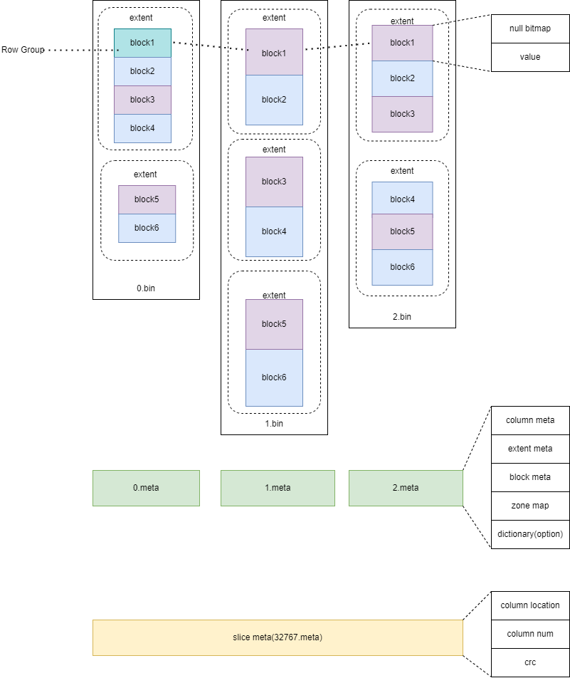

The physical storage structure is used to carry the persistent data of YashanDB on storage media (including user data and database metadata), and users can directly view the files related to the physical storage structure at the operating system level.

YashanDB's physical storage structure mainly includes the following files:

- **Data Storage File**: A physical file used to store data. YashanDB supports two different organization formats for data files: segment page and sharded.

- **Temporary File**: Used for storing temporary data (data in temporary tablespaces) or swapping out intermediate computation results (data in swap tablespaces).

- **Redo Log File**: A physical log used to record changes to the database, typically used for fault recovery or primary/standby synchronization.

- **Control File**: A file used to persist the basic metadata of the database, such as information about other physical files, serving as the entry point for loading the database.

- **Double Write File**: Used for writing multiple copies of data to resolve the issue of partial writes of data blocks caused by file system buffers.

- **Flashback Log Files**: Special log files that support database flashback technology, existing only when the database flashback feature is enabled.

YashanDB supports deploying the physical storage structure on different storage media, mainly including:

- General File System: YashanDB supports deploying the physical storage structure on mainstream file systems such as ext4, XFS, ZFS, NFS, etc.

- Self-Developed File System: YashanDB's self-developed file system YFS provides multi-instance shared storage capabilities in addition to basic physical file storage abilities.

- Cloud Storage: YashanDB supports storing data remotely in an object storage manner, such as S3, OBS, BLOB, etc.

## Data Storage File

YashanDB supports both row-oriented and column-oriented data storage formats, corresponding to the segment page and slice formats of data storage files, namely, data file (DataFile) and slice file (SliceFile).

### Data File

The Data file is specified when creating the tablespace, and each tablespace must contain at least one Data file. The data stored in a Data file includes not only user data but also database metadata (such as table structure information), historical data (undo data), etc.

Although the use of Linux sparse files (updating only metadata without actually occupying storage space) can significantly improve file creation efficiency, it may lead to exceptions during database operation due to insufficient actual storage space. Therefore, YashanDB uses preallocated space when creating data files, initializes all storage space, and accelerates the creation process with adaptive parallel technology.

YashanDB supports various operational SQL statements for data files (including creation, deletion, attribute modification, offline operations, etc.), but direct physical operations on data files (such as using OS commands like rm, mv, chmod, etc.) are not allowed, as they could lead to unexpected exceptions in the database.

Segment page space management relies on the physical storage method based on data files, so data files are physically divided into data blocks. The supported data block sizes are 8K, 16K, and 32K. For example, if a data file is 1M in size and the data block size is 8K, then this data file contains 128 contiguous data blocks.

There are various types of data blocks in the Data file, mainly including:

- Tablespace Header: Used to record information related to the owning tablespace.

- Data File Header: Used to record information about the current data file.

- Space Management Block: Used for the space management of the current data file, recording the usage status of each data block.

- Data Block: The data block used for actual data storage.

### Slice File

Slice file is used to store stable slices data for LSC tables, adopting file storage. Users can specify storage in a databucket. The Slice file consists of column data files, column metadata files, and slice metadata files:

- Column Data File: Data is divided into multiple blocks by a fixed number of rows. Multiple blocks form an extent, and the blocks in the same position of each column are called RowGroup.

- Column Metadata File: Stores metadata for blocks and extents, including a zone map of the maximum and minimum values of the blocks and other statistics. If dictionary encoding is used, the dictionary will also be stored.

- Slice Metadata File: Mainly stores the column count of the entire slice, CRC column storage location, and other information.

### Temporary File

Temporary files are used to store non-persistent data (data that will be lost after a database restart). The storage structure is the same as data files, but modifications related to temporary files do not generate redo log entries and are not flushed to disk through the checkpoint mechanism.

The data stored in temporary files mainly includes:

- Temporary Tablespace Data: YashanDB stores non-persistent objects such as temporary tables and indexes in the temporary tablespace. When temporary memory is insufficient, information about these objects will be temporarily written to a temporary file and loaded when needed.

- Swap Tablespace Data: The swap tablespace is used for swapping in and out intermediate results from computations, such as sorting and grouping results.

## Redo Log File

The online redo log is used to store redo entries (also known as redo log records), logging changes made to the database (mainly changes to data files).

The primary purpose of the redo log is recovery. After an abnormal database exit, the redo log can recover data that has been committed but not written to the data file, thereby preventing data loss.

### Structure of the Redo Log File

YashanDB's redo file records the physical logs generated by the database, which are used for database crash replay and primary-standby replication.

The structure of the redo file is as follows:

- **redo head**

	Records metadata, including sequence number, block size, time, etc.

- **redo pack**

	The basic unit for log flushing, containing several partitions, each of which includes multiple redo groups.
    
    - Redo Group: A collection of records generated by a session executing a business operation.

    - Record: A specific log operation, such as insert, update, etc.

### Writing to the Redo Log

Each instance has an independent redo log writing thread (LGWR). When the log reaches a certain threshold, this thread is triggered to write redo entries to the redo file.

When the business volume is high, the rate of redo entry generation is rapid. If the entire REDO BUFFER is filled, the user session will also actively write redo entries to the redo file.

YashanDB requires at least three redo log files to coexist.

### Redo Log Switch

The redo log files have the following four states:

- NEW: Unused files.

- CURRENT: The file currently being written to.

- ACTIVE: This file cannot be reused.

- INACTIVE: This file can be reused.

The database can only write redo entries to one redo log file, which is known as the CURRENT redo log file.

When the database stops writing to one redo file and starts writing to the next file, this indicates a log switch, which usually occurs when the CURRENT redo log file is full and new redo entries need to be written. A manual forced log switch is supported, where there is no need to check if the CURRENT redo log file is full.

During the redo log switch, only files with a status of NEW or INACTIVE can be selected as the next CURRENT redo log file. If there are no NEW or INACTIVE redo files available at that time, a "log tailing" situation will arise.

### Archive Log Files

Archive log files are copies of the online redo logs, commonly used for synchronous replication to standby databases or recovering the database to a specified point in time. Archive log files are only generated when the database is in archiving mode.

In primary/standby deployment or when generating backup sets, archiving must be enabled to put the database in archiving mode.

## Control File

### Overview of Control Files

The control file is the brain of YashanDB and serves as the entry point for a database instance to mount the database. The control file contains the following important information:

- The basic metadata of the database, including database name, number of database instances, SCN information, etc.

- Database checkpoint information, such as the starting point for redo log replay and the application consistency point.

- Paths and sizes of various physical files in the database.

During database operation, the control file is updated in real-time. For example, operations to create data files require writing new database information to the control file, and the checkpoint mechanism needs to periodically update recovery points in the control file.

Damage to the control file can lead to complete unavailability of the database. Therefore, YashanDB employs a multi-copy control file mechanism to ensure that damage to a single file does not cause exceptions in the database.

The information in the control file is maintained automatically by the database, and manual operation of the control file is not permitted, as it could result in unexpected exceptions in the database.

### Structure of the Control File

The internal structure of the control file is organized into different sections to store various types of metadata, mainly including the following categories:

- Boot Section: Used to store basic information about the database, such as version, ID, role, data block size, character set, etc.

- Instance Section: Used for instance-level startup information (in a YAC configuration, the same database may include multiple instances), such as recovery points, SCN, consistency points, etc.

- Storage Structure Section: Used to store information about tablespaces, data files, redo logs, archive log files, and other storage structures.

## Double Write File

The data block specifications of YashanDB are larger than the page size of mainstream file systems; therefore, data blocks cannot be written atomically. In scenarios such as power failure, partial writes may occur, leading to fractured blocks.

YashanDB solves the partial write issue of data blocks through double write technology. When a data block is written to disk, it is first written to a double write area. Upon database startup, the double write area is used to recover fractured blocks caused by abnormal exits.

The double write file serves as the storage carrier for the double write area, created when the database is established. Users can independently specify the path, size, and other information for the double write file.

##  Flashback Log Files

When enabling the database flashback feature, the database automatically generates Flashback log files. These files, based on logical change records, store pre-modification information for database blocks, providing the foundation for Flashback recovery and enabling rapid restoration to a specific point in time.

The Flashback log files are maintained by the database's Flashback Log Writer thread (RVWR) through an asynchronous write mechanism. Manual operations on these files are prohibited, and any tampering, corruption, or loss of these files may result in failed Flashback recovery.
