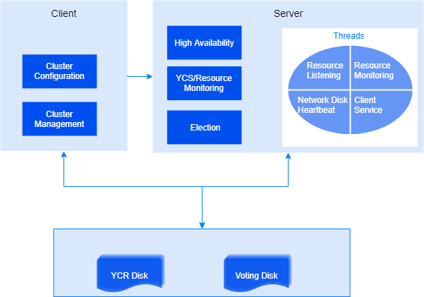

The Yashan Cluster Service (YCS) adopts a client-server architecture. The overall architecture is as follows: the client command-line tool can execute commands such as configuration and queries, and the related commands are sent to the server for processing and the results are returned to the client.

## YCS Instance

The YCS instance adopts a single-process, multi-threaded service architecture (the process name is yascs), which includes proxy threads responsible for listening, heartbeat, monitoring, and serving clients.

In the YCS process, the YFS instance is embedded and runs, which also includes a series of threads. For details, please refer to [Yashan File System](Yashan File System).

## YCS Configuration

Before running the cluster, the cluster service configuration must be completed, involving the following three layers of concepts: cluster, server, and resource.

**Cluster**

When initializing and installing a cluster database, the YCS client tool must first be used to complete the cluster configuration, including specifying the cluster name, participating servers, and resources on the servers. Only one cluster can be created on the same cluster registry disk; if a cluster is created in an overlapping manner, the previous cluster configuration will be lost.

**Server**

A cluster should deploy at least two servers, each running a YCS instance to provide cluster services. This ensures that at least one server can provide service in the event of a single point of failure, achieving high availability. Each server must run a configured YCS instance, and besides that, resource information, including databases, needs to be configured.

**Resource**

Each server needs to manage a series of resources. By managing resources (including monitoring and starting/stopping), high-availability cluster services can be provided for upper-layer applications.

Resources include embedded resources and external resources:

- YFS is a parallel file system that the cluster database depends on at runtime, started with YCS as an embedded resource that is transparent to the user.

- Embedded network resources:

    - SCAN (Single Client Access Name) is an optional cluster-level network resource for cluster databases. Once configured, YCS provides a single logical name (SCAN domain name) for client connections, eliminating the need for clients to be aware of actual node IP addresses or topology changes, thereby achieving transparent connection load balancing and automatic failover. When the cluster starts, SCAN VIPs are assigned to the cluster nodes. Nodes running SCAN VIPs will start a SCAN listener to handle connection requests.
    - VIP (Virtual IP) is an optional node-level network resource for cluster databases. Once configured, each node provides a virtual IP for client connections, and this virtual IP can migrate between failed and healthy instances, making instance-level failures completely transparent to users.

- The YashanDB database server is managed by YCS as an external resource.

After configuring the start/stop scripts for the resources, they can be started or stopped using the YCS client tool.

## Cluster Status

The cluster status, also referred to as cluster topology status or topology state, refers to the operational state of the entire cluster, including the start/stop state information of the cluster services on all servers, as well as the start/stop state information of the resources.

## Cluster Shared Files

Cluster shared files are divided into the following two categories:

- **Yashan Cluster Registry**

    The Yashan Cluster Registry (YCR) stores configuration information for the cluster services, including server configuration, resource configuration, etc. The YCR must be stored on shared storage, and all YCS instances and database instances must be able to access YCR during runtime to ensure consistent cluster service configuration information.

- **Cluster Voting File**

    The Cluster Voting File is a disk file that all servers periodically write state information to during runtime. In the event of a failure, voting must be conducted in the cluster voting file to determine which servers survive and which servers are expelled from the cluster. Without access to the voting file, the latest cluster status information cannot be obtained, and the relevant YCS instances and database instances cannot operate normally.