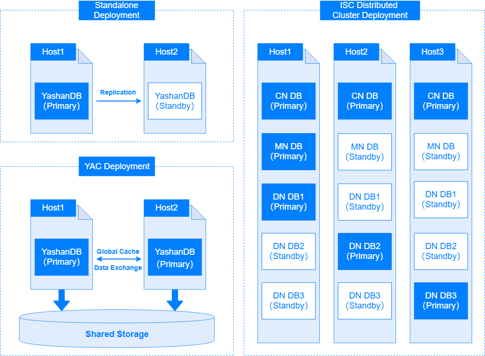
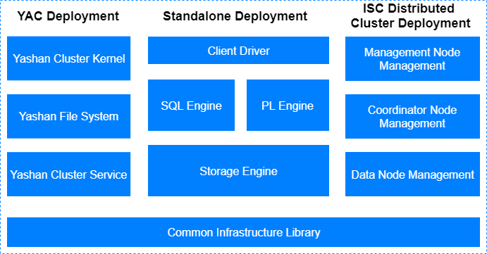

## Deployment Architecture

YashanDB supports three types of deployment forms: **Standalone Deployment** (also known as primary/standby deployment), **YAC Deployment**, and **Distributed Cluster Deployment**.

### Standalone Deployment

Standalone Deployment typically runs the primary instance and standby instance on two separate servers. Replication is used to synchronize modifications from the primary database to the standby database. In some scenarios where high availability requirements are lower, only one server is used to run a single instance during deployment.

Standalone Deployment is a common form and is suitable for most scenarios.

### YAC Deployment

YACs at the hardware level rely on shared storage, allowing all instances to read and write. Instances exchange data through a global buffer.

YAC Deployment is commonly applied in high-end core transaction scenarios that require multiple write capabilities, high availability, performance, and scalability.

### Distributed Cluster Deployment

Distributed Cluster Deployment adopts a compute-storage separation deployment architecture, consisting of a compute cluster and a storage cluster. The compute cluster is composed of a group of active-active compute instances, all of which can support read and write services.The storage cluster consists of a group of storage nodes, forming a distributed intelligent storage cluster. The computing cluster and storage cluster can be flexibly and independently scaled up as needed.

Distributed Cluster Deployment is suitable for trading, analysis, or mixed tranding/analysis scenarios, all of which require high availability and resilience.

## Logical Architecture

The zero-level view of YashanDB's logical architecture is shown in the following figure:

### Major Subsystems of Standalone Database

**Client Driver**

Includes a series of client APIs that provide capabilities such as establishing connections, executing SQL statements, and obtaining result sets.

**SQL Engine**

The SQL engine includes a parser, optimizer, and executor, responsible for parsing the SQL text submitted by the client, generating execution plans, and executing them. The SQL engine provides a rich built-in function library for convenient use of functions in SQL for expression operations.

**PL Engine**

The PL engine offers capabilities for user-defined functions (UDFs), type management, and user-defined types (UDTs), including advanced packages, stored procedures, stored functions, and triggers. PL objects can be persisted and can be executed multiple times after creation.

**Storage Engine**

Responsible for storage space management using a three-level management approach of segments, pages, and blocks; handles transaction management and controls concurrent access, providing consistent access capabilities; manages relational objects, including tables, indexes, etc.

### Major Subsystems of YAC Database

In addition to the standalone form, YAC Deployment adds three subsystems: YAC kernel, file system, and YAC management:

**Cohesive Memory Management**

The core component during the cluster's runtime in YAC Deployment, responsible for coordinating memory pages across servers during operation using cohesive memory technology, ensuring efficient and consistent access among multiple instances in the cluster.

**Storage Management**

Responsible for managing storage devices, providing a file system-like interface for database use, and processing file read/write requests from upper-level applications, converting them into read/write operations on storage devices through address translation.

**Cluster Management**

Responsible for managing the cluster and providing configuration management capabilities in YAC Deployment.

### Major Subsystems of Distributed Cluster Database

In addition to the standalone and YAC Deployment, Distributed Cluster Deployment adds three subsystems: Distributed Transaction Management, Distributed Parallel Execution, and Intelligent Storage Service:

**Distributed Transaction Management**

Responsible for managing distributed transaction. By leveraging decentralized global high-precision logical clock synchronization technology, it delivers real-time strong data consistency across distributed multi-instance environments, avoiding scalability bottlenecks associated with global centralized transaction management (GTM).

**Distributed Parallel Execution**

Responsible for orchestrating distributed parallel execution, optimizing utilization of distributed multi-instance resources to accelerate analytics and computation on massive datasets.

**Intelligent Storage Service**

Manages and monitors storage devices to deliver unified distributed storage services for computing clusters, featuring elasticity and high availability.

### Common Infrastructure Library

The infrastructure library contains commonly used public foundational capabilities, including network communication, thread management, etc.

## Instance Architecture

YashanDB includes two concepts: databases and database instances (referred to as "instances"). Databases and database instances generally have a one-to-one relationship, but in YAC Deployment and Distributed Cluster Deployment, there is a one-to-many relationship between databases and database instances. For more details, please refer to [Deployment Architecture](#deploy).

- Database

    A database refers to a set of data files stored on non-volatile storage, including control files, data files, and log files. If these data files are missing or damaged, the database instance cannot start and operate normally.

- Database Instance

    A database instance exists only during runtime and consists of a set of memory structures and a multithreaded program. For more details, please refer to [Instance Architecture](../Instance Architecture/Database Instance).

In most cases, we use "database" to refer to both concepts mentioned above.