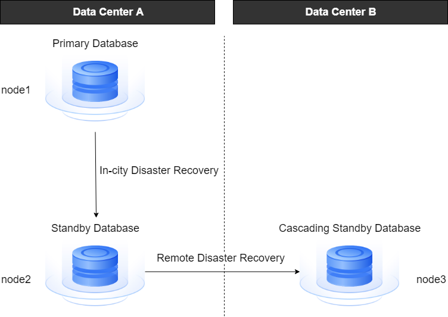

Replication is the main high availability measure for databases, implemented by real-time replicating data from the primary database to the standby database. The primary database is the database instance that executes business operations, while the standby database is the database instance that replicates data from the primary database. When the primary database fails, business operations can be switched to the standby database to continue execution, reducing the impact of failures on the business and improving the availability of the database.

## Primary/Standby Deployment Architecture

YashanDB supports primary/standby mode (one-primary/multi-standby) and cascade standby mode (unlimited levels) for high availability deployment architecture.

Primary/standby instances are deployed on different servers. Multiple servers should generally connect to the same switch to ensure low network latency, and redundancy configurations for the switch should be considered to guarantee high availability and avoid single points of failure.

Cascade standby is an asynchronous standby database that receives logs from the standby database, reducing bandwidth load on the primary database, and is typically used in remote disaster recovery scenarios.

The following diagram illustrates this:

- **Primary Database**

    Currently provides online database services in read-write mode.

    In the primary/standby cluster deployment, the primary database expands to the concept of a primary cluster, where multiple instances in the primary cluster simultaneously provide online database services, all in read-write mode.

    In the ISC distributed high availability deployment, each MN Group and DN Group contains one primary database.

- **Standby Database**

    Receives and applies logs from the primary database, operating in read-only mode. When the primary database fails, the status of the standby database switches to that of the primary database. A primary database can have multiple standby databases.

    In standalone primary/standby high availability deployments, standby databases can be further categorized into physical standby databases and logical standby databases based on the replication method.

    In primary/standby cluster deployments, the standby database expands to the concept of a standby cluster, but only the primary instance in the standby cluster is needed to receive and apply logs.

    In ISC distributed high availability deployments, each MN Group and DN Group can contain one or more standby databases.

- **Cascade Standby**

    A standby database of a standby database, which receives and applies logs from the standby database. A standby database can have multiple and multi-layer cascade standbys. When a higher-level standby database is promoted to a primary database, the cascade standby is converted to a normal standby database; when the primary database becomes a standby database, its standby databases become cascade standbys.

    There are no cascade standbys in primary/standby cluster deployments and ISC distributed high availability deployments.

## Primary-standby Replication Link

In replication, redo logs are sent from the primary database, and the standby database receives and applies the logs to achieve online synchronization between the standby database and the primary database. YashanDB uses a circular Log Cache buffer for redo logs, where log sending and standby database applying in synchronous mode prioritize reading data from the buffer to improve speed.

Log applying refers to the standby database restoring data pages by replaying the redo logs sent from the primary database to achieve timely synchronization with the primary database. When the required data is not found in both the Log Cache and redo files, a thread will be initiated to synchronize the primary database's archive log files to the standby database and search for the needed data, maximizing data consistency between the primary and standby databases.

Primary standby database replication link:

Primary/standby cluster replication link:

## Primary/Standby Switching

YashanDB supports manual switching of the primary and standby databases and leader election without external intervention in specific scenarios.

- **Manual Switching**

    Supports two modes of manual switching: switchover (when the primary and standby databases are synchronized normally) and failover (when the primary database is damaged or unavailable due to system failures). For more details, please refer to [primary/standby switching](../High Availability/Replication and Switching.md#switch).

- **Leader Election**

    Based on different deployment scenarios, YashanDB implements various mechanisms for leader election, including one-primary/multi-standby leader election and one-primary/one-standby yasom election, reducing operational complexity. When an exception occurs with the primary database and it cannot provide services, the system selects a new primary database from the standby databases according to the corresponding mechanism and automatically performs the primary/standby switch. For more details, please refer to [leader election](../High Availability/Automatic Election).