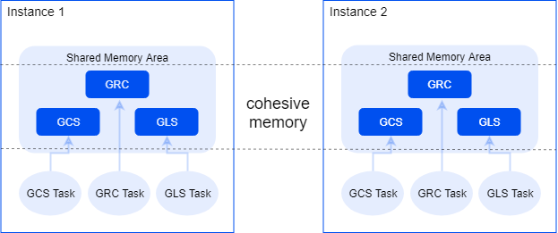
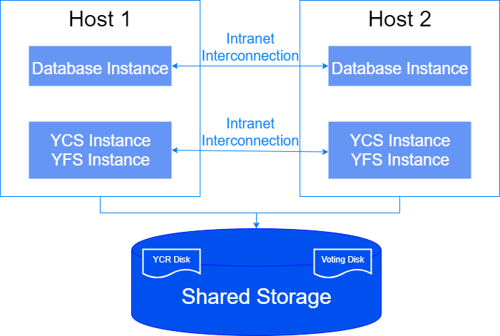

YAC is continuously evolving based on the YashanDB kernel. It relies on shared storage to implement a shared-Disk architecture and introduces Cohesive Memory core technology to achieve Shared-Cache capability. This allows for collaborative read and write access to data pages and concurrent control of various non-data resources among multiple instances in a cluster database. The main features include:

- YAC is a multi-active database system with a single database and multiple instances. Users can connect to any instance to access the same database. Multiple database instances can concurrently read and write the same data while ensuring strong consistency of reads and writes among instances. It has features such as high availability, high scalability, and high performance.
- The core components of YAC mainly include Yashan Cluster Kernel (YCK), Yashan Cluster Service (YCS), and Yashan File System (YFS).
- YAC supports online automatic failover and fault recovery. Abnormal failures of cluster instances do not affect the remaining live instances' ability to provide external services.
- Through the client TAF technology, client applications can automatically switch connections to live instances in case of failure, making the failure transparent and unnoticeable to the business.

## Yashan Cluster Kernel (YCK)

YCK aggregates multi-instance concurrent access to data and non-data resources through Cohesive Memory technology.

- **GRC**

    GRC (Global Resource Catalog) is responsible for managing global resource state information, such as which instance currently holds a data block, whether it is held in read/write mode, and which instance requests are in the queue. Metadata related to GRC is evenly distributed to all instances using a consistent hash algorithm, with only one copy of any resource's metadata in the cluster. GRC thread groups handle the concurrent access control to global resources and provide queuing services.

- **GCS**

    GCS (Global Cache Service) is responsible for managing the scheduling of global resources such as data blocks. GCS implements the complete process of data block requests between instances based on capabilities provided by GRC, including routing request messages, data transfer, and status maintenance, with services provided by GCS thread groups.

- **GLS**

    GLS (Global Lock Service) is responsible for managing the scheduling of non-data block global resources, primarily various types of locks. GLS implements the complete process of applying for global locks among instances based on capabilities provided by GRC, with services provided by GLS thread groups.

## Yashan Cluster Service (YCS)

YCS is responsible for managing YAC database, including cluster server configuration management, cluster resource configuration management, starting/stopping and monitoring servers and resources, and providing query capabilities for the server resource topology status. It is responsible for voting arbitration and restructuring the cluster during various failures.

YCS is a critical component for high availability. It confirms the normal operation of other servers and resources running on these servers through network heartbeats and disk heartbeats. When monitoring tasks detect abnormal resource operation states, they conduct voting arbitration to determine the list of survivors allowed to remain in the cluster and notify all resources on all servers to take necessary restructuring actions.

Each server in YAC deploys a YCS instance (a group of threads providing YCS services is called a YCS instance) and database instances. The YCS instances and database instances running on different servers within the same cluster are identical and interconnected through an internal network (also known as private network).

YCS requires the system disk to be allocated on shared storage for storing the [cluster registry](../YAC Infrastructure/Yashan Cluster Service.html#YACfiles) (which mainly stores cluster service configuration information) and [cluster voting files](../YAC Infrastructure/Yashan Cluster Service.html#YACfiles) (which mainly store cluster operational status). YCS instances and database instances on all servers can read and write to the system disk.

## Yashan File System (YFS)

YFS is a dedicated parallel file system for YashanDB, providing storage device management, storage high availability, and file system interface functionalities.

In YAC Deployment, all file operations must rely on YFS, including but not limited to the addition, deletion, and modification of control files, data files, and log files.

Compared with general file systems, the differences in YFS mainly include:

-  YFS allocates larger minimum units of space to ensure that FAT (File Allocation Table) information occupies less space and can reside in memory. In addition, YFS uses shared memory technology for direct access by database instances, thus reducing latency.
- The parallel file system synchronizes metadata modifications in real-time across all instances in YAC, ensuring that all database instances can access consistent directory file metadata information.

YFS does not have a standalone process; it runs as an embedded resource in the same process as YCS instances and starts with YCS without user intervention.

