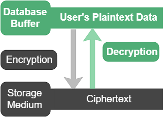

The data in the database is ultimately carried by storage media. In addition to ensuring physical security (preventing attacks and theft), encrypting data is an extremely effective and robust security measure.

Based on transparent encryption technology, after users customize the encryption attributes of database objects, YashanDB can automatically handle the encryption and decryption process without user or application awareness. Data is automatically encrypted when written to the storage medium and is stored in ciphertext form; when read from storage to the database buffer, it is automatically decrypted and presented in plaintext. The encryption/decryption process is completely transparent to applications, and access control, data operations, and SQL queries at the database layer are not affected.



YashanDB adopts encryption algorithms that comply with Chinese or international standards for TDE, supporting AES128 and SM4 algorithms. This ensures not only the difficulty of decrypting the ciphertext but also a low performance impact on the database during encryption and decryption. To enhance security, YashanDB further encrypts data keys through a multi-level key management system.

> **Note**:
>
> - To use the national encryption algorithm SM4 and TDE-related key management functionality, please refer to the [Pre-Installation Preparation](../../../Installation and Upgrade/Installation and Deployment/Pre-Installation Preparation/Preparing Dependencies) section to check and ensure that the required tools are installed in the server system.
>
> - Key management functionality is not applicable to ISC Distributed Cluster Deployment; in ISC Distributed Cluster Deployment, please create encryption objects directly.

## Functionality Introduction

### Encryption Granularity

YashanDB supports three levels of TDE granularity: tablespace level, table level, and column level.

### Encryption Algorithms

Supports encryption algorithms AES128 and the national encryption algorithm SM4.

### Functionality Constraints

- In Standalone/YAC/Distributed Cluster Deployment, key management configurations must be completed before creating encryption objects, including creating wallets, opening wallets, and setting the master key.

- Encryption attributes can only be specified when creating the object and cannot be modified afterward. If column encryption is used, other attributes of the encrypted column cannot be modified. Object creation operations include creating new tablespaces, creating new tables, and adding new column fields to existing tables.

- The sys user cannot use table encryption and column encryption.

- Column encryption is only applicable to HEAP tables and LSC tables, and cannot be used for temporary tables. The column to be encrypted must meet the following requirements:

    - If an index is to be created on this column, it can only be specified as a BTREE index for equality queries.

    - The column cannot be a partition key or subpartition key.

    - The column cannot be a dependent column of an AC object.

    - The column cannot be a foreign key column or a key that the foreign key depends on.

    - If it is a column encryption for an LSC table, the data type of the column cannot be of LOB type.

- Requirements for encryption algorithm uniformity:

    - When encrypting multiple columns in one table, the encryption algorithm must be consistent.

    - When using both column encryption and table encryption in one table, the encryption algorithms must be uniform.

- For tables in an encrypted tablespace, indexes and AC created on them must also be located in an encrypted tablespace.

## Using TDE

In Standalone/YAC/Distributed Cluster Deployment environments, some scenarios require [configuring and opening the wallet](Key Management.md#configuringwallet) first:

- Existing encryption objects: For example, encryption objects in the database that were created before upgrading from YashanDB 23.2 to YashanDB 23.4 can continue to be used without configuring the wallet and keys. To enable key management functionality for existing encryption objects, the wallet needs to be configured and opened.

- Newly added encryption objects: The wallet needs to be configured first, and it should be opened as required during daily database start and stop operations.

In ISC Distributed Cluster Deployment, there is no need for a wallet and key management functionality; encryption objects can be created and used directly.

### Creating Encrypted Tablespace

For specific operations, please refer to the CREATE TABLESPACE's [encryption_clause](../../../Development Guide/SQL Reference Manual/SQL Statements/CREATE TABLESPACE.md#encryptionclause).

```sql
-- Create an encrypted tablespace, using SM4 encryption by default
CREATE TABLESPACE encrypt_tb ENCRYPTION ENCRYPT;

-- Create an encrypted tablespace and specify using the AES128 encryption algorithm
CREATE TABLESPACE aes128_tb ENCRYPTION USING 'AES128' ENCRYPT;
```

### Creating Encrypted Table

For specific operations, please refer to the CREATE TABLE's [table_encryption_clause](../../../Development Guide/SQL Reference Manual/SQL Statements/CREATE TABLE.md#tableencryptionclause).

```sql
-- Create an encrypted table, using AES128 encryption by default
DROP TABLE IF EXISTS encrypt_branches;
CREATE TABLE encrypt_branches
(branch_no CHAR(4), 
branch_name VARCHAR2(200), 
area_no CHAR(2), 
address VARCHAR2(200)) 
ENCRYPT;

-- Create an encrypted table and specify using the SM4 encryption algorithm
DROP TABLE IF EXISTS encrypt_area;
CREATE TABLE encrypt_area
(area_no CHAR(2), 
area_name VARCHAR2(60), 
DHQ VARCHAR2(20)) 
ENCRYPT USING 'SM4';
```

### Creating a Table with Encrypted Columns

For specific operations, please refer to the CREATE TABLE's [column_encryption_clause](../../../Development Guide/SQL Reference Manual/SQL Statements/CREATE TABLE.md#columnencryptionclause).

***Example*** for Heap tables and LSC tables

```sql
-- Create an employee information table and encrypt the employee_ID column, specifying using the SM4 encryption algorithm
DROP TABLE IF EXISTS encrypt_col_employees;
CREATE TABLE encrypt_col_employees
(branch CHAR(4), 
department CHAR(3), 
employee_no CHAR(10) NOT NULL PRIMARY KEY, 
employee_name VARCHAR2(10), 
employee_ID CHAR(18) ENCRYPT USING 'SM4', 
sex CHAR(1), 
entry_date DATE
);
```

### Adding Encrypted Columns to Existing Table

For specific operations, please refer to the ALTER TABLE's [column_encryption_clause](../../../Development Guide/SQL Reference Manual/SQL Statements/ALTER TABLE.md#columnencryptionclause).

***Example*** for Heap tables and LSC tables

```sql
-- Add an address column to the encrypt_col_employees table and encrypt it; must use the same encryption algorithm
ALTER TABLE encrypt_col_employees ADD address VARCHAR(200) ENCRYPT USING 'SM4';
```
